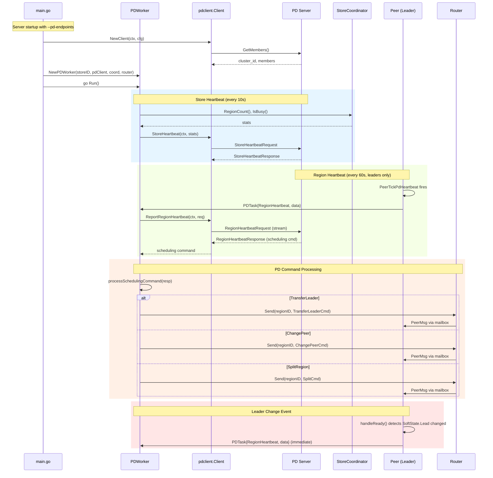
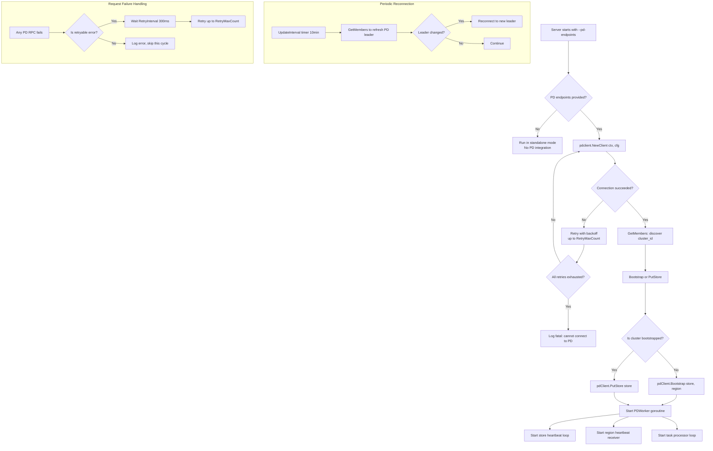

# 14. PD Integration: Heartbeat Loop, Leader Failover, PD Client Wiring

## 1. Overview

This document describes the design for integrating gookvs with the Placement Driver (PD) server. The PD client package (`pkg/pdclient`) already provides a complete gRPC client with all 13 methods implemented, including `StoreHeartbeat`, `ReportRegionHeartbeat`, `GetTS`, `AskBatchSplit`, and `ReportBatchSplit`. However, **none of these methods are actually called** from the running server. The `--pd-endpoints` flag is accepted and stored in config but the server never instantiates a PD client.

This design covers:

1. **PD client instantiation** in `main.go` using `--pd-endpoints`
2. **Store heartbeat loop** -- a dedicated goroutine reporting store-level statistics to PD
3. **Region heartbeat** -- each Peer leader periodically reports region status via `PeerTickPdHeartbeat`
4. **Leader change notification** -- immediate heartbeat on leader transitions
5. **PD command processing** -- handling scheduling responses from PD (transfer leader, add/remove peer, split)
6. **PD client retry and leader failover** -- reconnection when PD becomes unreachable
7. **Graceful degradation** -- behavior when PD is unavailable

### Current State

| Component | Status |
|-----------|--------|
| `pkg/pdclient.Client` interface (13 methods) | Fully implemented |
| `grpcClient` gRPC implementation | Fully implemented |
| `MockClient` for testing | Fully implemented with 14 test cases |
| `PeerTickPdHeartbeat` tick type | Defined in `msg.go` but never handled |
| `--pd-endpoints` flag in `main.go` | Parsed into `config.PDConfig.Endpoints`, never used |
| Store heartbeat loop | Not implemented |
| Region heartbeat from Peer | Not implemented |
| PD scheduling command processing | Not implemented |
| PD client retry/failover | Config fields defined but not consumed |

## 2. TiKV Reference

### 2.1 Architecture

In TiKV, PD integration is handled by a dedicated **PD Worker** -- a single-threaded `LazyWorker` that processes `PdTask` messages via an MPSC scheduler. The PD worker is created during server bootstrap in `components/server/src/server.rs` and shared across the raftstore.

Key components:
- **`PdTask` enum** (`components/raftstore/src/store/worker/pd.rs`): Defines all PD-related tasks including `Heartbeat`, `StoreHeartbeat`, `AskBatchSplit`, `ReportBatchSplit`, `ValidatePeer`, etc.
- **`StoreFsm`** (`store/fsm/store.rs`): Sends store heartbeats on `StoreTick::PdStoreHeartbeat` via `store_heartbeat_pd()`.
- **`PeerFsmDelegate`** (`store/fsm/peer.rs`): Sends region heartbeats on `PeerTick::PdHeartbeat` via `peer.heartbeat_pd(ctx)`.

### 2.2 Store Heartbeat (TiKV)

`StoreFsm::on_pd_store_heartbeat_tick()` collects store-wide statistics into a `pdpb::StoreStats` message:

- `store_id`, `region_count`, `capacity`, `used_size`, `available`
- `bytes_read`, `keys_read`, `bytes_written`, `keys_written`
- `is_busy`, `sending_snap_count`, `receiving_snap_count`
- `start_time`, `cpu_usages`, `read_io_rates`, `write_io_rates`
- Query statistics (`put`, `delete`, `delete_range`)

The stats are sent as a `PdTask::StoreHeartbeat` to the PD worker, which calls `pd_client.store_heartbeat()`. The response may contain replication status updates, recovery plans, or awaken-region directives.

Default interval: `pd_store_heartbeat_tick_interval = 10s`.

### 2.3 Region Heartbeat (TiKV)

`Peer::heartbeat_pd()` creates a `PdTask::Heartbeat` with:

- `term`, `region` (metadata), `peer` (this peer)
- `down_peers`, `pending_peers`
- `written_bytes`, `written_keys`
- `approximate_size`, `approximate_keys`
- `replication_status`

The PD worker calls `pd_client.region_heartbeat()` which uses a bidirectional gRPC stream. PD responds with scheduling commands which are dispatched in `schedule_heartbeat_receiver()`:

| PD Response Field | Action |
|-------------------|--------|
| `change_peer` | Send `AdminRequest::ChangePeer` to the region |
| `change_peer_v2` | Send `AdminRequest::ChangePeerV2` to the region |
| `transfer_leader` | Send `AdminRequest::TransferLeader` to the region |
| `split_region` | Send `CasualMessage::SplitRegion` or `HalfSplitRegion` |
| `merge` | Send `AdminRequest::Merge` to the region |

Default interval: `pd_heartbeat_tick_interval = 1min` (re-registered after each tick).

### 2.4 Heartbeat Triggers

Region heartbeats are sent not only on tick but also after:
- Leader election (`on_role_changed`)
- Configuration change completion (`on_apply_res_conf_change`)
- Region split completion
- Merge completion

## 3. Proposed Go Design

### 3.1 PDWorker

A new `PDWorker` struct in `internal/server/pd_worker.go` serves as the central PD integration point. Unlike TiKV's LazyWorker pattern, gookvs uses a goroutine with a channel-based task queue (idiomatic Go).

```go
// internal/server/pd_worker.go

type PDTaskType int

const (
    PDTaskStoreHeartbeat PDTaskType = iota
    PDTaskRegionHeartbeat
    PDTaskReportBatchSplit
)

type PDTask struct {
    Type PDTaskType
    Data interface{}
}

type RegionHeartbeatData struct {
    Term            uint64
    Region          *metapb.Region
    Peer            *metapb.Peer
    DownPeers       []*pdpb.PeerStats
    PendingPeers    []*metapb.Peer
    WrittenBytes    uint64
    WrittenKeys     uint64
    ApproximateSize uint64
    ApproximateKeys uint64
}

type PDWorker struct {
    storeID   uint64
    pdClient  pdclient.Client
    router    *router.Router
    taskCh    chan PDTask
    ctx       context.Context
    cancel    context.CancelFunc
    done      chan struct{}
}
```

### 3.2 Store Heartbeat Loop

A dedicated goroutine in `PDWorker` sends store heartbeats at a configurable interval (default: 10 seconds). It collects store-level statistics from the `StoreCoordinator`.

```go
func (w *PDWorker) storeHeartbeatLoop() {
    ticker := time.NewTicker(w.storeHeartbeatInterval)
    defer ticker.Stop()

    for {
        select {
        case <-w.ctx.Done():
            return
        case <-ticker.C:
            w.sendStoreHeartbeat()
        }
    }
}

func (w *PDWorker) sendStoreHeartbeat() {
    stats := &pdpb.StoreStats{
        StoreId:     w.storeID,
        RegionCount: uint32(w.coordinator.RegionCount()),
        Capacity:    w.collectCapacity(),
        UsedSize:    w.collectUsedSize(),
        Available:   w.collectAvailable(),
        StartTime:   uint32(w.startTime.Unix()),
        IsBusy:      w.coordinator.IsBusy(),
    }
    ctx, cancel := context.WithTimeout(w.ctx, 5*time.Second)
    defer cancel()
    if err := w.pdClient.StoreHeartbeat(ctx, stats); err != nil {
        slog.Warn("store heartbeat failed", "err", err)
    }
}
```

### 3.3 Region Heartbeat Handler

When `PeerTickPdHeartbeat` fires in the Peer event loop, the Peer sends a `PDTaskRegionHeartbeat` to the PDWorker's task channel. Only leaders send heartbeats.

Changes to `internal/raftstore/peer.go`:
- Add a `pdTaskCh chan<- PDTask` field set via `SetPDTaskFunc`
- Add a `pdHeartbeatTicker` with configurable interval (default: 60s)
- Handle `PeerTickPdHeartbeat` in the event loop
- Send immediate heartbeat on leader change (detected in `handleReady` when `rd.SoftState` changes)

### 3.4 PD Command Processor

The PDWorker receives scheduling commands from PD via the `ReportRegionHeartbeat` response stream. Since `pkg/pdclient/client.go` currently uses unary-style `ReportRegionHeartbeat` (sends one request, does not read responses), this needs enhancement.

The processor handles:
- **TransferLeader**: Route an admin command to the target region's Peer
- **ChangePeer**: Route a conf change admin command (depends on `04_conf_change.md`)
- **SplitRegion**: Route a split request (depends on `02_region_split.md`)
- **Merge**: Route a merge request (future scope)

```go
func (w *PDWorker) processSchedulingCommand(resp *pdpb.RegionHeartbeatResponse) {
    regionID := resp.GetRegionId()

    if resp.GetTransferLeader() != nil {
        // Send transfer leader to the region's Peer
        w.router.Send(regionID, raftstore.PeerMsg{
            Type: raftstore.PeerMsgTypeRaftCommand,
            Data: buildTransferLeaderCmd(resp),
        })
    } else if resp.GetChangePeer() != nil {
        w.router.Send(regionID, raftstore.PeerMsg{
            Type: raftstore.PeerMsgTypeRaftCommand,
            Data: buildChangePeerCmd(resp),
        })
    } else if resp.GetSplitRegion() != nil {
        w.router.Send(regionID, raftstore.PeerMsg{
            Type: raftstore.PeerMsgTypeCasual,
            Data: buildSplitRequest(resp),
        })
    }
}
```

## 4. Processing Flows

### 4.1 Heartbeat Cycle



### 4.2 PD Client Initialization and Retry



## 5. Data Structures

```mermaid
classDiagram
    class PDWorker {
        -storeID uint64
        -pdClient pdclient.Client
        -coordinator *StoreCoordinator
        -router *router.Router
        -taskCh chan PDTask
        -ctx context.Context
        -cancel context.CancelFunc
        -done chan struct{}
        -storeHeartbeatInterval time.Duration
        -startTime time.Time
        +Run()
        +Stop()
        +ScheduleTask(task PDTask)
        -storeHeartbeatLoop()
        -sendStoreHeartbeat()
        -processTask(task PDTask)
        -sendRegionHeartbeat(data RegionHeartbeatData)
        -processSchedulingCommand(resp RegionHeartbeatResponse)
    }

    class PDTask {
        +Type PDTaskType
        +Data interface{}
    }

    class RegionHeartbeatData {
        +Term uint64
        +Region *metapb.Region
        +Peer *metapb.Peer
        +DownPeers []*pdpb.PeerStats
        +PendingPeers []*metapb.Peer
        +WrittenBytes uint64
        +WrittenKeys uint64
        +ApproximateSize uint64
        +ApproximateKeys uint64
    }

    class StoreCoordinatorConfig {
        +StoreID uint64
        +Engine traits.KvEngine
        +Storage *Storage
        +Router *router.Router
        +Client *transport.RaftClient
        +PeerCfg raftstore.PeerConfig
        +PDClient pdclient.Client
    }

    class PeerConfig {
        +RaftBaseTickInterval time.Duration
        +RaftElectionTimeoutTicks int
        +RaftHeartbeatTicks int
        +PDHeartbeatInterval time.Duration
        +MaxInflightMsgs int
        +MaxSizePerMsg uint64
        +PreVote bool
        +MailboxCapacity int
    }

    class Peer {
        -regionID uint64
        -peerID uint64
        -storeID uint64
        -region *metapb.Region
        -rawNode *raft.RawNode
        -pdTaskCh chan~PDTask~
        -pdHeartbeatTicker *time.Ticker
        -peerStat PeerStat
        +SetPDTaskCh(ch chan PDTask)
        -onPdHeartbeatTick()
        -collectHeartbeatData() RegionHeartbeatData
    }

    class PeerStat {
        +WrittenBytes uint64
        +WrittenKeys uint64
        +ReadBytes uint64
        +ReadKeys uint64
    }

    PDWorker --> PDTask : processes
    PDWorker --> RegionHeartbeatData : sends to PD
    PDWorker --> StoreCoordinatorConfig : uses coordinator
    Peer --> PDTask : produces
    Peer --> PeerStat : tracks
    PeerConfig --> Peer : configures
```

## 6. Error Handling

### 6.1 PD Unreachable

When PD is unreachable, gookvs must continue serving read/write requests using the current region configuration. Specific behaviors:

| Scenario | Behavior |
|----------|----------|
| Store heartbeat fails | Log warning, retry on next tick. Store continues operating. |
| Region heartbeat fails | Log warning, retry on next tick. Regions continue serving. |
| PD connection lost | PDWorker enters reconnection loop with exponential backoff (300ms to 30s). |
| All PD endpoints unreachable | Log error every 30s. No scheduling commands processed. Store operates in degraded mode. |
| PD recovers | PDWorker reconnects, sends immediate store heartbeat, resumes normal operation. |

### 6.2 Stale Heartbeat Responses

PD may return scheduling commands based on outdated information. Guards include:

- **Region epoch check**: Before executing a scheduling command, verify the region epoch in the response matches the local region epoch. Reject stale commands.
- **Leader check**: Only the current leader processes scheduling commands for its region.
- **Idempotency**: Conf change and transfer leader commands are idempotent at the Raft level.

### 6.3 Task Channel Backpressure

The PDWorker task channel has a bounded capacity (default: 256). If the channel is full (PD is slow or unresponsive), heartbeat tasks are dropped with a warning log. This prevents Peer goroutines from blocking on PD communication.

## 7. Configuration

New configuration fields in `internal/config/config.go`:

```go
type RaftStoreConfig struct {
    // ... existing fields ...

    // PDHeartbeatTickInterval is the interval for region heartbeats to PD.
    // Default: 60s
    PDHeartbeatTickInterval Duration `toml:"pd-heartbeat-tick-interval"`

    // PDStoreHeartbeatTickInterval is the interval for store heartbeats to PD.
    // Default: 10s
    PDStoreHeartbeatTickInterval Duration `toml:"pd-store-heartbeat-tick-interval"`
}

type PDConfig struct {
    // ... existing fields ...

    // EnablePDIntegration controls whether the server connects to PD.
    // When false, the server runs without PD even if endpoints are configured.
    // Default: true (when endpoints are provided)
    EnablePDIntegration bool `toml:"enable-pd-integration"`
}
```

## 8. Testing Strategy

### 8.1 Unit Tests

| Test | Description |
|------|-------------|
| `TestPDWorkerStoreHeartbeat` | Verify `PDWorker` sends periodic store heartbeats to `MockClient`, check stats fields. |
| `TestPDWorkerRegionHeartbeat` | Submit `RegionHeartbeatData` tasks, verify `MockClient.ReportRegionHeartbeat` is called with correct region/peer/stats. |
| `TestPDWorkerSchedulingCommands` | Mock PD responses with `TransferLeader`, `ChangePeer`, `SplitRegion` commands. Verify correct `PeerMsg` types are routed via `Router`. |
| `TestPDWorkerBackpressure` | Fill the task channel, verify that new tasks are dropped (non-blocking) with appropriate logging. |
| `TestPDWorkerGracefulShutdown` | Verify `PDWorker.Stop()` drains the task channel and closes the PD client. |
| `TestPeerPdHeartbeatTick` | Verify that the Peer goroutine sends heartbeat data on `PeerTickPdHeartbeat`. |
| `TestPeerLeaderChangeHeartbeat` | Verify immediate heartbeat when `SoftState.Lead` changes in `handleReady`. |
| `TestPDClientRetry` | Verify retry behavior when PD connection fails intermittently. |

### 8.2 Integration Tests

| Test | Description |
|------|-------------|
| `TestPDIntegrationEndToEnd` | Start gookvs-server with `MockClient`, verify full heartbeat cycle: store heartbeat -> region heartbeat -> scheduling command processed. |
| `TestPDDisconnectRecovery` | Start with MockClient, simulate PD disconnect, verify gookvs continues serving, verify reconnection and heartbeat resumption. |
| `TestStoreBootstrapWithPD` | Verify that on first startup, gookvs correctly calls `Bootstrap` or `PutStore` on PD. |

### 8.3 Test with Real PD

For manual testing and CI with a real PD server:
1. Start a PD server (from TiKV PD release or `pd-server` binary)
2. Start gookvs-server with `--pd-endpoints=127.0.0.1:2379`
3. Verify store appears in `pd-ctl store` output
4. Verify region heartbeats appear in PD logs
5. Issue `pd-ctl operator add transfer-leader <region_id> <store_id>` and verify leader transfer

## 9. Implementation Steps

### Phase 1: PD Client Wiring (Foundation)

1. **Instantiate PD client in `main.go`**
   - When `--pd-endpoints` is provided and `--store-id > 0`, create `pdclient.Client`
   - Call `IsBootstrapped` -> if not, call `Bootstrap` with store and initial region
   - If already bootstrapped, call `PutStore` to register this store
   - Pass PD client to `StoreCoordinator` via `StoreCoordinatorConfig`

2. **Add `PDClient` field to `StoreCoordinatorConfig`**
   - Optional field: `nil` means PD integration disabled (standalone/static-cluster mode)

### Phase 2: Store Heartbeat Loop

3. **Create `PDWorker` in `internal/server/pd_worker.go`**
   - Implement `Run()`, `Stop()`, `ScheduleTask()`
   - Implement `storeHeartbeatLoop()` with configurable interval
   - Collect basic stats: `storeID`, `regionCount` from `StoreCoordinator`

4. **Wire `PDWorker` into server startup**
   - Create and start `PDWorker` in `main.go` after `StoreCoordinator` creation
   - Stop `PDWorker` during graceful shutdown (before `StoreCoordinator.Stop()`)

### Phase 3: Region Heartbeat

5. **Add PD heartbeat tick to Peer**
   - Add `pdTaskCh` channel field and `SetPDTaskCh()` setter to `Peer`
   - Add PD heartbeat ticker (separate from Raft tick) in `Peer.Run()` event loop
   - On tick, if leader, collect `RegionHeartbeatData` and send to `pdTaskCh`

6. **Handle region heartbeat tasks in `PDWorker`**
   - Process `PDTaskRegionHeartbeat` by calling `pdClient.ReportRegionHeartbeat`

7. **Leader change immediate heartbeat**
   - In `Peer.handleReady()`, when `rd.SoftState` shows leader change, send immediate heartbeat task

### Phase 4: PD Command Processing

8. **Enhance `ReportRegionHeartbeat` to read responses**
   - Modify `pdclient.grpcClient.ReportRegionHeartbeat` to use a persistent bidirectional stream
   - Add a response callback mechanism or return channel

9. **Implement `processSchedulingCommand` in `PDWorker`**
   - Handle `TransferLeader` response: build admin command, route via `Router`
   - Handle `ChangePeer` response: build conf change command, route via `Router` (requires `04_conf_change.md`)
   - Handle `SplitRegion` response: build split command, route via `Router` (requires `02_region_split.md`)

### Phase 5: Retry and Failover

10. **Implement PD leader refresh loop**
    - Periodic `GetMembers` call (every `UpdateInterval`, default 10min)
    - If PD leader changed, reconnect to new leader

11. **Implement request retry logic**
    - Wrap PD RPCs with retry using `Config.RetryInterval` and `RetryMaxCount`
    - Exponential backoff for reconnection attempts

### Phase 6: PeerStat Tracking

12. **Add `PeerStat` to Peer for traffic statistics**
    - Track `WrittenBytes`, `WrittenKeys` in `Peer.propose()` (count proposed data size)
    - Include in `RegionHeartbeatData`

## 10. Dependencies

| Dependency | Status | Notes |
|------------|--------|-------|
| `pkg/pdclient` (Client interface, grpcClient, MockClient) | Complete | All 13 methods implemented |
| `13_pd_server.md` (PD server) | External dependency | gookvs uses an external PD server (same as TiKV) |
| `04_conf_change.md` (Configuration change) | Required for Phase 4 | `ChangePeer` command processing |
| `02_region_split.md` (Region split) | Required for Phase 4 | `SplitRegion` command processing |
| `internal/raftstore/msg.go` (PeerTickPdHeartbeat) | Defined | Tick type exists but is never handled |
| `internal/server/coordinator.go` (StoreCoordinator) | Complete | Needs new fields: `PDClient`, region count accessor |
| `internal/raftstore/peer.go` (Peer) | Complete | Needs new fields: `pdTaskCh`, PD heartbeat ticker, `PeerStat` |
| `internal/config/config.go` | Complete | Needs new fields: `PDHeartbeatTickInterval`, `PDStoreHeartbeatTickInterval` |
