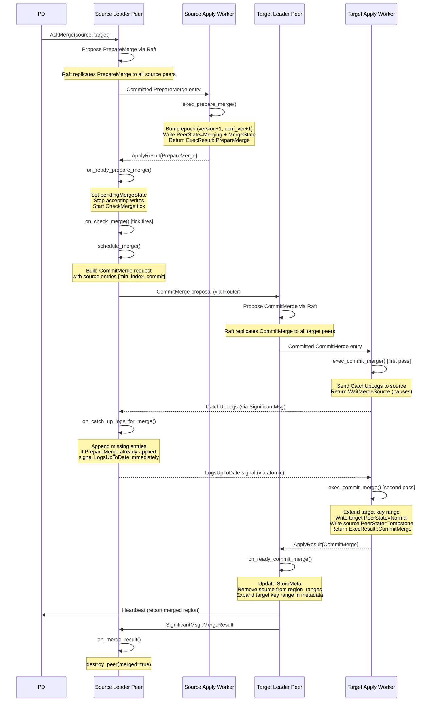
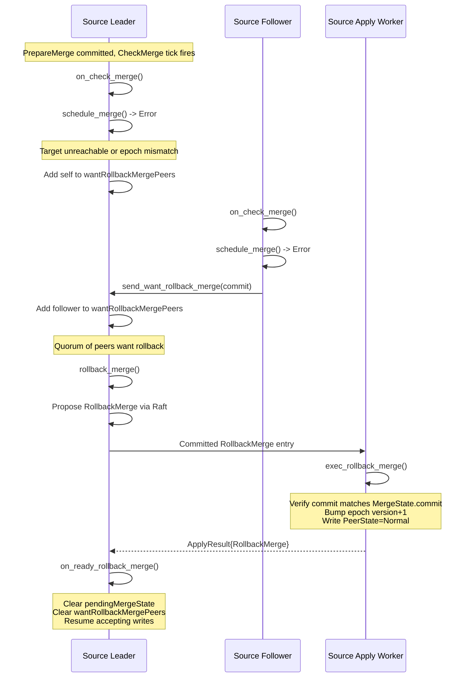
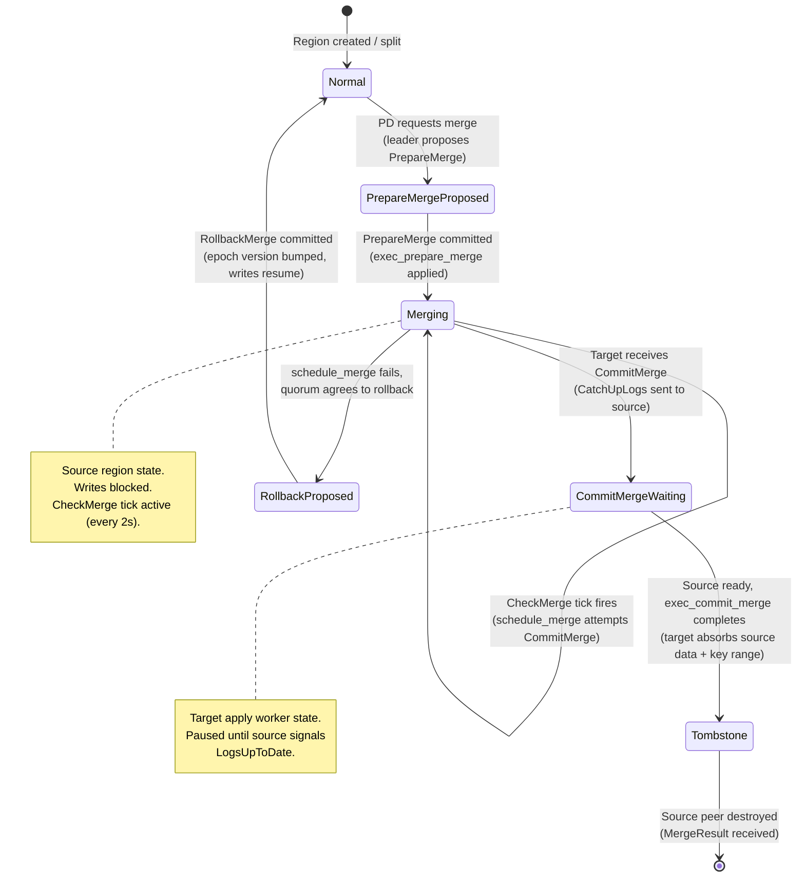
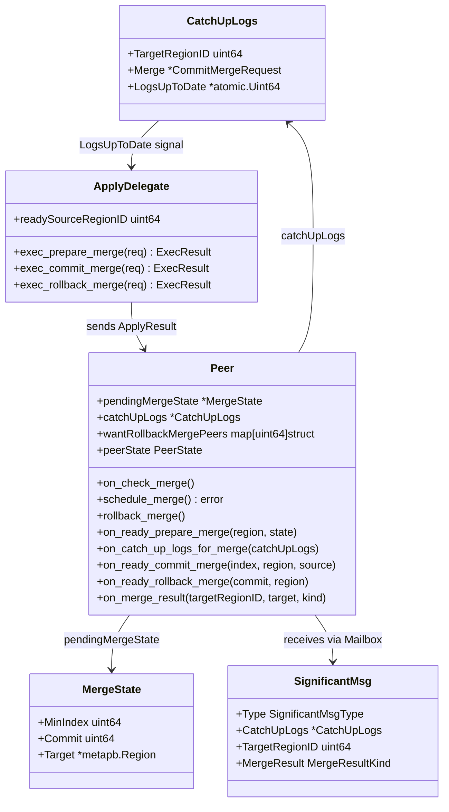

# Region Merge Design Document

## 1. Overview

Region merge is the inverse of region split: it combines two adjacent, undersized regions into a single region to reduce overhead from managing too many small regions. When a region shrinks below a configurable threshold (typically 20 MiB), PD schedules a merge of the **source region** into an adjacent **target region**.

This is the most complex raftstore administrative operation. It involves coordination between two independent Raft groups (source and target), a two-phase commit protocol (PrepareMerge on source, CommitMerge on target), a rollback path for failure recovery, and careful epoch-based safety to prevent stale reads/writes during the merge window.

### 1.1 Current State in gookvs

From `impl_doc_0318/08_not_yet_implemented.md` section 3.5 and `internal/raftstore/msg.go`:

- `PeerTickCheckMerge` (tick type) is defined but never handled in the event loop.
- `SignificantMsgTypeMergeResult` (significant message type) is defined but never handled.
- No merge proposal logic, no PrepareMerge/CommitMerge/RollbackMerge admin command handling, no merge execution code.
- The `ExecResultType` enum does not include merge-related variants.
- The `SignificantMsg` struct lacks fields needed for merge (e.g., `MergeResultKind`, `CatchUpLogs`).

### 1.2 Design Goals

1. Implement the full TiKV-compatible region merge protocol (PrepareMerge, CommitMerge, RollbackMerge).
2. Ensure data safety: no data loss during merge, no stale reads after merge.
3. Support merge rollback on leader change or timeout.
4. Integrate with PD for merge scheduling and post-merge reporting.
5. Follow Go idioms (goroutine coordination via channels, context.Context for cancellation).

---

## 2. TiKV Reference

### 2.1 Three-Phase Merge Protocol

TiKV implements region merge as a three-phase protocol coordinated between two Raft groups:

**Phase 1 -- PrepareMerge (source region)**:
1. PD schedules the merge: source region merges INTO the target region (an adjacent region).
2. The source leader proposes a `PrepareMerge` admin command through Raft.
3. On apply (`exec_prepare_merge` in `fsm/apply.rs`):
   - Compute `min_index = min(matched_index)` across all followers.
   - Create a `MergeState { min_index, commit, target: target_region }`.
   - Set source peer state to `PeerState::Merging`.
   - Increment both `version` and `conf_ver` in the source region epoch.
4. The source region stops accepting new write proposals.
5. The source continues replicating logs until all peers reach `min_index`.

**Phase 2 -- CommitMerge (target region)**:
1. The target region's apply FSM receives the CommitMerge command.
2. On first encounter, it sends `CatchUpLogs` to the source peer FSM via `SignificantMsg` and pauses (returns `WaitMergeSource`).
3. The source peer receives `CatchUpLogs`, appends any missing entries, and once its PrepareMerge is applied, signals readiness by sending `LogsUpToDate` back.
4. The target apply FSM resumes `exec_commit_merge`:
   - Verifies the source region is in `PeerState::Merging`.
   - Extends the target region's key range to cover the source region's range.
   - Sets the source region state to `PeerState::Tombstone`.
   - Sets the new target region epoch version to `max(source_version, target_version) + 1`.
5. The target leader reports the merged region to PD via heartbeat.

**Phase 3 -- Cleanup**:
1. The target peer FSM sends `SignificantMsg::MergeResult` to the source peer FSM.
2. The source peer FSM destroys itself (sets `pending_remove`, clears state, stops the goroutine).
3. Source region metadata is removed from `StoreMeta`.

### 2.2 PrepareMerge Details

From `tikv/components/raftstore/src/store/fsm/apply.rs` (`exec_prepare_merge`, line 2844):

- Validates `min_index >= first_index` (ensures no compacted log gap).
- Bumps both `region_epoch.version` and `region_epoch.conf_ver` by 1.
- Writes `PeerState::Merging` with `MergeState` to the KV engine.
- Returns `ExecResult::PrepareMerge { region, state }`.

The epoch bump on both version and conf_ver is intentional: it prevents any concurrent conf change proposals from being accepted after PrepareMerge is committed, without needing to iterate all pending proposals.

### 2.3 CommitMerge Details

From `tikv/components/raftstore/src/store/fsm/apply.rs` (`exec_commit_merge`, line 2924):

- Uses a two-pass approach: first call returns `WaitMergeSource` to pause; second call (after source is ready) performs the actual merge.
- The `ready_source_region_id` field tracks whether the source has signaled readiness.
- Key range extension: if target's `end_key == source's start_key`, the target's `end_key` becomes the source's `end_key` (right merge). Otherwise, the target's `start_key` becomes the source's `start_key` (left merge).
- Writes target region as `PeerState::Normal` and source region as `PeerState::Tombstone`.

### 2.4 RollbackMerge

From `tikv/components/raftstore/src/store/fsm/apply.rs` (`exec_rollback_merge`, line 3058):

- Validates the rollback commit index matches the `MergeState.commit`.
- Sets source region back to `PeerState::Normal`.
- Increments `region_epoch.version` by 1 to prevent duplicate rollback.

Rollback is triggered when:
- The source leader cannot schedule the merge (e.g., target unreachable) and a quorum of peers votes to rollback (`want_rollback_merge_peers`).
- A leader change occurs during the merge window.

### 2.5 CatchUpLogs Mechanism

From `tikv/components/raftstore/src/store/fsm/peer.rs` (`on_catch_up_logs_for_merge`, line 5249):

The CatchUpLogs mechanism ensures the source region has applied all entries up to the PrepareMerge commit index before the target finalizes the merge:

1. Target's apply FSM sends `CatchUpLogs { target_region_id, merge, logs_up_to_date }` to the source peer FSM.
2. If the source has already completed `on_ready_prepare_merge`, it immediately signals readiness.
3. Otherwise, the source appends the provided entries via `maybe_append_merge_entries`, stores the `CatchUpLogs`, and waits for `on_ready_prepare_merge` to complete.
4. When ready, the source sends `LogsUpToDate` back to the target apply FSM, which resumes `exec_commit_merge`.

### 2.6 Merge Check Tick

From `tikv/components/raftstore/src/store/fsm/peer.rs` (`on_check_merge`, line 5145):

The `CheckMerge` tick (default 2s interval) drives the merge forward after PrepareMerge is committed:
- Calls `schedule_merge()` to send the CommitMerge proposal to the target region.
- If `schedule_merge()` fails and a quorum of peers agrees, triggers `rollback_merge()`.
- Non-leader peers can send `want_rollback_merge` messages to the leader.

---

## 3. Proposed Go Design

### 3.1 New Types and Constants

Add to `internal/raftstore/msg.go`:

```go
// ExecResultType additions
const (
    ExecResultTypePrepareMerge  ExecResultType = iota + 10 // avoid collision with existing values
    ExecResultTypeCommitMerge
    ExecResultTypeRollbackMerge
)

// MergeState tracks the state of a pending merge on the source region.
type MergeState struct {
    MinIndex uint64           // min(matched_index) across all followers at PrepareMerge time
    Commit   uint64           // commit index of the PrepareMerge entry
    Target   *metapb.Region   // target region to merge into
}

// PeerState represents the lifecycle state of a region peer.
type PeerState int

const (
    PeerStateNormal    PeerState = iota
    PeerStateMerging             // source region: PrepareMerge committed, awaiting CommitMerge
    PeerStateTombstone           // region destroyed (merged or removed)
)

// CatchUpLogs is sent from the target apply worker to the source peer
// to ensure the source has applied all entries before CommitMerge finalizes.
type CatchUpLogs struct {
    TargetRegionID uint64
    Merge          *CommitMergeRequest // contains source region, commit index, entries
    LogsUpToDate   *atomic.Uint64      // signaling channel: 0 = not ready, non-zero = ready
}

// MergeResultKind classifies how a merge completed.
type MergeResultKind int

const (
    MergeResultFromTargetLog   MergeResultKind = iota // normal completion via target's commit log
    MergeResultFromTargetSnap                         // completion via target snapshot
    MergeResultStale                                  // stale merge result (already handled)
)

// PrepareMergeResult is the data for ExecResultTypePrepareMerge.
type PrepareMergeResult struct {
    Region *metapb.Region
    State  *MergeState
}

// CommitMergeResult is the data for ExecResultTypeCommitMerge.
type CommitMergeResult struct {
    Index  uint64           // commit index of the CommitMerge entry
    Region *metapb.Region   // target region after merge (expanded key range)
    Source *metapb.Region   // source region (now tombstoned)
}

// RollbackMergeResult is the data for ExecResultTypeRollbackMerge.
type RollbackMergeResult struct {
    Region *metapb.Region
    Commit uint64
}
```

Update `SignificantMsg` struct:

```go
type SignificantMsg struct {
    Type            SignificantMsgType
    RegionID        uint64
    ToPeerID        uint64
    Status          raft.SnapshotStatus
    // Merge-specific fields
    CatchUpLogs     *CatchUpLogs        // for CatchUpLogs delivery
    TargetRegionID  uint64              // for MergeResult
    Target          *metapb.Peer        // for MergeResult
    MergeResult     MergeResultKind     // for MergeResult
}
```

Add new `SignificantMsgType`:

```go
const (
    SignificantMsgTypeCatchUpLogs SignificantMsgType = iota + 10
)
```

### 3.2 Peer Struct Additions

Add merge-related fields to the `Peer` struct in `internal/raftstore/peer.go`:

```go
type Peer struct {
    // ... existing fields ...

    // Merge state
    pendingMergeState       *MergeState           // non-nil when PrepareMerge is committed
    catchUpLogs             *CatchUpLogs          // non-nil when CatchUpLogs received before PrepareMerge
    wantRollbackMergePeers  map[uint64]struct{}   // peer IDs that want to rollback
    peerState               PeerState             // Normal, Merging, or Tombstone
}
```

### 3.3 Apply Worker Additions

The apply worker (responsible for executing committed entries against the state machine) needs:

```go
// In the apply delegate/worker:
type ApplyDelegate struct {
    // ... existing fields ...
    readySourceRegionID uint64   // tracks CatchUpLogs handshake for CommitMerge
}
```

The apply worker must handle three new admin command types and return a `WaitMergeSource` result to pause CommitMerge processing.

### 3.4 Config Additions

Add to `PeerConfig`:

```go
type PeerConfig struct {
    // ... existing fields ...
    MergeCheckTickInterval time.Duration  // default: 2s
    MergeSizeThreshold     uint64         // default: 20 MiB -- regions smaller than this are merge candidates
}
```

---

## 4. Processing Flows

### 4.1 Full Merge Sequence



### 4.2 Merge Rollback Flow



---

## 5. Data Structures

### 5.1 Merge State Machine



### 5.2 Key Data Structures Relationship



---

## 6. Error Handling

### 6.1 Epoch Stale Detection

During merge, the source region's epoch is bumped on PrepareMerge (both version and conf_ver). Any client request with an older epoch is rejected with `EpochNotMatch`. This prevents stale reads/writes to the source region while it is being merged.

After CommitMerge, the target region's epoch version is bumped to `max(source_version, target_version) + 1`. Stale requests to the old target epoch are also rejected.

### 6.2 Target Region Unreachable

If `schedule_merge()` fails because the target region is not found or unreachable:
- The source leader adds itself to `wantRollbackMergePeers`.
- On subsequent CheckMerge ticks, if a quorum of peers have voted to rollback, the leader proposes `RollbackMerge`.
- Non-leader peers send `want_rollback_merge` messages to the leader.

### 6.3 Leader Change During Merge

If the source leader changes while in `Merging` state:
- The new leader inherits the `pendingMergeState` from the applied region state.
- The new leader starts CheckMerge ticks and attempts `schedule_merge()`.
- If the merge cannot proceed (e.g., target epoch changed), the new leader drives rollback.

### 6.4 Source Apply Lag

The `CatchUpLogs` mechanism handles the case where the source region has not yet applied all entries up to the PrepareMerge commit:
- The target apply worker pauses via `WaitMergeSource` (an `atomic.Uint64` polled periodically).
- The source peer receives the `CatchUpLogs` message, appends any missing entries from the merge request, and waits for `on_ready_prepare_merge` to complete.
- Only after the source has fully applied does it signal `LogsUpToDate`.

### 6.5 Concurrent Admin Commands

PrepareMerge bumps `conf_ver` specifically to prevent concurrent conf change proposals:
- Any ConfChange proposed with the old `conf_ver` will fail epoch check.
- CompactLog proposals between `min_index` and `commit` are filtered before proposing PrepareMerge (TiKV checks this in `propose_merge`).

### 6.6 Snapshot During Merge

If a source peer receives a snapshot while in `Merging` state, the snapshot effectively rolls back the merge (the snapshot may contain state without the PrepareMerge). In this case, `on_ready_rollback_merge` is called with `commit = 0` to indicate rollback-via-snapshot.

---

## 7. Testing Strategy

### 7.1 Unit Tests

| Test | Description |
|------|-------------|
| `TestExecPrepareMerge` | Verify epoch bumps (version+1, conf_ver+1), PeerState set to Merging, MergeState correctly persisted |
| `TestExecCommitMerge_RightMerge` | Source is right-adjacent to target; target's end_key expands to source's end_key |
| `TestExecCommitMerge_LeftMerge` | Source is left-adjacent to target; target's start_key shrinks to source's start_key |
| `TestExecRollbackMerge` | Verify PeerState returns to Normal, epoch version bumped, commit index validation |
| `TestMergeState_Serialization` | MergeState round-trip through protobuf encoding |
| `TestScheduleMerge_BuildsCorrectRequest` | Verify CommitMerge request contains correct entries, source region, and commit index |
| `TestPrepareMerge_RejectsWrites` | After PrepareMerge, write proposals to source region are rejected |
| `TestEpochCheck_RejectsStaleAfterMerge` | Client requests with pre-merge epoch are rejected |

### 7.2 Integration Tests

| Test | Description |
|------|-------------|
| `TestMerge_HappyPath` | Two adjacent regions merge successfully; verify target key range, source tombstoned, PD notified |
| `TestMerge_Rollback_TargetUnreachable` | Target region goes away; source rolls back after quorum agreement |
| `TestMerge_Rollback_LeaderChange` | Source leader changes during merge; new leader drives rollback |
| `TestMerge_CatchUpLogs` | Source has unapplied entries at CommitMerge time; verify CatchUpLogs mechanism works |
| `TestMerge_ConcurrentSplit` | Attempt split on source during merge; verify epoch check rejects split |
| `TestMerge_ConcurrentConfChange` | Attempt conf change during merge; verify epoch check rejects it |
| `TestMerge_ClientRedirect` | After merge, client requests to source region receive EpochNotMatch with target region info |
| `TestMerge_SnapshotRollback` | Source receives snapshot during merge; verify merge is rolled back |

### 7.3 TiKV Reference Tests

TiKV merge integration tests are located in `tests/integrations/raftstore/`. Key test patterns to port:
- `test_node_merge_*` -- basic merge, split-merge interleaving, merge with network partitions
- `test_merge_rollback` -- rollback scenarios
- `test_merge_cascade` -- merging a region that was recently split
- `test_merge_concurrent_*` -- concurrent admin operations during merge

---

## 8. Implementation Steps

### Step 1: Data Structures and Message Types

**Files**: `internal/raftstore/msg.go`

- Add `MergeState`, `CatchUpLogs`, `MergeResultKind`, `PeerState` types.
- Add `ExecResultTypePrepareMerge`, `ExecResultTypeCommitMerge`, `ExecResultTypeRollbackMerge` constants.
- Add `PrepareMergeResult`, `CommitMergeResult`, `RollbackMergeResult` structs.
- Extend `SignificantMsg` with merge-related fields.
- Add `SignificantMsgTypeCatchUpLogs` constant.

### Step 2: Peer Struct Extensions

**Files**: `internal/raftstore/peer.go`

- Add `pendingMergeState`, `catchUpLogs`, `wantRollbackMergePeers`, `peerState` fields to `Peer`.
- Add `MergeCheckTickInterval` and `MergeSizeThreshold` to `PeerConfig`.
- Add write-rejection logic: `Peer.propose()` returns an error when `peerState == PeerStateMerging`.

### Step 3: Apply Worker -- PrepareMerge Execution

**Files**: `internal/raftstore/apply.go` (or equivalent apply worker file)

- Implement `execPrepareMerge()`:
  - Validate `min_index >= first_index`.
  - Bump region epoch (version+1, conf_ver+1).
  - Write `PeerState::Merging` with `MergeState` to the engine.
  - Return `ExecResult` with `PrepareMergeResult`.

### Step 4: Peer -- on_ready_prepare_merge

**Files**: `internal/raftstore/peer.go`

- Implement `onReadyPrepareMerge()`:
  - Update region metadata in StoreMeta.
  - Set `pendingMergeState`.
  - If `catchUpLogs` is already set (CatchUpLogs arrived first), signal `LogsUpToDate` immediately.
  - Otherwise, start CheckMerge tick.

### Step 5: Merge Scheduling

**Files**: `internal/raftstore/peer.go`

- Implement `onCheckMerge()` tick handler:
  - Guard: skip if stopped, pending_remove, or no pendingMergeState.
  - Call `scheduleMerge()`.
  - On failure: add self to `wantRollbackMergePeers`; rollback if quorum agrees.
- Implement `scheduleMerge()`:
  - Validate target region epoch.
  - Fetch entries from `[min_index+1, commit]`.
  - Build CommitMerge admin request.
  - Send to target region via Router.
- Implement `rollbackMerge()`:
  - Build RollbackMerge admin request.
  - Propose through local Raft.
- Register `PeerTickCheckMerge` in the event loop.

### Step 6: Apply Worker -- CommitMerge Execution

**Files**: `internal/raftstore/apply.go`

- Implement `execCommitMerge()`:
  - First pass: send `CatchUpLogs` to source peer, return `WaitMergeSource`.
  - Second pass (after source is ready): extend key range, tombstone source, return `ExecResult`.
- Add `WaitMergeSource` as a special apply result that pauses the apply pipeline.
- Implement polling/notification mechanism for `LogsUpToDate` signal.

### Step 7: Peer -- CatchUpLogs and CommitMerge Handling

**Files**: `internal/raftstore/peer.go`

- Implement `onCatchUpLogsForMerge()`:
  - If PrepareMerge already applied: signal `LogsUpToDate` immediately.
  - Otherwise: append entries, store `catchUpLogs`, wait for PrepareMerge.
- Handle `PeerMsgTypeSignificant` with `SignificantMsgTypeCatchUpLogs` in `handleMessage()`.
- Implement `onReadyCommitMerge()`:
  - Update StoreMeta: remove source from region_ranges, expand target.
  - Send `MergeResult` to source peer.
  - Heartbeat PD with merged region.

### Step 8: Apply Worker -- RollbackMerge Execution

**Files**: `internal/raftstore/apply.go`

- Implement `execRollbackMerge()`:
  - Validate commit index matches MergeState.
  - Write `PeerState::Normal`.
  - Bump epoch version+1.
  - Return `ExecResult` with `RollbackMergeResult`.

### Step 9: Peer -- Rollback and MergeResult Handling

**Files**: `internal/raftstore/peer.go`

- Implement `onReadyRollbackMerge()`:
  - Clear `pendingMergeState` and `wantRollbackMergePeers`.
  - Update region in StoreMeta.
  - Resume accepting writes.
- Implement `onMergeResult()`:
  - Validate merge state consistency.
  - Call `destroyPeer(merged=true)`.
- Handle `SignificantMsgTypeMergeResult` in `handleMessage()`.

### Step 10: PD Integration

**Files**: `internal/raftstore/peer.go`, PD client integration

- Handle PD's merge schedule request (AskMerge / MergeRegion).
- Report merged region via heartbeat after CommitMerge.
- Report rollback via heartbeat after RollbackMerge.

### Step 11: Testing

- Implement unit tests (Step 1-4 above enable this).
- Implement integration tests with multi-region clusters.
- Port relevant TiKV merge integration tests.

---

## 9. Dependencies

### Prerequisites (must be completed before region merge)

| Dependency | Reason | Status |
|------------|--------|--------|
| Region split (`internal/raftstore/split`) | Merge is the inverse of split; split creates the regions that merge combines. Split must be stable before merge can be tested. | Designed (design doc 02) |
| Conf change execution | PrepareMerge bumps conf_ver and must interact correctly with conf change epoch checks. | Partial (ConfChange applied to Raft tracker, but no peer creation/destruction) |
| PD integration | PD schedules merges and receives post-merge heartbeats. Without PD, merge cannot be triggered or reported. | Designed (design doc 14) |
| Apply worker with admin command support | Merge requires the apply worker to execute PrepareMerge/CommitMerge/RollbackMerge admin commands and return structured ExecResults. | Partial (apply worker exists but lacks admin command dispatch) |
| StoreMeta with region_ranges | CommitMerge must update the region range index in StoreMeta. | Not implemented (StoreMeta exists in concept but not as a concrete type with BTreeMap-based range tracking) |
| Peer destruction | Source peer must be cleanly destroyed after merge completes. | Partial (PeerMsgTypeDestroy exists but destruction is minimal) |

### Optional Enhancements (can follow initial merge implementation)

| Enhancement | Description |
|-------------|-------------|
| Pessimistic lock transfer | Transfer pessimistic locks from source to target during merge (TiKV's `txn_ext` integration) |
| Read progress merge | Merge `safe_ts` values from source and target for resolved TS correctness |
| Bucket reset | Reset region buckets after merge for accurate hot-spot tracking |
| Merge size check worker | Automatic merge triggering based on region size (complement to split check worker) |
