# gookv Architecture Overview

## Table of Contents

1. [What is gookv?](#1-what-is-gookv)
2. [Why Distributed?](#2-why-distributed)
3. [Cluster Topology](#3-cluster-topology)
4. [Layer Architecture](#4-layer-architecture)
5. [Package Structure](#5-package-structure)
6. [Data Model](#6-data-model)
7. [Operating Modes](#7-operating-modes)
8. [Server Startup Sequence](#8-server-startup-sequence)
9. [Key Dependencies](#9-key-dependencies)

---

## 1. What is gookv?

gookv is a distributed transactional key-value store written in Go. It is modeled
after TiKV, the distributed storage layer of TiDB, but reimplemented from the
ground up using Go idioms rather than Rust.

The goals of gookv are:

- **Strong consistency**: Every read returns the most recently committed value,
  even across node failures.
- **Horizontal scalability**: Data is split into regions that can be spread
  across many nodes. Adding a node increases both capacity and throughput.
- **Fault tolerance**: Data is replicated via the Raft consensus protocol across
  multiple nodes. The system continues operating as long as a majority of
  replicas are alive.
- **MVCC transactions**: Full Percolator-style two-phase commit with snapshot
  isolation, supporting concurrent readers and writers without blocking.
- **TiKV wire compatibility**: gookv speaks the same gRPC protocol as TiKV,
  so existing TiKV-compatible clients can connect without modification.

At a high level, gookv takes a user's key-value data, splits it into ranges
called **regions**, replicates each region across multiple nodes using Raft, and
stores the actual bytes in Pebble (a Go-native RocksDB-compatible storage
engine). A Placement Driver (PD) server coordinates the cluster by assigning
timestamps, tracking region locations, and scheduling data balance operations.

### Project Identity

| Field        | Value                              |
|--------------|------------------------------------|
| Module       | `github.com/ryogrid/gookv`         |
| Language     | Go 1.22.2                          |
| License      | See `LICENSE`                      |
| Binaries     | `gookv-server`, `gookv-pd`, `gookv-ctl` |

---

## 2. Why Distributed?

A single-node key-value store is simple to build and reason about. However, it
has three fundamental limitations that motivate a distributed architecture:

### 2.1 Scalability

A single machine has a finite amount of disk, memory, and CPU. When the data
set grows beyond what one machine can hold, or when the request rate exceeds what
one machine can handle, you are stuck. A distributed system solves this by
splitting data across many machines (horizontal scaling).

gookv achieves this through **regions**. The entire key space is divided into
contiguous, non-overlapping ranges called regions. Each region is an independent
unit that can be placed on any node. When a region grows too large (default
threshold: 96 MiB), it automatically splits into two smaller regions. The PD
server then rebalances regions across nodes to keep load even.

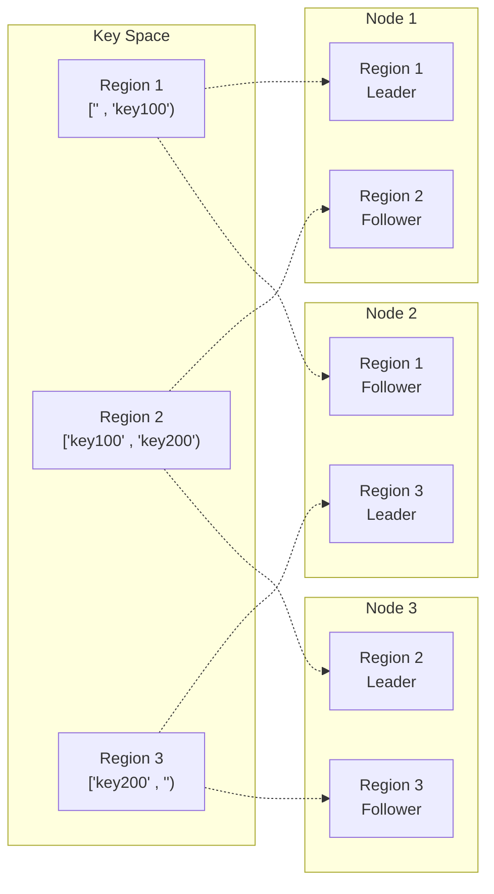

### 2.2 Fault Tolerance

Hardware fails. Disks die, networks partition, processes crash. A single-node
store loses all data when its disk fails. A distributed store replicates each
piece of data to multiple nodes, so the system survives individual failures.

gookv replicates each region to three nodes (configurable) using the Raft
consensus protocol. Raft guarantees that as long as a majority of replicas
(2 out of 3) are alive, the region continues to serve reads and writes.

### 2.3 Strong Consistency

Many distributed databases trade consistency for availability (eventual
consistency). gookv does not. It provides **linearizable** reads and
**snapshot isolation** for transactions. This means:

- A read always returns the latest committed value.
- A transaction sees a consistent snapshot of all data at a single point in time.
- Two transactions that conflict (write to the same key) are serialized: one
  succeeds, the other retries.

This is achieved through a combination of Raft (for replication consistency),
MVCC (for read isolation), and Percolator 2PC (for transaction atomicity).

---

## 3. Cluster Topology

A gookv cluster has three types of components:

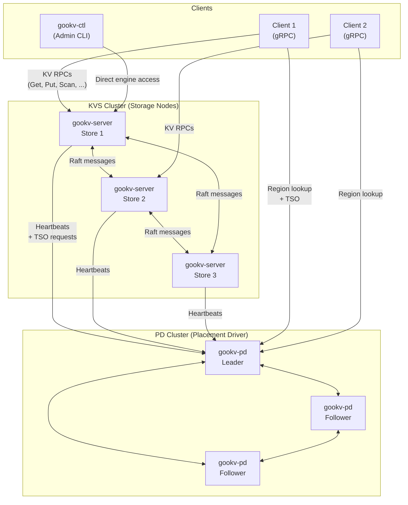

### 3.1 KVS Nodes (`gookv-server`)

Each KVS node is one instance of the `gookv-server` binary. It stores data in a
local Pebble engine and participates in Raft groups for the regions it hosts. A
single node may host replicas of many different regions. Each region replica runs
as an independent Go goroutine.

A KVS node exposes two network interfaces:

| Interface | Purpose | Default Port |
|-----------|---------|--------------|
| gRPC      | Client KV RPCs + inter-node Raft messages | 20160 |
| HTTP      | Diagnostics: `/metrics`, `/debug/pprof`, `/health`, `/config` | 20180 |

### 3.2 PD Server (`gookv-pd`)

The Placement Driver (PD) is the brain of the cluster. It has four
responsibilities:

1. **Timestamp Oracle (TSO)**: Allocates globally unique, monotonically
   increasing timestamps. Every transaction starts by requesting a timestamp
   from PD. Timestamps are hybrid logical clocks: upper 46 bits are physical
   milliseconds, lower 18 bits are a logical sequence number.

2. **Region metadata store**: Tracks which regions exist, their key ranges, and
   which nodes host their replicas. KVS nodes send periodic heartbeats reporting
   region information; clients query PD to discover which node to contact for a
   given key.

3. **Scheduling**: Decides when to move region replicas between nodes to balance
   load, when to add or remove replicas, and when to transfer Raft leadership.

4. **GC safe point management**: Stores the global GC safe point timestamp.
   MVCC versions older than the safe point can be garbage collected.

For high availability, PD itself can be replicated using Raft across multiple
nodes (the `--initial-cluster` flag enables this). PD follower nodes forward
requests to the PD leader automatically.

### 3.3 Client (`pkg/client`)

The client library provides Go APIs for interacting with the cluster. It handles:

- **Region routing**: The `RegionCache` maintains a sorted list of known regions
  and uses binary search to route each key to the correct KVS node. On cache
  miss, it queries PD.
- **Connection pooling**: The `RegionRequestSender` manages gRPC connection
  pools to KVS nodes.
- **Store resolution**: The `PDStoreResolver` maps store IDs to network
  addresses with TTL-based caching.
- **Automatic retry**: On region errors (leader change, region split, stale
  epoch), the client refreshes its cache and retries the request.

Two client APIs are available:

| API | Purpose |
|-----|---------|
| `RawKVClient` | Simple get/put/delete/scan without transactions |
| `TxnKVClient` | Full transactional API with Percolator 2PC |

The `gookv-ctl` admin CLI bypasses the gRPC layer entirely and opens the Pebble
engine directly for low-level inspection.

---

## 4. Layer Architecture

gookv is organized into horizontal layers, where each layer depends only on
the layers below it. This section provides a visual overview of how the layers
connect, followed by a description of each layer's purpose.

### 4.1 Full Layer Diagram

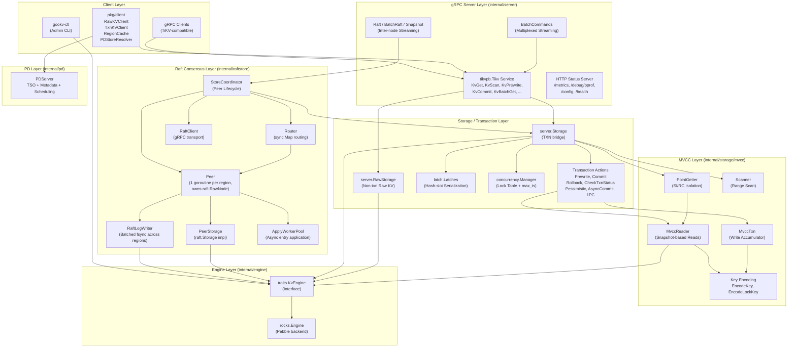

### 4.2 Layer Descriptions

#### Client Layer

The topmost layer. Clients connect to KVS nodes via gRPC, or to PD for region
routing and timestamp allocation. The `gookv-ctl` admin tool connects directly
to the Pebble engine for offline inspection.

#### gRPC Server Layer (`internal/server`)

Receives client requests over gRPC. The `tikvService` struct implements the
`tikvpb.TikvServer` interface, providing handlers for all transactional RPCs
(KvGet, KvScan, KvPrewrite, KvCommit, ...), raw RPCs (RawGet, RawPut, ...),
and inter-node Raft RPCs (Raft, BatchRaft, Snapshot).

The `Server` struct owns the gRPC listener and lifecycle. The `BatchCommands`
handler provides a bidirectional streaming RPC for multiplexing multiple
operations over a single connection.

#### Storage / Transaction Layer

The `Storage` struct (`internal/server/storage.go`) bridges gRPC handlers
to the MVCC and transaction layers. It manages latches for key serialization
and dispatches to the appropriate transaction action (Prewrite, Commit,
Rollback, etc.).

The `RawStorage` struct (`internal/server/raw_storage.go`) provides a
simpler, non-transactional key-value interface that bypasses MVCC entirely.

#### MVCC Layer (`internal/storage/mvcc`)

Implements multi-version concurrency control. Each write creates a new version
of a key rather than overwriting the old one. The MVCC layer stores data across
three column families: CF_DEFAULT (large values), CF_LOCK (active transaction
locks), and CF_WRITE (commit/rollback records).

Key components:

| Component     | Purpose |
|---------------|---------|
| `MvccTxn`     | Collects write modifications without applying them |
| `MvccReader`  | Reads MVCC data from a snapshot |
| `PointGetter` | Optimized single-key read with lock checking |
| `Scanner`     | Forward/reverse range scan with MVCC visibility |
| `key.go`      | Encodes user keys with timestamps for storage |

#### Raft Consensus Layer (`internal/raftstore`)

Replicates data across nodes using the Raft protocol. Each region replica runs
as a `Peer` goroutine that owns an etcd `raft.RawNode`. The `StoreCoordinator`
manages peer lifecycles, proposes writes through Raft, and handles split/merge
operations.

Two optional performance components decouple hot-path I/O from the peer
goroutine (both enabled by default via `RaftStoreConfig`):

| Component | File | Purpose |
|-----------|------|---------|
| `RaftLogWriter` | `raft_log_writer.go` | Collects `WriteTask`s from multiple peers into a single `WriteBatch` + fsync, reducing disk IOPS. Config: `EnableBatchRaftWrite`. |
| `ApplyWorkerPool` | `apply_worker.go` | Applies committed entries on a shared worker pool (default 4 goroutines) so the peer goroutine can immediately process the next Raft Ready. Config: `EnableApplyPipeline`. |

#### Engine Layer (`internal/engine`)

The lowest layer. The `traits.KvEngine` interface abstracts persistent
key-value storage. The `rocks.Engine` implementation wraps Pebble (a pure-Go
RocksDB-compatible engine by CockroachDB). Column families are emulated by
prepending a single-byte prefix to every key.

#### PD Layer (`internal/pd`)

The Placement Driver server implementation. Provides timestamp allocation,
region metadata storage, ID allocation, GC safe point management, and
scheduling. Can run standalone or replicated via its own internal Raft group.

### 4.3 Request Flow: Reading a Key (Cluster Mode)

To illustrate how the layers work together, here is the complete flow for a
transactional key read (`KvGet`):

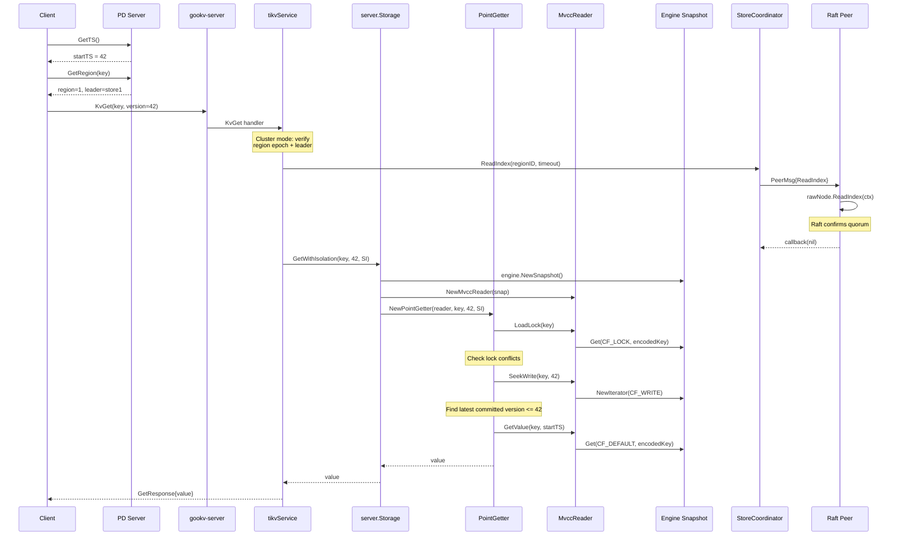

### 4.4 Request Flow: Writing a Key (Cluster Mode, 2PC)

Writing requires two phases: Prewrite (acquire locks) and Commit (make visible).

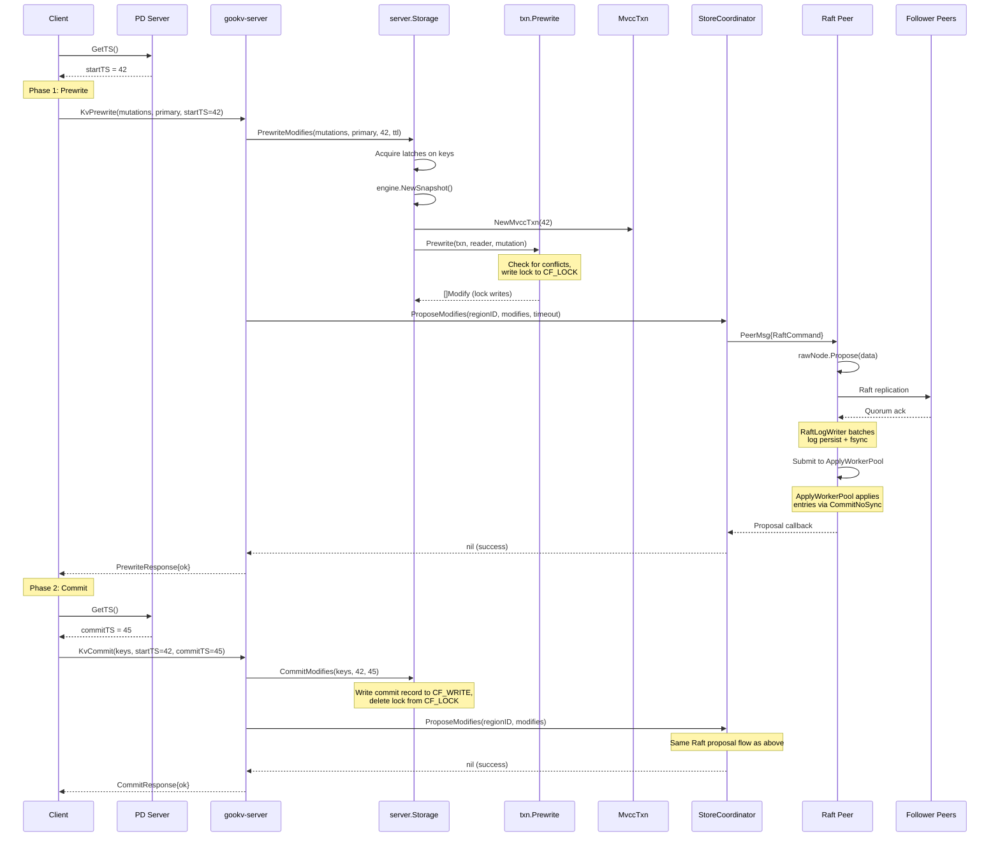

---

## 5. Package Structure

The codebase follows a standard Go layout with public packages under `pkg/`
and private packages under `internal/`. The `cmd/` directory contains the
three binary entry points.

### 5.1 Directory Tree

```
github.com/ryogrid/gookv/
|-- cmd/
|   |-- gookv-server/      # KVS node binary
|   |-- gookv-pd/           # PD server binary
|   |-- gookv-ctl/           # Admin CLI binary
|
|-- pkg/                     # Public packages (importable by external code)
|   |-- codec/               # Memcomparable byte/number encoding
|   |-- keys/                # Internal key construction (Raft, region, data)
|   |-- cfnames/             # Column family name constants
|   |-- txntypes/            # Transaction types (Lock, Write, Mutation, TimeStamp)
|   |-- pdclient/            # PD gRPC client interface
|   |-- client/              # Multi-region client library
|   |-- e2elib/              # PostgreSQL TAP-style end-to-end test library
|
|-- internal/                # Private packages (not importable externally)
|   |-- engine/
|   |   |-- traits/          # KvEngine interface definitions
|   |   |-- rocks/           # Pebble-backed implementation
|   |
|   |-- raftstore/           # Raft consensus and region management
|   |   |-- router/          # sync.Map message routing
|   |   |-- split/           # Region split checking and execution
|   |
|   |-- storage/
|   |   |-- mvcc/            # MVCC layer (MvccTxn, Reader, PointGetter, Scanner)
|   |   |-- txn/             # Transaction actions (Prewrite, Commit, Rollback, ...)
|   |   |   |-- latch/       # Hash-slot key serialization
|   |   |   |-- concurrency/ # ConcurrencyManager (lock table + max_ts)
|   |   |   |-- scheduler/   # TxnScheduler (worker pool + latches)
|   |   |-- gc/              # GC worker for old MVCC versions
|   |
|   |-- server/              # gRPC server, Storage bridge, StoreCoordinator
|   |   |-- transport/       # Inter-node Raft message transport
|   |   |-- status/          # HTTP diagnostics server
|   |   |-- flow/            # Flow control and backpressure
|   |
|   |-- pd/                  # Embedded PD server implementation
|   |-- config/              # TOML configuration system
|   |-- log/                 # Structured logging (slog-based)
|   |-- coprocessor/         # Push-down query execution
|
|-- e2e/                     # End-to-end integration tests
|-- impl_doc/                # Implementation reference documents
|-- design_doc/              # Design documents (this directory)
```

### 5.2 Public Packages (`pkg/`)

Public packages define the contracts that external code can depend on. They
contain no business logic -- only data types, encoding functions, and client
interfaces.

| Package       | Purpose | Key Exports |
|---------------|---------|-------------|
| `pkg/codec`   | Byte-level encoding that preserves sort order | `EncodeBytes`, `DecodeBytes`, `EncodeUint64Desc`, `DecodeUint64Desc`, `EncodeInt64`, `EncodeFloat64` |
| `pkg/keys`    | Constructs internal keys for Raft state and data | `DataKey`, `RaftLogKey`, `RaftStateKey`, `ApplyStateKey`, `RegionStateKey`, `DataPrefix`, `LocalPrefix` |
| `pkg/cfnames` | Column family name constants | `CFDefault`, `CFLock`, `CFWrite`, `CFRaft`, `DataCFs`, `AllCFs` |
| `pkg/txntypes`| Transaction data types with TiKV-compatible serialization | `TimeStamp`, `Lock`, `Write`, `Mutation`, `LockType`, `WriteType` |
| `pkg/pdclient`| PD gRPC client interface with failover | `Client` (interface), `NewClient`, `GetTS`, `GetRegion`, `PutStore` |
| `pkg/client`  | Multi-region client library | `Client`, `RawKVClient`, `TxnKVClient`, `RegionCache`, `PDStoreResolver` |
| `pkg/e2elib`  | PostgreSQL TAP-style end-to-end test library | `GokvNode`, `GokvCluster`, `PDNode`, `PDCluster`, `PortAllocator`, `NewStandaloneNode` |

### 5.3 Private Packages (`internal/`)

Private packages contain the implementation. The Go compiler prevents external
modules from importing anything under `internal/`.

| Package                       | Purpose |
|-------------------------------|---------|
| `internal/engine/traits`      | `KvEngine`, `Snapshot`, `WriteBatch`, `Iterator` interface definitions |
| `internal/engine/rocks`       | Pebble-backed `KvEngine` implementation with CF prefix emulation |
| `internal/raftstore`          | `Peer` (Raft goroutine), `PeerStorage` (raft.Storage impl), `RaftLogWriter` (batched fsync), `ApplyWorkerPool` (async apply), message types |
| `internal/raftstore/router`   | `Router` -- sync.Map routing from region ID to peer mailbox channel |
| `internal/raftstore/split`    | `SplitCheckWorker` -- background region size scanning and split execution |
| `internal/storage/mvcc`       | `MvccTxn`, `MvccReader`, `PointGetter`, `Scanner`, MVCC key encoding |
| `internal/storage/txn`        | Percolator 2PC actions: `Prewrite`, `Commit`, `Rollback`, `CheckTxnStatus` |
| `internal/storage/txn/latch`  | `Latches` -- FNV-1a hash-based deadlock-free key serialization |
| `internal/storage/txn/concurrency` | `ConcurrencyManager` -- in-memory lock table + atomic max_ts |
| `internal/storage/txn/scheduler` | `TxnScheduler` -- command dispatcher with worker pool |
| `internal/storage/gc`         | `GCWorker` -- 3-state machine for MVCC garbage collection |
| `internal/server`             | `Server`, `tikvService`, `Storage`, `StoreCoordinator`, `RawStorage` |
| `internal/server/transport`   | `RaftClient` -- gRPC connection pooling for inter-node Raft messages |
| `internal/server/status`      | HTTP diagnostics: pprof, metrics, health, config |
| `internal/server/flow`        | `ReadPool`, `FlowController`, `MemoryQuota` -- backpressure |
| `internal/pd`                 | Embedded PD server with optional Raft replication |
| `internal/config`             | TOML config: `Config`, `ServerConfig`, `StorageConfig`, `RaftStoreConfig` |
| `internal/log`                | `LogDispatcher`, `SlowLogHandler`, `RotatingFileWriter` |
| `internal/coprocessor`        | Push-down execution: `TableScanExecutor`, `SelectionExecutor`, `RPNExpression` |

### 5.4 Binary Packages (`cmd/`)

| Binary          | Entry Point                    | Purpose |
|-----------------|--------------------------------|---------|
| `gookv-server`  | `cmd/gookv-server/main.go`     | KVS node: gRPC server + Raft + PD integration |
| `gookv-pd`      | `cmd/gookv-pd/main.go`         | PD server: TSO, metadata, scheduling |
| `gookv-ctl`     | `cmd/gookv-ctl/main.go`        | Admin CLI: scan, get, mvcc, dump, size, compact, region |

### 5.5 Dependency Flow

The following diagram shows which packages depend on which. Arrows point from
the consumer to the dependency.

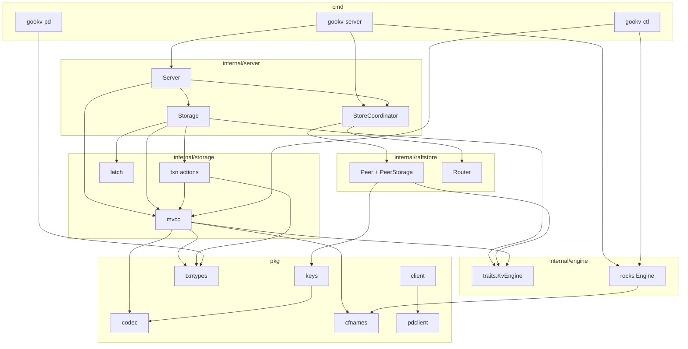

---

## 6. Data Model

### 6.1 Key-Value with MVCC

gookv stores data as key-value pairs where both keys and values are arbitrary
byte strings. Unlike a simple key-value store, gookv keeps multiple versions of
each key. Every write creates a new version tagged with a timestamp, and old
versions remain until garbage collected. This is called Multi-Version
Concurrency Control (MVCC).

MVCC enables two important properties:

1. **Non-blocking reads**: Readers see a consistent snapshot at their start
   timestamp without blocking writers.
2. **Snapshot isolation**: A transaction sees all data as it existed at the
   moment the transaction started, regardless of concurrent writes.

### 6.2 Three Column Families

Data is organized into three column families (CFs), each serving a distinct
purpose in the transaction protocol:

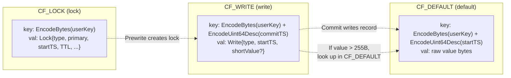

| Column Family | Purpose | Key Format | Value Format |
|---------------|---------|------------|--------------|
| **CF_LOCK** (`"lock"`) | Active transaction locks. One lock per key per transaction. Created during Prewrite, deleted during Commit/Rollback. | `EncodeBytes(userKey)` (no timestamp) | `Lock.Marshal()`: type, primary key, startTS, TTL, optional short value |
| **CF_WRITE** (`"write"`) | Commit/rollback records. Records that a version of a key was committed or rolled back. Contains the commit timestamp in the key and the start timestamp in the value. | `EncodeBytes(userKey) + EncodeUint64Desc(commitTS)` | `Write.Marshal()`: type (Put/Delete/Lock/Rollback), startTS, optional short value |
| **CF_DEFAULT** (`"default"`) | Large values. When a value exceeds 255 bytes, it cannot be inlined in the CF_WRITE record and is stored separately here. | `EncodeBytes(userKey) + EncodeUint64Desc(startTS)` | Raw value bytes |

A fourth column family, **CF_RAFT** (`"raft"`), is used internally to persist
Raft log entries and state. It is not part of the MVCC data model.

### 6.3 Short Value Optimization

Values of 255 bytes or fewer are stored directly in the CF_WRITE record as a
`ShortValue` field (tag `'v'`, 1-byte length prefix). This avoids an extra
read from CF_DEFAULT for small values, which is the common case. The constant
`ShortValueMaxLen = 255` controls this threshold.

### 6.4 Timestamp Model

Timestamps are `uint64` values from PD's Timestamp Oracle (TSO). They are
hybrid logical clocks:

```
|<------ 46 bits ------>|<- 18 bits ->|
|  physical (ms)        |  logical    |
```

- **Physical component** (`ts >> 18`): Milliseconds since Unix epoch.
- **Logical component** (`ts & 0x3FFFF`): Sequence number within the same
  millisecond.

Key constants defined in `pkg/txntypes/timestamp.go`:

| Constant        | Value              | Purpose |
|-----------------|--------------------|---------|
| `TSLogicalBits` | 18                 | Number of logical bits |
| `TSMax`         | `math.MaxUint64`   | Maximum possible timestamp |
| `TSZero`        | 0                  | Zero timestamp (uninitialized) |

Helper function `ComposeTS(physical, logical)` constructs a timestamp from
its components. Method `ts.Physical()` extracts the physical part, and
`ts.Logical()` extracts the logical part.

### 6.5 Key Space Partitioning

The engine's single flat keyspace is partitioned at two levels:

**Level 1: Column family prefix** (1 byte, applied by `rocks.Engine`):

| Prefix | Column Family |
|--------|---------------|
| `0x00` | CF_DEFAULT    |
| `0x01` | CF_LOCK       |
| `0x02` | CF_WRITE      |
| `0x03` | CF_RAFT       |

**Level 2: Data vs local prefix** (1 byte, applied by `pkg/keys`):

| Prefix | Namespace | Content |
|--------|-----------|---------|
| `0x01` (`LocalPrefix`) | Local keys | Raft logs, hard state, region state, store identity |
| `0x7A` (`DataPrefix`, ASCII `'z'`) | Data keys | User-facing MVCC data |

Because `0x01 < 0x7A`, all local (internal) keys sort before all data (user)
keys within each column family.

### 6.6 Region Model

The key space is divided into **regions** -- contiguous, non-overlapping byte
ranges. Each region is defined by:

```go
// From protobuf: metapb.Region
type Region struct {
    Id          uint64
    StartKey    []byte          // inclusive lower bound
    EndKey      []byte          // exclusive upper bound (empty = infinity)
    RegionEpoch *RegionEpoch    // version tracking for splits/conf changes
    Peers       []*Peer         // list of replicas (store ID + peer ID)
}
```

The initial cluster starts with a single region covering the entire key space
(`StartKey=""`, `EndKey=""`). As data grows, regions split at a midpoint key,
creating two child regions. The `RegionEpoch.Version` is bumped on every split
to detect stale routing.

---

## 7. Operating Modes

gookv supports three operating modes, selected by command-line flags.

### 7.1 Standalone Mode

**When**: No cluster flags (`--store-id`, `--initial-cluster`, `--pd-endpoints`)
are provided.

In standalone mode, gookv runs as a single-node store without Raft and without
PD. The default PD endpoints are cleared automatically when no config file and
no cluster flags are given, so the server starts fully self-contained. The
`StoreCoordinator` is nil, so no Raft proposal path is taken.

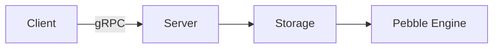

This mode is useful for development, testing, and single-node deployments where
fault tolerance is not needed.

**Write path**:
1. gRPC handler calls `Storage.Prewrite(mutations, ...)`.
2. `Storage` acquires latches, takes a snapshot, creates `MvccTxn` + `MvccReader`.
3. Transaction actions compute MVCC modifications.
4. `Storage.ApplyModifies()` writes a single atomic `WriteBatch` to Pebble.

### 7.2 Bootstrap Cluster Mode

**When**: `--store-id N --initial-cluster "1=addr1,2=addr2,..."` flags are provided.

In bootstrap mode, all nodes start together with a known topology. The
`--initial-cluster` flag provides a static mapping of store IDs to addresses.

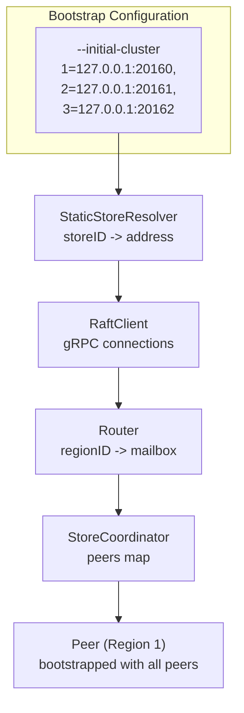

At startup:
1. A `StaticStoreResolver` is created from the cluster map.
2. A `RaftClient` manages gRPC connections to peer stores.
3. A `Router` maps region IDs to peer mailbox channels.
4. A `StoreCoordinator` is created and attached to the server.
5. A single region (region 1) is bootstrapped spanning all stores.

**Write path**:
1. gRPC handler calls `Storage.PrewriteModifies(...)` to compute MVCC
   modifications without applying them.
2. The handler calls `StoreCoordinator.ProposeModifies(regionID, modifies)`.
3. `ProposeModifies` serializes modifications as `raft_cmdpb.RaftCmdRequest`.
4. The `Peer` goroutine proposes through `raft.RawNode.Propose()`.
5. After Raft consensus, all nodes apply committed entries via
   `StoreCoordinator.applyEntries()`.

### 7.3 Join Mode

**When**: `--pd-endpoints` is provided without `--initial-cluster`.

In join mode, a node discovers the cluster dynamically through PD. This is the
production mode for adding new nodes to an existing cluster.

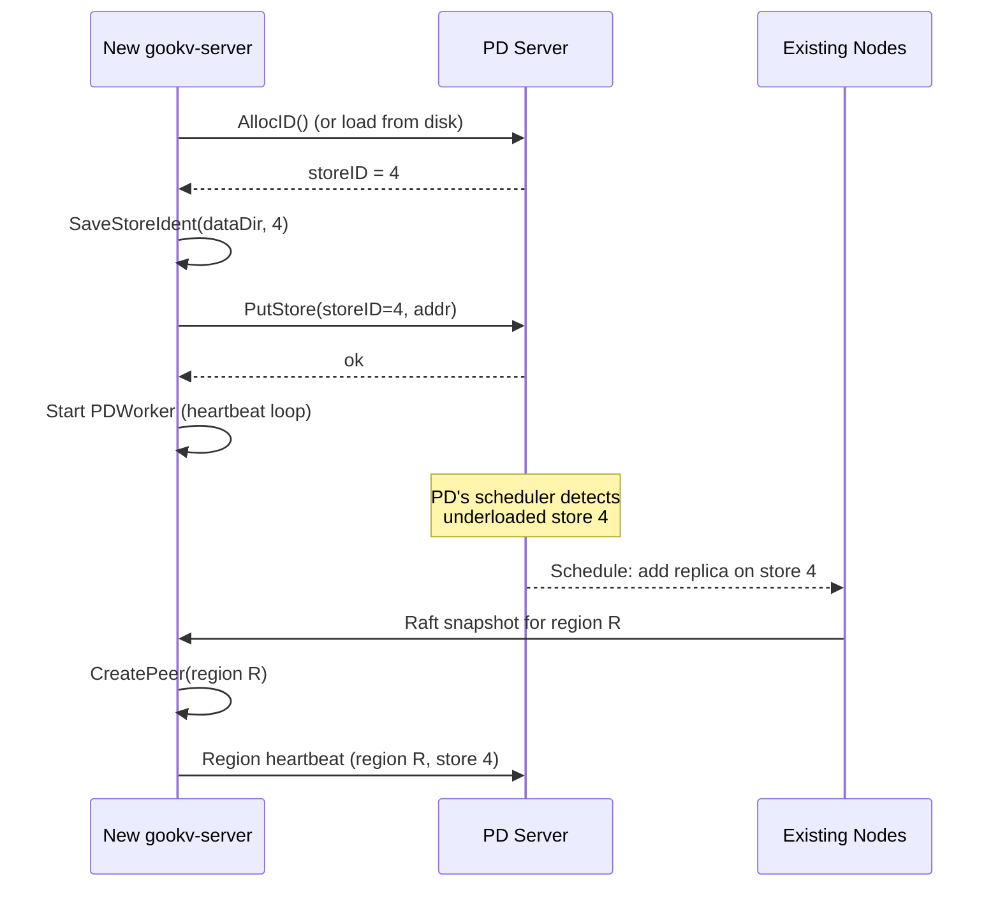

At startup:
1. The node allocates a store ID from PD (or loads a previously persisted one
   from `<dataDir>/store_ident`).
2. A `PDStoreResolver` resolves peer addresses dynamically via PD queries.
3. The node starts empty -- no regions are hosted initially.
4. PD's scheduling algorithms detect the new node and begin moving region
   replicas to it via Raft snapshots.

The store identity persistence (`internal/server/store_ident.go`) ensures the
node retains its store ID across restarts:

| Function           | Purpose |
|--------------------|---------|
| `SaveStoreIdent()` | Writes store ID as decimal text to `<dataDir>/store_ident` |
| `LoadStoreIdent()` | Reads and parses the persisted store ID on restart |

---

## 8. Server Startup Sequence

The `cmd/gookv-server/main.go` entry point orchestrates all component
initialization. The following diagram shows the complete startup flow:

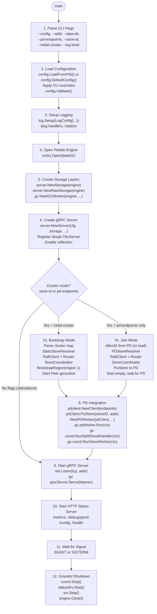

### 8.1 Detailed Step Breakdown

**Step 1: Parse CLI Flags**

The server accepts the following flags:

| Flag               | Type     | Purpose |
|--------------------|----------|---------|
| `--config`         | string   | Path to TOML config file |
| `--addr`           | string   | gRPC listen address |
| `--status-addr`    | string   | HTTP status listen address |
| `--data-dir`       | string   | Pebble data directory |
| `--pd-endpoints`   | string   | Comma-separated PD addresses |
| `--store-id`       | uint64   | Store ID (enables cluster mode) |
| `--initial-cluster`| string   | Static cluster topology map |
| `--log-level`      | string   | Log level: debug/info/warn/error |
| `--log-file`       | string   | Log file path |

**Step 2: Load Configuration**

Configuration follows a layered approach: TOML file first, then CLI flag
overrides. The `config.Config` struct contains sections:

```go
// internal/config/config.go
type Config struct {
    Server      ServerConfig
    Storage     StorageConfig
    PD          PDConfig
    RaftStore   RaftStoreConfig
    Coprocessor CoprocessorConfig
    Pessimistic PessimisticTxnConfig
    Log         LogConfig
    SlowLogFile string
}
```

**Step 4: Open Pebble Engine**

`rocks.Open(dataDir)` creates or opens a Pebble database. This single database
instance stores all four column families (via key prefixing) and all regions
hosted by this node.

**Step 5: Create Storage Layers**

Three storage-level components are created:

- `server.NewStorage(engine)`: Initializes a `Latches` table with 2048 hash
  slots, a `ConcurrencyManager`, and a command ID counter.
- `server.NewRawStorage(engine)`: Simple wrapper for non-transactional
  operations.
- `gc.NewGCWorker(engine, safePointProvider)`: Starts a background goroutine
  for MVCC garbage collection.

**Step 6: Create gRPC Server**

`server.NewServer()` creates the gRPC server with:
- Max message size: 16 MiB (both send and receive)
- Cluster ID interceptor (when ClusterID is configured)
- Server reflection enabled for tooling like `grpcurl`
- All TiKV-compatible RPCs registered

**Step 7: Raft Infrastructure (cluster mode only)**

In bootstrap mode, the coordinator creates a single initial region spanning the
entire key space. The region is bootstrapped with one `Peer` goroutine per store
in the cluster. Each peer's `Run()` method starts a goroutine with the Raft
event loop.

Key wiring:
- `peer.SetSendFunc(sendRaftMessage)` -- connects outbound messages to `RaftClient`
- `peer.SetApplyFunc(coord.applyEntriesForPeer)` -- connects committed entries
  to the `Storage.ApplyModifies` pipeline
- `router.Register(regionID, peer.Mailbox)` -- registers the mailbox for routing

**Step 9-10: Start Network Servers**

The gRPC server starts listening on the configured address. The HTTP status
server starts on a separate port, providing:

| Endpoint          | Purpose |
|-------------------|---------|
| `/metrics`        | Prometheus metrics |
| `/debug/pprof/*`  | Go pprof profiling |
| `/config`         | Current configuration dump |
| `/status`         | Server status information |
| `/health`         | Health check endpoint |

**Step 12: Graceful Shutdown**

On SIGINT or SIGTERM:
1. `coord.Stop()` -- cancels all peer contexts, waits for goroutines to exit
2. `statusSrv.Stop()` -- HTTP graceful shutdown with 5-second timeout
3. `srv.Stop()` -- gRPC `GracefulStop()` (waits for in-flight RPCs)
4. `engine.Close()` -- closes Pebble (deferred from step 4)

---

## 9. Key Dependencies

gookv is built on a small number of carefully chosen dependencies:

### 9.1 Storage Engine: Pebble

| | |
|-|-|
| **Module** | `github.com/cockroachdb/pebble` v1.1.5 |
| **What it is** | A pure-Go LSM-tree storage engine, developed by CockroachDB as a replacement for RocksDB |
| **Why** | Avoids CGo build dependencies while providing RocksDB-compatible semantics. Supports atomic write batches, point-in-time snapshots, and configurable compaction. |
| **Used by** | `internal/engine/rocks` -- the `Engine` struct wraps `*pebble.DB` |

### 9.2 Raft Consensus: etcd/raft

| | |
|-|-|
| **Module** | `go.etcd.io/etcd/raft/v3` v3.5.17 |
| **What it is** | The Raft consensus library extracted from etcd. Provides the `RawNode` API for full control over Raft state transitions. |
| **Why** | Battle-tested Raft implementation used in production by etcd, CockroachDB, and many other systems. The `RawNode` API gives gookv control over when to tick, step, propose, and process ready state. |
| **Used by** | `internal/raftstore` -- each `Peer` owns a `*raft.RawNode` |

### 9.3 Protocol Buffers: kvproto

| | |
|-|-|
| **Module** | `github.com/pingcap/kvproto` |
| **What it is** | TiKV's protobuf definitions for the gRPC API, Raft messages, region metadata, and PD protocol. |
| **Why** | Wire compatibility with TiKV clients. Defines `tikvpb.Tikv` (the gRPC service), `kvrpcpb` (request/response types), `raft_serverpb` (Raft messages), `raft_cmdpb` (Raft commands), `eraftpb` (Raft protocol buffers), `metapb` (cluster metadata), and `pdpb` (PD protocol). |
| **Used by** | `internal/server`, `internal/raftstore`, `internal/pd`, `pkg/pdclient` |

### 9.4 gRPC

| | |
|-|-|
| **Module** | `google.golang.org/grpc` v1.79.3 |
| **What it is** | Google's high-performance RPC framework |
| **Why** | Required for TiKV API compatibility. Provides streaming RPCs for Raft message transport and batch command multiplexing. |
| **API** | Uses `grpc.NewClient` (the `grpc.Dial` API was deprecated in v1.63). |
| **Used by** | `internal/server` (server side), `internal/server/transport` (client connections to peers), `pkg/pdclient` (PD client), `pkg/client` (KV client) |

### 9.5 Other Dependencies

| Module | Purpose |
|--------|---------|
| `github.com/prometheus/client_golang` v1.15.0 | Prometheus metrics exposition at `/metrics` |
| `github.com/stretchr/testify` v1.11.1 | Test assertions (assert, require) |
| `github.com/BurntSushi/toml` v1.6.0 | TOML config file parsing |
| `gopkg.in/natefinch/lumberjack.v2` v2.2.1 | Log file rotation |

---

## 10. The gRPC API Surface

gookv implements the full TiKV-compatible gRPC API, defined by the
`tikvpb.Tikv` service. This section lists all implemented RPCs and their
purpose.

### 10.1 Transactional KV RPCs

These RPCs implement the Percolator two-phase commit protocol:

| RPC | Purpose | Cluster Mode Behavior |
|-----|---------|----------------------|
| `KvGet` | Read a single key at a given timestamp | ReadIndex for linearizability, then snapshot read |
| `KvScan` | Range scan returning key-value pairs | ReadIndex, then MVCC-aware forward/reverse scan |
| `KvBatchGet` | Read multiple keys in one RPC | ReadIndex, then parallel point reads |
| `KvPrewrite` | Phase 1: Acquire locks on keys | Compute modifications, propose via Raft |
| `KvCommit` | Phase 2: Make committed versions visible | Compute modifications, propose via Raft |
| `KvBatchRollback` | Roll back uncommitted keys | Compute modifications, propose to multiple regions |
| `KvCleanup` | Resolve a single key's lock | Check primary, then commit or rollback |
| `KvCheckTxnStatus` | Inspect transaction status (may clean up) | Read-only or write (TTL-based cleanup) |
| `KvPessimisticLock` | Acquire pessimistic locks | Propose lock modifications via Raft |
| `KvPessimisticRollback` | Release pessimistic locks | Direct application |
| `KvTxnHeartBeat` | Refresh lock TTL | Direct modification |
| `KvCheckSecondaryLocks` | Inspect async commit secondary keys | Read-only |
| `KvScanLock` | Scan CF_LOCK for locks below a timestamp | Iterator over CF_LOCK |
| `KvResolveLock` | Commit or rollback all locks for a transaction | Propose to multiple regions |
| `KvGC` | Schedule GC with a safe point | Updates PD safe point |
| `KvDeleteRange` | Delete all keys in a range | DeleteRange modifies via Raft |

### 10.2 Raw KV RPCs

These RPCs bypass the MVCC layer entirely:

| RPC | Purpose |
|-----|---------|
| `RawGet` | Read a single key from a column family |
| `RawPut` | Write a key-value pair |
| `RawDelete` | Delete a single key |
| `RawScan` | Range scan |
| `RawBatchGet` | Multi-key read |
| `RawBatchPut` | Multi-key write |
| `RawBatchDelete` | Multi-key delete |
| `RawDeleteRange` | Range delete |
| `RawBatchScan` | Multi-range scan with per-range limits |
| `RawGetKeyTTL` | Get remaining TTL for a key |
| `RawCompareAndSwap` | Atomic CAS with TTL awareness |
| `RawChecksum` | CRC64 XOR checksum over a key range |

### 10.3 Raft RPCs (Inter-Node)

| RPC | Purpose |
|-----|---------|
| `Raft` | Receive Raft messages from other nodes (streaming) |
| `BatchRaft` | Receive batched Raft messages (streaming) |
| `Snapshot` | Receive snapshot chunks from other nodes (streaming) |

### 10.4 Multiplexing

| RPC | Purpose |
|-----|---------|
| `BatchCommands` | Bidirectional streaming for multiplexing multiple operations |

### 10.5 Other

| RPC | Purpose |
|-----|---------|
| `Coprocessor` | Push-down query execution (table scan, filter, aggregate) |
| `CoprocessorStream` | Streaming variant of Coprocessor |

---

## 11. The Dual Write Path

A distinctive feature of gookv's architecture is the **dual write path**. The
same transactional logic produces MVCC modifications, but these modifications
are applied differently depending on the operating mode.

### 11.1 Path Comparison

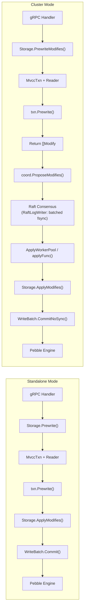

| Aspect | Standalone | Cluster |
|--------|-----------|---------|
| Method suffix | `Prewrite()`, `Commit()` | `PrewriteModifies()`, `CommitModifies()` |
| Modifications | Computed and applied in one call | Computed, returned, then proposed via Raft |
| Latency | Single Pebble write | Raft round-trip + Pebble write |
| Durability | Single-node Pebble sync | Majority replicated + Raft log fsync (apply uses `CommitNoSync`) |
| Concurrency control | Latches only | Latches + Raft serialization |

### 11.2 Modify Serialization

In cluster mode, `[]mvcc.Modify` must be serialized for Raft proposal.
Two helper functions in `internal/server/raftcmd.go` handle this:

**`ModifiesToRequests([]mvcc.Modify) []*raft_cmdpb.Request`** (leader path):
- `ModifyTypePut` becomes `CmdType_Put` with CF, Key, Value.
- `ModifyTypeDelete` becomes `CmdType_Delete` with CF, Key.
- `ModifyTypeDeleteRange` becomes `CmdType_DeleteRange` with CF, StartKey, EndKey.

**`RequestsToModifies([]*raft_cmdpb.Request) []mvcc.Modify`** (apply path):
- Reverse of the above.

These are wrapped in a `raft_cmdpb.RaftCmdRequest` protobuf and proposed as
a normal Raft entry.

### 11.3 Region-Aware Proposal Routing

Some operations may span multiple regions (for example, `KvBatchRollback`
rolling back keys in different regions). The server provides helpers:

- **`groupModifiesByRegion(modifies)`**: Groups modifications by target region
  using the encoded modify key for region lookup.
- **`proposeModifiesToRegions(coord, modifies, timeout)`**: Groups and proposes
  to each region sequentially.

Single-region operations (`KvPrewrite`, `KvCommit`) use the region ID from the
request context directly (`req.GetContext().GetRegionId()`) without grouping.

---

## 12. Region Lifecycle

### 12.1 Region Creation

Regions are created in three ways:

1. **Bootstrap**: The first region (ID=1) is created at cluster startup, spanning
   the entire key space.
2. **Split**: When a region grows too large, it splits into two child regions.
   The parent's `EndKey` is updated, and a new child region is created with the
   split key as its `StartKey`.
3. **Snapshot**: When PD schedules a region replica to a new node, the leader
   sends a Raft snapshot. The receiving node creates a new peer for the region.

### 12.2 Region Split Flow

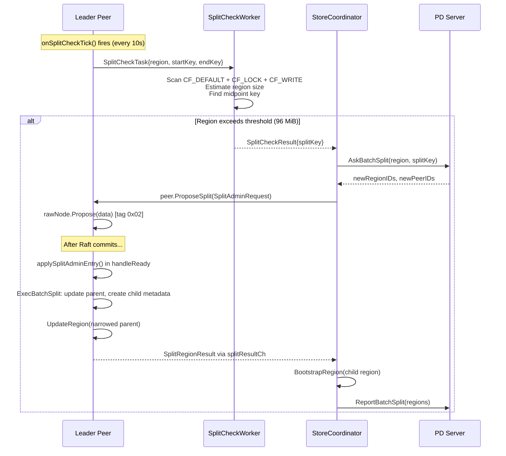

### 12.3 Region Epoch

Every region has a `RegionEpoch` with two version numbers:

| Field | Incremented When |
|-------|-----------------|
| `Version` | Region split or merge |
| `ConfVer` | Raft membership change (add/remove peer) |

The epoch is used to detect stale requests. When a client sends a request with
an old epoch, the server returns an `EpochNotMatch` error, and the client
refreshes its region cache.

### 12.4 Region State Persistence

Region metadata is persisted in CF_RAFT at `RegionStateKey(regionID)`:

```
Key:   [0x01][0x03][regionID:8B BE][0x01]
Value: RegionState protobuf (region metadata + peer state)
```

---

## 13. Configuration System

gookv uses a TOML-based configuration system defined in
`internal/config/config.go`. The configuration is hierarchical with sections
for each component.

### 13.1 Top-Level Config

```go
type Config struct {
    Server      ServerConfig
    Storage     StorageConfig
    PD          PDConfig
    RaftStore   RaftStoreConfig
    Coprocessor CoprocessorConfig
    Pessimistic PessimisticTxnConfig
    Log         LogConfig
    SlowLogFile string
}
```

### 13.2 Key Configuration Sections

**ServerConfig**:

| Field | Default | Purpose |
|-------|---------|---------|
| `Addr` | `"127.0.0.1:20160"` | gRPC listen address |
| `StatusAddr` | `"127.0.0.1:20180"` | HTTP status server address |
| `ClusterID` | 0 | Cluster ID for request validation |

**StorageConfig**:

| Field | Default | Purpose |
|-------|---------|---------|
| `DataDir` | `"/tmp/gookv"` | Pebble data directory |

**PDConfig**:

| Field | Default | Purpose |
|-------|---------|---------|
| `Endpoints` | `[]` | PD server addresses |

**RaftStoreConfig**:

| Field | Default | Purpose |
|-------|---------|---------|
| `RegionSplitSize` | `96 MiB` | Region size threshold for split |
| `RegionMaxSize` | `144 MiB` | Maximum region size |
| `EnableBatchRaftWrite` | `true` | Use `RaftLogWriter` to batch multiple regions' Raft log persistence into one fsync |
| `EnableApplyPipeline` | `true` | Use `ApplyWorkerPool` to decouple entry application from the peer goroutine |

### 13.3 Config Operations

| Function | Purpose |
|----------|---------|
| `LoadFromFile(path)` | Parse a TOML config file |
| `DefaultConfig()` | Return a config with sensible defaults |
| `Validate()` | Check config consistency (returns error on invalid) |
| `SaveToFile(path)` | Write current config to a TOML file |
| `Clone()` | Deep copy the config |
| `Diff(other)` | Compare two configs and return differences |

---

## 14. Logging Architecture

gookv uses Go's `log/slog` structured logging with custom handlers defined in
`internal/log/log.go`.

### 14.1 LogDispatcher

The `LogDispatcher` routes log records to different handlers based on the record
attributes:

| Handler | Destination | Purpose |
|---------|-------------|---------|
| Normal | File or stderr | Standard application logs |
| Slow | Separate file | Slow query logs (threshold-based) |
| Raft | Raft-specific file | Raft-related logs (filtered by tag) |

### 14.2 Log Rotation

File-based handlers use `lumberjack.v2` for automatic log rotation:

| Parameter | Default | Purpose |
|-----------|---------|---------|
| MaxSize | 100 MB | Rotate when file exceeds this size |
| MaxAge | 30 days | Delete rotated files older than this |
| MaxBackups | 10 | Maximum number of rotated files to keep |
| Compress | true | Gzip compress rotated files |

---

## 15. Observability

### 15.1 HTTP Status Server

The HTTP status server (`internal/server/status`) provides diagnostic
endpoints:

| Endpoint | Purpose |
|----------|---------|
| `/metrics` | Prometheus metrics in text format |
| `/debug/pprof/` | Go pprof profiling index |
| `/debug/pprof/profile` | CPU profile |
| `/debug/pprof/heap` | Heap profile |
| `/debug/pprof/goroutine` | Goroutine dump |
| `/config` | Current configuration as JSON |
| `/status` | Server status information |
| `/health` | Health check (returns 200 if alive) |

### 15.2 Metrics

gookv exposes Prometheus metrics for monitoring. Key metric categories include:

- **gRPC request latency and error rates** per RPC type
- **Raft proposal latency** and commit rates
- **Engine-level metrics** (compaction, memtable size, SST count)
- **MVCC operation counts** (prewrite, commit, rollback)
- **Region count and size** per store

---

## 16. Concurrency Model

gookv uses Go's concurrency primitives throughout. Understanding how goroutines,
channels, and locks are used helps in reasoning about correctness and performance.

### 16.1 Goroutine Architecture

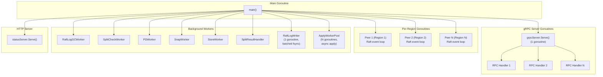

### 16.2 Channel-Based Communication

Channels connect components without shared state:

| Channel | Producer | Consumer | Purpose |
|---------|----------|----------|---------|
| `Peer.Mailbox` | Router, Transport | Peer goroutine | Raft messages and commands |
| `logGCWorkerCh` | Peer goroutine | RaftLogGCWorker | Log deletion tasks |
| `pdTaskCh` | Peer goroutine | PDWorker | Region heartbeats |
| `splitCheckCh` | Peer goroutine | SplitCheckWorker | Split check tasks |
| `splitResultCh` | Peer goroutine | Coordinator | Split results |
| `snapTaskCh` | PeerStorage | SnapWorker | Snapshot generation |
| `router.storeCh` | Transport | StoreWorker | Store-level messages |
| `RaftLogWriter.taskCh` | Peer goroutine | RaftLogWriter | Batched Raft log persist tasks |
| `ApplyWorkerPool.taskCh` | Peer goroutine | ApplyWorkerPool | Committed entry application tasks |

### 16.3 Lock Usage

| Lock | Type | Protects | Location |
|------|------|----------|----------|
| `Peer.regionMu` | `sync.RWMutex` | Region metadata | `internal/raftstore/peer.go` |
| `PeerStorage.mu` | `sync.RWMutex` | Storage state | `internal/raftstore/storage.go` |
| `StoreCoordinator.mu` | `sync.RWMutex` | Peers map | `internal/server/coordinator.go` |
| `Storage.mu` | `sync.Mutex` | Command ID counter | `internal/server/storage.go` |
| `WriteBatch.mu` | `sync.Mutex` | Batch state | `internal/engine/rocks/engine.go` |
| `Router.peers` | `sync.Map` | Region routing | `internal/raftstore/router/router.go` |
| `PDStoreResolver.mu` | `sync.RWMutex` | Address cache | `internal/server/pd_resolver.go` |

### 16.4 Key Design Principle: One Goroutine Per Peer

The most important concurrency design decision in gookv is running one goroutine
per Raft peer. Within a single peer goroutine, there is no need for locks on
Raft state -- all Raft operations (tick, step, propose, ready) are sequential.

This eliminates an entire class of concurrency bugs: race conditions on Raft
log indices, pending proposals, and leader state. The trade-off is that each
region adds one goroutine, which consumes memory (about 8 KB stack per
goroutine). For a node hosting 10,000 regions, this is approximately 80 MB of
goroutine stacks -- acceptable for modern servers.

---

## 17. Flow Control and Backpressure

The `internal/server/flow` package provides three mechanisms for preventing
overload:

### 17.1 ReadPool

The `ReadPool` uses EWMA (Exponentially Weighted Moving Average) to track
request processing latency. When latency exceeds a threshold, new requests
are throttled.

### 17.2 FlowController

The `FlowController` probabilistically drops requests based on Pebble's
compaction pressure. When L0 file count is high (indicating compaction backlog),
the probability of dropping a request increases.

### 17.3 MemoryQuota

The `MemoryQuota` enforces a lock-free memory limit on the transaction
scheduler. When the total memory used by in-flight commands exceeds the quota,
new commands are rejected until existing commands complete.

---

## 18. Error Handling Patterns

gookv uses several error handling patterns consistently across the codebase:

### 18.1 Region Errors

When a request cannot be served by the current node, a structured region error
is returned instead of a gRPC error. This tells the client exactly what went
wrong and how to recover:

| Region Error | Meaning | Client Action |
|-------------|---------|--------------|
| `NotLeader` | This node is not the leader for the region | Retry with the suggested leader, or refresh region cache |
| `RegionNotFound` | This node does not host the requested region | Refresh region cache from PD |
| `EpochNotMatch` | Region epoch is stale (split/merge occurred) | Refresh region cache from PD |
| `KeyNotInRegion` | The key falls outside the region's range | Refresh region cache from PD |

### 18.2 Key Errors

When a transactional operation encounters a logical conflict, a `KeyError` is
returned:

| Key Error | Meaning | Client Action |
|-----------|---------|--------------|
| `Locked` | Key is locked by another transaction | Wait or resolve the lock |
| `WriteConflict` | Write-write conflict detected | Retry the transaction |
| `TxnLockNotFound` | Lock was already resolved | Transaction already committed/rolled back |
| `AlreadyCommitted` | Transaction is already committed | No action needed |

---

## Summary

gookv is a distributed transactional key-value store that combines:

- **Pebble** for persistent, ordered key-value storage
- **Raft** (via etcd/raft) for consistent replication across nodes
- **MVCC** (3 column families) for multi-version concurrency control
- **Percolator 2PC** for distributed transactions with snapshot isolation
- **PD** for cluster coordination (timestamps, routing, scheduling)

The system is organized into clean layers (Engine -> Raft -> MVCC -> Storage ->
Server) with well-defined interfaces between them. It supports three operating
modes (standalone, bootstrap cluster, join) to accommodate development,
testing, and production use cases.

All data flows through the same fundamental path: user keys are encoded with
memcomparable encoding, tagged with timestamps, stored across three column
families, and replicated via Raft before being acknowledged to the client.
