# Chapter 5: Transactions

## Table of Contents

1. [The Problem: Transactions Across Multiple Machines](#the-problem-transactions-across-multiple-machines)
2. [Single-Node vs Distributed Transactions](#single-node-vs-distributed-transactions)
3. [Two-Phase Commit: The Basic Idea](#two-phase-commit-the-basic-idea)
4. [Percolator Protocol: Lock-Then-Commit](#percolator-protocol-lock-then-commit)
5. [MVCC with Three Column Families](#mvcc-with-three-column-families)
6. [Timestamp Model: TSO](#timestamp-model-tso)
7. [Key Types: Lock, Write, and Supporting Structures](#key-types-lock-write-and-supporting-structures)
8. [Prewrite Phase](#prewrite-phase)
9. [Commit Phase](#commit-phase)
10. [Rollback](#rollback)
11. [Read Path: PointGetter and Scanner](#read-path-pointgetter-and-scanner)
12. [Lock Resolution](#lock-resolution)
13. [Async Commit Optimization](#async-commit-optimization)
14. [1PC Optimization](#1pc-optimization)
15. [Pessimistic Locking](#pessimistic-locking)
16. [Garbage Collection](#garbage-collection)

---

## The Problem: Transactions Across Multiple Machines

Suppose you are transferring money from Account A to Account B. You need to:

1. Read the balance of Account A
2. Read the balance of Account B
3. Subtract $100 from Account A
4. Add $100 to Account B

If these operations are not atomic, another transaction might read Account A after step 3 but before step 4, seeing money that has vanished from the system. This is a **consistency violation**.

On a single database server, this is solved with locks and transactions. But what happens when Account A and Account B are on **different machines** (different regions)?

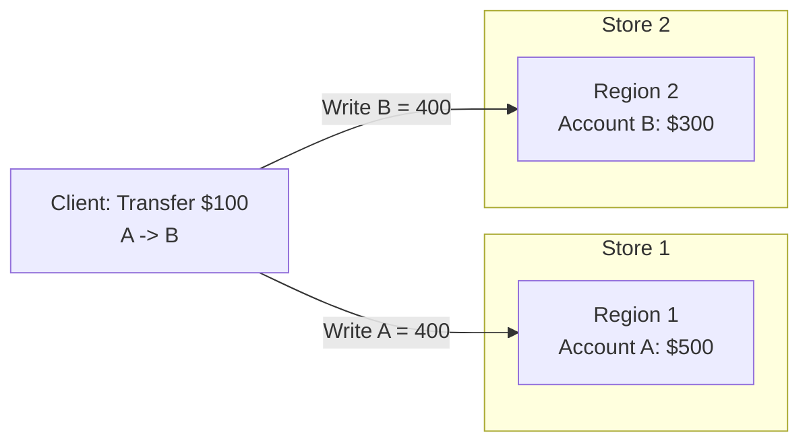

The challenge: if the write to Store 1 succeeds but the write to Store 2 fails (due to a crash, network partition, or conflict), the system is left in an inconsistent state -- $100 has disappeared.

This is the **distributed transaction problem**. gookv solves it using the **Percolator protocol**, a variant of two-phase commit designed for distributed key-value stores.

---

## Single-Node vs Distributed Transactions

### Single-Node Transactions

On a single machine, transactions are straightforward:

1. Acquire locks on all keys involved
2. Make the changes
3. Release locks

If anything goes wrong, you simply undo all changes (rollback) and release the locks. This works because locks and data are on the same machine -- there is no partial failure.

### Why Single-Node Techniques Fail in Distributed Systems

In a distributed system, partial failure is always possible:

| Failure Mode | What Happens |
|-------------|-------------|
| Store crash | Half the writes succeed, half are lost |
| Network partition | Coordinator cannot reach one store |
| Coordinator crash | Participants hold locks forever |

You need a protocol that can:
- Ensure **all-or-nothing** semantics across machines
- **Recover** from crashes without losing data
- Allow **concurrent** transactions without corruption

---

## Two-Phase Commit: The Basic Idea

Two-Phase Commit (2PC) splits a transaction into two steps:

### Phase 1: Prepare (Can you commit?)

The coordinator asks all participants: "Are you ready to commit?" Each participant:
- Checks for conflicts
- Writes a **tentative** record (a lock)
- Responds "yes" or "no"

### Phase 2: Commit (Do commit.)

If all participants said "yes", the coordinator tells them: "Commit." Each participant:
- Makes the tentative record permanent
- Removes the lock
- Responds "done"

If any participant said "no", the coordinator tells everyone: "Abort." Each participant removes their tentative records.

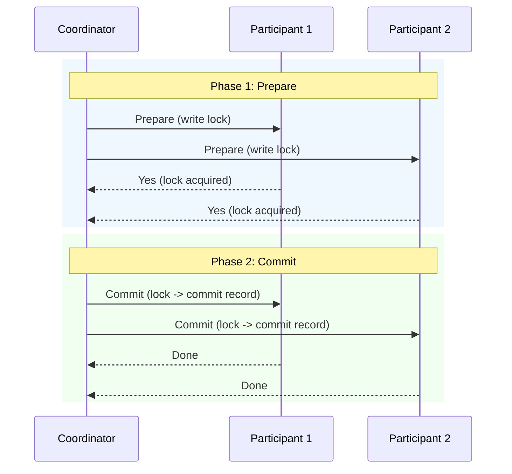

### The Coordinator Problem

Classical 2PC has a critical weakness: the coordinator is a single point of failure. If the coordinator crashes between Phase 1 and Phase 2, participants hold locks indefinitely.

Percolator elegantly solves this by **making the commit decision durable on a single key** (the primary key), allowing any participant to determine the transaction's fate by checking the primary.

---

## Percolator Protocol: Lock-Then-Commit

The Percolator protocol is Google's variant of 2PC designed for key-value stores. It was first described in the paper "Large-scale Incremental Processing Using Distributed Transactions and Notifications" (2010).

### Core Insight

Percolator designates one key in the transaction as the **primary key**. The primary key's lock is the **single source of truth** for the transaction's commit status:

- If the primary lock exists, the transaction is **in progress**
- If the primary has a commit record, the transaction is **committed**
- If the primary has a rollback record, the transaction is **aborted**

All other keys (called **secondaries**) point to the primary key. When anyone needs to know a transaction's status, they check the primary.

### Transaction Flow Overview

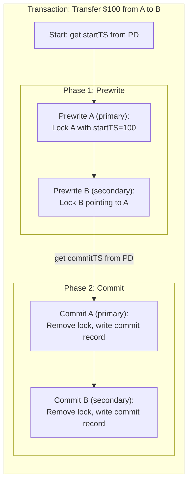

### Key Property: Commit Decision is Atomic

The transaction is considered committed **the instant the primary key's lock is replaced with a commit record**. This is a single atomic write on a single key. Even if the coordinator crashes before committing the secondary keys, the transaction is still committed -- any reader encountering an uncommitted secondary lock can check the primary to determine the outcome.

---

## MVCC with Three Column Families

Multi-Version Concurrency Control (MVCC) allows readers and writers to operate concurrently without blocking each other. Each write creates a **new version** of the key rather than overwriting the old one. Readers see a consistent snapshot based on their timestamp.

gookv stores MVCC data across three column families (CFs), each serving a distinct purpose:

### CF_LOCK: Active Transaction Locks

**Purpose**: Records which keys are currently being modified by in-progress transactions.

**Key encoding**: `EncodeLockKey(userKey)` -- the user key encoded with `codec.EncodeBytes` but **without a timestamp**. There is at most one lock per user key.

**Value**: A serialized `txntypes.Lock` struct containing the lock type, primary key pointer, start timestamp, TTL, and optionally inlined short values.

```
CF_LOCK:
  Key:   codec.EncodeBytes(nil, "account_A")
  Value: Lock{LockType:'P', Primary:"account_A", StartTS:100, TTL:3000, ShortValue:nil}

  Key:   codec.EncodeBytes(nil, "account_B")
  Value: Lock{LockType:'P', Primary:"account_A", StartTS:100, TTL:3000, ShortValue:nil}
```

### CF_WRITE: Commit and Rollback Metadata

**Purpose**: Records the commit (or rollback) status of each version. This is where readers look to find which versions are visible.

**Key encoding**: `EncodeKey(userKey, commitTS)` -- the user key followed by the commit timestamp in **descending order**. This means newer versions sort first, making it efficient to find the latest version with a single seek.

**Value**: A serialized `txntypes.Write` struct containing the write type (Put, Delete, Lock, Rollback), the transaction's start timestamp, and optionally an inlined short value.

```
CF_WRITE:
  Key:   codec.EncodeBytes(nil, "account_A") + descTS(commitTS=150)
  Value: Write{WriteType:'P', StartTS:100, ShortValue: []byte("400")}

  Key:   codec.EncodeBytes(nil, "account_A") + descTS(commitTS=50)
  Value: Write{WriteType:'P', StartTS:40, ShortValue: []byte("500")}
```

### CF_DEFAULT: Large Values

**Purpose**: Stores values that are too large to inline in the Write or Lock records (> 255 bytes).

**Key encoding**: `EncodeKey(userKey, startTS)` -- the user key followed by the transaction's **start** timestamp (not commit timestamp).

**Value**: The raw value bytes.

```
CF_DEFAULT:
  Key:   codec.EncodeBytes(nil, "large_doc") + descTS(startTS=100)
  Value: <4096 bytes of document data>
```

### Short Value Optimization

Values of 255 bytes or fewer are **inlined** directly in the Lock record (during prewrite) or the Write record (during commit), avoiding a separate write to CF_DEFAULT entirely. This is controlled by `txntypes.ShortValueMaxLen`:

```go
const ShortValueMaxLen = 255
```

### How the Three CFs Work Together

```mermaid
graph TB
    subgraph "Key: account_A"
        direction TB

        subgraph "CF_LOCK"
            L1["Lock{type:Put, primary:A, startTS:200, ttl:3000}"]
        end

        subgraph "CF_WRITE (newest first)"
            W1["commitTS=150: Write{type:Put, startTS:100, short:\"400\"}"]
            W2["commitTS=50: Write{type:Put, startTS:40, short:\"500\"}"]
        end

        subgraph "CF_DEFAULT"
            D1["(empty -- values are inlined as short values)"]
        end
    end

    Note1["Active txn (startTS=200) is modifying A"]
    Note2["Version at commitTS=150: value='400'"]
    Note3["Version at commitTS=50: value='500'"]

    L1 --- Note1
    W1 --- Note2
    W2 --- Note3
```

### Timestamp Ordering in Keys

The descending timestamp encoding is critical for performance. When a reader wants to find the latest version visible at timestamp T, it seeks to `EncodeKey(userKey, T)`. Because timestamps are descending, this seek lands at the first version with `commitTS <= T` -- exactly what the reader needs, in a single seek operation.

```go
// EncodeKey encodes a user key with a timestamp for storage.
// The timestamp is encoded in descending order so newer versions sort first.
func EncodeKey(key Key, ts txntypes.TimeStamp) []byte {
    encoded := codec.EncodeBytes(nil, key)
    return codec.EncodeUint64Desc(encoded, uint64(ts))
}
```

---

## Timestamp Model: TSO

### What is a TSO?

TSO stands for **Timestamp Oracle** -- a service that generates globally unique, monotonically increasing timestamps. In gookv, the PD (Placement Driver) serves as the TSO.

### Hybrid Logical Clock

Each timestamp is a 64-bit integer with two components:

```
 63                        18  17            0
+----------------------------+---------------+
|     Physical (ms)          |   Logical     |
+----------------------------+---------------+
     46 bits                    18 bits
```

```go
type TimeStamp uint64

const TSLogicalBits = 18

func (ts TimeStamp) Physical() int64 {
    return int64(ts >> TSLogicalBits)  // Milliseconds since epoch
}

func (ts TimeStamp) Logical() int64 {
    return int64(ts & ((1 << TSLogicalBits) - 1))  // Sequence number
}

func ComposeTS(physical int64, logical int64) TimeStamp {
    return TimeStamp(uint64(physical)<<TSLogicalBits | uint64(logical))
}
```

The physical component provides **wall-clock ordering** (millisecond granularity). The logical component provides **unique ordering** within the same millisecond, supporting up to 262,144 timestamps per millisecond.

### Special Timestamps

```go
const (
    TSMax  = TimeStamp(math.MaxUint64)  // Largest possible timestamp
    TSZero = TimeStamp(0)               // Zero/unset timestamp
)
```

### How Timestamps Drive Transactions

| Timestamp | When Allocated | Purpose |
|-----------|---------------|---------|
| `startTS` | Before prewrite | Defines the transaction's snapshot |
| `commitTS` | Before commit | Records when the transaction became visible |
| `forUpdateTS` | For pessimistic locks | Defines the conflict detection horizon |

Both `startTS` and `commitTS` are allocated from PD's TSO, ensuring global ordering. The key invariant: `commitTS > startTS` for every transaction, and every `startTS` or `commitTS` is unique cluster-wide.

---

## Key Types: Lock, Write, and Supporting Structures

### Lock

The `Lock` struct (defined in `pkg/txntypes/lock.go`) represents an active transaction lock:

```go
type Lock struct {
    LockType                    LockType    // 'P' (Put), 'D' (Delete), 'L' (Lock), 'S' (Pessimistic)
    Primary                     []byte      // Primary key of the transaction
    StartTS                     TimeStamp   // Transaction's start timestamp
    TTL                         uint64      // Time-to-live in milliseconds
    ShortValue                  []byte      // Inlined value (<= 255 bytes)
    ForUpdateTS                 TimeStamp   // Pessimistic lock conflict horizon
    TxnSize                     uint64      // Estimated transaction size
    MinCommitTS                 TimeStamp   // Minimum allowed commit timestamp (async commit)
    UseAsyncCommit              bool        // Whether this lock uses async commit
    Secondaries                 [][]byte    // All secondary keys (async commit primary only)
    RollbackTS                  []TimeStamp // Protected rollback timestamps
    LastChange                  LastChange  // Optimization: pointer to last data-changing version
    TxnSource                   uint64      // Source identifier
    PessimisticLockWithConflict bool        // Lock acquired despite conflict
    Generation                  uint64      // Pipelined DML generation counter
}
```

Lock binary format is byte-identical to TiKV's format, using tag-length-value encoding for optional fields:

```
[lockType: 1 byte]
[primary: varint-length + bytes]
[startTS: varint]
[ttl: varint]
[optional field: tag byte + data]...
```

### Write

The `Write` struct (defined in `pkg/txntypes/write.go`) represents a committed or rolled-back version:

```go
type Write struct {
    WriteType             WriteType   // 'P' (Put), 'D' (Delete), 'L' (Lock), 'R' (Rollback)
    StartTS               TimeStamp   // Transaction's start timestamp
    ShortValue            []byte      // Inlined value (<= 255 bytes)
    HasOverlappedRollback bool        // Rollback occurred at the same commit timestamp
    GCFence               *TimeStamp  // GC protection fence
    LastChange            LastChange  // Pointer to last data-changing version
    TxnSource             uint64      // Source identifier
}
```

### MvccTxn

The `MvccTxn` struct (defined in `internal/storage/mvcc/txn.go`) is a **write-only accumulator** that collects all modifications during a transaction action:

```go
type MvccTxn struct {
    StartTS   txntypes.TimeStamp
    Modifies  []Modify      // Accumulated CF modifications
    WriteSize int           // Estimated total write size
}
```

It provides methods for each type of modification:

| Method | CF | Key Encoding | Purpose |
|--------|-------|-------------|---------|
| `PutLock(key, lock)` | CF_LOCK | `EncodeLockKey(key)` | Write a lock |
| `UnlockKey(key, isPessimistic)` | CF_LOCK | `EncodeLockKey(key)` | Remove a lock |
| `PutValue(key, startTS, value)` | CF_DEFAULT | `EncodeKey(key, startTS)` | Write a large value |
| `DeleteValue(key, startTS)` | CF_DEFAULT | `EncodeKey(key, startTS)` | Remove a large value |
| `PutWrite(key, commitTS, write)` | CF_WRITE | `EncodeKey(key, commitTS)` | Write a commit/rollback record |
| `DeleteWrite(key, commitTS)` | CF_WRITE | `EncodeKey(key, commitTS)` | Remove a write record (GC) |

### MvccReader

The `MvccReader` struct (defined in `internal/storage/mvcc/reader.go`) provides MVCC-aware reads:

```go
type MvccReader struct {
    snapshot traits.Snapshot
}
```

Key methods:

| Method | Purpose |
|--------|---------|
| `LoadLock(key)` | Read lock from CF_LOCK |
| `SeekWrite(key, ts)` | Find first write with `commitTS <= ts` |
| `GetWrite(key, ts)` | Find latest data-changing write (skips Rollback/Lock records) |
| `GetTxnCommitRecord(key, startTS)` | Find a specific transaction's commit record |
| `GetValue(key, startTS)` | Read large value from CF_DEFAULT |

### Modify

The `Modify` struct represents a single CF operation:

```go
type Modify struct {
    Type   ModifyType  // Put, Delete, or DeleteRange
    CF     string      // Column family name
    Key    []byte      // Encoded key
    Value  []byte      // Value (for Put)
    EndKey []byte      // End key (for DeleteRange)
}
```

---

## Prewrite Phase

### Purpose

Prewrite is Phase 1 of 2PC. For each key in the transaction, it:
1. Checks for conflicts (other locks, newer writes)
2. Creates a lock in CF_LOCK
3. Writes the value (if any) to CF_DEFAULT or inlines it in the lock

### Conflict Detection

The prewrite must detect two types of conflicts:

**Lock conflict**: Another transaction already holds a lock on the key.

```go
existingLock, err := reader.LoadLock(key)
if existingLock != nil {
    if existingLock.StartTS == props.StartTS {
        return nil  // Idempotent: we already prewrote this key
    }
    return &KeyLockedError{Key: key, Lock: existingLock}
}
```

**Write conflict**: Another transaction has committed a write to this key after our `startTS`.

```go
// Loop through write records, skipping Rollback/Lock records
seekTS := txntypes.TSMax
for i := 0; i < mvcc.SeekBound*2; i++ {
    write, commitTS, err := reader.SeekWrite(key, seekTS)
    if write == nil {
        break
    }
    if commitTS <= props.StartTS {
        break  // All remaining writes are before our snapshot
    }
    // A newer data-changing write exists
    if write.WriteType != txntypes.WriteTypeRollback && write.WriteType != txntypes.WriteTypeLock {
        return ErrWriteConflict
    }
    seekTS = commitTS.Prev()
}
```

The conflict detection loop skips `Rollback` and `Lock` write records because they do not represent actual data changes. Only `Put` and `Delete` records can conflict.

### Lock Creation

After passing conflict checks, a lock is created:

```go
lock := &txntypes.Lock{
    LockType: lockType,       // Put, Delete, or Lock
    Primary:  props.Primary,  // Primary key of the transaction
    StartTS:  props.StartTS,  // Transaction's start timestamp
    TTL:      props.LockTTL,  // Time-to-live for lock cleanup
}

// Inline short values (<= 255 bytes)
if mutation.Value != nil && len(mutation.Value) <= txntypes.ShortValueMaxLen {
    lock.ShortValue = mutation.Value
}

txn.PutLock(key, lock)

// Write large values to CF_DEFAULT
if mutation.Op == MutationOpPut && mutation.Value != nil && len(mutation.Value) > txntypes.ShortValueMaxLen {
    txn.PutValue(key, props.StartTS, mutation.Value)
}
```

### PrewriteProps

The `PrewriteProps` struct carries all the parameters needed for a prewrite:

```go
type PrewriteProps struct {
    StartTS    txntypes.TimeStamp  // Transaction's start timestamp
    Primary    []byte              // Primary key
    LockTTL    uint64              // Lock TTL in milliseconds
    IsPrimary  bool                // Whether this is the primary key
}
```

### Complete Prewrite Flow

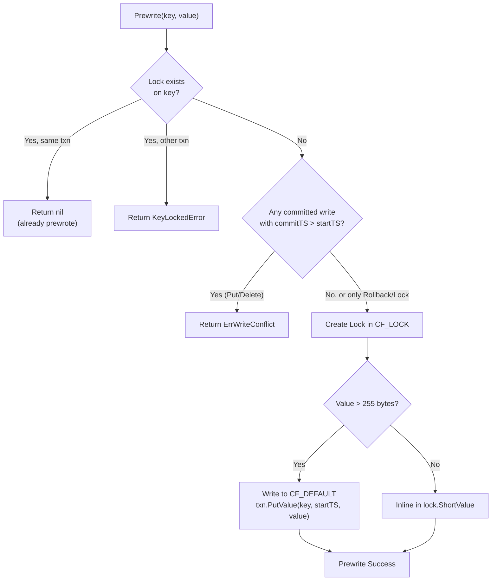

---

## Commit Phase

### Purpose

Commit is Phase 2 of 2PC. For each key, it:
1. Validates the lock still exists and belongs to our transaction
2. Removes the lock from CF_LOCK
3. Writes a commit record to CF_WRITE

### Lock Validation

The commit must verify the lock:

```go
func Commit(txn *mvcc.MvccTxn, reader *mvcc.MvccReader, key mvcc.Key, startTS, commitTS txntypes.TimeStamp) error {
    lock, err := reader.LoadLock(key)
    if err != nil {
        return err
    }
    if lock == nil || lock.StartTS != startTS {
        return ErrTxnLockNotFound  // Lock was cleaned up (TTL expired)
    }

    // Check min_commit_ts constraint (async commit)
    if commitTS < lock.MinCommitTS {
        return errors.New("txn: commit_ts less than min_commit_ts")
    }

    // Skip pessimistic locks that were never prewrote
    if lock.LockType == txntypes.LockTypePessimistic {
        txn.UnlockKey(key, true)
        return nil
    }
    // ...
}
```

### Write Record Creation

After validation, the lock is replaced with a write record:

```go
// Remove the lock
txn.UnlockKey(key, false)

// Create commit record
writeType := lockTypeToWriteType(lock.LockType)
write := &txntypes.Write{
    WriteType:  writeType,      // Put, Delete, or Lock
    StartTS:    lock.StartTS,   // Links commit record to its prewrite
    ShortValue: lock.ShortValue, // Carry forward the inlined value
}
txn.PutWrite(key, commitTS, write)
```

The commit record is stored in CF_WRITE keyed by `(userKey, commitTS)`. The `StartTS` field in the write record links it back to the prewrite, allowing readers to find the value in CF_DEFAULT if needed.

### Commit Flow

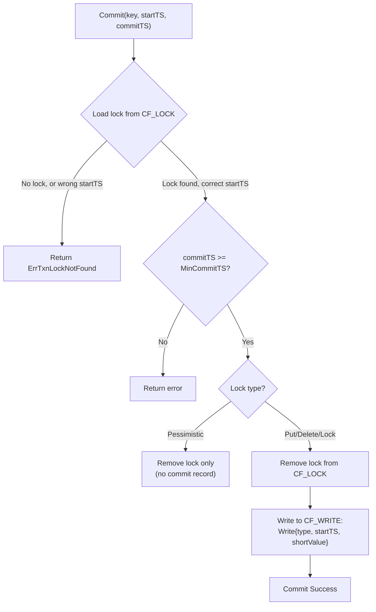

### Primary Key Selection

The primary key is chosen **deterministically** by lexicographic sort. In `TxnHandle` (`pkg/client/txn.go`), the `primaryKey()` method selects the lexicographically smallest key from the mutation buffer and caches the result in `cachedPrimary`. In `twoPhaseCommitter` (`pkg/client/committer.go`), `selectPrimary()` sorts all mutations by key and picks the first. This determinism ensures that all code paths (prewrite, commit, rollback, pessimistic lock) agree on the same primary key, and that the primary is stable across retries.

### Primary-First Commit Order

The client must commit the **primary key first**. Once the primary key's lock is replaced with a commit record, the transaction is considered committed. Secondary keys are committed afterward -- if the client crashes, other transactions will discover the commit by checking the primary.

**Batch secondary commit**: `commitSecondaries` in `pkg/client/committer.go` groups secondary keys by region via `GroupKeysByRegion` and sends one `KvCommit` RPC per region group in parallel. If a batch commit fails with `TxnLockNotFound` (e.g., because a lock was resolved by another transaction), it falls back to `commitSecondariesPerKey` which commits each key individually.

**Ambiguous primary commit failure**: If `commitPrimary` returns an error, the client calls `isPrimaryCommitted` (which returns `(bool, error)`) to check the actual transaction status via `KvCheckTxnStatus`. This handles the case where the Raft proposal succeeded but the response was lost (e.g., timeout during leader change after split). If the check itself fails (returns an error), the client does **not** rollback -- the primary may already be committed, and a rollback would be unsafe.

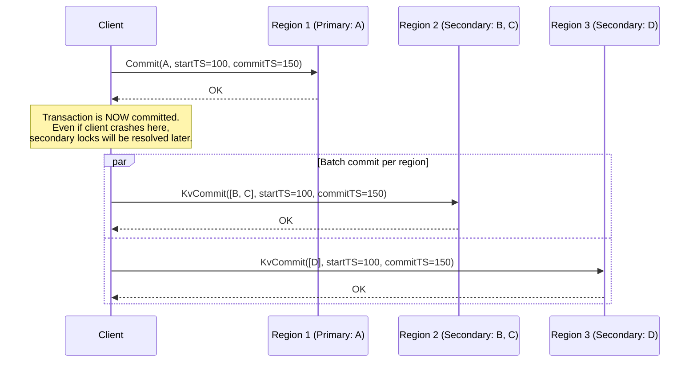

---

## Rollback

### Purpose

Rollback aborts a transaction by:
1. Removing any lock on the key
2. Deleting any large value written to CF_DEFAULT
3. Writing a **rollback record** to CF_WRITE to prevent late-arriving prewrites

### Idempotency

Rollback is designed to be idempotent -- calling it multiple times on the same key produces the same result:

```go
func Rollback(txn *mvcc.MvccTxn, reader *mvcc.MvccReader, key mvcc.Key, startTS txntypes.TimeStamp) error {
    // 1. Check if already committed
    existingWrite, _, err := reader.GetTxnCommitRecord(key, startTS)
    if existingWrite != nil {
        if existingWrite.WriteType != txntypes.WriteTypeRollback {
            return ErrAlreadyCommitted  // Cannot rollback a committed txn
        }
        return nil  // Already rolled back (idempotent)
    }

    // 2. Remove lock if present
    lock, err := reader.LoadLock(key)
    if lock != nil && lock.StartTS == startTS {
        txn.UnlockKey(key, lock.LockType == txntypes.LockTypePessimistic)
        // Delete large value from CF_DEFAULT
        if lock.ShortValue == nil && lock.LockType == txntypes.LockTypePut {
            txn.DeleteValue(key, startTS)
        }
    }

    // 3. Write rollback record (prevents late prewrites)
    rollbackWrite := &txntypes.Write{
        WriteType: txntypes.WriteTypeRollback,
        StartTS:   startTS,
    }
    txn.PutWrite(key, startTS, rollbackWrite)
    return nil
}
```

### Why Write a Rollback Record?

Without a rollback record, the following race condition is possible:

1. Transaction T1 prewrites key A on Store 1
2. T1's prewrite to key B (on Store 2) is slow due to network delay
3. Another transaction T2 discovers T1's lock on A, checks T1's status, and decides to roll T1 back
4. T2 removes T1's lock on A
5. T1's delayed prewrite on B arrives and succeeds (no lock on A to check)

Now B has a lock from a rolled-back transaction. The rollback record prevents step 5: when T1's delayed prewrite on B checks for conflicting writes, it finds the rollback record (with `commitTS = startTS`) and knows the transaction was aborted.

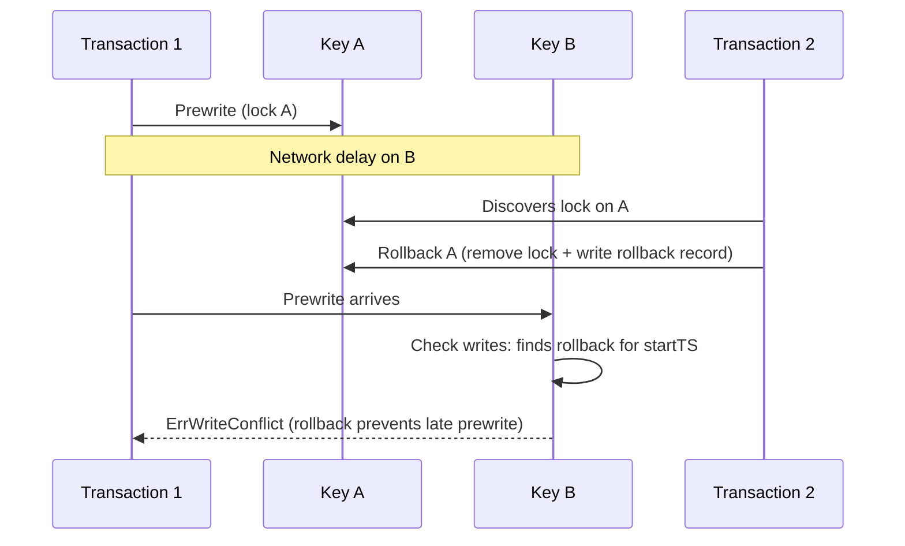

---

## Read Path: PointGetter and Scanner

### PointGetter

`PointGetter` (defined in `internal/storage/mvcc/point_getter.go`) performs optimized single-key reads. It supports two isolation levels:

- **Snapshot Isolation (SI)**: The default. Reads see a consistent snapshot at `readTS`. Locks from transactions with `startTS <= readTS` block the read.
- **Read Committed (RC)**: Reads ignore locks entirely and see the latest committed version.

```go
type PointGetter struct {
    reader         *MvccReader
    ts             txntypes.TimeStamp  // Read timestamp
    isolationLevel IsolationLevel      // SI or RC
    bypassLocks    map[txntypes.TimeStamp]bool
}
```

The `Get` method follows three steps:

```go
func (pg *PointGetter) Get(key Key) ([]byte, error) {
    // Step 1: Check for blocking locks (SI only)
    if pg.isolationLevel == IsolationLevelSI {
        lock, err := pg.reader.LoadLock(key)
        if lock != nil && lock.StartTS <= pg.ts && lock.LockType != txntypes.LockTypePessimistic {
            if !pg.bypassLocks[lock.StartTS] {
                return nil, &LockError{Key: key, Lock: lock}
            }
        }
    }

    // Step 2: Find the visible write record
    write, _, err := pg.reader.GetWrite(key, pg.ts)
    if write == nil {
        return nil, nil  // Key does not exist at this timestamp
    }

    // Step 3: Read the value
    if write.ShortValue != nil {
        return write.ShortValue, nil  // Inlined in the write record
    }
    return pg.reader.GetValue(key, write.StartTS)  // Read from CF_DEFAULT
}
```

### GetWrite: Finding Visible Versions

The `MvccReader.GetWrite` method scans CF_WRITE to find the latest data-changing write (Put or Delete) visible at the given timestamp:

```go
func (r *MvccReader) GetWrite(key Key, ts txntypes.TimeStamp) (*txntypes.Write, txntypes.TimeStamp, error) {
    seekKey := EncodeKey(key, ts)
    iter := r.snapshot.NewIterator(cfnames.CFWrite, traits.IterOptions{})
    iter.Seek(seekKey)

    for iter.Valid() {
        // Check same user key
        foundUserKey := TruncateToUserKey(iter.Key())
        if !bytes.Equal(foundUserKey, encodedUserKey) {
            break
        }

        write, _ := txntypes.UnmarshalWrite(iter.Value())

        switch write.WriteType {
        case txntypes.WriteTypePut:
            return write, commitTS, nil    // Found a visible Put
        case txntypes.WriteTypeDelete:
            return nil, 0, nil             // Key was deleted
        case txntypes.WriteTypeLock, txntypes.WriteTypeRollback:
            // Skip non-data-changing records
            // Use LastChange optimization when available
            if write.LastChange.EstimatedVersions >= SeekBound && !write.LastChange.TS.IsZero() {
                iter.Seek(EncodeKey(key, write.LastChange.TS))
                continue
            }
            iter.Next()
            continue
        }
    }
    return nil, 0, nil
}
```

### LastChange Optimization

When many `Rollback` or `Lock` write records accumulate for a key, scanning through them becomes expensive. The `LastChange` field provides a shortcut:

```go
type LastChange struct {
    TS                TimeStamp  // Timestamp of the last data-changing version
    EstimatedVersions uint64     // Estimated number of versions to skip
}
```

When `EstimatedVersions >= SeekBound` (32), instead of iterating one-by-one, the reader jumps directly to the `LastChange.TS` using a seek operation:

```go
if write.LastChange.EstimatedVersions >= SeekBound && !write.LastChange.TS.IsZero() {
    jumpKey := EncodeKey(key, write.LastChange.TS)
    iter.Seek(jumpKey)
    continue
}
```

### Scanner

`Scanner` (defined in `internal/storage/mvcc/scanner.go`) performs MVCC-aware range scans with persistent cursor state across multiple keys. It manages three iterators:

```go
type Scanner struct {
    cfg           ScannerConfig
    writeCursor   traits.Iterator  // CF_WRITE: always active
    lockCursor    traits.Iterator  // CF_LOCK: nil under RC isolation
    defaultCursor traits.Iterator  // CF_DEFAULT: lazily created
    isStarted     bool
    stats         ScanStatistics
}
```

The scanner coordinates the write cursor and lock cursor to find visible keys:

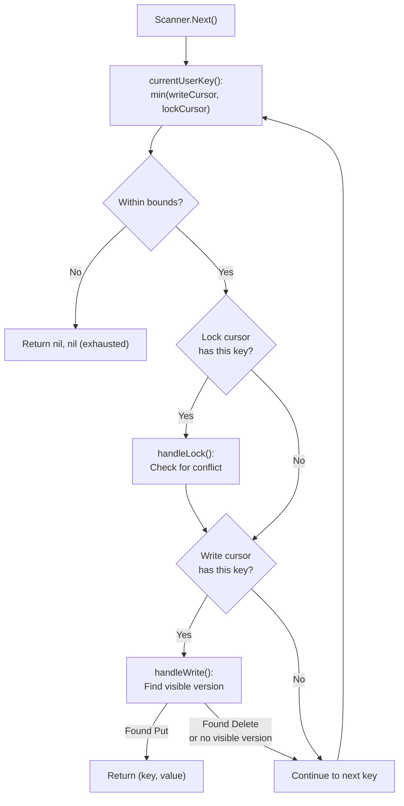

The scanner supports both forward and backward scans via the `Desc` configuration flag. For backward scans, it uses `Prev()` instead of `Next()` on iterators and reverses the cursor comparison logic (max instead of min).

### ScanStatistics

The scanner tracks performance metrics:

```go
type ScanStatistics struct {
    ScannedKeys   int64  // Total keys examined
    ProcessedKeys int64  // Keys returned to caller
    ScannedLocks  int64  // Lock records examined
    DefaultReads  int64  // CF_DEFAULT reads (large values)
    OverSeekBound int64  // Times a seek was used instead of linear iteration
}
```

---

## Lock Resolution

### The Problem

When a reader encounters a lock left by a potentially crashed transaction, it cannot simply wait forever. The **lock resolution** protocol determines whether the transaction committed or aborted, then cleans up accordingly.

### CheckTxnStatus

`CheckTxnStatus` examines a transaction's primary key to determine its status:

```go
type TxnStatus struct {
    IsLocked     bool
    Lock         *txntypes.Lock
    CommitTS     txntypes.TimeStamp  // Non-zero if committed
    IsRolledBack bool
}

func CheckTxnStatus(reader *mvcc.MvccReader, primaryKey mvcc.Key, startTS txntypes.TimeStamp) (*TxnStatus, error) {
    // Check for lock on primary
    lock, _ := reader.LoadLock(primaryKey)
    if lock != nil && lock.StartTS == startTS {
        return &TxnStatus{IsLocked: true, Lock: lock}, nil
    }

    // Check for commit/rollback record
    write, commitTS, _ := reader.GetTxnCommitRecord(primaryKey, startTS)
    if write != nil {
        if write.WriteType == txntypes.WriteTypeRollback {
            return &TxnStatus{IsRolledBack: true}, nil
        }
        return &TxnStatus{CommitTS: commitTS}, nil
    }

    // Transaction not found
    return &TxnStatus{}, nil
}
```

### TTL-Based Lock Expiry

`CheckTxnStatusWithCleanup` extends `CheckTxnStatus` with automatic cleanup of expired locks:

```go
func CheckTxnStatusWithCleanup(txn, reader, primaryKey, startTS, callerStartTS, rollbackIfNotExist) {
    lock, _ := reader.LoadLock(primaryKey)
    if lock != nil && lock.StartTS == startTS {
        // Check TTL expiry using physical time component
        lockPhysicalTime := uint64(startTS) >> 18
        callerPhysicalTime := uint64(callerStartTS) >> 18
        lockExpireTime := lockPhysicalTime + lock.TTL

        if callerPhysicalTime >= lockExpireTime {
            // Lock expired: force rollback
            txn.UnlockKey(primaryKey, ...)
            txn.PutWrite(primaryKey, startTS, rollbackWrite)
            return &TxnStatus{IsRolledBack: true}, nil
        }

        return &TxnStatus{IsLocked: true, Lock: lock}, nil
    }
    // ... check commit record or write rollback ...
}
```

The TTL is compared using the **physical component** of the timestamp (upper 46 bits), which represents milliseconds since epoch.

### ResolveLock

`ResolveLock` resolves a single key's lock based on the transaction's determined fate:

```go
func ResolveLock(txn *mvcc.MvccTxn, reader *mvcc.MvccReader, key mvcc.Key, startTS, commitTS txntypes.TimeStamp) error {
    lock, _ := reader.LoadLock(key)
    if lock == nil || lock.StartTS != startTS {
        return nil  // No lock to resolve
    }

    if commitTS > 0 {
        return Commit(txn, reader, key, startTS, commitTS)  // Commit the lock
    }
    return Rollback(txn, reader, key, startTS)  // Roll back the lock
}
```

### TxnHeartBeat

Long-running transactions keep their locks alive by sending heartbeats that extend the TTL:

```go
func TxnHeartBeat(txn *mvcc.MvccTxn, reader *mvcc.MvccReader, primaryKey mvcc.Key, startTS txntypes.TimeStamp, adviseTTL uint64) (uint64, error) {
    lock, _ := reader.LoadLock(primaryKey)
    if lock == nil || lock.StartTS != startTS {
        return 0, ErrTxnLockNotFound
    }
    if adviseTTL > lock.TTL {
        lock.TTL = adviseTTL
        txn.PutLock(primaryKey, lock)
    }
    return lock.TTL, nil
}
```

### CleanupModifies

`CleanupModifies` in `internal/server/storage.go` resolves a lock on a secondary key by checking the primary key's transaction status. If the primary is committed, it commits the secondary; if rolled back or not found, it rolls back the secondary. Critically, if the primary status check itself fails (e.g., network error or stale region), `CleanupModifies` writes a **rollback record** on the secondary key and removes the lock. This prevents a late-arriving commit from succeeding on that key -- without the rollback record, a slow commit could land after the lock was cleaned up, violating transaction atomicity.

### Lock Resolution Flow

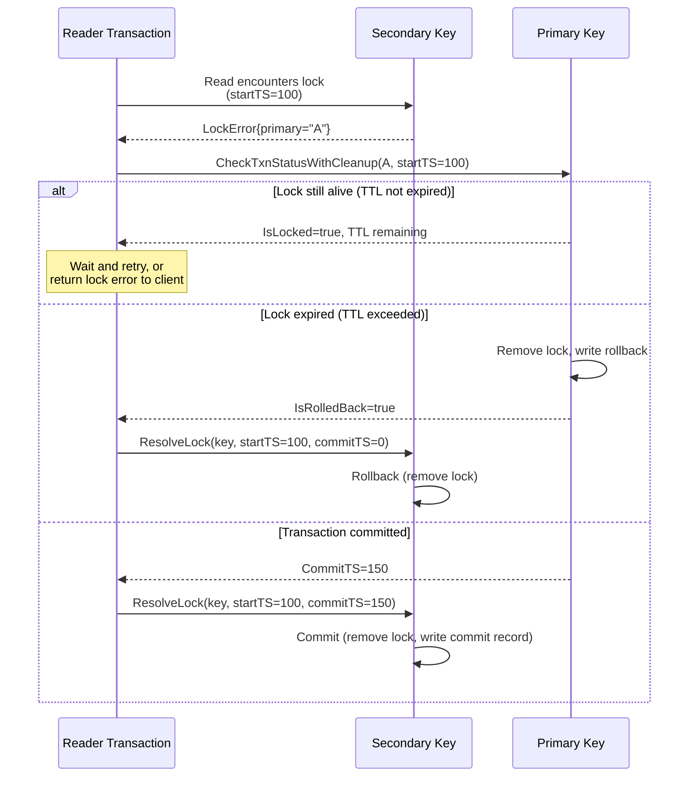

---

## Async Commit Optimization

### Problem

In standard 2PC, the client must wait for the primary key's commit to complete before the transaction is visible. This adds one full network round-trip of latency.

### Solution

Async commit makes the transaction visible **when all prewrite locks are successfully written**, without waiting for the commit phase. The key insight: the primary lock stores all secondary keys, so any reader can determine the commit status by examining just the locks.

### How It Works

`PrewriteAsyncCommit` uses the same conflict-check logic as regular `Prewrite`: it loops through up to `SeekBound*2` (64) write records to skip past Rollback and Lock records before concluding there is no write conflict. This ensures that async commit prewrites are not incorrectly blocked or incorrectly allowed due to interleaved non-data-changing write records.

During prewrite, the primary key's lock contains the list of all secondary keys:

```go
type AsyncCommitPrewriteProps struct {
    PrewriteProps
    UseAsyncCommit bool
    Secondaries    [][]byte            // All secondary keys
    MaxCommitTS    txntypes.TimeStamp  // For MinCommitTS calculation
}
```

The lock also gets a `MinCommitTS` to ensure reads at timestamps before the async commit cannot see the new data:

```go
if props.UseAsyncCommit {
    lock.UseAsyncCommit = true
    if props.IsPrimary {
        lock.Secondaries = props.Secondaries
    }
    // min_commit_ts = max(start_ts + 1, max_ts_from_concurrency_manager + 1)
    minCommitTS := props.StartTS + 1
    if props.MaxCommitTS > 0 && props.MaxCommitTS+1 > minCommitTS {
        minCommitTS = props.MaxCommitTS + 1
    }
    lock.MinCommitTS = minCommitTS
}
```

### CheckAsyncCommitStatus

A reader can check whether an async-commit transaction is committed by examining the primary lock:

```go
func CheckAsyncCommitStatus(reader *mvcc.MvccReader, primaryKey mvcc.Key, startTS txntypes.TimeStamp) (txntypes.TimeStamp, error) {
    lock, _ := reader.LoadLock(primaryKey)

    if lock != nil && lock.StartTS == startTS {
        if !lock.UseAsyncCommit {
            return 0, nil  // Not async commit
        }
        // Transaction still in progress; MinCommitTS is the candidate
        return lock.MinCommitTS, nil
    }

    // Primary lock gone - check commit record
    write, commitTS, _ := reader.GetTxnCommitRecord(primaryKey, startTS)
    if write != nil && write.WriteType != txntypes.WriteTypeRollback {
        return commitTS, nil
    }

    return 0, nil  // Rolled back
}
```

### Async Commit Eligibility

Not all transactions can use async commit:

```go
func IsAsyncCommitEligible(mutations []Mutation, maxKeys int) bool {
    if maxKeys <= 0 {
        maxKeys = 256  // Default maximum
    }
    return len(mutations) > 0 && len(mutations) <= maxKeys
}
```

### Async Commit Timeline

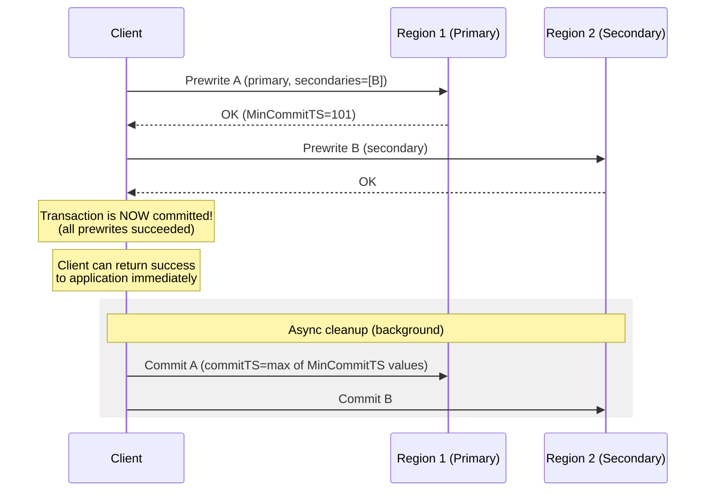

---

## 1PC Optimization

### Purpose

For small, single-region transactions, the two-phase protocol is overhead. The **1PC (One-Phase Commit)** optimization writes the commit record directly, bypassing CF_LOCK entirely.

### How It Works

`PrewriteAndCommit1PC` checks all mutations for conflicts, then writes commit records directly to CF_WRITE:

```go
func PrewriteAndCommit1PC(txn *mvcc.MvccTxn, reader *mvcc.MvccReader, props OnePCProps, mutations []Mutation) []error {
    // Phase 1: Check ALL mutations for conflicts
    for i, mut := range mutations {
        // Check locks
        existingLock, _ := reader.LoadLock(mut.Key)
        if existingLock != nil && existingLock.StartTS != props.StartTS {
            errs[i] = ErrKeyIsLocked
        }
        // Check write conflicts
        write, commitTS, _ := reader.SeekWrite(mut.Key, txntypes.TSMax)
        if write != nil && commitTS > props.StartTS {
            errs[i] = ErrWriteConflict
        }
    }

    // If any conflict, return errors (no modifications written)
    // Phase 2: Write commit records directly (NO locks in CF_LOCK)
    for _, mut := range mutations {
        write := &txntypes.Write{
            WriteType: mutationOpToWriteType(mut.Op),
            StartTS:   props.StartTS,
        }
        if mut.Value != nil && len(mut.Value) <= txntypes.ShortValueMaxLen {
            write.ShortValue = mut.Value
        } else if mut.Op == MutationOpPut && mut.Value != nil {
            txn.PutValue(mut.Key, props.StartTS, mut.Value)
        }
        txn.PutWrite(mut.Key, props.CommitTS, write)
    }
    return errs
}
```

### 1PC Eligibility

```go
func Is1PCEligible(mutations []Mutation, maxSize int) bool {
    if maxSize <= 0 {
        maxSize = 64
    }
    if len(mutations) > maxSize {
        return false
    }
    totalSize := 0
    for _, m := range mutations {
        totalSize += len(m.Key) + len(m.Value)
    }
    return totalSize < 256*1024  // Under 256 KB
}
```

### 1PC Timeline

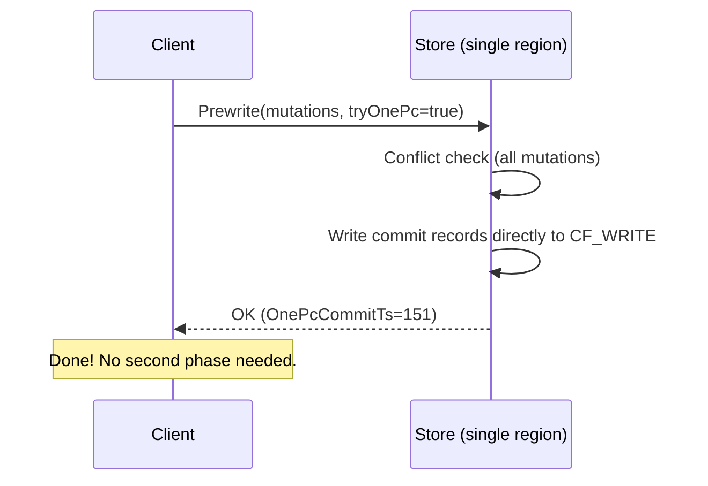

---

## Pessimistic Locking

### The Problem with Optimistic Transactions

In optimistic transactions (standard Percolator), conflict detection happens at prewrite time. For interactive transactions where the client reads data, thinks, then writes:

1. Client reads row A (startTS=100)
2. Client spends 10 seconds thinking
3. Client tries to prewrite row A with updated value
4. Another transaction committed a write to A at commitTS=105
5. Client gets `ErrWriteConflict` and must retry from step 1

This is wasteful for interactive applications. **Pessimistic locking** acquires locks **before** the prewrite, guaranteeing the prewrite will succeed.

### Pessimistic Lock Acquisition

```go
func AcquirePessimisticLock(txn *mvcc.MvccTxn, reader *mvcc.MvccReader, props PessimisticLockProps, key mvcc.Key) error {
    // 1. Check existing locks
    existingLock, _ := reader.LoadLock(key)
    if existingLock != nil {
        if existingLock.StartTS == props.StartTS {
            // Our lock - update ForUpdateTS if needed
            return nil
        }
        return ErrKeyIsLocked  // Another transaction's lock
    }

    // 2. Check write conflicts against ForUpdateTS (not startTS)
    write, commitTS, _ := reader.SeekWrite(key, txntypes.TSMax)
    if write != nil && commitTS > props.ForUpdateTS {
        return ErrWriteConflict
    }

    // 3. Write pessimistic lock
    lock := &txntypes.Lock{
        LockType:    txntypes.LockTypePessimistic,  // 'S' - invisible to readers
        Primary:     props.Primary,
        StartTS:     props.StartTS,
        TTL:         props.LockTTL,
        ForUpdateTS: props.ForUpdateTS,
    }
    txn.PutLock(key, lock)
    return nil
}
```

### Key Differences from Optimistic Locks

| Property | Optimistic Lock | Pessimistic Lock |
|----------|----------------|-----------------|
| Lock type | `LockTypePut`, `LockTypeDelete` | `LockTypePessimistic` |
| Created during | Prewrite | Before prewrite |
| Visible to readers | Yes (blocks reads) | No (readers skip them) |
| Conflict horizon | `startTS` | `forUpdateTS` |
| Rollback | Writes rollback record | Just removes lock |

### Pessimistic Prewrite: Upgrading the Lock

When the client is ready to commit, it upgrades the pessimistic lock to a normal prewrite lock:

```go
func PrewritePessimistic(txn *mvcc.MvccTxn, reader *mvcc.MvccReader, props PessimisticPrewriteProps, mutation Mutation) error {
    existingLock, _ := reader.LoadLock(key)

    if existingLock != nil {
        if existingLock.StartTS != props.StartTS {
            return ErrKeyIsLocked
        }
        if existingLock.LockType != txntypes.LockTypePessimistic {
            return nil  // Already upgraded (idempotent)
        }
        // Remove old pessimistic lock
        txn.UnlockKey(key, true)
    } else if props.IsPessimistic {
        return ErrTxnLockNotFound  // Expected lock was cleaned up
    }

    // Write normal prewrite lock with value
    lock := &txntypes.Lock{
        LockType:    lockType,  // Put, Delete, etc.
        Primary:     props.Primary,
        StartTS:     props.StartTS,
        TTL:         props.LockTTL,
        ForUpdateTS: props.ForUpdateTS,
    }
    txn.PutLock(key, lock)
    // ... write value to CF_DEFAULT if needed ...
}
```

### Pessimistic Rollback

Unlike normal rollback, pessimistic rollback does **not** write a rollback record -- it simply removes the pessimistic lock:

```go
func PessimisticRollback(txn *mvcc.MvccTxn, reader *mvcc.MvccReader, keys []mvcc.Key, startTS, forUpdateTS txntypes.TimeStamp) []error {
    for i, key := range keys {
        lock, _ := reader.LoadLock(key)
        if lock == nil || lock.StartTS != startTS {
            continue  // No lock or wrong transaction
        }
        if lock.LockType != txntypes.LockTypePessimistic {
            continue  // Not a pessimistic lock - don't touch
        }
        if forUpdateTS != 0 && lock.ForUpdateTS != forUpdateTS {
            continue  // Wrong ForUpdateTS
        }
        txn.UnlockKey(key, true)
    }
    return errs
}
```

### Pessimistic Transaction Flow

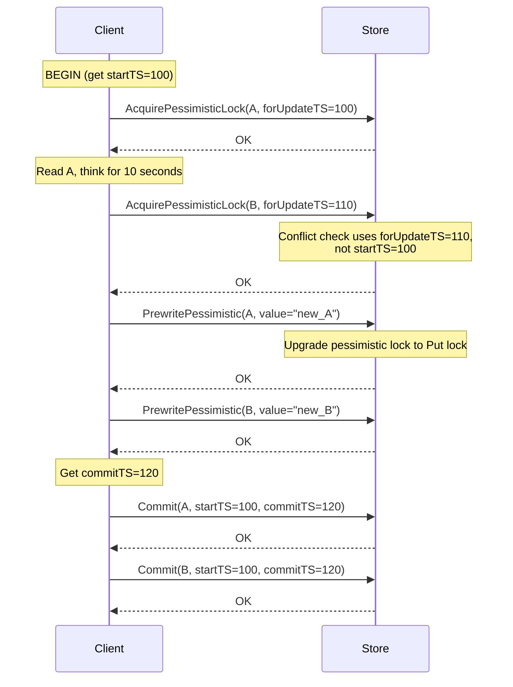

---

## Garbage Collection

### The Problem

MVCC creates new versions on every write but never deletes old ones. Over time, the storage engine accumulates millions of obsolete versions that waste disk space and slow down reads (which must skip over them).

### GC Safe Point

PD maintains a cluster-wide **GC safe point** -- a timestamp below which all versions are eligible for cleanup. The safe point is the minimum of all active transactions' `startTS` values.

```go
type SafePointProvider interface {
    GetGCSafePoint(ctx context.Context) (txntypes.TimeStamp, error)
}
```

### GC State Machine

The `GC` function processes a single key using a three-state machine:

```go
type gcState int

const (
    gcStateRewind          gcState = iota  // Skip versions above safePoint
    gcStateRemoveIdempotent                // Remove Lock/Rollback, keep first Put/Delete
    gcStateRemoveAll                       // Remove all remaining older versions
)
```

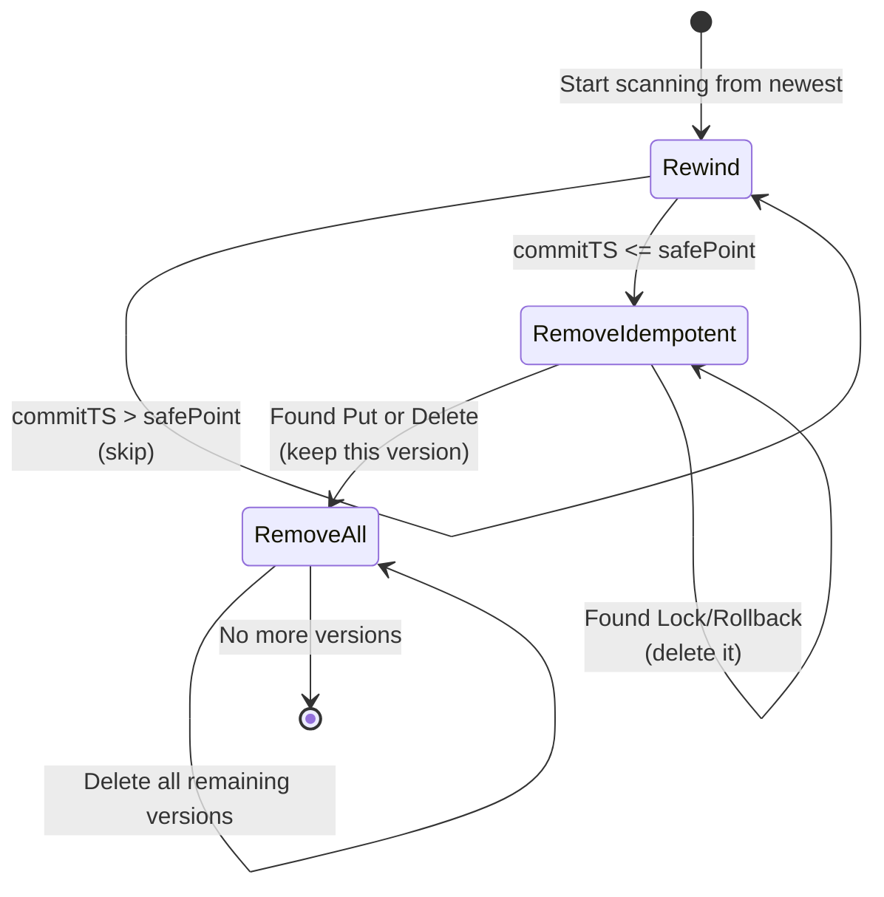

The logic:

```go
func GC(txn *mvcc.MvccTxn, reader *mvcc.MvccReader, key mvcc.Key, safePoint txntypes.TimeStamp) (*GCInfo, error) {
    state := gcStateRewind
    ts := txntypes.TSMax

    for {
        write, commitTS, _ := reader.SeekWrite(key, ts)
        if write == nil { break }

        switch state {
        case gcStateRewind:
            if commitTS > safePoint {
                ts = commitTS - 1  // Skip: above safe point
                continue
            }
            state = gcStateRemoveIdempotent
            fallthrough

        case gcStateRemoveIdempotent:
            switch write.WriteType {
            case txntypes.WriteTypePut, txntypes.WriteTypeDelete:
                state = gcStateRemoveAll  // Keep this version, remove all older
                ts = commitTS - 1
            case txntypes.WriteTypeLock, txntypes.WriteTypeRollback:
                txn.DeleteWrite(key, commitTS)  // Remove non-data records
                ts = commitTS - 1
            }

        case gcStateRemoveAll:
            txn.DeleteWrite(key, commitTS)
            if write.WriteType == txntypes.WriteTypePut && write.ShortValue == nil {
                txn.DeleteValue(key, write.StartTS)  // Remove large value too
            }
            ts = commitTS - 1
        }
    }
    return info, nil
}
```

### GC Example

Given key "X" with these versions (newest first):

| commitTS | WriteType | State Action |
|----------|-----------|-------------|
| 200 | Put | Rewind (above safePoint=150) |
| 160 | Rollback | Rewind (above safePoint=150) |
| 140 | Rollback | RemoveIdempotent: **delete** |
| 120 | Put | RemoveIdempotent: **keep** (transition to RemoveAll) |
| 80 | Put | RemoveAll: **delete** |
| 40 | Delete | RemoveAll: **delete** |

After GC:
- commitTS=200: Put (kept -- above safe point)
- commitTS=160: Rollback (kept -- above safe point)
- commitTS=120: Put (kept -- latest version at or below safe point)
- All others: deleted

### GCWorker

The `GCWorker` (defined in `internal/storage/gc/gc.go`) processes GC tasks in a background goroutine:

```go
type GCWorker struct {
    engine  traits.KvEngine
    taskCh  chan GCTask
    config  *GCConfig
    stopCh  chan struct{}
}

type GCTask struct {
    SafePoint txntypes.TimeStamp
    StartKey  []byte
    EndKey    []byte
    Callback  func(error)
}
```

The worker scans CF_WRITE for unique user keys in the task's range and runs `GC` on each:

```go
func (w *GCWorker) processTask(task GCTask) error {
    snap := w.engine.NewSnapshot()
    reader := mvcc.NewMvccReader(snap)
    defer reader.Close()

    iter := snap.NewIterator(cfnames.CFWrite, opts)
    txn := mvcc.NewMvccTxn(0)
    var lastUserKey []byte

    for iter.SeekToFirst(); iter.Valid(); iter.Next() {
        userKey, _, _ := mvcc.DecodeKey(iter.Key())
        if string(userKey) == string(lastUserKey) {
            continue  // Already GC'd this key
        }
        lastUserKey = append(lastUserKey[:0], userKey...)

        GC(txn, reader, userKey, task.SafePoint)

        // Flush when batch gets large
        if txn.WriteSize >= w.config.MaxTxnWriteSize {
            w.applyModifies(txn)
            txn = mvcc.NewMvccTxn(0)
        }
    }
    // Flush remaining
    w.applyModifies(txn)
    return nil
}
```

### GC Configuration

```go
type GCConfig struct {
    PollSafePointInterval time.Duration  // How often to check safe point (10s)
    MaxWriteBytesPerSec   int64          // Write rate limit (0 = unlimited)
    MaxTxnWriteSize       int            // Flush threshold per key (32 KB)
    BatchKeys             int            // Keys per batch (512)
}
```

---

## Summary: Transaction Flow Comparison

```mermaid
graph TB
    subgraph "Standard 2PC"
        S1["Prewrite all keys<br/>(write locks + values)"]
        S2["Get commitTS from PD"]
        S3["Commit primary<br/>(lock -> write record)"]
        S4["Commit secondaries<br/>(lock -> write record)"]
        S1 --> S2 --> S3 --> S4
    end

    subgraph "Async Commit"
        A1["Prewrite all keys<br/>(locks contain secondaries)"]
        A2["All prewrites succeed =<br/>logically committed"]
        A3["Background: commit records"]
        A1 --> A2 --> A3
    end

    subgraph "1PC"
        O1["Check conflicts<br/>Write commit records directly"]
        O2["Done"]
        O1 --> O2
    end

    subgraph "Pessimistic"
        P1["Acquire pessimistic locks"]
        P2["Read and process"]
        P3["Prewrite (upgrade locks)"]
        P4["Commit"]
        P1 --> P2 --> P3 --> P4
    end
```

### Key Takeaways

1. **Percolator** uses the primary key as the single source of truth for transaction status, eliminating the coordinator single-point-of-failure problem.
2. **Three column families** separate concerns: CF_LOCK for in-progress transactions, CF_WRITE for committed/rolled-back metadata, CF_DEFAULT for large values.
3. **Descending timestamp encoding** in CF_WRITE enables efficient "find the latest version" queries with a single seek.
4. **Rollback records** prevent late-arriving prewrites from succeeding after a transaction has been aborted.
5. **Lock resolution** uses TTL-based expiry and primary-key checking to handle crashed transactions.
6. **Async commit** and **1PC** reduce latency for eligible transactions by eliminating round-trips.
7. **Pessimistic locking** enables interactive transactions by acquiring locks before prewrite.
8. **GC** uses a three-state machine to efficiently clean up old versions below the safe point.
