# 07. Client Library

## 1. Purpose

The gookv client library (`pkg/client`) provides the application-facing API for reading and writing data in a gookv cluster. It abstracts away the distributed nature of the storage system: applications do not need to know which server holds which key, how regions are split, or what happens when a Raft leader changes. The client handles all of this transparently.

The library offers two distinct APIs:

| API | Use Case | Consistency |
|-----|----------|-------------|
| **TxnKV** | Multi-key transactions with snapshot isolation | Full ACID with Percolator 2PC |
| **RawKV** | Simple key-value operations without transactions | Per-key linearizability |

Both APIs share the same underlying infrastructure: `RegionCache` for key-to-region mapping, `PDStoreResolver` for store address resolution, and `RegionRequestSender` for RPC delivery with automatic retry.

---

## 2. Architecture Overview

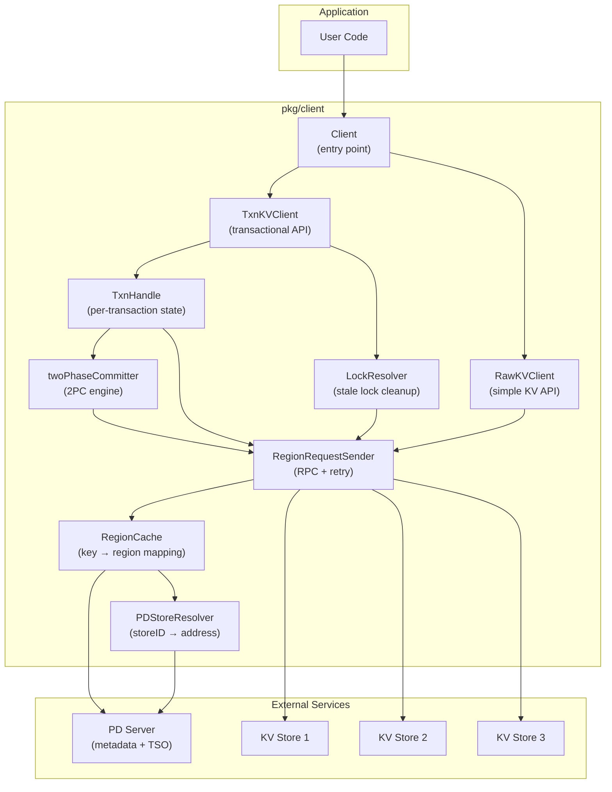
```mermaid
graph TB
    subgraph "Application"
        APP[User Code]
    end

    subgraph "pkg/client"
        CLIENT["Client<br/>(entry point)"]
        TXNKV["TxnKVClient<br/>(transactional API)"]
        RAWKV["RawKVClient<br/>(simple KV API)"]
        TXN_HANDLE["TxnHandle<br/>(per-transaction state)"]
        COMMITTER["twoPhaseCommitter<br/>(2PC engine)"]
        LOCK_RESOLVER["LockResolver<br/>(stale lock cleanup)"]
        SENDER["RegionRequestSender<br/>(RPC + retry)"]
        CACHE["RegionCache<br/>(key → region mapping)"]
        RESOLVER["PDStoreResolver<br/>(storeID → address)"]
    end

    subgraph "External Services"
        PD["PD Server<br/>(metadata + TSO)"]
        KVS1["KV Store 1"]
        KVS2["KV Store 2"]
        KVS3["KV Store 3"]
    end

    APP --> CLIENT
    CLIENT --> TXNKV
    CLIENT --> RAWKV
    TXNKV --> TXN_HANDLE
    TXN_HANDLE --> COMMITTER
    TXNKV --> LOCK_RESOLVER

    COMMITTER --> SENDER
    TXN_HANDLE --> SENDER
    RAWKV --> SENDER
    LOCK_RESOLVER --> SENDER

    SENDER --> CACHE
    CACHE --> PD
    CACHE --> RESOLVER
    RESOLVER --> PD

    SENDER --> KVS1
    SENDER --> KVS2
    SENDER --> KVS3
```

---

## 3. Client Struct and Configuration

### 3.1 Config

The `Config` struct in `pkg/client/client.go` controls client behavior:

```go
type Config struct {
    PDAddrs       []string      // PD server addresses (at least one required)
    DialTimeout   time.Duration // gRPC dial timeout (default: 5s)
    MaxRetries    int           // max retries per RPC (default: 3)
    StoreCacheTTL time.Duration // TTL for store address cache (default: 30s)
}
```

**PDAddrs** is the only required field. The client connects to PD on startup and uses it for two purposes: (1) obtaining region metadata so it knows which server to talk to, and (2) allocating timestamps for transactions.

**DialTimeout** controls how long the client waits when establishing a new gRPC connection to a KV store. This is per-connection, not per-request.

**MaxRetries** controls how many times `RegionRequestSender` will retry an RPC after a retriable region error (such as a leader change or region split). Between each retry, the region cache is invalidated and re-queried.

**StoreCacheTTL** controls how long a resolved store address (storeID to gRPC address mapping) is cached before being re-fetched from PD. This allows the client to track store address changes during rolling upgrades or topology changes.

### 3.2 Client

The `Client` struct is the entry point. It is created via `NewClient`:

```go
func NewClient(ctx context.Context, cfg Config) (*Client, error)
```

`NewClient` performs the following steps:

1. Apply default values for any zero-valued config fields.
2. Create a PD client (`pdclient.NewClient`) and establish a connection to PD.
3. Create a `PDStoreResolver` for resolving store IDs to gRPC addresses.
4. Create a `RegionCache` for caching key-to-region mappings.
5. Create a `RegionRequestSender` for sending RPCs with retry logic.

The `Client` exposes two factory methods:

```go
func (c *Client) TxnKV() *TxnKVClient  // transactional API
func (c *Client) RawKV() *RawKVClient   // simple KV API
```

Both sub-clients share the same `RegionRequestSender`, `RegionCache`, and `PDStoreResolver`. This means they share the same gRPC connection pool and region cache.

### 3.3 Lifecycle

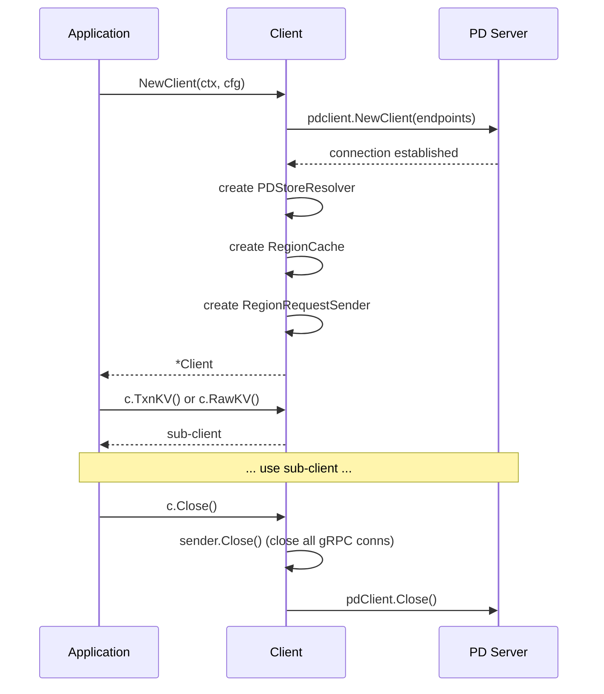
```mermaid
sequenceDiagram
    participant App as Application
    participant C as Client
    participant PD as PD Server

    App->>C: NewClient(ctx, cfg)
    C->>PD: pdclient.NewClient(endpoints)
    PD-->>C: connection established
    C->>C: create PDStoreResolver
    C->>C: create RegionCache
    C->>C: create RegionRequestSender
    C-->>App: *Client

    App->>C: c.TxnKV() or c.RawKV()
    C-->>App: sub-client

    Note over App,PD: ... use sub-client ...

    App->>C: c.Close()
    C->>C: sender.Close() (close all gRPC conns)
    C->>PD: pdClient.Close()
```

---

## 4. RegionCache

### 4.1 Purpose

Every key in gookv belongs to exactly one region. To send an RPC for a key, the client must know which region owns it and which server is that region's Raft leader. The `RegionCache` maintains this mapping in memory, falling back to PD when the cache does not have the answer.

### 4.2 Data Structures

```go
type RegionInfo struct {
    Region    *metapb.Region  // region metadata (ID, start/end key, epoch, peers)
    Leader    *metapb.Peer    // current leader peer
    StoreAddr string          // gRPC address of the leader's store
}

type RegionCache struct {
    mu       sync.RWMutex
    pdClient pdclient.Client
    resolver *PDStoreResolver

    regions []*RegionInfo    // sorted by StartKey (ascending)
    byID    map[uint64]int   // regionID -> index in regions slice
}
```

The `regions` slice is kept sorted by the region's `StartKey`. This enables O(log N) key lookups via binary search. The `byID` map provides O(1) access by region ID for cache invalidation.

### 4.3 LocateKey: Finding the Region for a Key

```go
func (c *RegionCache) LocateKey(ctx context.Context, key []byte) (*RegionInfo, error)
```

`LocateKey` is the primary entry point. Given a raw user key, it returns the `RegionInfo` that owns that key. The algorithm:

1. **Encode the key.** Raw user keys must be encoded via `codec.EncodeBytes` before comparison with region boundaries. This is because region start/end keys use memcomparable encoding (the same encoding that MVCC keys use). Without this encoding, binary search would produce incorrect results for keys containing bytes like `0x00`.

2. **Binary search the cache.** Under a read lock, `findInCache` performs a binary search on the sorted `regions` slice to find the rightmost region whose `StartKey <= encodedKey`. It then checks that `encodedKey < EndKey` (treating an empty `EndKey` as unbounded, meaning the last region).

3. **PD fallback.** If the cache misses (no matching region, or the region's key range does not cover the key), `loadFromPD` queries PD via `GetRegion(key)` using the raw (unencoded) key. PD returns the region metadata and its current leader.

4. **Resolve store address.** The leader's store ID is resolved to a gRPC address via `PDStoreResolver.Resolve`.

5. **Insert into cache.** The new `RegionInfo` is inserted into the sorted slice, maintaining sort order. The `byID` map is rebuilt.

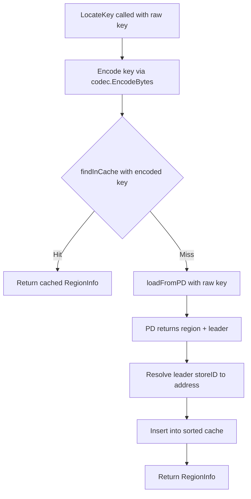
```mermaid
flowchart TD
    A[LocateKey called with raw key] --> B[Encode key via codec.EncodeBytes]
    B --> C{findInCache with encoded key}
    C -->|Hit| D[Return cached RegionInfo]
    C -->|Miss| E[loadFromPD with raw key]
    E --> F[PD returns region + leader]
    F --> G[Resolve leader storeID to address]
    G --> H[Insert into sorted cache]
    H --> I[Return RegionInfo]
```

### 4.4 Binary Search Implementation

The `findInCache` method uses Go's `sort.Search` to perform a binary search:

```go
func (c *RegionCache) findInCache(key []byte) *RegionInfo {
    // sort.Search finds the first index where StartKey > key
    idx := sort.Search(len(c.regions), func(i int) bool {
        return bytes.Compare(c.regions[i].Region.GetStartKey(), key) > 0
    })
    idx-- // step back to the region whose StartKey <= key

    if idx < 0 {
        return nil
    }

    info := c.regions[idx]
    endKey := info.Region.GetEndKey()
    // empty endKey means unbounded (last region)
    if len(endKey) > 0 && bytes.Compare(key, endKey) >= 0 {
        return nil
    }
    return info
}
```

This works because `sort.Search` returns the first index `i` where the predicate is true. Since regions are sorted by `StartKey`, the first index where `StartKey > key` is one past the region we want. Stepping back by one gives us the region whose `StartKey <= key`.

### 4.5 GroupKeysByRegion: Batch Key Grouping

```go
func (c *RegionCache) GroupKeysByRegion(ctx context.Context, keys [][]byte) (map[uint64]*KeyGroup, error)
```

For multi-key operations (like `BatchGet` or `BatchPut`), `GroupKeysByRegion` partitions a set of keys into groups based on which region owns each key. The result is a map from region ID to `KeyGroup`:

```go
type KeyGroup struct {
    Info *RegionInfo
    Keys [][]byte
}
```

The implementation simply calls `LocateKey` for each key and groups the results. This is O(N log R) where N is the number of keys and R is the number of cached regions.

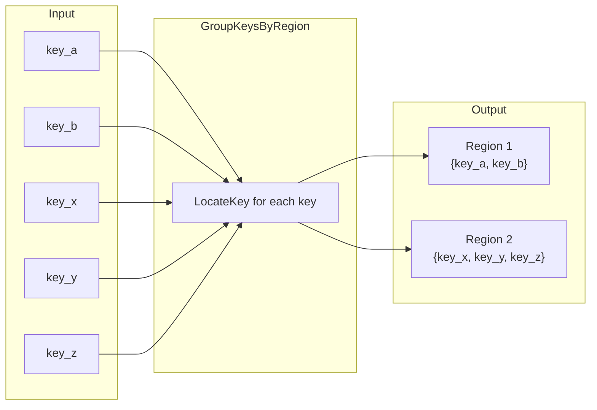
```mermaid
flowchart LR
    subgraph Input
        K1[key_a]
        K2[key_b]
        K3[key_x]
        K4[key_y]
        K5[key_z]
    end

    subgraph GroupKeysByRegion
        L[LocateKey for each key]
    end

    subgraph Output
        G1["Region 1<br/>{key_a, key_b}"]
        G2["Region 2<br/>{key_x, key_y, key_z}"]
    end

    K1 --> L
    K2 --> L
    K3 --> L
    K4 --> L
    K5 --> L
    L --> G1
    L --> G2
```

### 4.6 Cache Invalidation

The cache provides two invalidation methods:

**InvalidateRegion(regionID uint64)**: Removes the cached entry for a specific region. Called when an RPC returns a region error (such as `EpochNotMatch` or `RegionNotFound`). The region is removed from both the sorted slice and the `byID` map, and `byID` indices are rebuilt.

**UpdateLeader(regionID uint64, leader *metapb.Peer, storeAddr string)**: Updates the leader peer and store address for a cached region without removing the region entry. Called when an RPC returns `NotLeader` with a hint about who the new leader is. This avoids a PD round-trip when the new leader is already known.

Both methods are thread-safe (they acquire the write lock).

### 4.7 Cache Insertion

When a new `RegionInfo` is inserted (`insertLocked`):

1. If the region ID already exists in `byID`, the existing entry is replaced in-place.
2. Otherwise, any stale overlapping regions are evicted first. The helper function `regionsOverlap(aStart, aEnd, bStart, bEnd)` tests whether two key ranges overlap (treating an empty end key as +infinity). Each existing region whose range overlaps with the new region (and has a different region ID) is removed from the slice. This handles the case where a pre-split region covering `[a, z)` is still cached when a post-split region covering `[a, m)` arrives from PD.
3. The insertion point is found via binary search on `StartKey`.
4. The slice is grown and elements are shifted to make room.
5. The `byID` index is rebuilt from scratch (since indices change after insertion).

---

## 5. PDStoreResolver

### 5.1 Purpose

Given a store ID (a numeric identifier for a KV server), `PDStoreResolver` returns the gRPC network address (like `"127.0.0.1:20160"`) needed to connect to that store. It caches the mapping for a configurable TTL to avoid querying PD on every RPC.

### 5.2 Data Structure

```go
type PDStoreResolver struct {
    mu       sync.RWMutex
    pdClient pdclient.Client
    stores   map[uint64]*storeEntry
    ttl      time.Duration
    nowFunc  func() time.Time  // injectable clock for testing
}

type storeEntry struct {
    addr      string
    fetchedAt time.Time
}
```

### 5.3 Resolve

```go
func (r *PDStoreResolver) Resolve(ctx context.Context, storeID uint64) (string, error)
```

The resolution flow:

1. **Check cache** (under read lock). If the store ID exists and `now - fetchedAt < TTL`, return the cached address immediately.
2. **Query PD** via `pdClient.GetStore(ctx, storeID)`. PD returns the full store metadata including its address.
3. **Update cache** (under write lock) with the resolved address and current timestamp.

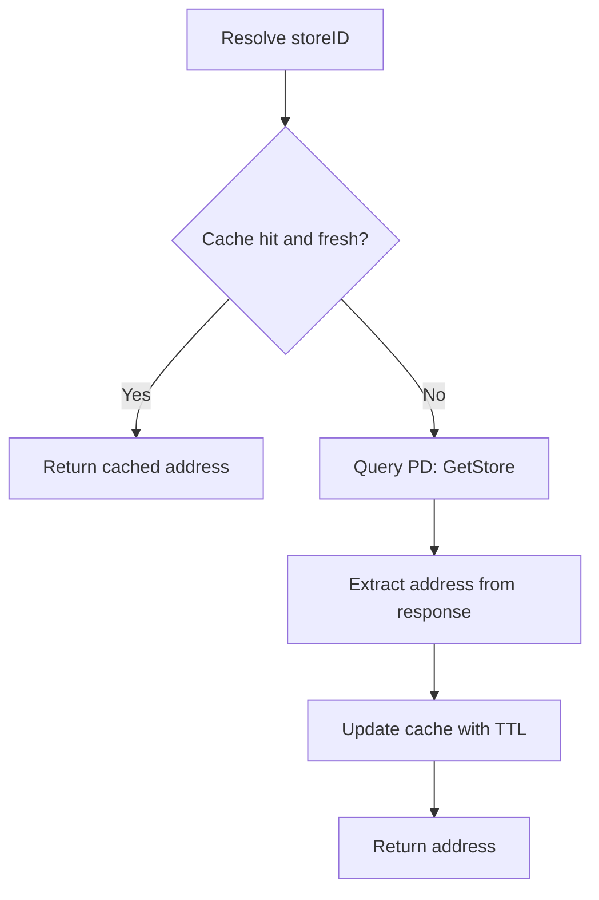
```mermaid
flowchart TD
    A[Resolve storeID] --> B{Cache hit and fresh?}
    B -->|Yes| C[Return cached address]
    B -->|No| D[Query PD: GetStore]
    D --> E[Extract address from response]
    E --> F[Update cache with TTL]
    F --> G[Return address]
```

### 5.4 InvalidateStore

```go
func (r *PDStoreResolver) InvalidateStore(storeID uint64)
```

Forces the next `Resolve` call for that store to query PD. Called when a `StoreNotMatch` error indicates the store address has changed.

---

## 6. RegionRequestSender

### 6.1 Purpose

`RegionRequestSender` is the RPC delivery engine. It ties together `RegionCache` and `PDStoreResolver` to send an RPC to the correct KV store, and automatically retries on retriable region errors.

### 6.2 Data Structure

```go
type RegionRequestSender struct {
    cache       *RegionCache
    resolver    *PDStoreResolver
    maxRetries  int
    dialTimeout time.Duration

    mu    sync.RWMutex
    conns map[string]*grpc.ClientConn  // address -> connection pool
}
```

The `conns` map is a connection pool keyed by server address. Connections are lazily created on first use and reused for subsequent RPCs to the same server. Each connection is configured with:

- Insecure credentials (no TLS)
- 64 MiB max receive message size
- gRPC keepalive (60s interval, 10s timeout)

### 6.3 RPCFunc Callback Pattern

Instead of exposing typed methods for every RPC, `RegionRequestSender` uses a callback pattern:

```go
type RPCFunc func(client tikvpb.TikvClient, info *RegionInfo) (regionErr *errorpb.Error, err error)
```

The caller provides a function that:
1. Receives a `TikvClient` (the generated gRPC stub) and `RegionInfo` (for building the request context).
2. Makes the actual gRPC call.
3. Returns the region error from the response (if any) and any gRPC-level error.

This pattern keeps `RegionRequestSender` generic and allows it to work with any TiKV RPC.

### 6.4 SendToRegion: The Retry Loop

```go
func (s *RegionRequestSender) SendToRegion(ctx context.Context, key []byte, rpcFn RPCFunc) error
```

`SendToRegion` is the main entry point. It takes a key (to locate the region) and an `RPCFunc` callback:

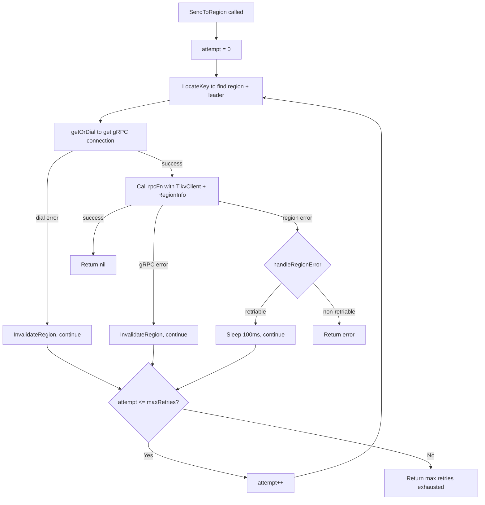
```mermaid
flowchart TD
    A[SendToRegion called] --> B[attempt = 0]
    B --> C[LocateKey to find region + leader]
    C --> D[getOrDial to get gRPC connection]
    D -->|dial error| E[InvalidateRegion, continue]
    D -->|success| F[Call rpcFn with TikvClient + RegionInfo]
    F -->|gRPC error| G[InvalidateRegion, continue]
    F -->|region error| H{handleRegionError}
    F -->|success| I[Return nil]
    H -->|retriable| J[Sleep 100ms, continue]
    H -->|non-retriable| K[Return error]
    E --> L{attempt <= maxRetries?}
    G --> L
    J --> L
    L -->|Yes| M[attempt++]
    M --> C
    L -->|No| N[Return max retries exhausted]
```

The detailed flow for each attempt:

1. **Locate the key** via `cache.LocateKey(ctx, key)`. This returns the region metadata and the leader's store address.
2. **Get or create a gRPC connection** to the leader's store via `getOrDial(addr)`. If dialing fails, the region is invalidated and the next attempt will re-query PD for a fresh region.
3. **Execute the RPC** by calling `rpcFn(client, info)`.
4. **Check for gRPC-level errors** (network failures, connection refused, etc.). On gRPC error, the region cache is invalidated. Note: the connection itself is NOT closed, because gRPC connections are shared across goroutines and gRPC handles reconnection automatically.
5. **Check for region errors** (returned inside the RPC response). If `handleRegionError` returns true, the error is retriable and the loop continues. If false, the error is non-retriable and is returned to the caller.
6. **Backoff** for 100ms between retries to allow region state to stabilize (e.g., new region peers being created after a split).

### 6.5 handleRegionError: Error Classification

`handleRegionError` processes a region error, performs cache invalidation, and returns whether the error is retriable:

| Error Type | Cache Action | Retriable? | Description |
|-----------|-------------|-----------|-------------|
| `NotLeader` (with new leader hint) | `UpdateLeader` | Yes | The leader has changed; PD told us who the new leader is |
| `NotLeader` (without hint) | `InvalidateRegion` | Yes | The leader has changed but the new leader is unknown |
| `EpochNotMatch` | `InvalidateRegion` | Yes | The region has been split or merged; cached metadata is stale |
| `RegionNotFound` | `InvalidateRegion` | Yes | The region no longer exists (merged into another region) |
| `KeyNotInRegion` | `InvalidateRegion` | Yes | The key does not belong to this region (stale routing) |
| `StoreNotMatch` | `InvalidateStore` + `InvalidateRegion` | Yes | The store address has changed |
| (anything else) | (none) | No | Unknown error; not safe to retry |

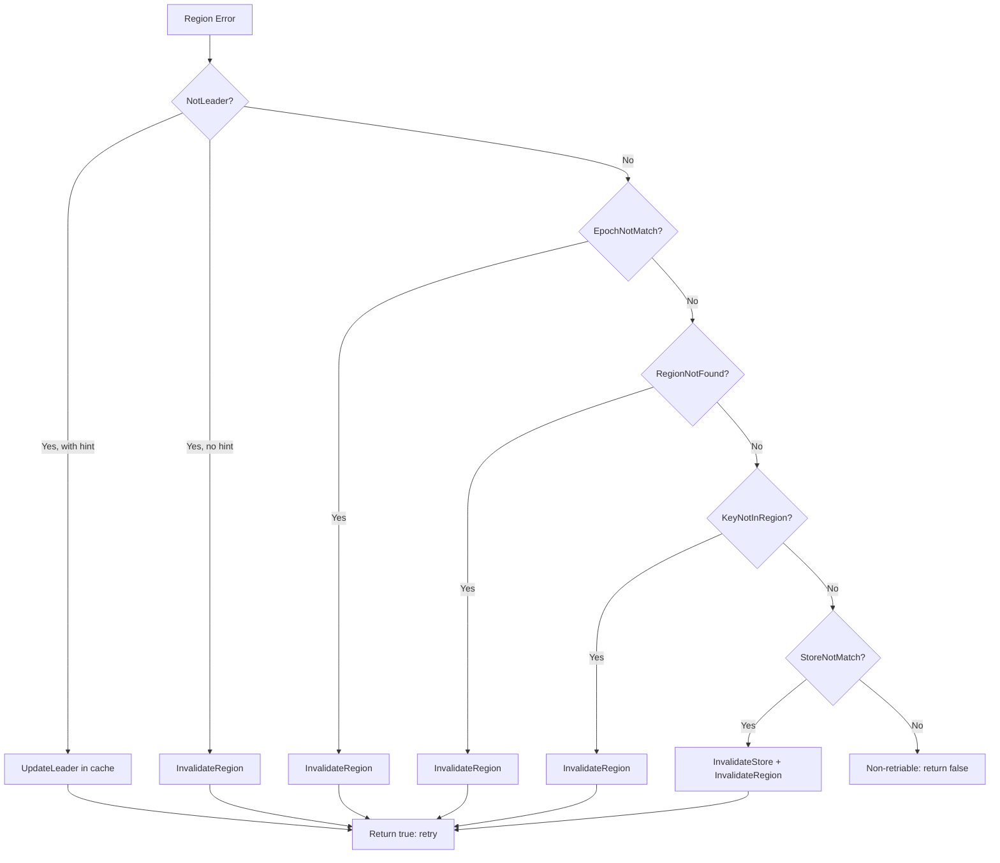
```mermaid
flowchart TD
    RE[Region Error] --> NL{NotLeader?}
    NL -->|Yes, with hint| UL[UpdateLeader in cache]
    NL -->|Yes, no hint| IR1[InvalidateRegion]
    NL -->|No| ENM{EpochNotMatch?}
    ENM -->|Yes| IR2[InvalidateRegion]
    ENM -->|No| RNF{RegionNotFound?}
    RNF -->|Yes| IR3[InvalidateRegion]
    RNF -->|No| KNIR{KeyNotInRegion?}
    KNIR -->|Yes| IR4[InvalidateRegion]
    KNIR -->|No| SNM{StoreNotMatch?}
    SNM -->|Yes| IS[InvalidateStore + InvalidateRegion]
    SNM -->|No| NR[Non-retriable: return false]

    UL --> RET[Return true: retry]
    IR1 --> RET
    IR2 --> RET
    IR3 --> RET
    IR4 --> RET
    IS --> RET
```

### 6.6 Connection Management

Connections are cached in `conns map[string]*grpc.ClientConn` with double-checked locking:

1. Check under read lock for existing connection.
2. If not found, acquire write lock and check again (another goroutine may have created it).
3. If still not found, dial the address with a timeout context.
4. Store the connection in the map.

The `Close` method closes all cached connections when the client shuts down.

---

## 7. TxnKV API

### 7.1 TxnKVClient

`TxnKVClient` is the entry point for transactional operations. It is created via `Client.TxnKV()`.

```go
type TxnKVClient struct {
    sender   *RegionRequestSender
    cache    *RegionCache
    pdClient pdclient.Client
    resolver *LockResolver
}
```

The `LockResolver` is created alongside the `TxnKVClient` and shared across all transactions created by this client. It handles resolving stale locks left by other transactions (see Section 9).

### 7.2 Begin: Starting a Transaction

```go
func (c *TxnKVClient) Begin(ctx context.Context, opts ...TxnOption) (*TxnHandle, error)
```

`Begin` starts a new transaction. It:

1. Applies functional options to build `TxnOptions`.
2. Allocates a start timestamp from PD via `pdClient.GetTS(ctx)`.
3. Creates a `TxnHandle` with the start timestamp and options.

The start timestamp establishes the transaction's read snapshot: the transaction will see all data committed before this timestamp, and none committed after.

### 7.3 TxnOptions

Transaction behavior is configured via functional options:

```go
type TxnOptions struct {
    Mode           TxnMode  // Optimistic (default) or Pessimistic
    UseAsyncCommit bool     // Enable async commit protocol
    Try1PC         bool     // Try single-phase commit for single-region txns
    LockTTL        uint64   // Lock TTL in milliseconds (default: 3000)
}
```

Available option functions:

| Function | Effect |
|----------|--------|
| `WithPessimistic()` | Use pessimistic locking (lock on write, not on commit) |
| `WithAsyncCommit()` | Enable async commit protocol |
| `With1PC()` | Attempt single-phase commit for single-region transactions |
| `WithLockTTL(ttl)` | Set lock TTL in milliseconds |

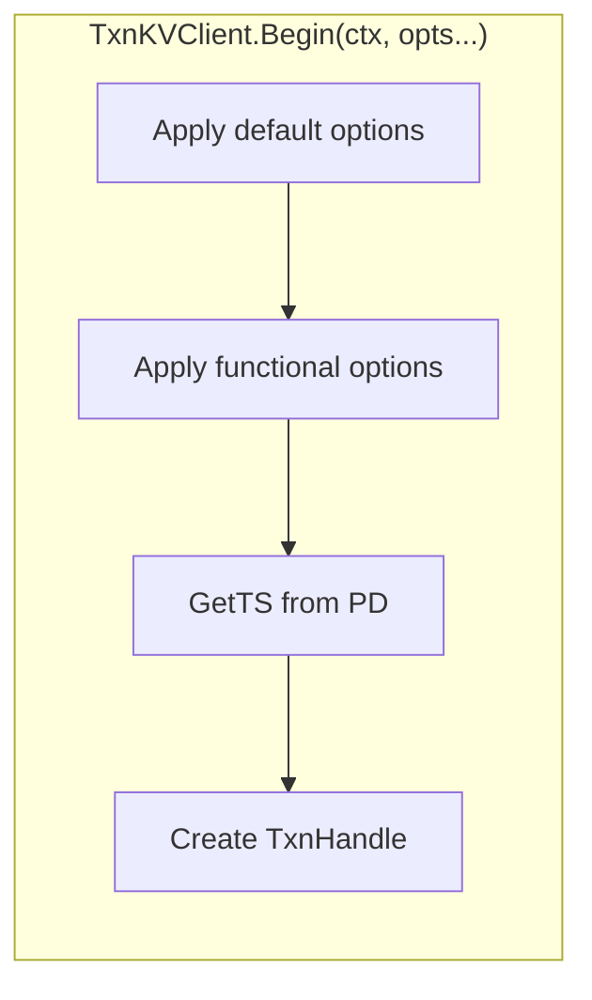
```mermaid
flowchart LR
    subgraph "TxnKVClient.Begin(ctx, opts...)"
        A[Apply default options] --> B[Apply functional options]
        B --> C[GetTS from PD]
        C --> D[Create TxnHandle]
    end
```

---

## 8. TxnHandle: Per-Transaction State

### 8.1 Structure

```go
type TxnHandle struct {
    mu            sync.Mutex
    client        *TxnKVClient
    startTS       txntypes.TimeStamp
    opts          TxnOptions
    membuf        map[string]mutationEntry  // local write buffer
    lockKeys      [][]byte                  // pessimistic lock keys
    cachedPrimary []byte                    // deterministic primary key (cached)
    committed     bool
    rolledBack    bool
}

type mutationEntry struct {
    op    kvrpcpb.Op    // Op_Put or Op_Del
    value []byte
}
```

`TxnHandle` represents a single active transaction. All mutations are buffered locally in `membuf` until `Commit` is called. Reads first check `membuf` (read-your-own-writes) then fall back to server RPCs.

### 8.2 Get: Point Read

```go
func (t *TxnHandle) Get(ctx context.Context, key []byte) ([]byte, error)
```

Get reads a single key. The flow:

1. **Check transaction state.** If already committed or rolled back, return an error.
2. **Check local buffer.** If the key exists in `membuf` and the operation is `Put`, return the buffered value. If the operation is `Del`, return nil (the key has been deleted by this transaction).
3. **Send KvGet RPC.** Calls `kvGet` which uses `SendToRegion` to locate the key's region and send a `KvGet` request with `Version = startTS`.
4. **Handle locks.** If the response indicates the key is locked by another transaction, resolve the lock via `LockResolver.ResolveLocks` and retry. The retry loop runs up to 20 times with a 200ms pause between attempts to allow Raft proposals from lock resolution to be applied.

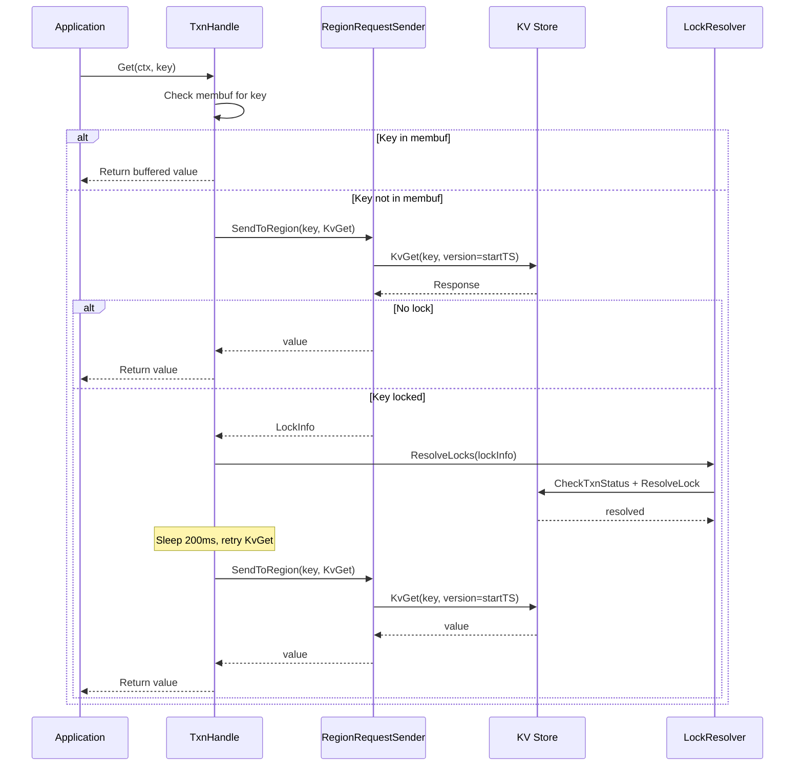
```mermaid
sequenceDiagram
    participant App as Application
    participant TH as TxnHandle
    participant S as RegionRequestSender
    participant KVS as KV Store
    participant LR as LockResolver

    App->>TH: Get(ctx, key)
    TH->>TH: Check membuf for key
    alt Key in membuf
        TH-->>App: Return buffered value
    else Key not in membuf
        TH->>S: SendToRegion(key, KvGet)
        S->>KVS: KvGet(key, version=startTS)
        KVS-->>S: Response
        alt No lock
            S-->>TH: value
            TH-->>App: Return value
        else Key locked
            S-->>TH: LockInfo
            TH->>LR: ResolveLocks(lockInfo)
            LR->>KVS: CheckTxnStatus + ResolveLock
            KVS-->>LR: resolved
            Note over TH: Sleep 200ms, retry KvGet
            TH->>S: SendToRegion(key, KvGet)
            S->>KVS: KvGet(key, version=startTS)
            KVS-->>S: value
            S-->>TH: value
            TH-->>App: Return value
        end
    end
```

### 8.3 BatchGet: Multi-Key Read

```go
func (t *TxnHandle) BatchGet(ctx context.Context, keys [][]byte) ([]KvPair, error)
```

BatchGet reads multiple keys. It first partitions keys into those found in `membuf` (returning their buffered values) and those needing server RPCs. Remote keys are grouped by region via `GroupKeysByRegion`, and a separate `KvBatchGet` RPC is sent to each region. Results from all regions are collected into a single slice. Lock resolution follows the same pattern as single `Get`, with up to 3 retries.

### 8.4 Set: Buffered Write

```go
func (t *TxnHandle) Set(ctx context.Context, key, value []byte) error
```

Set buffers a put mutation in `membuf`. In pessimistic mode, it also immediately acquires a pessimistic lock on the key by sending a `KvPessimisticLock` RPC:

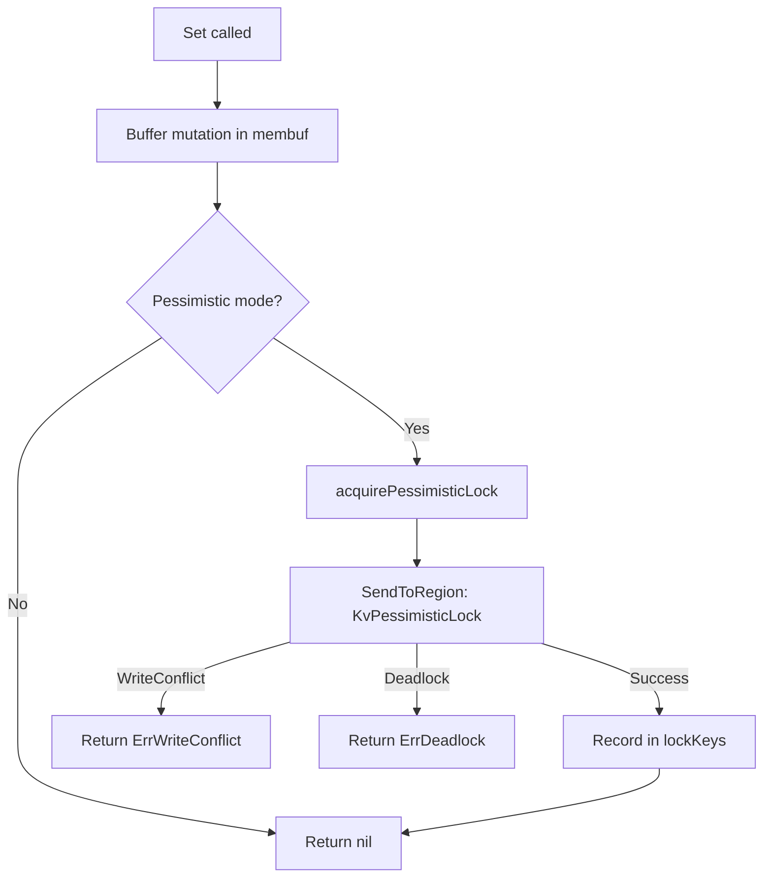
```mermaid
flowchart TD
    A[Set called] --> B[Buffer mutation in membuf]
    B --> C{Pessimistic mode?}
    C -->|Yes| D[acquirePessimisticLock]
    C -->|No| E[Return nil]
    D --> F[SendToRegion: KvPessimisticLock]
    F -->|Success| G[Record in lockKeys]
    G --> E
    F -->|WriteConflict| H[Return ErrWriteConflict]
    F -->|Deadlock| I[Return ErrDeadlock]
```

The pessimistic lock RPC sends a `PessimisticLockRequest` with:
- `PrimaryLock` set to the lexicographically smallest key in `membuf` (the primary key, cached in `cachedPrimary`)
- `StartVersion` and `ForUpdateTs` both set to `startTS`
- `LockTtl` set to the configured lock TTL

### 8.5 Delete: Buffered Deletion

```go
func (t *TxnHandle) Delete(ctx context.Context, key []byte) error
```

Delete works identically to Set but stores a `mutationEntry` with `op = Op_Del`. In pessimistic mode, it also acquires a pessimistic lock.

### 8.6 Commit

```go
func (t *TxnHandle) Commit(ctx context.Context) error
```

Commit executes the two-phase commit protocol by creating a `twoPhaseCommitter` and calling `execute`. See Section 8 for the full 2PC flow.

If the mutation buffer is empty, Commit simply marks the transaction as committed and returns.

### 8.7 Rollback

```go
func (t *TxnHandle) Rollback(ctx context.Context) error
```

Rollback aborts the transaction. Its behavior depends on the transaction mode:

**Optimistic mode:**
- Collects all keys from `membuf`.
- Groups keys by region via `GroupKeysByRegion`.
- Sends `KvBatchRollback` to each region.

**Pessimistic mode:**
- First sends `KVPessimisticRollback` for all keys in `lockKeys` (the pessimistic locks acquired during Set/Delete).
- Then sends `KvBatchRollback` for all keys in `membuf` to clean up any prewrite locks left by a partial commit attempt.

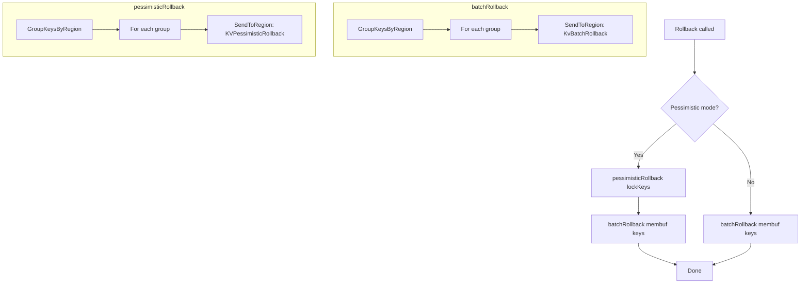
```mermaid
flowchart TD
    A[Rollback called] --> B{Pessimistic mode?}
    B -->|Yes| C[pessimisticRollback lockKeys]
    C --> D[batchRollback membuf keys]
    B -->|No| E[batchRollback membuf keys]
    D --> F[Done]
    E --> F

    subgraph "batchRollback"
        G[GroupKeysByRegion] --> H[For each group]
        H --> I[SendToRegion: KvBatchRollback]
    end

    subgraph "pessimisticRollback"
        J[GroupKeysByRegion] --> K[For each group]
        K --> L[SendToRegion: KVPessimisticRollback]
    end
```

### 8.8 Primary Key Selection

The primary key is determined by `primaryKey()`, which selects the lexicographically smallest key from `membuf`. The result is cached in the `cachedPrimary` field so that repeated calls (e.g., during pessimistic lock acquisition and later during commit) return the same key without re-scanning the map. During commit, the `twoPhaseCommitter` also sorts all mutations by key and uses the first key as the primary, which is consistent with this selection.

---

## 9. twoPhaseCommitter: The 2PC Execution Engine

### 9.1 Purpose

The `twoPhaseCommitter` implements the Percolator two-phase commit protocol. It takes the buffered mutations from a `TxnHandle` and orchestrates the distributed commit across multiple KV stores.

### 9.2 Structure

```go
type twoPhaseCommitter struct {
    client       *TxnKVClient
    startTS      txntypes.TimeStamp
    commitTS     txntypes.TimeStamp
    mutations    []mutationWithKey      // sorted by key
    primary      []byte                 // primary key (first after sort)
    opts         TxnOptions
    prewriteDone bool
}

type mutationWithKey struct {
    key   []byte
    op    kvrpcpb.Op
    value []byte
}
```

### 9.3 selectPrimary: Choosing the Primary Key

```go
func (c *twoPhaseCommitter) selectPrimary()
```

Sorts all mutations lexicographically by key, then selects the first key as the primary. The primary key has special significance in Percolator: it serves as the single point of truth for whether the transaction is committed or not. The primary's lock record is the authority that other nodes check when they encounter a stale lock.

### 9.4 execute: The Full 2PC Protocol

```go
func (c *twoPhaseCommitter) execute(ctx context.Context) error
```

The `execute` method runs the complete 2PC protocol:

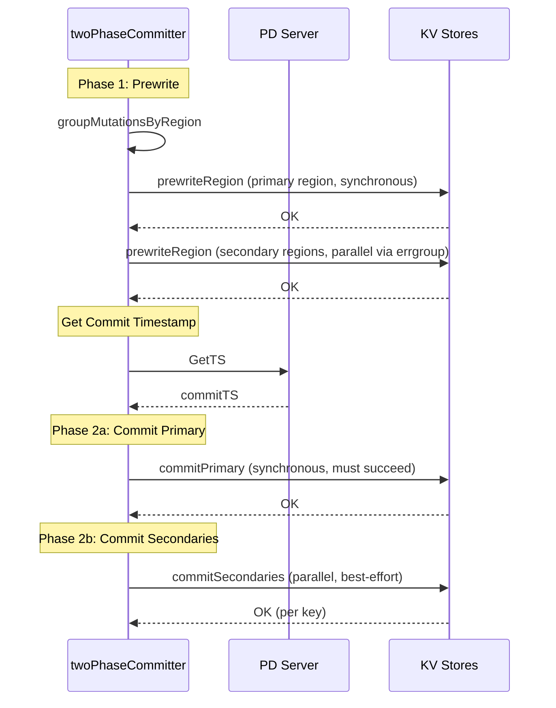
```mermaid
sequenceDiagram
    participant C as twoPhaseCommitter
    participant PD as PD Server
    participant KVS as KV Stores

    Note over C: Phase 1: Prewrite
    C->>C: groupMutationsByRegion
    C->>KVS: prewriteRegion (primary region, synchronous)
    KVS-->>C: OK
    C->>KVS: prewriteRegion (secondary regions, parallel via errgroup)
    KVS-->>C: OK

    Note over C: Get Commit Timestamp
    C->>PD: GetTS
    PD-->>C: commitTS

    Note over C: Phase 2a: Commit Primary
    C->>KVS: commitPrimary (synchronous, must succeed)
    KVS-->>C: OK

    Note over C: Phase 2b: Commit Secondaries
    C->>KVS: commitSecondaries (parallel, best-effort)
    KVS-->>C: OK (per key)
```

The detailed steps:

**Step 1: Prewrite**
1. Group mutations by region via `groupMutationsByRegion`.
2. Find the primary key's region group.
3. Prewrite the primary region synchronously. If this fails, rollback all mutations and return the error.
4. Prewrite all secondary regions in parallel using `errgroup`. If any secondary prewrite fails, rollback and return the error.

**Step 2: Get Commit Timestamp**
1. Allocate a commit timestamp from PD via `GetTS`.
2. If this fails, rollback and return the error.

**Step 3: Commit Primary**
1. Send a `KvCommit` RPC for the primary key with the allocated `commitTS`.
2. If this fails, check via `isPrimaryCommitted` whether the primary was actually committed despite the error. The primary commit may have succeeded at the Raft level but the response was lost (e.g., timeout during a leader change after split).
3. If the primary IS committed, proceed with secondaries.
4. If the primary is NOT committed, rollback and return the error.

**Step 4: Commit Secondaries**
1. For each secondary key, send a per-key `KvCommit` RPC via `SendToRegion`.
2. Secondaries are committed in parallel using goroutines with a `sync.WaitGroup`.
3. If a secondary returns `TxnLockNotFound`, retry up to 5 times. This handles Raft replication delays where the prewrite has not yet been applied on the node receiving the commit.
4. After 5 retries, accept as genuinely resolved (the lock was cleaned up by another transaction's lock resolution).

### 9.5 prewrite: Phase 1

For each region group, `prewriteRegion` sends a `PrewriteRequest`:

```go
req := &kvrpcpb.PrewriteRequest{
    Mutations:    protoMuts,
    PrimaryLock:  c.primary,
    StartVersion: uint64(c.startTS),
    LockTtl:      c.opts.LockTTL,
    TxnSize:      uint64(len(c.mutations)),
}
```

Special handling for commit optimizations:
- If `Try1PC` is enabled and all mutations fit in a single region, `TryOnePc = true` is set. If the server commits the transaction in one phase, `resp.GetOnePcCommitTs()` is non-zero and is used as the commit timestamp.
- If `UseAsyncCommit` is enabled, `req.UseAsyncCommit = true` and the `Secondaries` field is populated with all secondary keys.

### 9.6 getCommitTS: Timestamp Allocation

Allocates a new timestamp from PD via `pdClient.GetTS`. This timestamp is strictly greater than the start timestamp (guaranteed by PD's monotonically increasing TSO).

### 9.7 commitPrimary: The Point of No Return

Once the primary key is committed, the transaction is considered committed regardless of whether secondaries succeed. The primary's write record in `CF_WRITE` is the authoritative proof of commitment. Other transactions encountering locked secondary keys will check the primary's status to decide whether to commit or rollback the lock.

If `Try1PC` is enabled and the 1PC optimization succeeded during prewrite (indicated by a non-zero `commitTS`), `commitPrimary` is skipped entirely since the transaction was already committed during prewrite.

### 9.8 isPrimaryCommitted: Post-Error Verification

```go
func (c *twoPhaseCommitter) isPrimaryCommitted(ctx context.Context) bool
```

After `commitPrimary` returns an error, this method checks via `KvCheckTxnStatus` whether the primary was actually committed. This handles a critical edge case:

1. The client sends a commit request to the Raft leader.
2. The Raft leader proposes the commit.
3. The Raft group commits the entry and applies it (the primary IS committed).
4. Before the response reaches the client, a network timeout occurs.
5. The client sees an error and might incorrectly rollback.

By checking `KvCheckTxnStatus.CommitVersion != 0`, the client can detect this case and proceed with committing secondaries instead of rolling back.

### 9.9 commitSecondaries: Per-Key Commit with Retry

```go
func (c *twoPhaseCommitter) commitSecondaries(ctx context.Context)
```

Each secondary key is committed individually via `SendToRegion` rather than grouped by region. This design handles the case where region splits occur between prewrite and commit: by doing per-key `SendToRegion`, the `RegionCache` automatically routes each key to its current region, even if it moved due to a split.

The `TxnLockNotFound` retry mechanism is critical for correctness after splits. When a region splits, the new child region may not yet have applied the prewrite entries from the parent region's Raft log. The secondary commit arrives and finds no lock, returning `TxnLockNotFound`. Retrying after a brief delay (via the 100ms backoff in `SendToRegion`) gives the child region time to catch up.

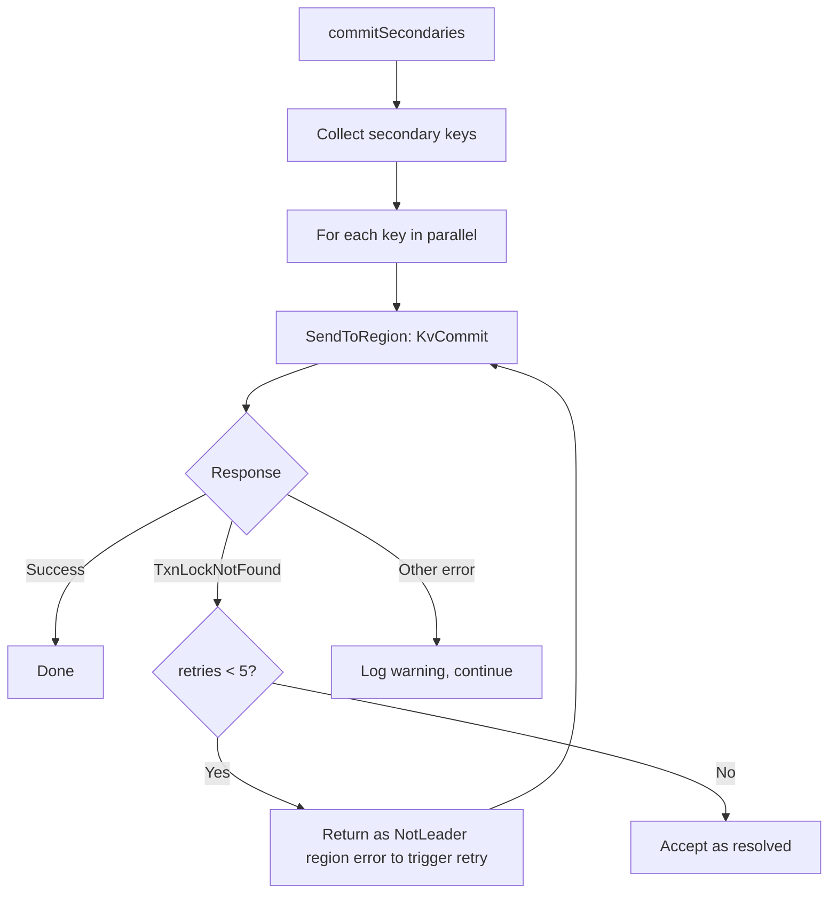
```mermaid
flowchart TD
    A[commitSecondaries] --> B[Collect secondary keys]
    B --> C[For each key in parallel]
    C --> D[SendToRegion: KvCommit]
    D --> E{Response}
    E -->|Success| F[Done]
    E -->|TxnLockNotFound| G{retries < 5?}
    G -->|Yes| H[Return as NotLeader region error to trigger retry]
    H --> D
    G -->|No| I[Accept as resolved]
    E -->|Other error| J[Log warning, continue]
```

### 9.10 rollback: Cleanup on Failure

If prewrite or commit fails, the committer rolls back all mutations:

1. Collect all mutation keys.
2. Group by region via `GroupKeysByRegion`.
3. Send `KvBatchRollback` to each region in parallel via `errgroup`.

---

## 10. LockResolver

### 10.1 Purpose

When a transaction reads a key that is locked by another transaction, it encounters a stale lock. The lock may belong to a committed transaction that has not yet cleaned up its secondary locks, or to a crashed transaction that will never complete. `LockResolver` determines the state of the locking transaction and either commits or rolls back the lock, allowing the blocked read to proceed.

### 10.2 Structure

```go
type LockResolver struct {
    sender   *RegionRequestSender
    cache    *RegionCache
    pdClient pdclient.Client

    mu           sync.Mutex
    resolving    map[lockKey]chan struct{}  // deduplication map
    resolveCount int                        // total resolutions since last map reset
}

type lockKey struct {
    primary string
    startTS uint64
}
```

### 10.3 Deduplication via resolving Map

Multiple goroutines may encounter the same stale lock simultaneously. Without deduplication, they would all independently check the transaction status and resolve the lock, wasting resources.

The `resolving` map tracks which locks are currently being resolved. The key is a `{primary, startTS}` pair that uniquely identifies a transaction. The value is a `chan struct{}` that is closed when resolution completes.

**Map cleanup**: After each resolution, a `resolveCount` counter is incremented. When the map is empty and the counter reaches 1000, the map is recreated with `make()` to release the old backing memory. This prevents the map from retaining memory from deleted entries indefinitely without churning on every single resolve.

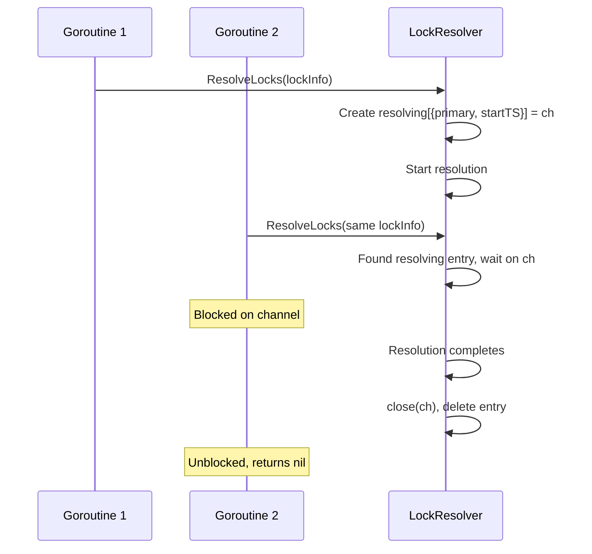
```mermaid
sequenceDiagram
    participant G1 as Goroutine 1
    participant G2 as Goroutine 2
    participant LR as LockResolver

    G1->>LR: ResolveLocks(lockInfo)
    LR->>LR: Create resolving[{primary, startTS}] = ch
    LR->>LR: Start resolution

    G2->>LR: ResolveLocks(same lockInfo)
    LR->>LR: Found resolving entry, wait on ch
    Note over G2: Blocked on channel

    LR->>LR: Resolution completes
    LR->>LR: close(ch), delete entry
    Note over G2: Unblocked, returns nil
```

### 10.4 Resolution Flow

```go
func (lr *LockResolver) resolveSingleLock(ctx context.Context, lock *kvrpcpb.LockInfo) error
```

For each lock:

1. **Deduplication check.** If another goroutine is already resolving this lock (same primary + startTS), wait on its channel.

2. **Check transaction status** via `checkTxnStatus`. This sends a `KvCheckTxnStatus` RPC to the primary key's region:
   - `PrimaryKey`: the primary key from the lock info
   - `LockTs`: the start timestamp of the locking transaction
   - `CallerStartTs`: a fresh timestamp from PD (used for TTL expiry checks)
   - `RollbackIfNotExist`: true (if the primary lock is gone and no commit record exists, write a rollback record to prevent the transaction from committing later)

3. **Interpret the result:**
   - If `LockTtl > 0` and `CommitVersion == 0`: the primary is still locked and the transaction is still in progress. Return nil and let the caller retry later.
   - If `CommitVersion > 0`: the transaction was committed. Resolve the secondary lock by committing it.
   - If `CommitVersion == 0` and `LockTtl == 0`: the transaction was rolled back. Resolve the secondary lock by rolling it back.

4. **Resolve the lock** via `resolveLock`. This sends a `KvResolveLock` RPC to the locked key's region:
   - If `commitTS > 0`: the server commits the lock (writes a commit record and removes the lock).
   - If `commitTS == 0`: the server rolls back the lock (removes the lock and writes a rollback protection record).

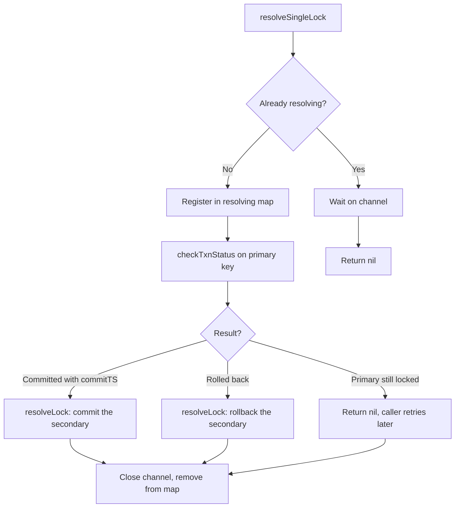
```mermaid
flowchart TD
    A[resolveSingleLock] --> B{Already resolving?}
    B -->|Yes| C[Wait on channel]
    B -->|No| D[Register in resolving map]

    D --> E[checkTxnStatus on primary key]
    E --> F{Result?}

    F -->|Primary still locked| G[Return nil, caller retries later]
    F -->|Committed with commitTS| H[resolveLock: commit the secondary]
    F -->|Rolled back| I[resolveLock: rollback the secondary]

    H --> J[Close channel, remove from map]
    I --> J
    G --> J
    C --> K[Return nil]
```

### 10.5 checkTxnStatus: Checking the Primary

```go
func (lr *LockResolver) checkTxnStatus(ctx context.Context, primaryKey []byte, lockTS txntypes.TimeStamp) (*kvrpcpb.CheckTxnStatusResponse, error)
```

This method:
1. Allocates a fresh timestamp from PD (`callerStartTS`).
2. Sends `KvCheckTxnStatus` to the primary key's region via `SendToRegion`.
3. The `RollbackIfNotExist = true` flag tells the server: "if the lock is gone and there is no commit or rollback record, write a rollback record." This prevents the transaction from committing later (known as "rollback protection").

### 10.6 resolveLock: Committing or Rolling Back

```go
func (lr *LockResolver) resolveLock(ctx context.Context, lock *kvrpcpb.LockInfo, commitTS txntypes.TimeStamp) error
```

Sends `KvResolveLock` to the locked key's region. The server:
- If `commitTS > 0`: writes a commit record to `CF_WRITE` and removes the lock from `CF_LOCK`.
- If `commitTS == 0`: removes the lock from `CF_LOCK` and writes a rollback protection record to `CF_WRITE`.

---

## 11. RawKV API

### 11.1 Purpose

`RawKVClient` provides a simple, non-transactional key-value API. It bypasses the MVCC layer entirely and stores data directly in the `CF_DEFAULT` column family. It is suitable for applications that do not need multi-key transactions.

### 11.2 Structure

```go
type RawKVClient struct {
    sender *RegionRequestSender
    cache  *RegionCache
    cf     string  // column family (default: "")
}
```

### 11.3 Operations

All operations use `SendToRegion` for automatic region routing and retry:

#### Put

```go
func (c *RawKVClient) Put(ctx context.Context, key, value []byte) error
```

Sends `RawPut` to the region owning the key.

#### PutWithTTL

```go
func (c *RawKVClient) PutWithTTL(ctx context.Context, key, value []byte, ttl uint64) error
```

Like `Put`, but sets a TTL (in seconds) on the key-value pair. The server encodes the TTL alongside the value.

#### Get

```go
func (c *RawKVClient) Get(ctx context.Context, key []byte) ([]byte, bool, error)
```

Returns the value and a `notFound` boolean. The `notFound` flag distinguishes between "key exists with empty value" and "key does not exist".

#### Delete

```go
func (c *RawKVClient) Delete(ctx context.Context, key []byte) error
```

Sends `RawDelete` to the region owning the key.

#### GetKeyTTL

```go
func (c *RawKVClient) GetKeyTTL(ctx context.Context, key []byte) (uint64, error)
```

Returns the remaining TTL for a key (in seconds). Returns 0 if the key has no TTL.

#### BatchGet

```go
func (c *RawKVClient) BatchGet(ctx context.Context, keys [][]byte) ([]KvPair, error)
```

Groups keys by region via `GroupKeysByRegion`, then sends `RawBatchGet` to each region in parallel using `errgroup`. Results are collected into a single slice.

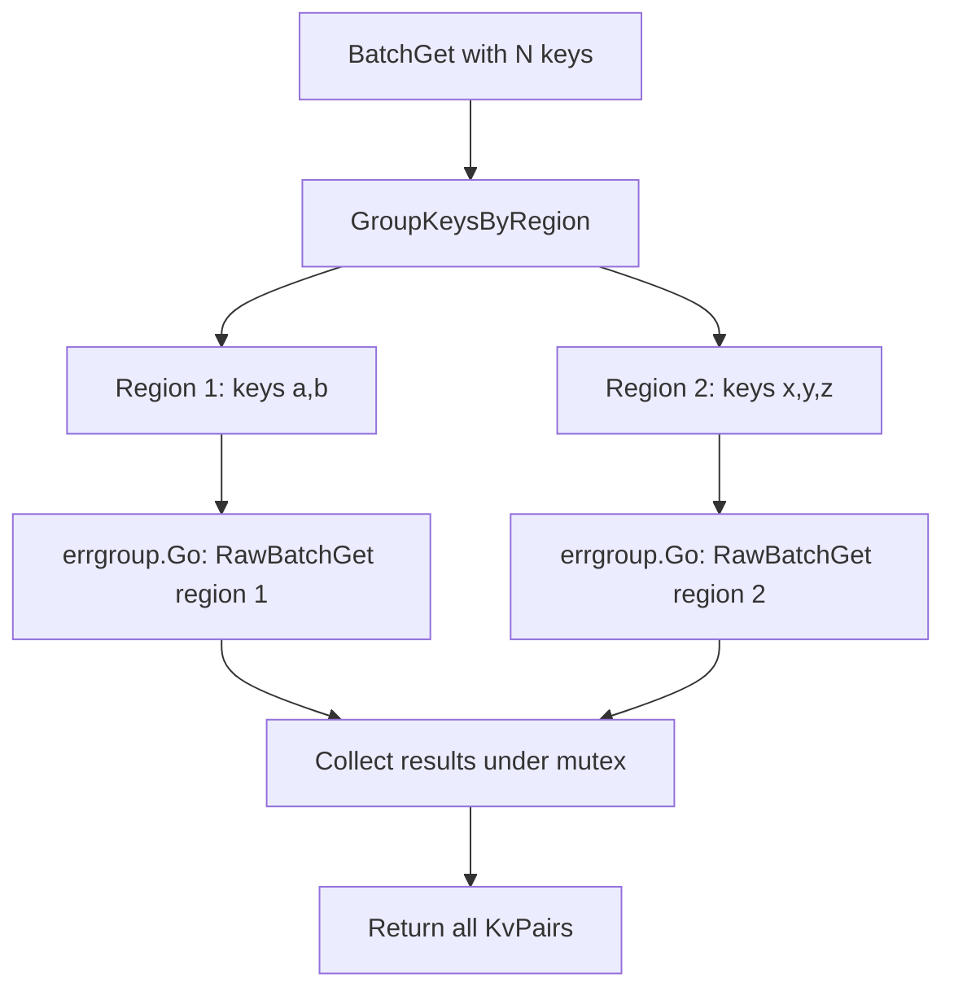
```mermaid
flowchart TD
    A[BatchGet with N keys] --> B[GroupKeysByRegion]
    B --> C[Region 1: keys a,b]
    B --> D[Region 2: keys x,y,z]
    C --> E["errgroup.Go: RawBatchGet region 1"]
    D --> F["errgroup.Go: RawBatchGet region 2"]
    E --> G[Collect results under mutex]
    F --> G
    G --> H[Return all KvPairs]
```

#### BatchPut

```go
func (c *RawKVClient) BatchPut(ctx context.Context, pairs []KvPair) error
```

Groups key-value pairs by region, then sends `RawBatchPut` to each region in parallel.

#### BatchDelete

```go
func (c *RawKVClient) BatchDelete(ctx context.Context, keys [][]byte) error
```

Groups keys by region, then sends `RawBatchDelete` to each region in parallel.

#### Scan

```go
func (c *RawKVClient) Scan(ctx context.Context, startKey, endKey []byte, limit int) ([]KvPair, error)
```

Scan transparently crosses region boundaries. The algorithm:

1. Start with `currentKey = startKey`.
2. Send `RawScan` via `SendToRegion`. Inside the RPC callback, `regionEnd` and `scanEnd` are recomputed from the (possibly refreshed) `RegionInfo` argument so that after a region error and cache invalidation, the retry uses up-to-date region boundaries rather than stale ones captured before the call. The per-region scan end is `min(regionEndKey, endKey)`, and the scan limit is `remaining = limit - len(results)`.
3. Append results.
4. If more results are needed and there are more regions, set `currentKey = regionEndKey` and repeat.

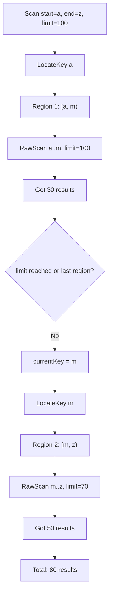
```mermaid
flowchart TD
    A[Scan start=a, end=z, limit=100] --> B[LocateKey a]
    B --> C["Region 1: [a, m)"]
    C --> D["RawScan a..m, limit=100"]
    D --> E[Got 30 results]
    E --> F{limit reached or last region?}
    F -->|No| G[currentKey = m]
    G --> H[LocateKey m]
    H --> I["Region 2: [m, z)"]
    I --> J["RawScan m..z, limit=70"]
    J --> K[Got 50 results]
    K --> L[Total: 80 results]
```

#### DeleteRange

```go
func (c *RawKVClient) DeleteRange(ctx context.Context, startKey, endKey []byte) error
```

Deletes all keys in a range, transparently spanning region boundaries. The algorithm iterates across regions: for each region, it clamps the delete range to the region's key range (using `min(regionEndKey, endKey)` as the per-region end) and sends a `RawDeleteRange` RPC via `SendToRegion`. After each region, it advances `currentKey` to the region's end key and continues until the entire range is covered.

#### CompareAndSwap

```go
func (c *RawKVClient) CompareAndSwap(ctx context.Context, key, value, prevValue []byte, prevNotExist bool) (bool, []byte, error)
```

Atomic compare-and-swap operation. Sends `RawCompareAndSwap` with:
- `Key`: the target key
- `Value`: the new value to set if the comparison succeeds
- `PreviousValue`: the expected current value
- `PreviousNotExist`: if true, the swap succeeds only if the key does not exist

Returns `(succeed, previousValue, error)`.

#### Checksum

```go
func (c *RawKVClient) Checksum(ctx context.Context, startKey, endKey []byte) (uint64, uint64, uint64, error)
```

Computes a checksum over a key range, transparently spanning region boundaries. The algorithm iterates across regions (same pattern as `DeleteRange`): for each region, a `RawChecksum` RPC is sent with the clamped key range. Per-region checksums are combined with XOR, and `totalKvs`/`totalBytes` are summed. Returns `(checksum, totalKvs, totalBytes, error)`. Used for data integrity verification.

---

## 12. Complete Request Flow

This section traces a complete transactional write from application code through the client library to the KV store and back.

### 12.1 Example: Bank Transfer

```go
// Transfer $100 from account A to account B
client, _ := client.NewClient(ctx, client.Config{PDAddrs: []string{"pd:2379"}})
txn, _ := client.TxnKV().Begin(ctx)

// Read current balances
balA, _ := txn.Get(ctx, []byte("account:A"))
balB, _ := txn.Get(ctx, []byte("account:B"))

// Compute new balances
newA := deduct(balA, 100)
newB := add(balB, 100)

// Buffer writes
txn.Set(ctx, []byte("account:A"), newA)
txn.Set(ctx, []byte("account:B"), newB)

// Commit (2PC)
err := txn.Commit(ctx)
```

### 12.2 Full Request Trace

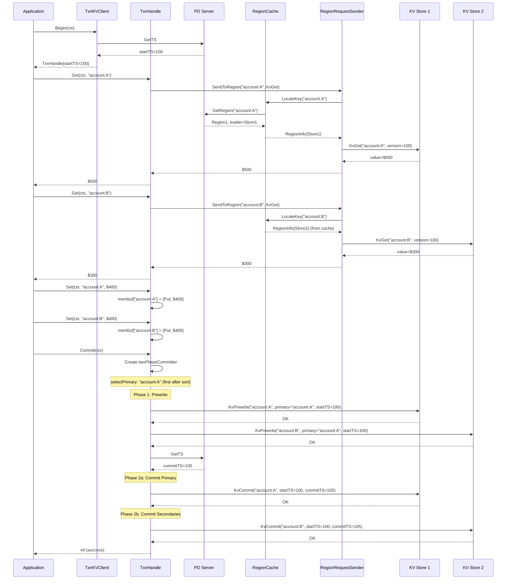
```mermaid
sequenceDiagram
    participant App as Application
    participant TKV as TxnKVClient
    participant TH as TxnHandle
    participant PD as PD Server
    participant RC as RegionCache
    participant RRS as RegionRequestSender
    participant KVS1 as KV Store 1
    participant KVS2 as KV Store 2

    App->>TKV: Begin(ctx)
    TKV->>PD: GetTS
    PD-->>TKV: startTS=100
    TKV-->>App: TxnHandle{startTS=100}

    App->>TH: Get(ctx, "account:A")
    TH->>RRS: SendToRegion("account:A", KvGet)
    RRS->>RC: LocateKey("account:A")
    RC->>PD: GetRegion("account:A")
    PD-->>RC: Region1, leader=Store1
    RC-->>RRS: RegionInfo{Store1}
    RRS->>KVS1: KvGet("account:A", version=100)
    KVS1-->>RRS: value=$500
    RRS-->>TH: $500
    TH-->>App: $500

    App->>TH: Get(ctx, "account:B")
    TH->>RRS: SendToRegion("account:B", KvGet)
    RRS->>RC: LocateKey("account:B")
    RC-->>RRS: RegionInfo{Store2} (from cache)
    RRS->>KVS2: KvGet("account:B", version=100)
    KVS2-->>RRS: value=$300
    RRS-->>TH: $300
    TH-->>App: $300

    App->>TH: Set(ctx, "account:A", $400)
    TH->>TH: membuf["account:A"] = {Put, $400}

    App->>TH: Set(ctx, "account:B", $400)
    TH->>TH: membuf["account:B"] = {Put, $400}

    App->>TH: Commit(ctx)
    TH->>TH: Create twoPhaseCommitter

    Note over TH: selectPrimary: "account:A" (first after sort)

    Note over TH: Phase 1: Prewrite
    TH->>KVS1: KvPrewrite("account:A", primary="account:A", startTS=100)
    KVS1-->>TH: OK
    TH->>KVS2: KvPrewrite("account:B", primary="account:A", startTS=100)
    KVS2-->>TH: OK

    TH->>PD: GetTS
    PD-->>TH: commitTS=105

    Note over TH: Phase 2a: Commit Primary
    TH->>KVS1: KvCommit("account:A", startTS=100, commitTS=105)
    KVS1-->>TH: OK

    Note over TH: Phase 2b: Commit Secondaries
    TH->>KVS2: KvCommit("account:B", startTS=100, commitTS=105)
    KVS2-->>TH: OK

    TH-->>App: nil (success)
```

---

## 13. Error Handling Summary

### 13.1 Transaction-Level Errors

| Error | Meaning | Recovery |
|-------|---------|----------|
| `ErrTxnCommitted` | Transaction already committed | None needed |
| `ErrTxnRolledBack` | Transaction already rolled back | Start a new transaction |
| `ErrWriteConflict` | Another transaction holds a conflicting lock | Retry the entire transaction |
| `ErrTxnLockNotFound` | Expected lock not found during commit | Handled internally by retry |
| `ErrDeadlock` | Deadlock detected during pessimistic locking | Application must retry |

### 13.2 Region-Level Errors (handled automatically)

| Error | Meaning | Automatic Action |
|-------|---------|-----------------|
| `NotLeader` | Sent to wrong server | Update leader in cache, retry |
| `EpochNotMatch` | Region was split/merged | Invalidate cache, retry |
| `RegionNotFound` | Region no longer exists | Invalidate cache, retry |
| `KeyNotInRegion` | Key routed to wrong region | Invalidate cache, retry |
| `StoreNotMatch` | Store address changed | Invalidate store + region, retry |

### 13.3 Infrastructure Errors

| Error | Meaning | Action |
|-------|---------|--------|
| gRPC connection failure | Network issue | Invalidate region, retry |
| PD unreachable | Cannot allocate timestamps | Propagated to caller |
| Max retries exhausted | All retry attempts failed | Propagated to caller |

---

## 14. Thread Safety

All public types in `pkg/client` are safe for concurrent use by multiple goroutines:

- `Client`, `TxnKVClient`, `RawKVClient`: stateless or use internal synchronization.
- `RegionCache`: uses `sync.RWMutex` for all cache operations.
- `PDStoreResolver`: uses `sync.RWMutex` for the store cache.
- `RegionRequestSender`: uses `sync.RWMutex` for the connection pool.
- `LockResolver`: uses `sync.Mutex` for the deduplication map.
- `TxnHandle`: uses `sync.Mutex` to protect `membuf`, `committed`, and `rolledBack` state.

**Important**: A single `TxnHandle` is intended for use by one goroutine. While it uses a mutex internally, interleaving Get/Set/Commit calls from multiple goroutines on the same transaction is not a supported use pattern.

---

## 15. File Inventory

| File | Struct/Type | Purpose |
|------|------------|---------|
| `pkg/client/client.go` | `Config`, `Client` | Entry point, configuration, sub-client factory |
| `pkg/client/region_cache.go` | `RegionInfo`, `KeyGroup`, `RegionCache` | Key-to-region mapping with PD fallback |
| `pkg/client/store_resolver.go` | `PDStoreResolver`, `storeEntry` | Store ID to gRPC address resolution with TTL cache |
| `pkg/client/request_sender.go` | `RegionRequestSender`, `RPCFunc` | RPC delivery with retry and connection pooling |
| `pkg/client/txnkv.go` | `TxnKVClient`, `TxnOptions`, `TxnOption` | Transactional KV client with functional options |
| `pkg/client/txn.go` | `TxnHandle`, `mutationEntry` | Per-transaction state, Get/Set/Delete/Commit/Rollback |
| `pkg/client/committer.go` | `twoPhaseCommitter`, `mutationWithKey` | 2PC protocol execution |
| `pkg/client/lock_resolver.go` | `LockResolver`, `lockKey` | Stale lock resolution via checkTxnStatus/resolveLock |
| `pkg/client/rawkv.go` | `RawKVClient`, `KvPair` | Non-transactional Raw KV API |

---

## 16. Relationship to Server-Side Components

The client library interacts with two server-side components:

**PD Server** (`internal/pd/server.go`):
- `GetTS`: provides monotonically increasing timestamps for transaction snapshot isolation
- `GetRegion` / `GetRegionByKey`: provides region metadata for key routing
- `GetStore`: provides store addresses for gRPC connection establishment

**KV Store** (`internal/server/server.go`):
- `KvGet` / `KvBatchGet`: snapshot-isolated point reads
- `KvPrewrite` / `KvCommit`: two-phase commit protocol
- `KvBatchRollback`: transaction rollback
- `KvCheckTxnStatus`: transaction status queries for lock resolution
- `KvResolveLock`: lock cleanup (commit or rollback)
- `KvPessimisticLock` / `KVPessimisticRollback`: pessimistic lock management
- `RawGet` / `RawPut` / `RawDelete` / `RawScan` / etc.: non-transactional operations

The client sends all RPCs using the TiKV-compatible `tikvpb.Tikv` gRPC service, making the gookv client compatible with real TiKV clusters as well.

---

## 17. Key Design Decisions

### 17.1 Per-Key Secondary Commits

Secondary keys are committed individually via `SendToRegion` rather than batched by region. This handles region splits between prewrite and commit: if a region splits after prewrite, the secondary commit for keys that moved to the new child region would fail with `KeyNotInRegion`. By using per-key `SendToRegion`, the `RegionCache` automatically re-routes each key to its current region.

### 17.2 Synchronous Secondary Commits

Secondary commits are executed synchronously (the caller waits for all secondaries to complete) rather than in background goroutines. This prevents orphan locks: if secondaries were committed in the background and the process crashed, locks on secondary keys would remain indefinitely until another transaction's `LockResolver` cleaned them up.

### 17.3 Connection Preservation on Error

When a gRPC error occurs, the client does NOT close the gRPC connection. gRPC connections are shared across goroutines and gRPC handles reconnection automatically. Closing a shared connection would cause cascading "connection is closing" errors for other in-flight RPCs.

### 17.4 TxnLockNotFound Retry

After a region split, prewrite entries in the parent region's Raft log may not have been replayed on the new child region yet. A commit arriving at the child region would find no lock and return `TxnLockNotFound`. The client retries up to 5 times, treating this as a `NotLeader` region error to trigger the standard retry path with 100ms backoff.

### 17.5 Read-Your-Own-Writes via membuf

The `TxnHandle.membuf` provides read-your-own-writes semantics. When `Get` is called, the local buffer is checked before issuing an RPC. This means:
- A `Set` followed by a `Get` for the same key returns the buffered value without a network round-trip.
- A `Delete` followed by a `Get` for the same key returns nil (the key is logically deleted).
- The buffer is a Go `map[string]mutationEntry`, so key lookups are O(1).

This design matches TiKV client behavior: mutations are buffered locally and only sent to the server during prewrite.

### 17.6 Primary Key Stability

The primary key is selected once during `newTwoPhaseCommitter` and remains fixed throughout the 2PC protocol. All subsequent operations (prewrite, commit, rollback, lock resolution) reference the same primary key. If the primary key changed during the protocol, other transactions checking lock status would get inconsistent results.

The primary key is the lexicographically smallest key after sorting all mutations. This deterministic selection ensures that even if the `TxnHandle.primaryKey()` method is called at different times (which iterates over a Go map with non-deterministic order), the committer always uses the same stable primary.

---

## 18. Key Encoding for Region Routing

### 18.1 The Encoding Problem

Region boundaries are stored as memcomparable-encoded keys (via `codec.EncodeBytes`). When the client receives a raw user key (like `"account:A"`), it must encode the key before comparing it against region boundaries. Without this encoding, binary search on region boundaries would produce incorrect results.

The `codec.EncodeBytes` function transforms arbitrary byte sequences into a format where byte-wise comparison preserves the original ordering. It uses a padding scheme that handles `0x00` bytes correctly:

```
Input:  "hello"
Output: [0x68 0x65 0x6C 0x6C 0x6F 0x00 0x00 0x00 0xFB]
        |-- original bytes --|-- padding --| marker |
```

### 18.2 Where Encoding Happens

1. **RegionCache.LocateKey**: Encodes the raw key via `codec.EncodeBytes(nil, key)` before binary search.
2. **RegionCache.loadFromPD**: Passes the raw (unencoded) key to PD, because PD handles encoding internally.
3. **RPC requests**: Keys in RPC requests are sent as raw bytes. The server handles encoding when needed.

This asymmetry (encode for cache lookup, raw for PD and RPCs) is a deliberate design choice. PD stores region boundaries in encoded form, and the server encodes keys as needed for MVCC operations.

---

## 19. Pessimistic vs Optimistic Mode

### 19.1 Optimistic Transactions

In optimistic mode (the default), mutations are only sent to the server during commit:

```
Begin → Get → Get → Set → Set → Commit
              ↑                    ↑
         reads from server    2PC: prewrite + commit
```

If two transactions modify the same key, the conflict is detected during prewrite. The transaction that prewrites second gets a `WriteConflict` error and must retry.

**Pro**: No lock overhead during the read-write phase.
**Con**: The entire transaction must be retried on conflict. With high contention, retries can be expensive.

### 19.2 Pessimistic Transactions

In pessimistic mode, each `Set` and `Delete` immediately acquires a pessimistic lock on the key:

```
Begin → Get → Set (lock) → Get → Set (lock) → Commit
                ↑                     ↑          ↑
           KvPessimisticLock    KvPessimisticLock   2PC
```

If two transactions try to lock the same key, the second one gets a `WriteConflict` error immediately at the `Set` call, rather than at commit time. This provides earlier conflict detection and avoids wasted work.

**Pro**: Conflicts detected immediately, reducing wasted computation.
**Pro**: Other transactions wait on the lock instead of conflicting (depending on TTL).
**Con**: Additional RPC per write operation.
**Con**: Lock overhead even for non-conflicting keys.

### 19.3 Lock Lifecycle

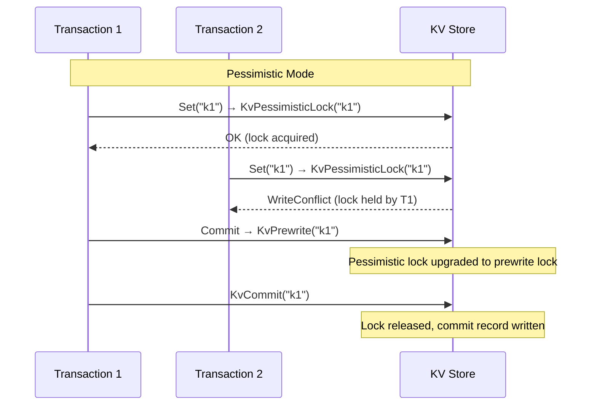
```mermaid
sequenceDiagram
    participant T1 as Transaction 1
    participant T2 as Transaction 2
    participant KVS as KV Store

    Note over T1,KVS: Pessimistic Mode

    T1->>KVS: Set("k1") → KvPessimisticLock("k1")
    KVS-->>T1: OK (lock acquired)

    T2->>KVS: Set("k1") → KvPessimisticLock("k1")
    KVS-->>T2: WriteConflict (lock held by T1)

    T1->>KVS: Commit → KvPrewrite("k1")
    Note over KVS: Pessimistic lock upgraded to prewrite lock
    T1->>KVS: KvCommit("k1")
    Note over KVS: Lock released, commit record written
```

### 19.4 Rollback in Pessimistic Mode

When a pessimistic transaction is rolled back, both types of locks must be cleaned up:

1. **Pessimistic locks**: Sent via `KVPessimisticRollback`. These are lightweight locks that only prevent other transactions from acquiring the same key.
2. **Prewrite locks**: Sent via `KvBatchRollback`. These exist if `Commit` was partially executed before the rollback.

The `TxnHandle.Rollback` method handles this by calling `pessimisticRollback` for `lockKeys` first, then `batchRollback` for `membuf` keys. Both calls are necessary because a partial commit attempt may have created prewrite locks for some keys before failing.

---

## 20. Connection Pool Behavior

### 20.1 Connection Lifecycle

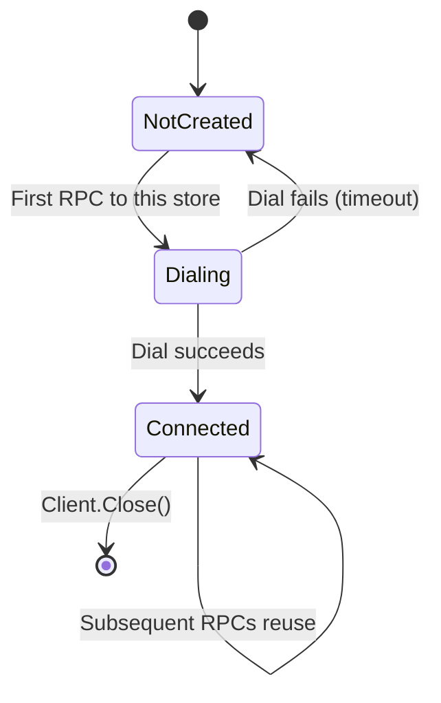
```mermaid
stateDiagram-v2
    [*] --> NotCreated
    NotCreated --> Dialing : First RPC to this store
    Dialing --> Connected : Dial succeeds
    Dialing --> NotCreated : Dial fails (timeout)
    Connected --> Connected : Subsequent RPCs reuse
    Connected --> [*] : Client.Close()
```

### 20.2 gRPC Connection Parameters

Each connection is created with the following parameters:

| Parameter | Value | Purpose |
|-----------|-------|---------|
| Credentials | Insecure (no TLS) | Simplicity; production should add TLS |
| Max recv message size | 64 MiB | Support large batch responses |
| Keepalive time | 60s | Detect dead connections |
| Keepalive timeout | 10s | Close unresponsive connections |
| Permit without stream | false | Only send keepalive when active streams exist |

### 20.3 Connection Sharing

All goroutines in the client share the same connection pool. A single gRPC connection multiplexes multiple concurrent RPCs via HTTP/2 streams. This means:
- 100 concurrent `Get` calls to the same store use 1 TCP connection.
- Connection creation is serialized via double-checked locking to prevent duplicate connections.
- A connection is never removed from the pool except during `Client.Close()`.

---

## 21. Usage Examples

### 21.1 RawKV: Simple Key-Value Operations

```go
client, _ := client.NewClient(ctx, client.Config{
    PDAddrs: []string{"127.0.0.1:2379"},
})
defer client.Close()

raw := client.RawKV()

// Put
raw.Put(ctx, []byte("name"), []byte("gookv"))

// Get
value, notFound, _ := raw.Get(ctx, []byte("name"))
// value = "gookv", notFound = false

// Delete
raw.Delete(ctx, []byte("name"))

// Scan
pairs, _ := raw.Scan(ctx, []byte("a"), []byte("z"), 100)

// BatchPut
raw.BatchPut(ctx, []client.KvPair{
    {Key: []byte("k1"), Value: []byte("v1")},
    {Key: []byte("k2"), Value: []byte("v2")},
})

// BatchGet
pairs, _ = raw.BatchGet(ctx, [][]byte{[]byte("k1"), []byte("k2")})

// CompareAndSwap
success, prev, _ := raw.CompareAndSwap(ctx,
    []byte("counter"),     // key
    []byte("2"),           // new value
    []byte("1"),           // expected current value
    false,                 // prevNotExist
)
```

### 21.2 TxnKV: Transactional Operations

```go
client, _ := client.NewClient(ctx, client.Config{
    PDAddrs: []string{"127.0.0.1:2379"},
})
defer client.Close()

txnClient := client.TxnKV()

// Optimistic transaction
txn, _ := txnClient.Begin(ctx)
val, _ := txn.Get(ctx, []byte("balance"))
newVal := incrementBalance(val, 100)
txn.Set(ctx, []byte("balance"), newVal)
err := txn.Commit(ctx)
if err == client.ErrWriteConflict {
    // Retry the entire transaction
}

// Pessimistic transaction
txn, _ = txnClient.Begin(ctx, client.WithPessimistic())
val, _ = txn.Get(ctx, []byte("balance"))
err = txn.Set(ctx, []byte("balance"), newVal) // acquires lock immediately
if err == client.ErrWriteConflict {
    txn.Rollback(ctx) // clean up pessimistic locks
    // Retry
}
err = txn.Commit(ctx)

// 1PC optimization (single-region transaction)
txn, _ = txnClient.Begin(ctx, client.With1PC())
txn.Set(ctx, []byte("key_in_one_region"), []byte("value"))
txn.Commit(ctx) // commits in a single phase if all keys are in one region
```

### 21.3 Error Handling Patterns

```go
// Retry pattern for optimistic transactions
for retries := 0; retries < 3; retries++ {
    txn, _ := txnClient.Begin(ctx)

    val, err := txn.Get(ctx, []byte("counter"))
    if err != nil {
        txn.Rollback(ctx)
        continue
    }

    newVal := increment(val)
    txn.Set(ctx, []byte("counter"), newVal)

    err = txn.Commit(ctx)
    if err == nil {
        break // success
    }
    if err == client.ErrWriteConflict {
        continue // retry
    }
    // non-retriable error
    return err
}
```
