# 09. gookv vs TiKV: Differences and Design Choices

## 1. Purpose

gookv is modeled after TiKV, implementing the same Percolator 2PC transaction protocol, the same MVCC three-CF scheme, and the same gRPC API (via kvproto). However, it is not a line-by-line port. gookv makes different architectural choices based on different goals: simplicity, pure Go implementation, and educational clarity.

This document catalogs the differences between gookv and TiKV to help developers understand:
- What concepts transfer directly from TiKV documentation
- Where gookv simplifies or diverges
- What features remain unimplemented
- What advantages the Go implementation provides

---

## 2. Feature Comparison Table

| Feature | gookv | TiKV | Notes |
|---------|-------|------|-------|
| **Language** | Go | Rust | See Section 3.1 |
| **Storage Engine** | Pebble (pure Go) | RocksDB (C++) | See Section 3.2 |
| **Column Families** | Key prefix emulation (4 CFs) | Native RocksDB CFs | See Section 3.2.2 |
| **Raft Consensus** | etcd/raft (Go) | raft-rs (Rust) | Same Raft algorithm |
| **MVCC** | 3-CF Percolator | 3-CF Percolator | Wire-compatible encoding |
| **Transaction Protocol** | Percolator 2PC | Percolator 2PC | Same protocol |
| **Optimistic Txn** | Yes | Yes | Same behavior |
| **Pessimistic Txn** | Yes | Yes | TTL-based timeout only (no deadlock detection) |
| **Async Commit** | Yes | Yes | Same protocol |
| **1PC Optimization** | Yes | Yes | Single-region only |
| **Region Split** | Raft admin command | Raft admin command | See Section 3.3 |
| **Region Merge** | Basic (ExecPrepareMerge/CommitMerge/RollbackMerge) | Full | gookv has the skeleton |
| **Apply Layer** | `ApplyWorkerPool` (async, goroutine pool) | Dedicated Apply FSM | See Section 3.4 |
| **Scheduler** | One per store | Per-region scheduler | See Section 3.5 |
| **Coprocessor** | Basic scan + aggregation | Full SQL pushdown | See Section 3.6 |
| **Raft Transport** | Per-message gRPC stream | Persistent connection pool | See Section 3.7 |
| **Flow Control** | Basic ReadPool/MemoryQuota | Multi-level | See Section 3.8 |
| **PD** | Embedded (Raft-replicated) | Separate service (etcd-based) | See Section 3.9 |
| **Client Library** | `pkg/client` (Go) | tikv-client-rust / client-go | Same conceptual design |
| **GC** | 3-state worker per store | Centralized GC coordinator | Simpler but functional |
| **Snapshot Transfer** | In-memory | Streaming chunks | See Section 4.3 |
| **Leader Lease** | Implemented but disabled | Fully enabled | See Section 4.4 |
| **Read Index** | Yes (ReadOnlySafe) | Yes | Same protocol |
| **Batch System** | No (goroutine per peer) | Yes (batch FSM) | See Section 3.4.2 |
| **Dynamic PD Membership** | Not implemented | Yes (via etcd) | See Section 4.2 |
| **TiFlash** | No | Yes | Columnar storage |
| **Titan** | No | Yes | Large value separation |
| **Encryption at Rest** | No | Yes | |
| **TLS** | No | Yes | |
| **Rate Limiter** | Basic | Advanced | |
| **CDC (Change Data Capture)** | No | Yes | |
| **Backup/Restore** | No | Yes (BR tool) | |

---

## 3. Architectural Differences

### 3.1 Language: Go vs Rust

**TiKV** is written in Rust, providing memory safety without garbage collection, zero-cost abstractions, and fine-grained control over memory layout. This is critical for TiKV's performance profile, where microsecond-level latencies matter.

**gookv** is written in Go, which trades some performance for:
- Faster development velocity (simpler syntax, garbage collection)
- Goroutines as a natural fit for one-goroutine-per-region-peer model
- Large ecosystem of Go libraries
- Lower barrier to entry for contributors

The Go implementation means gookv does not need to worry about lifetimes, borrow checking, or unsafe blocks. However, it accepts GC pauses and higher baseline memory overhead.

#### Concurrency Model Comparison

| Aspect | TiKV (Rust) | gookv (Go) |
|--------|-------------|------------|
| Threading | Thread pool (Tokio) | Goroutines |
| Peer execution | Batch system: multiple peers per thread | One goroutine per peer |
| Message passing | Crossbeam channels | Go channels |
| Shared state | Arc<Mutex<T>> | sync.Map, sync.RWMutex |
| Async I/O | async/await (Tokio runtime) | Blocking I/O in goroutines |

### 3.2 Storage Engine: Pebble vs RocksDB

#### 3.2.1 Engine Choice

**TiKV** uses RocksDB, a C++ LSM-tree storage engine. TiKV links to RocksDB via the `rust-rocksdb` crate (FFI bindings).

**gookv** uses Pebble, CockroachDB's pure Go LSM-tree storage engine. Pebble is designed to be RocksDB-compatible in terms of data format and configuration options, but is written entirely in Go.

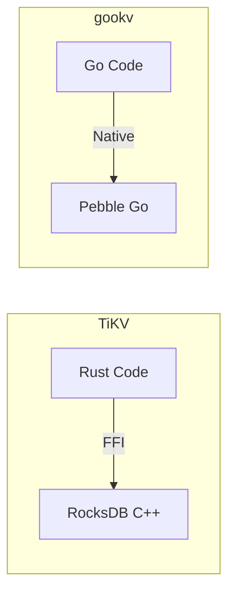

The key advantage of Pebble is that it requires no CGo. This eliminates:
- CGo call overhead (each CGo call costs ~100ns vs ~1ns for a Go function call)
- Build complexity (no C/C++ toolchain required)
- Cross-compilation challenges
- Debugging difficulty (mixed Go + C stack traces)

The key disadvantage is that Pebble may have different performance characteristics than RocksDB for certain workloads, particularly write-heavy ones where RocksDB's C++ implementation can be faster.

#### 3.2.2 Column Family Emulation

**TiKV** uses native RocksDB column families. RocksDB natively supports multiple column families with separate LSM trees, memtables, and compaction schedules.

**gookv** emulates column families using a single-byte key prefix:

```
CF_DEFAULT = 0x00   // data values
CF_LOCK    = 0x01   // transaction locks
CF_WRITE   = 0x02   // commit/rollback records
CF_RAFT    = 0x03   // Raft state
```

Every key stored in Pebble is prefixed with this byte. Iterators are scoped per-CF by setting appropriate prefix bounds.

```go
// Example: storing a key in CF_LOCK
prefixedKey := append([]byte{0x01}, originalKey...)
engine.Put(cfnames.CFLock, originalKey, value)
// Internally: pebble.Set(append([]byte{0x01}, originalKey...), value)
```

This approach is simpler than managing multiple Pebble instances or multiple prefixes with complex configuration. The trade-off is that all CFs share the same LSM tree, which means:
- Lock CF and Write CF entries are mixed in the same sorted structure
- Compaction cannot be tuned per-CF
- Deleting all data in one CF requires scanning the entire key space

For gookv's scale (educational/small-medium deployments), this trade-off is acceptable.

#### 3.2.3 Engine Interface

Both TiKV and gookv abstract the storage engine behind an interface:

| TiKV (`engine_traits` crate) | gookv (`internal/engine/traits`) |
|------------------------------|----------------------------------|
| `KvEngine` trait | `KvEngine` interface |
| `WriteBatch` trait | `WriteBatch` interface |
| `Snapshot` trait | `Snapshot` interface |
| `Iterator` trait | `Iterator` interface |
| `Peekable` trait | (methods on KvEngine) |

The gookv interface is a simplified subset of TiKV's, exposing the essential operations:

```go
type KvEngine interface {
    Get(cf string, key []byte) ([]byte, error)
    Put(cf string, key, value []byte) error
    Delete(cf string, key []byte) error
    NewWriteBatch() WriteBatch
    NewSnapshot() Snapshot
    NewIterator(cf string, opts IterOptions) Iterator
    Close() error
}
```

### 3.3 Region Split: Raft Admin Command

**TiKV** implements region splits as Raft admin commands. A split is proposed to the Raft log and applied by all replicas in the same order as data entries. This ensures strict ordering: no data write can be applied between the split detection and the split execution.

**gookv** follows the same approach, using a tag byte (`0x02`) to distinguish split admin entries from regular data entries in the Raft log:

```go
const TagSplitAdmin byte = 0x02

func IsSplitAdmin(data []byte) bool {
    return len(data) > 0 && data[0] == TagSplitAdmin
}
```

The split admin entry is serialized as:

```
┌──────┬──────────────┬──────────┬───────────────────────────┐
│ 0x02 │ splitKeyLen  │ splitKey │ [regionID + peerIDs]...   │
│ (1B) │ (4B, big-end)│ (N bytes)│ (8B + 4B + 8B*peerCount) │
└──────┴──────────────┴──────────┴───────────────────────────┘
```

This encoding is simpler than TiKV's protobuf-based admin command serialization but achieves the same purpose: the split is proposed and committed through the Raft log, guaranteeing total order with data entries.

The split flow in gookv:
1. `SplitCheckWorker` detects a region exceeding size thresholds.
2. `StoreCoordinator.RunSplitResultHandler` receives the split result.
3. Coordinator calls `AskBatchSplit` on PD for new region/peer IDs.
4. Coordinator proposes a `SplitAdminRequest` via `rawNode.Propose`.
5. All replicas apply the split in the Raft log order.
6. Child regions are bootstrapped on each store.
7. Coordinator reports the split to PD via `ReportBatchSplit`.

### 3.4 Apply Layer

#### 3.4.1 TiKV: Dedicated Apply FSM

TiKV has a sophisticated apply layer with its own state machine:

```
┌──────────────────────────────────────┐
│ TiKV Apply Layer                      │
│                                        │
│  BatchSystem:                          │
│    ApplyRouter → ApplyFSM → ApplyRes  │
│                                        │
│  ApplyFSM:                             │
│    - Handles committed entries         │
│    - Exec split/merge/conf_change      │
│    - Writes to engine                  │
│    - Returns results via ApplyRes      │
│                                        │
│  Pool of apply threads                 │
│  Batch processing for efficiency       │
└──────────────────────────────────────┘
```

In TiKV, the apply layer runs in a separate thread pool from the Raft state machine. Committed entries are sent from the Raft FSM to the Apply FSM via channels. This decouples Raft consensus (which needs low latency) from entry application (which involves disk I/O).

#### 3.4.2 gookv: ApplyWorkerPool (Async Apply)

gookv now uses an `ApplyWorkerPool` that decouples apply from the Raft event loop, similar in concept to TiKV's `ApplyFsm`:

```go
// StoreCoordinator creates the pool at startup
sc.applyWorkerPool = raftstore.NewApplyWorkerPool(4)
// Each peer is wired to the shared pool
peer.SetApplyWorkerPool(sc.applyWorkerPool)
```

After `handleReady` collects committed entries, the peer submits an `ApplyTask` to the pool. A background worker goroutine processes the task, calling the `applyFunc` closure and notifying the peer when done. This means the Raft tick loop is no longer blocked by slow `WriteBatch.Commit` operations.

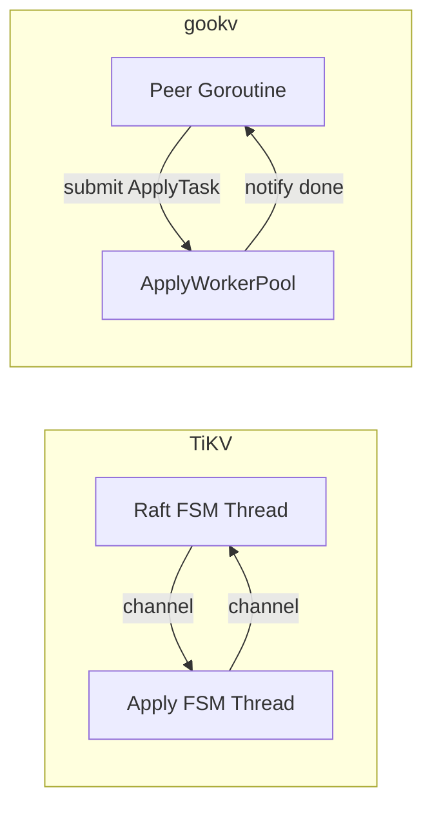

Compared to the original synchronous apply:
- **Pro**: Raft tick loop is no longer blocked by entry application.
- **Pro**: Multiple regions can apply concurrently via the shared worker pool (default 4 workers).
- **Pro**: Simpler than TiKV's full batch system but captures the key benefit (async apply).
- **Con**: Still no batching of applies across regions within a single worker (each task is independent).

#### 3.4.3 One Goroutine Per Peer vs Batch System

TiKV uses a "batch system" where multiple Raft peers share a thread pool. The batch system processes messages for many regions in a single thread, improving cache locality and reducing context switching overhead.

gookv uses a simpler model: one goroutine per Raft peer. Each peer runs its own event loop:

```go
func (p *Peer) Run(ctx context.Context) {
    ticker := time.NewTicker(p.cfg.RaftBaseTickInterval)
    for {
        select {
        case msg := <-p.Mailbox:
            p.handleMessage(msg)
        case <-ticker.C:
            p.rawNode.Tick()
        case <-ctx.Done():
            return
        }
        p.handleReady()
    }
}
```

This is idiomatic Go (goroutines are lightweight) and much simpler to reason about. The trade-off is that with many regions (thousands), goroutine scheduling overhead becomes significant. For gookv's target scale (hundreds of regions), this is acceptable.

### 3.5 Scheduler: One Per Store vs Per-Region

#### 3.5.1 TiKV Scheduling

TiKV's PD has a rich scheduling framework with pluggable schedulers:
- `balance-region-scheduler`
- `balance-leader-scheduler`
- `hot-region-scheduler`
- `scatter-range-scheduler`
- `evict-leader-scheduler`
- `grant-leader-scheduler`
- Various diagnostic and maintenance schedulers

Each scheduler runs independently and can be enabled/disabled at runtime. Schedulers can have complex policies (e.g., hot region detection uses traffic statistics over time windows).

#### 3.5.2 gookv Scheduling

gookv has a single `Scheduler` struct that evaluates all strategies in priority order on every region heartbeat:

```go
func (s *Scheduler) Schedule(regionID, region, leader) *ScheduleCommand {
    // Priority 0: Advance pending multi-step moves
    // Priority 1: Remove excess replicas
    // Priority 2: Repair under-replicated regions
    // Priority 3: Balance region distribution
    // Priority 4: Balance leader distribution
}
```

Key differences:
- **No hot region detection**: gookv does not track traffic statistics (bytes written, keys read) for scheduling decisions. It only looks at region counts per store.
- **No pluggable architecture**: all scheduling logic is in one file (`scheduler.go`).
- **No runtime configuration**: scheduling parameters are set at startup via `PDServerConfig`.
- **Simpler balance detection**: uses a fixed threshold (default 5%) rather than statistical models.

The `MoveTracker` implements a 3-step move protocol (AddPeer -> TransferLeader -> RemovePeer) which is equivalent to TiKV's region move mechanism, just with a much simpler implementation.

### 3.6 Coprocessor

#### 3.6.1 TiKV Coprocessor

TiKV's coprocessor is a full SQL pushdown engine. It can execute:
- Table scans with predicate filtering
- Index scans
- Aggregations (COUNT, SUM, MIN, MAX, AVG, GROUP BY)
- Top-N
- Hash joins (for certain query patterns)
- Expression evaluation (arithmetic, comparison, string functions, type casts)

The coprocessor receives `DAGRequest` messages from TiDB (the SQL layer) containing an execution plan as a directed acyclic graph of operators.

#### 3.6.2 gookv Coprocessor

gookv's coprocessor (`internal/coprocessor/`) implements a subset:

```go
// Supported executors
type TableScanExecutor    // MVCC-aware range scan
type SelectionExecutor    // RPN predicate filtering
type LimitExecutor        // row limit
type SimpleAggrExecutor   // COUNT, SUM, MIN, MAX, AVG
type HashAggrExecutor     // GROUP BY aggregation

// Expression evaluation
type RPNExpression         // stack-based evaluator
// Supports: comparison (EQ, NE, LT, GT, LE, GE),
//           logic (AND, OR, NOT),
//           arithmetic (PLUS, MINUS, MULTIPLY, DIVIDE)
```

Key differences from TiKV:
- No index scan support
- No hash joins
- Limited expression functions (no string functions, no type casts)
- No streaming vectorized execution
- Simpler memory management (no arena allocator)

The coprocessor is primarily used for basic range queries with filters. It is NOT designed for full SQL query execution.

### 3.7 Raft Transport

#### 3.7.1 TiKV Transport

TiKV uses a persistent connection pool between stores. Multiple Raft messages for different regions are batched and sent over the same TCP connection. The transport uses a dedicated thread pool for sending and receiving messages.

Key features:
- Connection pooling with configurable pool size
- Message batching (accumulate messages for a short duration, then send as a batch)
- Persistent streaming connections
- Separate connections for snapshot transfer

#### 3.7.2 gookv Transport

gookv's transport (`internal/server/transport/`) uses per-message gRPC streams:

```go
type RaftClient struct {
    resolver StoreResolver
    mu       sync.RWMutex
    conns    map[uint64]*grpc.ClientConn
    streams  map[uint64]tikvpb.Tikv_RaftClient
}
```

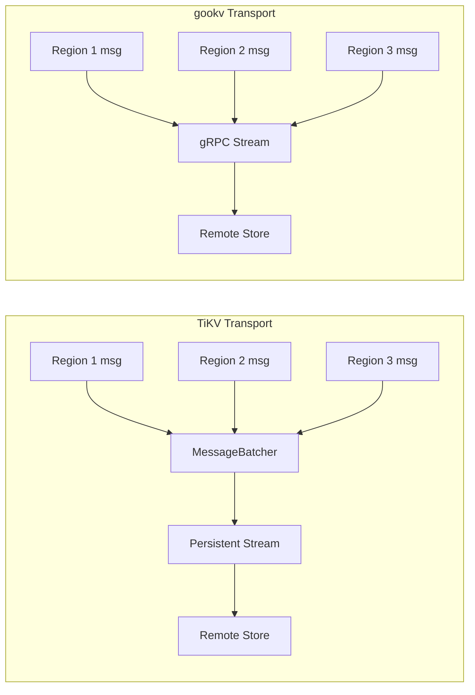

gookv does have a `MessageBatcher` that accumulates messages before sending, and maintains one gRPC stream per destination store. However, the implementation is simpler than TiKV's:
- No configurable pool size (single connection per store)
- No dedicated transport thread pool (sending happens in the peer's goroutine)
- Snapshot transfer uses a separate streaming RPC (`SendSnapshot`)

### 3.8 Flow Control

#### 3.8.1 TiKV Flow Control

TiKV has multiple levels of flow control:
- **Scheduler**: rate limits proposal submission based on Raft log size and pending proposal count
- **Apply**: backpressure from the apply thread pool
- **RocksDB write stall**: compaction-based backpressure
- **Rate limiter**: per-store rate limiting for reads and writes
- **Memory quota**: per-store memory tracking for pending proposals

#### 3.8.2 gookv Flow Control

gookv has basic flow control mechanisms in `internal/server/flow/`:

```go
// ReadPool: EWMA-based busy detection
type ReadPool struct {
    workers    int
    taskCh     chan func()
    ewmaSlice  atomic.Int64  // EWMA of task execution time
    queueDepth atomic.Int64
}

// FlowController: probabilistic request dropping
type FlowController struct {
    pendingBytes    atomic.Int64
    compactionLevel atomic.Int64
}

// MemoryQuota: lock-free scheduler memory enforcement
type MemoryQuota struct {
    used  atomic.Int64
    limit int64
}
```

Key differences:
- No Raft log size tracking
- No per-command backpressure
- No integration with Pebble compaction pressure (FlowController exists but is basic)
- No per-store rate limiter
- ReadPool exists but is not integrated into the main request path

### 3.9 PD: Embedded vs External

#### 3.9.1 TiKV PD

TiKV's PD is a separate service built on top of etcd:
- Uses etcd for consensus and state storage
- Standalone binary (`pd-server`)
- Complex operator framework for scheduling
- Dashboard integration (TiDB Dashboard)
- Hot region detection with sliding window statistics
- Placement rules for rack-awareness and zone-awareness
- Dynamic scheduler management via API

#### 3.9.2 gookv PD

gookv's PD is an embedded service (`internal/pd/`) with its own Raft implementation:

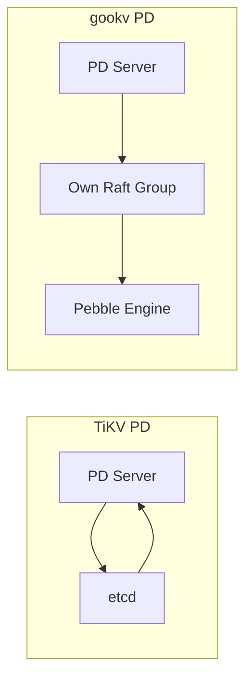

Key differences:
- gookv PD does not depend on etcd; it implements its own Raft group using etcd/raft.
- State is replicated via 12 `PDCommand` types (vs etcd's general-purpose key-value replication).
- No placement rules or rack-awareness.
- No dashboard integration.
- No dynamic scheduler management (fixed at startup).
- Follower forwarding for both unary and streaming RPCs.

The advantage of gookv's approach is self-containment: no external dependencies beyond the gookv binaries themselves.

---

## 4. Features Not Yet Implemented

### 4.1 BatchCoprocessor

**What it is**: A server-streaming RPC that dispatches a coprocessor request across multiple regions in a single call, avoiding client-side multi-region scatter-gather.

**Current state**: Only `Coprocessor` (unary, single region) and `CoprocessorStream` (server-streaming, single region) are implemented. `BatchCoprocessor` falls through to `UnimplementedTikvServer`.

**Impact**: Applications that need multi-region coprocessor queries must implement their own scatter-gather logic or use sequential single-region calls.

### 4.2 PD Raft Dynamic Membership

**What it is**: The ability to add or remove PD nodes at runtime without stopping the cluster.

**Current state**: PD cluster topology is fixed at startup via `--initial-cluster`. All PD nodes must be configured with the same initial cluster map. To change the topology, all nodes must be stopped and restarted.

**Impact**: PD scaling requires downtime. This is acceptable for the typical 3-or-5-node PD deployment but prevents online PD maintenance.

**TiKV approach**: TiKV's PD uses etcd, which supports dynamic membership changes via the etcd membership API. Nodes can be added or removed without stopping the cluster.

### 4.3 Streaming Snapshot

**What it is**: Sending region snapshots as a stream of chunks rather than loading the entire snapshot into memory.

**Current state**: gookv's snapshot transfer loads all region data into memory on the sender side, serializes it, and sends it as a single gRPC streaming message.

```go
// Current approach (simplified)
data := serializeRegionData(region)  // entire region in memory
stream.Send(data)
```

**Impact**: For large regions (GBs of data), this can cause out-of-memory errors. The snapshot size is bounded by the region split threshold (default: 96MB), but the in-memory representation may be larger.

**TiKV approach**: TiKV streams snapshots in chunks, using a bounded buffer. The sender reads from the engine iterator and sends chunks as they are generated, keeping memory usage constant regardless of region size.

### 4.4 Leader Lease for Reads

**What it is**: Allowing the Raft leader to serve reads without a round-trip to the quorum, as long as the leader's lease has not expired.

**Current state**: gookv has implemented leader lease checks (`HasLeaderLease` in `Peer`) but uses the ReadIndex protocol (`ReadOnlySafe` mode) instead. ReadIndex requires a quorum confirmation for every read, which adds latency but provides stronger consistency guarantees during leader transitions.

**Implementation**: The ReadIndex protocol works by:
1. Client sends a read request to the leader.
2. Leader records the current commit index and sends a heartbeat to the quorum.
3. Once the quorum acknowledges, the leader confirms it is still the leader.
4. Leader waits for the commit index to be applied.
5. Leader serves the read.

**TiKV approach**: TiKV uses leader lease to optimize reads. The leader maintains a lease that is renewed on every successful heartbeat. Reads within the lease period skip the quorum confirmation step.

### 4.5 Store Heartbeat Capacity Fields

**What it is**: Reporting disk capacity, available space, and used size in store heartbeats.

**Current state**: `StoreStats` fields for capacity and available space exist in the protobuf definition but are not populated by gookv KV stores.

**Impact**: PD cannot make capacity-aware scheduling decisions. Region balance is based solely on region count, not data size or available disk space.

### 4.6 Region Epoch Validation in handleScheduleMessage

**What it is**: Validating that a scheduling command (TransferLeader, ChangePeer) targets the correct region epoch before executing it.

**Current state**: gookv relies on Raft's built-in rejection for stale configuration changes. Explicit epoch validation is not performed in `handleScheduleMessage`.

**Impact**: Rare edge case where a stale scheduling command is proposed. Raft will reject it during configuration change processing, so this is safe but not optimal.

---

## 5. Features gookv Has That Are Notable

### 5.1 Pure Go (No CGo)

gookv is entirely written in Go with no CGo dependencies. This provides:

**Build simplicity**: `go build` is all that is needed. No C/C++ compiler, no linker flags, no system library dependencies.

```bash
# gookv
make build   # or: go build ./cmd/gookv-server

# TiKV
cargo build  # requires Rust toolchain, C compiler, cmake, protobuf compiler,
             # system libraries (libgcc, libdl, libpthread, librt, libsnappy, etc.)
```

**Cross-compilation**: Go's built-in cross-compilation works out of the box:

```bash
GOOS=linux GOARCH=arm64 go build ./cmd/gookv-server
```

TiKV cross-compilation requires a cross-compilation toolchain for both Rust and the C dependencies.

**Debugging**: All stack traces are Go stack traces. No mixed Go/C frames, no symbol resolution issues.

**Deployment**: A single static binary with no runtime library dependencies (beyond libc).

### 5.2 Simpler Codebase

| Metric | gookv | TiKV |
|--------|-------|------|
| Lines of Go/Rust code | ~47K | ~500K |
| Number of source files | ~120 | ~2500 |
| External dependencies | ~15 | ~200+ |
| Build time (cold) | ~30s | ~10min |

gookv's smaller codebase makes it significantly more approachable for studying distributed systems concepts. A developer can read and understand the entire system in a few days, whereas TiKV requires weeks of dedicated study.

### 5.3 Compatible TiKV gRPC API

gookv implements the same `tikvpb.Tikv` gRPC service as TiKV, defined by the `kvproto` protobuf definitions. This means:

- **Client compatibility**: Any TiKV client library (Go, Java, Rust) can connect to gookv without modification.
- **Tool compatibility**: TiKV admin tools that use the gRPC API can work with gookv.
- **Protocol compatibility**: Lock and Write binary serialization formats are identical, ensuring wire compatibility.

The key encodings are also compatible:

| Encoding | TiKV | gookv | Compatible? |
|----------|------|-------|-------------|
| Memcomparable bytes | `codec::bytes` | `pkg/codec.EncodeBytes` | Yes |
| Descending uint64 | `codec::number` | `pkg/codec.EncodeUint64Desc` | Yes |
| Lock serialization | Tag-based binary | Tag-based binary | Yes |
| Write serialization | Tag-based binary | Tag-based binary | Yes |
| MVCC key encoding | `Key::encode` | `mvcc.EncodeKey` | Yes |

### 5.4 Embedded PD

gookv ships its own PD server (`cmd/gookv-pd`) that requires no external dependencies (no etcd, no separate PD binary from the TiKV project). The PD server supports both single-node mode (for development) and Raft-replicated mode (for production).

This makes gookv fully self-contained: `gookv-server` + `gookv-pd` is all you need for a complete distributed transactional KV store.

### 5.5 Transaction Integrity Under Splits

gookv has been extensively tested for transaction integrity under concurrent region splits:
- 32-worker concurrent bank transfer stress test
- 1000 accounts with balance conservation verification
- Region splits occurring during active 2PC transactions
- Multiple bug fixes documented in `design_doc/cross_region_2pc_integrity/`

Key mechanisms that ensure correctness:
1. Split as Raft admin command (strict ordering with data entries)
2. Per-key secondary commits with automatic re-routing
3. `isPrimaryCommitted` check after commit errors
4. LatchGuard pattern for propose-time consistency
5. Propose-time epoch validation

### 5.6 Performance Optimizations Adopted from TiKV

gookv has adopted several key performance patterns from TiKV, adapted to Go idioms:

| Optimization | gookv Implementation | TiKV Equivalent |
|-------------|---------------------|-----------------|
| **NoSync apply path** | `WriteBatch.CommitNoSync()` for apply writes; Raft log guarantees durability via replay on crash | Same concept: apply writes skip fsync since the Raft log is the durability guarantee |
| **RaftLogWriter I/O coalescing** | `RaftLogWriter` batches `WriteTask` submissions from multiple peer goroutines into a single `WriteBatch.Commit()` with one fsync | TiKV's `WriteRouter` / `StoreWriteRouter` coalesces Raft log writes across regions |
| **ApplyWorkerPool (async apply)** | Shared goroutine pool (default 4 workers) processes `ApplyTask` entries asynchronously, decoupling apply from the Raft tick loop | TiKV's `ApplyFsm` / `ApplyBatchSystem` runs apply in a separate thread pool |
| **Batch commitSecondaries by region** | `GroupKeysByRegion` groups secondary keys, then sends one `KvCommit` RPC per region group (with per-key fallback) | TiKV's client batches commit requests by region for efficiency |

These optimizations represent the most impactful performance patterns from TiKV that can be cleanly expressed in Go without adding excessive complexity.

### 5.7 Modern gRPC API (grpc.NewClient)

gookv has adopted the modern `grpc.NewClient` API (gRPC v1.79.3) across core packages including `internal/pd/forward.go`, `internal/pd/transport.go`, `internal/server/transport/transport.go`, and `pkg/client/request_sender.go`. The deprecated `grpc.Dial` / `grpc.DialContext` has been replaced in these locations. The PD client (`pkg/pdclient/client.go`) still uses `grpc.DialContext` pending migration to a non-blocking connection pattern.

---

## 6. Detailed Comparison: Apply Path

This section traces the apply path in both systems to illustrate the architectural difference.

### 6.1 TiKV Apply Path

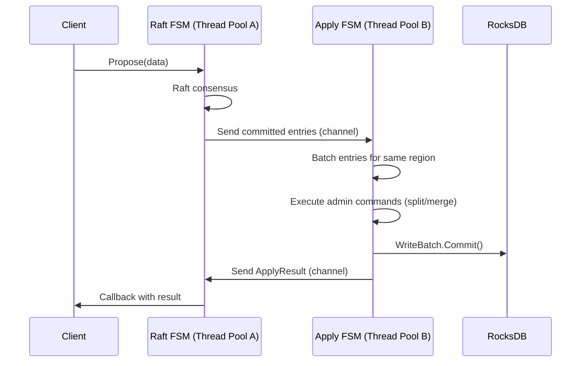

Key characteristics:
- Two separate thread pools (Raft and Apply)
- Asynchronous communication via channels
- Batching of entries for efficiency
- Apply thread pool has its own flow control

### 6.2 gookv Apply Path

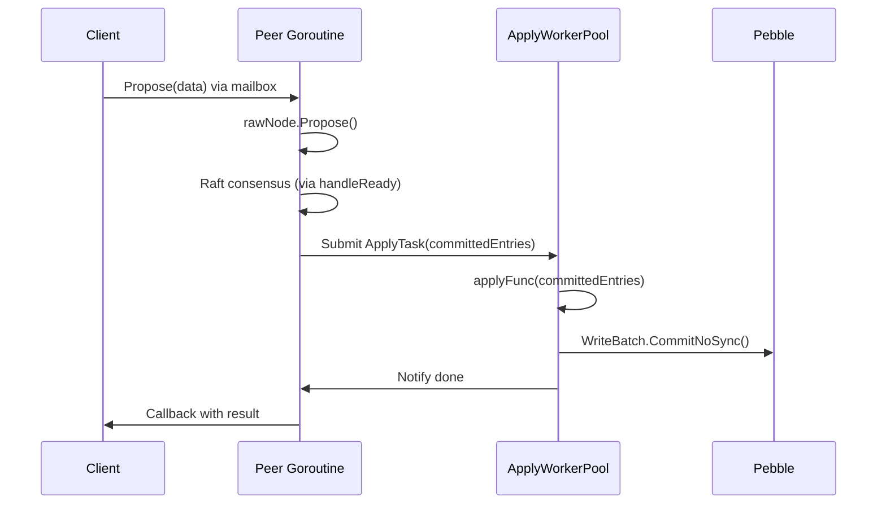

Key characteristics:
- Peer goroutine handles Raft; apply is offloaded to a shared worker pool
- Asynchronous: apply does not block the Raft tick loop
- Shared pool (default 4 workers) allows concurrent apply across regions
- Uses `CommitNoSync()` for apply writes (Raft log guarantees durability via replay)

---

## 7. Detailed Comparison: Scheduler

### 7.1 TiKV Scheduler Architecture

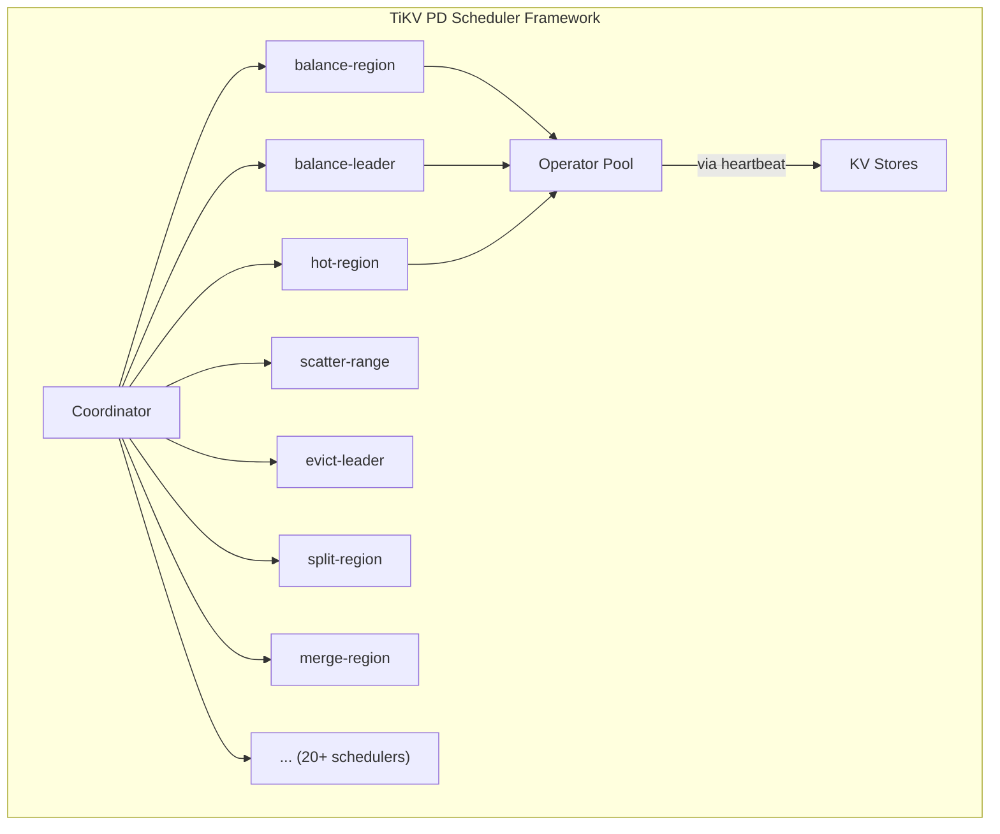

TiKV's scheduler framework features:
- Pluggable scheduler interface
- Operator abstraction (multi-step operations)
- Priority queue for operators
- Rate limiting per operator type
- Hot region detection with EWMA-based traffic analysis
- Placement rules for topology awareness
- Diagnostic API for inspecting scheduler state
- Runtime enable/disable via PD API

### 7.2 gookv Scheduler Architecture

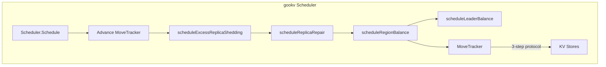

gookv's scheduler features:
- Single `Schedule` function with priority cascade
- 5 strategies in fixed priority order
- `MoveTracker` for multi-step region moves
- Region count-based balance (no traffic analysis)
- Fixed configuration (no runtime changes)
- Rate limiting via `regionBalanceRateLimit`

---

## 8. Detailed Comparison: Transaction Path

### 8.1 Shared Design

Both TiKV and gookv implement the Percolator 2PC protocol with the same fundamental structure:

1. **Prewrite**: Write locks to `CF_LOCK` and values to `CF_DEFAULT`
2. **Commit**: Write commit records to `CF_WRITE` and remove locks from `CF_LOCK`
3. **Lock resolution**: Check primary key status, commit or rollback secondaries

### 8.2 Key Differences

| Aspect | TiKV | gookv |
|--------|------|-------|
| **Lock conflict resolution** | Waits in a queue with timeout | Returns error immediately (retry at client) |
| **Deadlock detection** | Deadlock detector service | No centralized detector; relies on lock TTL expiry |
| **Green GC** | Yes (resolve-lock during read) | Yes (LockResolver in client) |
| **Async commit recovery** | Background resolve after crash | Same pattern |
| **1PC** | Optimized single-region path | Same optimization |
| **Pipelined pessimistic lock** | Yes | No |
| **In-memory pessimistic lock** | Yes (avoids write to engine) | No (writes to CF_LOCK) |
| **Lock TTL auto-renewal** | TxnHeartBeat RPC | TxnHeartBeat RPC supported |

### 8.3 Client Library Comparison

| Feature | TiKV client-go | gookv pkg/client |
|---------|---------------|-----------------|
| **Region cache** | B-tree based, sorted | Sorted slice with binary search |
| **Connection pool** | Per-store with max connections | Single connection per store |
| **Lock resolver** | Channel-based dedup | Channel-based dedup (same design) |
| **Batch scheduling** | Background batching of TSO requests | Not implemented |
| **Backoff** | Exponential with jitter | Fixed 100ms |

---

## 9. Code Size Comparison by Component

This table compares the implementation size of equivalent components:

| Component | TiKV (Rust, approx lines) | gookv (Go, approx lines) | Ratio |
|-----------|--------------------------|--------------------------|-------|
| Storage engine interface | 5,000 | 300 | 17x |
| MVCC layer | 15,000 | 1,500 | 10x |
| Transaction actions | 10,000 | 1,200 | 8x |
| Raft store (peer + storage) | 30,000 | 2,000 | 15x |
| Server (gRPC handlers) | 20,000 | 2,500 | 8x |
| Coprocessor | 40,000 | 800 | 50x |
| PD server | 50,000 | 3,000 | 17x |
| Client library | 15,000 | 1,500 | 10x |
| **Total (approx)** | **~500,000** | **~47,000** | **~11x** |

The ~11x size difference reflects both the feature gap (TiKV has more features) and the verbosity difference (Rust requires more explicit code for ownership, error handling, and type annotations, while Go is more concise).

---

## 10. When to Use gookv vs TiKV

### 10.1 Use gookv When

- **Learning**: You want to understand distributed transaction databases by reading the source code
- **Prototyping**: You need a distributed KV store for development/testing
- **Go ecosystem**: Your infrastructure is Go-based and you want native integration
- **Simplicity**: You prefer a simpler system you can fully understand and modify
- **Small scale**: Your deployment has fewer than ~100 regions and modest throughput

### 10.2 Use TiKV When

- **Production**: You need battle-tested reliability at scale
- **Performance**: You need microsecond-level latencies
- **Scale**: You have terabytes of data and thousands of regions
- **Features**: You need CDC, backup/restore, encryption, TLS
- **SQL**: You plan to use TiDB as the SQL layer
- **Ecosystem**: You need the TiKV ecosystem (TiFlash, TiCDC, BR, etc.)

---

## 11. Migration Path

Because gookv implements the same gRPC API as TiKV, applications built on gookv can be migrated to TiKV by:

1. Deploying a TiKV cluster with PD
2. Pointing the client library at the TiKV PD endpoints instead of gookv PD
3. Migrating data (manual ETL or using compatible backup formats)

The reverse migration (TiKV to gookv) is also possible for supported features, since the wire format is compatible.

---

## 12. Summary of Design Choices

| Choice | gookv Approach | TiKV Approach | Why gookv Chose Differently |
|--------|---------------|---------------|----------------------------|
| Language | Go | Rust | Development speed, ecosystem, educational clarity |
| Engine | Pebble | RocksDB | Pure Go, no CGo, simpler builds |
| CF emulation | Key prefix | Native CFs | Single engine instance, simpler configuration |
| Peer model | 1 goroutine/peer | Batch system | Idiomatic Go, simpler concurrency |
| Apply | ApplyWorkerPool (async) | Dedicated thread pool | Simpler pool, same async benefit |
| Scheduler | Single function | Pluggable framework | Sufficient for small-scale deployments |
| Coprocessor | Basic | Full SQL pushdown | Focus on KV API, not SQL |
| PD | Own Raft group | etcd-based | Self-contained, no external deps |
| Transport | Per-store gRPC | Connection pool + batching | Simpler, sufficient for moderate scale |
| Flow control | Basic | Multi-level | Complexity not justified at target scale |
| Snapshots | In-memory | Streaming | Simpler implementation |
| Deadlock | TTL-based | Detector service | Simpler, acceptable for moderate concurrency |

Each of these choices reflects the same principle: gookv optimizes for simplicity and understandability, trading some performance and features that are only needed at TiKV's scale (hundreds of terabytes, thousands of nodes).

---

## 13. Detailed Comparison: Region Split

### 13.1 TiKV Split Flow

In TiKV, region splits involve multiple components:

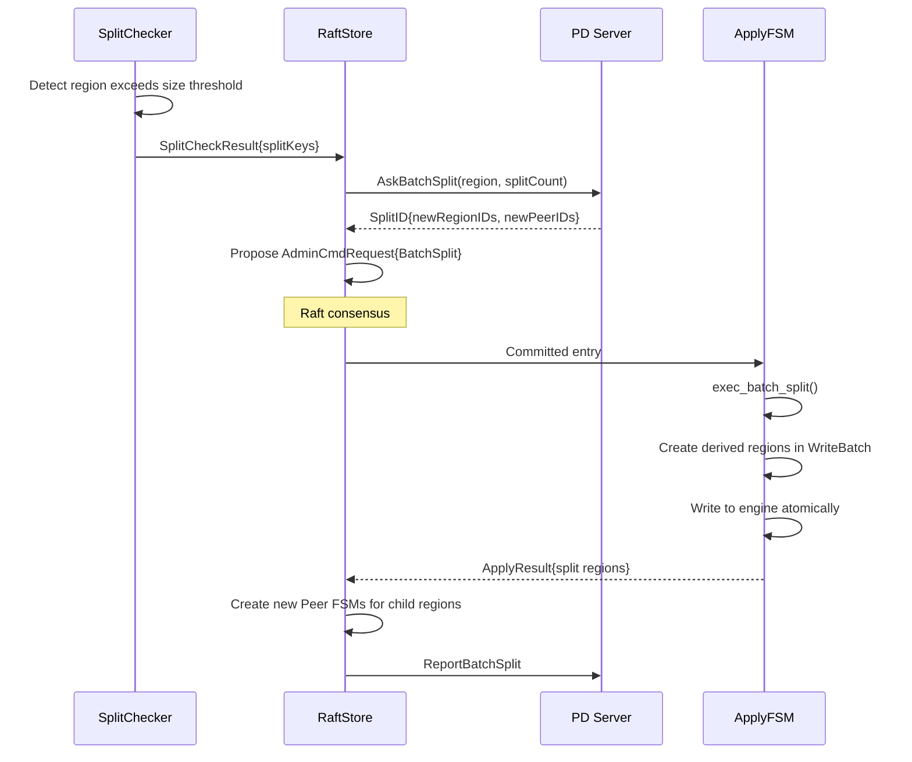

Key aspects of TiKV's split:
- Split is proposed as an `AdminCmdRequest` protobuf message.
- The Apply FSM handles the split in a separate thread from the Raft FSM.
- The split creates a "derived" region that shares the original engine.
- New Peer FSMs are created and registered with the batch system.
- Split checker runs in a background thread pool.
- Split supports multiple split points in a single operation.

### 13.2 gookv Split Flow

gookv's split uses a custom binary format instead of protobuf:

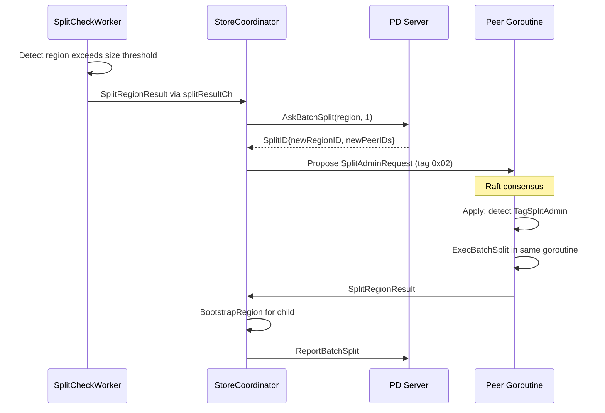

Key differences:
- **Binary format**: gookv uses a compact binary format (`TagSplitAdmin = 0x02` prefix) rather than protobuf for split commands. This is simpler and avoids protobuf serialization overhead.
- **Same goroutine apply**: The split is applied in the Peer's own goroutine, not in a separate Apply FSM thread.
- **Sequential processing**: gookv processes one split at a time per region. TiKV supports batch splits (splitting a region at multiple points simultaneously).
- **Child peer creation**: The `StoreCoordinator` creates child peers via `BootstrapRegion`, which starts a new goroutine for each child. In TiKV, new peers are registered with the batch system.

### 13.3 Split Key Selection

Both systems use a split checker that scans the region's data to find a good split point:

| Aspect | TiKV | gookv |
|--------|------|-------|
| Size-based split | Yes (default 96MB) | Yes (configurable via SplitSize) |
| Key-based split | Yes (200K keys default) | Yes (configurable via SplitKeys) |
| Half-split | Yes (split at midpoint) | Yes (same algorithm) |
| Table-aware split | Yes (via coprocessor) | No |
| Scan implementation | Iterator with size tracking | Same pattern in `SplitCheckWorker` |

### 13.4 Epoch Management During Split

Both systems use a region epoch to track splits and configuration changes:

```go
type RegionEpoch struct {
    ConfVer uint64  // incremented on peer add/remove
    Version uint64  // incremented on split/merge
}
```

When a split occurs:
- The parent region's `Version` is incremented.
- The child region gets a new `Version` (typically `parentVersion + 1`).
- Both regions get updated peers.

All subsequent RPCs to the region include the expected epoch. If the epoch does not match (because a split occurred), the server returns `EpochNotMatch`, causing the client to invalidate its cache and re-route.

---

## 14. Detailed Comparison: MVCC Layer

### 14.1 Shared Three-CF Scheme

Both TiKV and gookv use the same three-column-family MVCC scheme:

```mermaid
graph TB
    subgraph "CF_LOCK"
        L1["key=account:A<br/>value={startTS=100, primary=account:A, ttl=3000}"]
    end

    subgraph "CF_DEFAULT"
        D1["key=account:A_100<br/>value=$500 (large values)"]
    end

    subgraph "CF_WRITE"
        W1["key=account:A_~100<br/>value={type=Put, startTS=100, shortValue=$500}"]
        W2["key=account:A_~95<br/>value={type=Put, startTS=95, shortValue=$400}"]
    end

    Note over L1: Active locks (no timestamp in key)
    Note over D1: Values keyed by startTS (descending)
    Note over W1,W2: Commit records keyed by commitTS (descending)
```

The `~` in `CF_WRITE` keys denotes descending encoding: `EncodeUint64Desc(commitTS)` produces bytes where larger timestamps sort first. This allows efficient "find most recent version" scans by iterating from the key and taking the first entry.

### 14.2 Short Value Optimization

Both systems inline small values (< 255 bytes) directly in the `CF_WRITE` record as `ShortValue`. This avoids a second read from `CF_DEFAULT` for the common case of small values.

```
If value.len() < 255:
    CF_WRITE[key, commitTS] = {type=Put, startTS, shortValue=value}
Else:
    CF_WRITE[key, commitTS] = {type=Put, startTS}
    CF_DEFAULT[key, startTS] = value
```

### 14.3 Lock Serialization

Both systems use the same tag-based binary format for locks:

```
Tag  | Meaning
0x01 | Primary key
0x02 | StartTS
0x03 | LockTTL
0x04 | ShortValue
0x05 | MinCommitTS
0x08 | LockType
0x09 | UseAsyncCommit
0x0A | Secondaries
```

This wire compatibility means a gookv lock can be correctly parsed by TiKV code and vice versa.

### 14.4 Key Differences in MVCC

| Aspect | TiKV | gookv |
|--------|------|-------|
| Point getter | Optimized `PointGetter` struct | Same design (`PointGetter` in `internal/storage/mvcc/`) |
| Scanner | Bidirectional, vectorized | Forward/reverse, non-vectorized |
| Lock bypass | `IsolationLevel::Si` checks locks; `Rc` skips | Same: `SI` vs `RC` isolation level |
| Write conflict detection | Returns `WriteConflict` with detailed info | Same error type |
| GC | Centralized coordinator with distributed workers | Per-store 3-state GCWorker |

---

## 15. Detailed Comparison: Raft Implementation

### 15.1 Raft Libraries

| Aspect | TiKV | gookv |
|--------|------|-------|
| Library | `raft-rs` (Rust port of etcd/raft) | `go.etcd.io/etcd/raft/v3` (Go original) |
| API | `RawNode` | `RawNode` (same API design) |
| Storage interface | `Storage` trait | `Storage` interface |
| Message types | `raftpb` (kvproto version) | `raftpb` (etcd version) |
| Config change | `ConfChangeV2` (joint consensus) | `ConfChange` (simple) |

Both libraries implement the same Raft algorithm. The key difference is the message format:
- TiKV uses `eraftpb.Message` from kvproto (protobuf).
- gookv uses `raftpb.Message` from etcd (protobuf).

gookv includes conversion functions (`raftstore.RaftpbToEraftpb` and `raftstore.EraftpbToRaftpb`) to bridge between the two formats for inter-node communication.

### 15.2 PeerStorage

Both systems implement the `Storage` interface for their Raft library:

| Aspect | TiKV `PeerStorage` | gookv `PeerStorage` |
|--------|--------------------|--------------------|
| Engine | RocksDB (shared with data) | Pebble (shared with data) |
| Entry cache | In-memory vector | In-memory slice |
| Hard state persistence | Per-region CF_RAFT key | Per-region CF_RAFT key |
| Snapshot generation | Streaming via engine snapshot | In-memory serialization |
| Apply state | Per-region CF_RAFT key | Per-region CF_RAFT key |

### 15.3 Raft Log Key Format

Both systems store Raft log entries in `CF_RAFT` with keys that encode the region ID and entry index:

```
Key = RaftLogKey(regionID, index)
    = LocalPrefix + regionID_bytes + "raftlog" + index_bytes
```

gookv uses the same key construction functions in `pkg/keys/`:

```go
func RaftLogKey(regionID uint64, index uint64) []byte
func RaftStateKey(regionID uint64) []byte
func ApplyStateKey(regionID uint64) []byte
```

---

## 16. Detailed Comparison: gRPC Service

### 16.1 Shared Service Definition

Both systems implement the `tikvpb.Tikv` gRPC service from kvproto:

| RPC | TiKV | gookv | Notes |
|-----|------|-------|-------|
| `KvGet` | Yes | Yes | |
| `KvScan` | Yes | Yes | |
| `KvPrewrite` | Yes | Yes | Includes async commit and 1PC paths |
| `KvCommit` | Yes | Yes | |
| `KvBatchGet` | Yes | Yes | |
| `KvBatchRollback` | Yes | Yes | |
| `KvCleanup` | Yes | Yes | |
| `KvCheckTxnStatus` | Yes | Yes | Including cleanup variant |
| `KvCheckSecondaryLocks` | Yes | Yes | |
| `KvScanLock` | Yes | Yes | |
| `KvPessimisticLock` | Yes | Yes | |
| `KvResolveLock` | Yes | Yes | |
| `KvTxnHeartBeat` | Yes | Yes | |
| `RawGet` | Yes | Yes | |
| `RawPut` | Yes | Yes | |
| `RawDelete` | Yes | Yes | |
| `RawScan` | Yes | Yes | |
| `RawBatchGet` | Yes | Yes | |
| `RawBatchPut` | Yes | Yes | |
| `RawBatchDelete` | Yes | Yes | |
| `RawBatchScan` | Yes | Yes | |
| `RawGetKeyTTL` | Yes | Yes | |
| `RawCompareAndSwap` | Yes | Yes | |
| `RawChecksum` | Yes | Yes | |
| `KvDeleteRange` | Yes | Yes | |
| `Raft` | Yes | Yes | Inter-node Raft messages |
| `BatchRaft` | Yes | Yes | Batched Raft messages |
| `Snapshot` | Yes | Yes | Streaming snapshot transfer |
| `BatchCommands` | Yes | Yes | Multiplexed streaming |
| `Coprocessor` | Yes | Yes | Unary |
| `CoprocessorStream` | Yes | Yes | Server-streaming |
| `BatchCoprocessor` | Yes | No (stub) | Multi-region coprocessor |
| `KvGC` | Yes | Yes | With PD safe point update |

### 16.2 Request Context

Every KV RPC includes a `kvrpcpb.Context` that identifies the target region:

```protobuf
message Context {
    uint64 region_id = 1;
    RegionEpoch region_epoch = 2;
    Peer peer = 3;
    // ...
}
```

Both systems validate this context on the server side via `validateRegionContext`:
1. Check `region_id` matches a local region.
2. Check `region_epoch` matches the current epoch.
3. Check that the request key falls within the region's key range.

If validation fails, the server returns a `region_error` in the response, triggering client-side retry with cache invalidation.

---

## 17. Detailed Comparison: Configuration

### 17.1 TiKV Configuration

TiKV uses a TOML configuration file with hundreds of parameters, organized into sections:

```toml
[server]
addr = "127.0.0.1:20160"
grpc-concurrency = 4

[storage]
data-dir = "/data/tikv"

[raftstore]
region-max-size = "144MB"
region-split-size = "96MB"
raft-base-tick-interval = "1s"

[rocksdb]
max-background-jobs = 8
rate-bytes-per-sec = "10MB"

[coprocessor]
region-max-keys = 1440000
region-split-keys = 960000

[pessimistic-txn]
pipelined = true
in-memory = true
```

### 17.2 gookv Configuration

gookv uses a similar TOML structure but with far fewer parameters:

```toml
[server]
addr = "0.0.0.0:20160"
status-addr = "0.0.0.0:20180"

[storage]
data-dir = "/data/gookv"

[raftstore]
raft-base-tick-interval = "100ms"
raft-election-timeout-ticks = 10
raft-heartbeat-ticks = 2
split-check-tick-interval = "10s"

[coprocessor]
split-size = "96MB"
max-size = "144MB"
split-keys = 960000
max-keys = 1440000

[pd]
endpoints = ["127.0.0.1:2379"]
```

The `Config` struct (`internal/config/config.go`) supports:
- `LoadFromFile(path)` for TOML parsing
- `Validate()` for configuration validation
- `SaveToFile(path)` for persisting configuration
- `Clone()` and `Diff(other)` for runtime comparison
- Custom types: `Duration` (TOML-friendly duration) and `ReadableSize` (human-readable byte sizes)

---

## 18. Detailed Comparison: Logging

### 18.1 TiKV Logging

TiKV uses `slog` (Rust's structured logging) with:
- Multiple output targets (file, stderr)
- Per-component log levels
- Slow log for operations exceeding a threshold
- RocksDB-specific log integration
- Metrics emission alongside logs

### 18.2 gookv Logging

gookv uses Go's `log/slog` with a custom `LogDispatcher`:

```go
type LogDispatcher struct {
    normal    slog.Handler  // normal log output
    slow      *SlowLogHandler  // operations exceeding threshold
    rocksdb   slog.Handler  // storage engine logs
    raft      slog.Handler  // Raft-specific logs
}
```

Features:
- `SlowLogHandler`: filters log records, only emitting those that exceed a configurable time threshold.
- `LevelFilter`: supports runtime log level changes.
- `RotatingFileWriter`: wraps `lumberjack` for automatic log rotation.

The logging architecture is simpler than TiKV's but covers the essential use cases.

---

## 19. Detailed Comparison: Testing

### 19.1 TiKV Testing

TiKV has extensive testing infrastructure:
- Unit tests in each module
- Integration tests using a mock cluster
- Failpoint injection for error simulation
- Chaos testing via TiDB test infrastructure
- Performance benchmarks
- Fuzzing for parsers and codecs

### 19.2 gookv Testing

gookv's test strategy:

| Test Type | Location | Count | Purpose |
|-----------|----------|-------|---------|
| Unit tests | `*_test.go` in each package | ~80+ | Individual component testing |
| E2E tests | `e2e/*_test.go` | ~20+ | Full cluster integration |
| Codec fuzz tests | `pkg/codec/fuzz_test.go` | 6 targets | Codec correctness |
| Engine conformance | `internal/engine/traits/conformance_test.go` | 17 cases | Storage engine interface |
| Transaction integrity | `scripts/txn-integrity-demo-verify/` | 1 scenario | 2PC under concurrent splits |

Notable E2E tests:
- `client_lib_test.go`: client library with multi-region routing
- `pd_replication_test.go`: 16 PD Raft replication tests
- `add_node_test.go`: dynamic node addition
- `async_commit_test.go`: async commit protocol
- `region_split_merge_test.go`: split and merge operations
- `txn_rpc_test.go`: transactional RPC correctness

---

## 20. Performance Characteristics

### 20.1 Expected Performance Differences

Since gookv has not been benchmarked against TiKV in a controlled environment, these are theoretical expectations based on architectural differences:

| Aspect | Expected gookv Performance | Reason |
|--------|---------------------------|--------|
| Single-key read latency | ~2-5x slower | GC pauses, no leader lease, ReadIndex overhead |
| Single-key write latency | ~1.5-3x slower | Similar Raft path, but Go vs Rust overhead |
| Throughput (ops/sec) | ~5-10x lower | No batch system, no apply thread pool |
| Memory efficiency | ~2-3x more memory | Go GC overhead, no arena allocators |
| Large scan | ~2-4x slower | Non-vectorized scanner, GC pressure |
| Connection overhead | Similar | Both use gRPC with connection pooling |
| Startup time | Faster | Go builds are faster, no JIT warmup |

### 20.2 Where gookv Can Match TiKV

- **Low-concurrency reads**: With few concurrent readers, the overhead of Go vs Rust is small.
- **Small datasets**: When data fits in Pebble's block cache, the storage engine difference is minimal.
- **Network-bound workloads**: When the bottleneck is network latency (e.g., cross-datacenter), the language overhead is negligible.
- **Development/CI cycles**: gookv builds and tests much faster than TiKV.

### 20.3 Where TiKV Significantly Outperforms

- **High concurrency**: TiKV's batch system and thread pool scale much better with hundreds of concurrent requests.
- **Large datasets**: RocksDB's tuned compaction and TiKV's multi-level flow control handle large data volumes better.
- **Mixed workloads**: TiKV's per-component resource isolation prevents interference between reads, writes, and compaction.
- **Tail latency**: TiKV's lack of GC pauses provides more predictable P99 latency.

---

## 21. Compatibility Matrix

### 21.1 Wire Protocol Compatibility

| Component | Compatible? | Details |
|-----------|------------|---------|
| `tikvpb.Tikv` gRPC service | Yes | Same protobuf definitions |
| `pdpb.PD` gRPC service | Yes | Same protobuf definitions |
| MVCC key encoding | Yes | Same `codec.EncodeBytes` + `EncodeUint64Desc` |
| Lock binary format | Yes | Same tag-based encoding |
| Write record format | Yes | Same tag-based encoding |
| Raft message format | Converted | `raftpb` <-> `eraftpb` conversion |
| Region metadata | Yes | Same `metapb.Region` protobuf |
| Store metadata | Yes | Same `metapb.Store` protobuf |

### 21.2 Client Compatibility

| Client | Works with gookv? | Notes |
|--------|-------------------|-------|
| gookv `pkg/client` | Yes | Native client |
| TiKV client-go | Likely | Same gRPC API; untested |
| TiKV client-java | Likely | Same gRPC API; untested |
| TiKV client-rust | Likely | Same gRPC API; untested |
| TiDB | Partial | KV operations work; SQL pushdown limited |

### 21.3 Tool Compatibility

| Tool | Works with gookv? | Notes |
|------|-------------------|-------|
| `tikv-ctl` | Partial | Basic operations; some features unsupported |
| `pd-ctl` | No | Different PD implementation |
| `gookv-ctl` | Yes | Native admin CLI |
| `grpcurl` | Yes | Direct gRPC inspection |

---

## 22. Future Directions

### 22.1 Potential Improvements

Based on the differences identified in this document, the following improvements could bring gookv closer to TiKV's capabilities:

1. **Streaming snapshots**: Replace in-memory snapshot generation with chunk-based streaming to support larger regions.
2. **Leader lease**: Enable the existing lease implementation to skip ReadIndex for reads, reducing read latency.
3. **PD dynamic membership**: Implement Raft configuration changes in the PD cluster.
4. **Hot region detection**: Add traffic statistics to store heartbeats for smarter scheduling.
5. **TLS support**: Add TLS to gRPC connections for encrypted communication.
6. **Batch apply**: Allow multiple regions to batch their applies into a single engine WriteBatch.

### 22.2 Intentional Non-Goals

Some TiKV features are intentionally excluded from gookv's scope:

- **TiFlash**: Columnar storage for analytics workloads is a separate system.
- **CDC**: Change data capture requires a dedicated infrastructure.
- **Backup/Restore**: Production-grade backup needs careful design for consistency.
- **Encryption at rest**: Adds complexity to the storage layer.
- **SQL pushdown**: Full SQL execution requires a SQL parser and optimizer (TiDB's domain).

These features add significant complexity without contributing to gookv's goal of being an understandable, educational distributed transactional KV store.

---

## 23. Detailed Comparison: GC (Garbage Collection of MVCC Versions)

### 23.1 TiKV GC

TiKV's GC is a centralized, multi-phase process coordinated by TiDB (or a GC worker):

1. **Resolve locks**: Scan all regions for locks older than the safe point and resolve them.
2. **Delete ranges**: For dropped tables/indexes, issue `DeleteRange` operations.
3. **GC**: Iterate all MVCC versions and delete those below the safe point.

The GC coordinator runs in TiDB and dispatches GC tasks to individual TiKV stores. Each store processes GC tasks in a dedicated thread pool. The global GC safe point is managed by PD.

### 23.2 gookv GC

gookv uses a per-store `GCWorker` with a 3-state machine:

```go
type GCWorker struct {
    engine        traits.KvEngine
    safePointProv SafePointProvider
    state         GCState
}

type GCState int
const (
    GCStateRewind       GCState = iota  // Reset iterator to beginning
    GCStateRemoveIdempotent             // Remove versions below safe point (idempotent phase)
    GCStateRemoveAll                    // Remove all remaining old versions
)
```

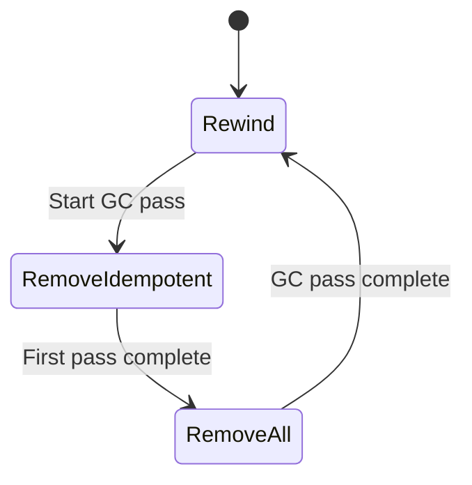

Key differences:
- **No centralized coordinator**: Each store runs its own GCWorker independently.
- **Safe point from PD**: After local GC completes, the store updates PD's global safe point via `UpdateGCSafePoint`.
- **3-state machine**: The worker alternates between scanning for idempotent deletes (safe to retry) and full deletes.
- **No resolve-locks phase**: Lock resolution is handled by the client-side `LockResolver` during reads, not as a separate GC phase.
- **No delete-ranges optimization**: gookv does not have a separate delete-range GC phase for dropped tables.

### 23.3 SafePointProvider Interface

```go
type SafePointProvider interface {
    GetSafePoint() (uint64, error)
}
```

In standalone mode, a local provider returns a hardcoded safe point. In cluster mode, `PDSafePointProvider` queries PD for the global safe point.

---

## 24. Detailed Comparison: Latch Implementation

### 24.1 Purpose

Both systems use latches to serialize concurrent access to the same keys. Without latches, two transactions modifying the same key could both read the MVCC state before the other's write, leading to inconsistent results.

### 24.2 TiKV Latches

TiKV uses a hash-based latch system with 2048 slots:
- Keys are hashed to slot indices.
- Commands acquire slots in sorted order (preventing deadlocks).
- Latch supports both read and write modes.
- Latch acquisition is non-blocking with a wait queue.

### 24.3 gookv Latches

gookv's latch implementation (`internal/storage/txn/latch/`) follows the same design:

```go
type Latches struct {
    slots []*Slot
}

type Slot struct {
    mu      sync.Mutex
    waiters []*LockWaiter
}
```

Key characteristics:
- 2048 hash slots (same as TiKV).
- FNV-1a hashing for key-to-slot mapping.
- Commands acquire slots in sorted index order (deadlock-free).
- `GenLock(keys) -> Lock`: generates a sorted list of slot indices.
- `Acquire(lock) -> acquired bool`: attempts to acquire all slots.
- `Release(lock)`: releases all slots and wakes waiters.

The implementation is simpler than TiKV's (no read/write mode distinction), but the core algorithm is identical.

### 24.4 LatchGuard Pattern

gookv extends the basic latch with a `LatchGuard` pattern that holds the latch across the Raft proposal:

```
1. Acquire latch for keys
2. Read MVCC state from snapshot
3. Compute modifications
4. Propose modifications to Raft (latch still held)
5. Wait for Raft to commit and apply
6. Release latch
```

This prevents a race condition where another transaction reads stale MVCC state between steps 3 and 5. TiKV handles this differently through its Apply FSM which provides serial execution guarantees.

---

## 25. Detailed Comparison: Concurrency Manager

### 25.1 Purpose

The concurrency manager tracks in-memory lock state and the global `max_ts` for async commit correctness. Both TiKV and gookv implement this component.

### 25.2 TiKV ConcurrencyManager

TiKV's concurrency manager uses a lock-free `DashMap` for high-throughput concurrent access. It tracks:
- Active locks (key -> lock info)
- `max_ts` (the maximum start_ts seen, used for async commit)
- Lock table for wait-for-graph deadlock detection

### 25.3 gookv ConcurrencyManager

gookv's concurrency manager (`internal/storage/txn/concurrency/`) uses `sync.Map`:

```go
type Manager struct {
    lockTable sync.Map       // key -> *LockEntry
    maxTS     atomic.Uint64  // maximum start_ts seen
}

type LockEntry struct {
    StartTS uint64
    Primary []byte
    LockType txntypes.LockType
}
```

Methods:
- `LockKey(key, startTS, primary, lockType)`: registers a lock.
- `UnlockKey(key)`: removes a lock.
- `IsKeyLocked(key, startTS) -> *LockEntry`: checks if a key is locked by another transaction.
- `UpdateMaxTS(ts)`: atomically updates `max_ts` if the new value is larger.
- `GlobalMinLock() -> *LockEntry`: returns the lock with the smallest `startTS` (used for async commit).

The `maxTS` field is critical for async commit correctness: when a prewrite arrives with async commit enabled, the server records `max_ts` at prewrite time. If `max_ts` advances beyond the transaction's `commitTS` before the primary is committed, the async commit falls back to normal 2PC.

---

## 26. Detailed Comparison: Error Types

### 26.1 Region Errors (Shared)

Both systems use the same protobuf error types defined in kvproto:

| Error Type | Protobuf Field | Meaning |
|-----------|---------------|---------|
| `NotLeader` | `not_leader` | Request sent to non-leader |
| `RegionNotFound` | `region_not_found` | Region does not exist |
| `KeyNotInRegion` | `key_not_in_region` | Key outside region's range |
| `EpochNotMatch` | `epoch_not_match` | Stale region metadata |
| `StoreNotMatch` | `store_not_match` | Store address changed |
| `ServerIsBusy` | `server_is_busy` | Server overloaded |
| `StaleCommand` | `stale_command` | Command from old term |
| `RaftEntryTooLarge` | `raft_entry_too_large` | Proposal exceeds size limit |

### 26.2 Key Errors (Shared)

| Error Type | Protobuf Field | Meaning |
|-----------|---------------|---------|
| `Locked` | `locked` | Key is locked by another transaction |
| `WriteConflict` | `conflict` | Write-write conflict detected |
| `AlreadyExist` | `already_exist` | Key already exists (for insert) |
| `Deadlock` | `deadlock` | Deadlock detected |
| `CommitTsExpired` | `commit_ts_expired` | Commit TS below min commit TS |
| `TxnLockNotFound` | `txn_lock_not_found` | Expected lock not present |
| `TxnNotFound` | `txn_not_found` | Transaction record not found |

### 26.3 gookv-Specific Error Handling

gookv adds a structured `LockError` type in the MVCC package that wraps lock information for propagation through the gRPC response:

```go
type LockError struct {
    Key       []byte
    Lock      *txntypes.Lock
    LockInfo  *kvrpcpb.LockInfo
}
```

This allows read handlers (`KvGet`, `KvBatchGet`) to return full lock information when a key is locked, enabling the client's `LockResolver` to check the locking transaction's status and resolve the lock.

---

## 27. Operational Differences

### 27.1 Deployment

| Aspect | TiKV | gookv |
|--------|------|-------|
| Minimum nodes | 3 TiKV + 3 PD | 1 gookv-server + 1 gookv-pd |
| Binary count | 2 (tikv-server, pd-server) | 3 (gookv-server, gookv-pd, gookv-ctl) |
| Configuration | Hundreds of parameters | ~30 parameters |
| Monitoring | Prometheus + Grafana dashboards | Basic `/metrics` endpoint |
| Rolling upgrade | Supported | Manual (stop, upgrade, start) |
| Online scaling | Automatic via PD | Supported (join mode) |

### 27.2 Data Directory Layout

**TiKV**:
```
data-dir/
  db/           # RocksDB data
  raft/         # Raft CF data
  snap/         # Snapshot files
  import/       # Ingest files
```

**gookv**:
```
data-dir/
  # Single Pebble database with all CFs
  # (Pebble manages its own internal file layout)
  MANIFEST-*
  *.sst
  WAL/
  store_ident   # Store identity (join mode)
```

### 27.3 Admin CLI

| Command | TiKV (`tikv-ctl`) | gookv (`gookv-ctl`) |
|---------|-------------------|---------------------|
| Scan keys | `tikv-ctl scan` | `gookv-ctl scan` |
| Get key | `tikv-ctl get` | `gookv-ctl get` |
| MVCC info | `tikv-ctl mvcc` | `gookv-ctl mvcc` |
| Hex dump | N/A | `gookv-ctl dump` |
| SST inspection | `tikv-ctl sst` | `gookv-ctl dump --sst` |
| Compact | `tikv-ctl compact` | `gookv-ctl compact` |
| Region info | `tikv-ctl region` | `gookv-ctl region` |
| Store info | `tikv-ctl store` | `gookv-ctl store list/status` |
| Modify | `tikv-ctl modify` | N/A |
| Recover | `tikv-ctl recover` | N/A |
| Metrics | `tikv-ctl metrics` | N/A |
