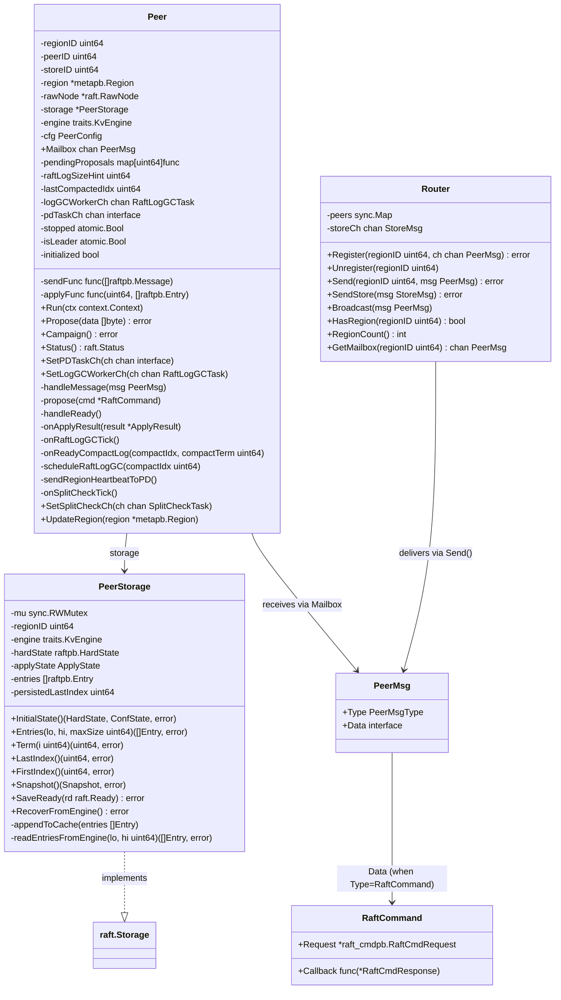
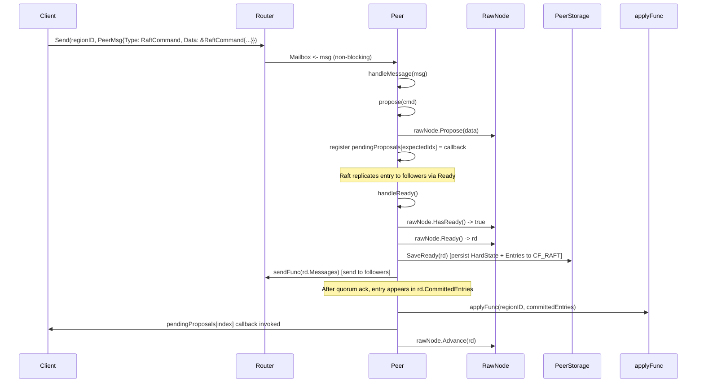
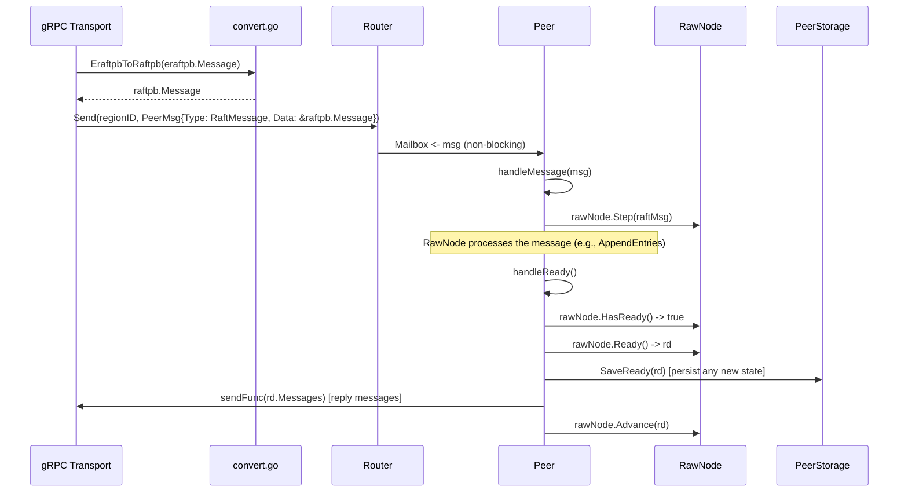
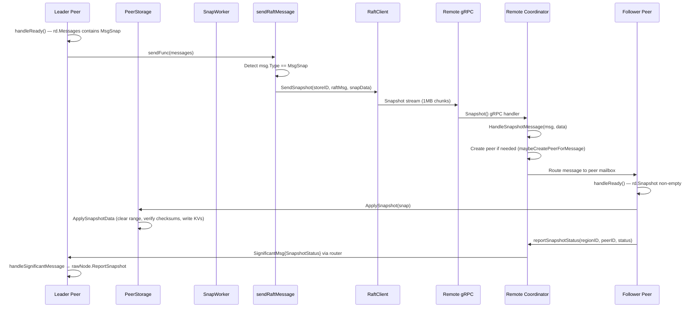

# Raftstore Layer — Raft-Based Replication in gookv

## 1. Overview

The raftstore layer implements region-based Raft consensus using the etcd/raft library (`go.etcd.io/etcd/raft/v3`). Each region replica is driven by a **Peer** goroutine that owns an etcd `raft.RawNode`, persists state through a **PeerStorage** adapter, and receives messages via a **Router** that maps region IDs to buffered Go channels (mailboxes).

Key design decisions:

- **One goroutine per region replica** — each `Peer.Run()` loop processes ticks, incoming Raft messages, client proposals, and apply results sequentially, eliminating the need for fine-grained locking within a single peer.
- **etcd/raft as a library** — gookv uses `raft.RawNode` directly (not a higher-level server), giving full control over when to call `Tick()`, `Step()`, `Propose()`, `Ready()`, and `Advance()`.
- **Protobuf wire-format conversion** — the `convert.go` file bridges kvproto's `eraftpb.Message` (used on the gRPC transport) and etcd's `raftpb.Message` via marshal/unmarshal, since both share the same protobuf wire format.

Source files:

| File | Purpose |
|------|---------|
| `internal/raftstore/peer.go` | Peer struct, lifecycle, event loop, Ready processing |
| `internal/raftstore/storage.go` | PeerStorage (raft.Storage impl), persistence, recovery |
| `internal/raftstore/msg.go` | Message/tick/result type definitions and constants |
| `internal/raftstore/router/router.go` | sync.Map-based message routing |
| `internal/raftstore/convert.go` | eraftpb <-> raftpb protobuf conversion |
| `internal/raftstore/snapshot.go` | Snapshot generation, serialization, transfer, and application; `SnapWorker` background processing |
| `internal/raftstore/split/checker.go` | Region split checking (`SplitCheckWorker`) and execution (`ExecBatchSplit`) |
| `internal/raftstore/raftlog_gc.go` | Raft log compaction: `execCompactLog`, `RaftLogGCWorker` background deletion |
| `internal/raftstore/conf_change.go` | Conf change processing (`applyConfChangeEntry`, `processConfChange`, `ProposeConfChange`) |
| `internal/raftstore/merge.go` | Region merge: `ExecPrepareMerge`, `ExecCommitMerge`, `ExecRollbackMerge` |
| `internal/raftstore/store_worker.go` | Region data cleanup (`CleanupRegionData`) |

---

## 2. Key Types and Interfaces

### 2.1 Peer

```go
// internal/raftstore/peer.go
type Peer struct {
    regionID         uint64
    peerID           uint64
    storeID          uint64
    region           *metapb.Region

    rawNode          *raft.RawNode
    storage          *PeerStorage
    engine           traits.KvEngine

    cfg              PeerConfig

    Mailbox          chan PeerMsg                    // buffered channel for incoming messages
    sendFunc         func([]raftpb.Message)          // outbound Raft message delivery
    applyFunc        func(regionID uint64, entries []raftpb.Entry)  // committed entry application
    pendingProposals map[uint64]func([]byte, error)  // index -> callback

    raftLogSizeHint  uint64                         // estimated Raft log size for GC decisions
    lastCompactedIdx uint64                         // last index sent to RaftLogGCWorker
    logGCWorkerCh    chan<- RaftLogGCTask            // sends GC tasks to RaftLogGCWorker
    pdTaskCh         chan<- interface{}              // sends RegionHeartbeatInfo to PDWorker
    splitCheckCh     chan<- split.SplitCheckTask     // sends split check tasks to SplitCheckWorker

    stopped          atomic.Bool
    isLeader         atomic.Bool
    initialized      bool
}
```

`Peer` is the central type. It owns the Raft state machine (`rawNode`), persistent storage (`storage`), and the mailbox channel. Two injectable function fields — `sendFunc` and `applyFunc` — decouple the peer from transport and state-machine concerns. The `raftLogSizeHint` and `lastCompactedIdx` fields track Raft log growth for compaction decisions. The `logGCWorkerCh` and `pdTaskCh` channels connect the peer to background workers for log GC and PD heartbeat reporting, respectively.

### 2.2 PeerConfig

```go
type PeerConfig struct {
    RaftBaseTickInterval     time.Duration  // default: 100ms
    RaftElectionTimeoutTicks int            // default: 10
    RaftHeartbeatTicks       int            // default: 2
    MaxInflightMsgs          int            // default: 256
    MaxSizePerMsg            uint64         // default: 1 MiB
    PreVote                  bool           // default: true
    MailboxCapacity          int            // default: 256
    RaftLogGCTickInterval    time.Duration  // default: 10s
    RaftLogGCCountLimit      uint64         // default: 72000
    RaftLogGCSizeLimit       uint64         // default: 72 MiB
    RaftLogGCThreshold       uint64         // default: 50
    SplitCheckTickInterval   time.Duration  // default: 10s (0 = disabled)
    PdHeartbeatTickInterval  time.Duration  // default: 60s (0 = disabled)
}
```

### 2.3 PeerStorage

```go
// internal/raftstore/storage.go
type PeerStorage struct {
    mu                 sync.RWMutex
    regionID           uint64
    engine             traits.KvEngine

    hardState          raftpb.HardState
    applyState         ApplyState
    entries            []raftpb.Entry   // in-memory cache (last 1024 entries)
    persistedLastIndex uint64
}
```

`PeerStorage` implements the `raft.Storage` interface. It caches recent entries in memory and falls back to the KvEngine (CF_RAFT column family) for older entries.

### 2.4 ApplyState

```go
type ApplyState struct {
    AppliedIndex   uint64
    TruncatedIndex uint64
    TruncatedTerm  uint64
}
```

Tracks which Raft log entries have been applied to the state machine and where log truncation stands.

### 2.5 Router

```go
// internal/raftstore/router/router.go
type Router struct {
    peers   sync.Map                    // regionID -> chan raftstore.PeerMsg
    storeCh chan raftstore.StoreMsg      // store-level message channel
}
```

### 2.6 Class Diagram



---

## 3. Peer Lifecycle

### 3.1 Initialization (`NewPeer`)

`NewPeer` accepts a region ID, peer ID, store ID, the region metadata, a KvEngine, config, and an optional list of initial Raft peers (for bootstrap).

**Bootstrap path** (when `len(peers) > 0`):
1. Create a `PeerStorage` with default `ApplyState` (indices at 0).
2. Call `SetDummyEntry()` to insert a sentinel entry at index 0, term 0 — matching etcd/raft's `MemoryStorage` convention.
3. Create a `raft.RawNode` with the storage.
4. Call `rawNode.Bootstrap(peers)` to initialize the Raft cluster membership.

**Restart path** (when `len(peers) == 0`):
1. Create a `PeerStorage`.
2. Call `RecoverFromEngine()` to restore hard state and log entries from `CF_RAFT`.
3. Create a `raft.RawNode` — it reads the recovered state via the `raft.Storage` interface.

The `raft.Config` is created with:
- `CheckQuorum: true` — leader steps down if it does not hear from a quorum.
- `PreVote: true` (by default) — prevents disruptive elections from partitioned nodes.

### 3.2 Event Loop (`Peer.Run`)

```go
func (p *Peer) Run(ctx context.Context) {
    ticker := time.NewTicker(p.cfg.RaftBaseTickInterval)  // 100ms default
    // Optional periodic PD region heartbeat.
    var pdHeartbeatTickerCh <-chan time.Time
    if p.cfg.PdHeartbeatTickInterval > 0 {
        pdHeartbeatTicker := time.NewTicker(p.cfg.PdHeartbeatTickInterval)
        defer pdHeartbeatTicker.Stop()
        pdHeartbeatTickerCh = pdHeartbeatTicker.C
    }
    for {
        select {
        case <-ctx.Done():           // shutdown
        case <-ticker.C:             // Raft tick
            p.rawNode.Tick()
        case <-pdHeartbeatTickerCh:  // periodic PD region heartbeat
            if p.isLeader.Load() && p.pdTaskCh != nil {
                p.sendRegionHeartbeatToPD()
            }
        case msg := <-p.Mailbox:     // incoming message
            p.handleMessage(msg)
        }
        p.handleReady()  // process Raft Ready after every event
    }
}
```

The loop processes Raft ticks, incoming messages, and an optional periodic PD heartbeat. Every event is followed by a `handleReady()` call to drain any pending Raft state changes. The `pdHeartbeatTickerCh` case sends periodic region heartbeats to PD when `PdHeartbeatTickInterval > 0` (default 60s). This ensures PD's scheduler can run continuously (region balance, move tracking), not just on leadership changes.

### 3.3 Message Handling (`handleMessage`)

| PeerMsgType | Action |
|-------------|--------|
| `RaftMessage` | Unwrap `*raftpb.Message`, call `rawNode.Step()` |
| `RaftCommand` | Unwrap `*RaftCommand`, call `propose()` |
| `Tick` | Call `rawNode.Tick()` (additional tick beyond the timer) |
| `ApplyResult` | Unwrap `*ApplyResult`, call `onApplyResult()` which processes `ExecResultTypeCompactLog` via `onReadyCompactLog()` and invokes pending proposal callbacks |
| `Significant` | Unwrap `*SignificantMsg`, call `handleSignificantMessage()` — dispatches `Unreachable` (→ `rawNode.ReportUnreachable`), `SnapshotStatus` (→ `rawNode.ReportSnapshot`), and `MergeResult` (→ `stopped = true`) |
| `Schedule` | Unwrap `*ScheduleMsg`, call `handleScheduleMessage()` — only executes if this peer is the leader; routes `TransferLeader`, `ChangePeer`, `Merge` |
| `Destroy` | Set `stopped = true`, close the Mailbox channel |
| Others | Silently ignored |

### 3.4 Ready Processing (`handleReady`)

This is the core Raft integration point. It runs after every event in the loop:

1. **Guard**: `rawNode.HasReady()` — return early if nothing to do.
2. **Get Ready**: `rd := rawNode.Ready()` — a batch of state changes.
3. **Update leader**: If `rd.SoftState` is non-nil, update `isLeader` based on whether `SoftState.Lead == peerID`. If this peer transitions from non-leader to leader, `sendRegionHeartbeatToPD()` is called to notify PD of the leadership change.
4. **Persist**: `storage.SaveReady(rd)` — write hard state and new entries to `CF_RAFT` via a `WriteBatch`.
4b. **Apply snapshot**: If `rd.Snapshot` is non-empty, call `storage.ApplySnapshot(rd.Snapshot)` to apply the received snapshot data to the storage engine (clears existing range, verifies checksums, writes key-value pairs).
5. **Send messages**: If `sendFunc` is set and `rd.Messages` is non-empty, deliver outbound Raft messages.
6. **Apply committed entries**:
   - Process `ConfChange` / `ConfChangeV2` entries by calling `rawNode.ApplyConfChange()`.
   - Forward all committed entries to `applyFunc` for state machine application.
   - Invoke and clean up pending proposal callbacks for committed entry indices.
7. **Advance**: `rawNode.Advance(rd)` — signal to etcd/raft that the Ready has been processed.

---

## 4. PeerStorage

### 4.1 raft.Storage Interface Implementation

`PeerStorage` implements all six methods of `raft.Storage`:

| Method | Behavior |
|--------|----------|
| `InitialState()` | Returns the in-memory `hardState` and an empty `ConfState` |
| `Entries(lo, hi, maxSize)` | Serves from cache if range is covered; falls back to per-index engine reads; applies `limitSize` byte cap |
| `Term(i)` | Returns truncated term for `TruncatedIndex`; otherwise checks cache, then engine |
| `LastIndex()` | Returns last cache entry index, or `persistedLastIndex` if cache is empty |
| `FirstIndex()` | Returns `TruncatedIndex + 1` |
| `Snapshot()` | Returns an empty snapshot with metadata set to `TruncatedIndex`/`TruncatedTerm` |

### 4.2 Persistence — `SaveReady()`

`SaveReady` persists a `raft.Ready` batch atomically:

1. Create a `WriteBatch` from the engine.
2. If hard state is non-empty, marshal and write to `keys.RaftStateKey(regionID)` in `CF_RAFT`.
3. For each new entry, marshal and write to `keys.RaftLogKey(regionID, index)` in `CF_RAFT`.
4. Commit the `WriteBatch` atomically.
5. Update the in-memory entry cache (`appendToCache`) and `persistedLastIndex`.

### 4.3 Recovery — `RecoverFromEngine()`

Called on restart (non-bootstrap path):

1. Read hard state from `keys.RaftStateKey(regionID)` in `CF_RAFT`; unmarshal into `hardState`.
2. Scan all entries in `keys.RaftLogKeyRange(regionID)` using an iterator over `CF_RAFT`.
3. Unmarshal each entry, track the maximum index as `persistedLastIndex`.
4. Keep the last 1024 entries in the in-memory cache.

### 4.3.1 `HasPersistedRaftState(engine, regionID)`

A package-level utility function that checks whether the engine has persisted Raft state for a given region by looking up `keys.RaftStateKey(regionID)` in `CF_RAFT`. Returns `true` if the key exists.

Used by `StoreCoordinator.CreatePeer` to decide whether a newly created peer should be bootstrapped with the region's full peer list (no persisted state → bootstrap with peers) or should recover from the engine (persisted state exists → `RecoverFromEngine`).

### 4.4 Entry Cache

The cache is a `[]raftpb.Entry` slice holding the most recent entries (up to 1024). The `appendToCache` method handles overlap:

- If new entries start at or before the cache's first index, the cache is replaced entirely.
- Otherwise, the cache is truncated at the overlap point and new entries are appended.
- If the total exceeds 1024 entries, the oldest are discarded.

This avoids engine reads for the common case where Raft needs recent log entries.

### 4.5 Engine Fallback — `readEntriesFromEngine()`

For entries outside the cache, reads are done one index at a time via `engine.Get(CF_RAFT, RaftLogKey(regionID, idx))`. Reading stops on `ErrNotFound` (gap in the log).

### 4.6 Initialization Constants

```go
const (
    RaftInitLogTerm  uint64 = 5
    RaftInitLogIndex uint64 = 5
)
```

These match TiKV conventions: a newly created `PeerStorage` (non-bootstrap) starts with `AppliedIndex = 5`, `TruncatedIndex = 5`, `TruncatedTerm = 5`.

---

## 5. Router

The `Router` type provides `sync.Map`-based routing from region IDs to peer mailboxes.

### 5.1 Registration

```go
func (r *Router) Register(regionID uint64, ch chan PeerMsg) error
```

Uses `sync.Map.LoadOrStore` — returns `ErrPeerAlreadyRegistered` if the region already exists. The channel passed in is typically the `Peer.Mailbox` created during `NewPeer`.

### 5.2 Message Delivery

```go
func (r *Router) Send(regionID uint64, msg PeerMsg) error
```

Looks up the mailbox channel via `sync.Map.Load`, then performs a **non-blocking send** (`select` with `default`). Returns `ErrRegionNotFound` or `ErrMailboxFull` on failure. This prevents a slow peer from blocking the caller.

### 5.3 Broadcast

```go
func (r *Router) Broadcast(msg PeerMsg)
```

Iterates all registered peers via `sync.Map.Range`, attempting a non-blocking send to each. Messages to full mailboxes are silently dropped — broadcast is best-effort.

### 5.4 Store-Level Messages

The router also carries a `storeCh chan StoreMsg` for store-level messages (peer creation, destruction, etc.). `SendStore` uses the same non-blocking send pattern.

### 5.5 Mailbox Design

Mailboxes are buffered Go channels with a default capacity of 256 (configurable via `PeerConfig.MailboxCapacity` or `router.DefaultMailboxCapacity`). The non-blocking send pattern means back-pressure is handled by dropping rather than blocking, which prevents cascading slowdowns across regions.

---

## 6. Message Types

### 6.1 PeerMsgType (messages to peer goroutines)

| Constant | Value | Description |
|----------|-------|-------------|
| `PeerMsgTypeRaftMessage` | 0 | Raft protocol message from another peer |
| `PeerMsgTypeRaftCommand` | 1 | Client read/write request to be proposed |
| `PeerMsgTypeTick` | 2 | Timer tick (supplemental to the built-in ticker) |
| `PeerMsgTypeApplyResult` | 3 | Results from the apply worker |
| `PeerMsgTypeSignificant` | 4 | High-priority control messages |
| `PeerMsgTypeStart` | 5 | Peer initialization signal |
| `PeerMsgTypeDestroy` | 6 | Peer destruction request |
| `PeerMsgTypeCasual` | 7 | Low-priority, droppable messages |
| `PeerMsgTypeSchedule` | 8 | Scheduling commands from PD (leader transfer, peer change, merge) |

### 6.2 PeerTickType (tick classifications)

| Constant | Value | Description |
|----------|-------|-------------|
| `PeerTickRaft` | 0 | Drives heartbeats and election timeout |
| `PeerTickRaftLogGC` | 1 | Triggers log garbage collection |
| `PeerTickSplitRegionCheck` | 2 | Triggers region size check for split |
| `PeerTickPdHeartbeat` | 3 | Triggers region heartbeat to PD |
| `PeerTickCheckMerge` | 4 | Checks merge proposal status |
| `PeerTickCheckPeerStaleState` | 5 | Detects stale leadership |

### 6.3 ExecResultType (apply execution results)

| Constant | Value | Description |
|----------|-------|-------------|
| `ExecResultTypeNormal` | 0 | Normal command execution |
| `ExecResultTypeSplitRegion` | 1 | Region split completed |
| `ExecResultTypeCompactLog` | 2 | Log compaction completed |
| `ExecResultTypeChangePeer` | 3 | Membership change completed |

### 6.4 StoreMsgType (messages to the store goroutine)

| Constant | Value | Description |
|----------|-------|-------------|
| `StoreMsgTypeRaftMessage` | 0 | Raft message for routing |
| `StoreMsgTypeStoreUnreachable` | 1 | Store unreachable notification |
| `StoreMsgTypeTick` | 2 | Store-level tick |
| `StoreMsgTypeStart` | 3 | Store initialization |
| `StoreMsgTypeCreatePeer` | 4 | Create a new peer |
| `StoreMsgTypeDestroyPeer` | 5 | Destroy an existing peer |

### 6.5 SignificantMsgType (high-priority control)

| Constant | Value | Description |
|----------|-------|-------------|
| `SignificantMsgTypeSnapshotStatus` | 0 | Snapshot send/receive status — `handleSignificantMessage` calls `rawNode.ReportSnapshot(msg.ToPeerID, msg.Status)` |
| `SignificantMsgTypeUnreachable` | 1 | Peer unreachable notification — `handleSignificantMessage` calls `rawNode.ReportUnreachable(msg.ToPeerID)` |
| `SignificantMsgTypeMergeResult` | 2 | Region merge result — `handleSignificantMessage` sets `stopped = true` on the peer |

All three `SignificantMsgType` values are fully handled in `Peer.handleSignificantMessage()`.

### 6.6 Data Structs

| Struct | Fields | Purpose |
|--------|--------|---------|
| `PeerMsg` | `Type PeerMsgType`, `Data interface{}` | Envelope for all peer messages |
| `RaftCommand` | `Request *raft_cmdpb.RaftCmdRequest`, `Callback func(*RaftCmdResponse)` | Client request + response callback |
| `ApplyResult` | `RegionID uint64`, `Results []ExecResult` | Apply worker output |
| `ExecResult` | `Type ExecResultType`, `Data interface{}` | Single execution result |
| `SplitRegionResult` | `Derived *metapb.Region`, `Regions []*metapb.Region` | Split operation output |
| `StoreMsg` | `Type StoreMsgType`, `Data interface{}` | Store-level message envelope |
| `SignificantMsg` | `Type`, `RegionID`, `ToPeerID`, `Status` | High-priority control message |
| `ScheduleMsg` | `Type ScheduleMsgType`, `TransferLeader *pdpb.TransferLeader`, `ChangePeer *pdpb.ChangePeer`, `Merge *pdpb.Merge` | PD scheduling command delivered to a peer |

**ScheduleMsgType constants:**

| Constant | Value | Description |
|----------|-------|-------------|
| `ScheduleMsgTypeTransferLeader` | 0 | Transfer Raft leadership to another peer |
| `ScheduleMsgTypeChangePeer` | 1 | Add or remove a peer (conf change) |
| `ScheduleMsgTypeMerge` | 2 | Merge this region with a target region |

---

## 7. Processing Flows

### 7.1 Client Write Proposal



### 7.2 Raft Message from Remote Peer



---

## 8. Snapshot, Split, and Other Subsystems

### 8.1 Snapshots

Source: `internal/raftstore/snapshot.go`

The snapshot subsystem handles Raft snapshot generation, serialization, transfer, and application.

**State Machine** — `SnapState` tracks snapshot progress per peer:

| State | Meaning |
|-------|---------|
| `SnapStateRelax` | No snapshot in progress |
| `SnapStateGenerating` | Background generation running; `GenSnapTask.ResultCh` pending |
| `SnapStateApplying` | Received snapshot being applied to engine |

**Core Types:**

| Type | Fields | Purpose |
|------|--------|---------|
| `SnapshotData` | `RegionID`, `Version`, `CFFiles []SnapshotCFFile` | Top-level snapshot container |
| `SnapshotCFFile` | `CF`, `KVPairs []SnapKVPair`, `Checksum uint32` | Per-CF key-value data with integrity check |
| `SnapKVPair` | `Key`, `Value []byte` | Single key-value entry |
| `GenSnapTask` | `RegionID`, `Region`, `SnapKey`, `Canceled`, `ResultCh` | Background generation request |
| `SnapKey` | `RegionID`, `Term`, `Index` | Unique snapshot identifier |

**Generation** — `GenerateSnapshotData(engine, region)` scans all three data CFs (`CF_DEFAULT`, `CF_LOCK`, `CF_WRITE`) within the region's key range using an engine snapshot. Each CF's data is collected into a `SnapshotCFFile` with a CRC32 checksum computed by `ComputeCFChecksum`.

**Serialization** — `MarshalSnapshotData` / `UnmarshalSnapshotData` convert `SnapshotData` to/from a binary format using `encoding/gob`.

**Application** — `ApplySnapshotData(engine, data)` applies a received snapshot:
1. Clears the existing key range via `DeleteRange` on all three data CFs.
2. Verifies the CRC32 checksum of each CF file.
3. Writes all key-value pairs via a `WriteBatch`.

**Background Worker** — `SnapWorker` runs a goroutine that consumes `GenSnapTask` from its task channel. Each task calls `GenerateSnapshotData` and sends the result (or error) back via `GenSnapTask.ResultCh`.

**PeerStorage Integration:**
- `SetSnapTaskCh(ch)` — Wires the async snapshot task channel from the coordinator to the peer storage.
- `SetRegion(region)` — Stores region metadata used when generating snapshot metadata.
- `Snapshot()` — If `snapTaskCh` is wired, calls `RequestSnapshot()` to trigger async generation via the `SnapWorker`. Otherwise returns metadata-only snapshot.
- `RequestSnapshot()` — Initiates async snapshot generation. Sets state to `SnapStateGenerating` and submits a `GenSnapTask` to the `SnapWorker`.
- `ApplySnapshot(snap)` — Validates the incoming snapshot metadata, calls `ApplySnapshotData`, then atomically updates the apply state, hard state, and region state in `CF_RAFT`.
- `CancelGeneratingSnap()` — Cancels an in-progress generation via the `Canceled` atomic flag.

**End-to-End Snapshot Transfer Pipeline:**

The full snapshot transfer flow is now wired end-to-end:



On the leader side, `PeerStorage.Snapshot()` triggers `SnapWorker` to generate `SnapshotData` (scanning all three data CFs). When the snapshot result arrives via `GenSnapTask.ResultCh`, the leader's next `handleReady()` includes the snapshot in `rd.Messages` as a `MsgSnap`. The `sendRaftMessage` function detects `MsgSnap` and uses `RaftClient.SendSnapshot` (streaming 1MB chunks) instead of the normal `Send` path. On send failure, `reportSnapshotStatus` with `SnapshotFailure` is sent back.

On the receiving side, the gRPC `Snapshot` handler reassembles the chunks and calls `HandleSnapshotMessage`, which attaches the snapshot data to the Raft message and creates a peer if one doesn't exist for the region (via `maybeCreatePeerForMessage`). When PD is available, `maybeCreatePeerForMessage` queries `pdClient.GetRegionByID()` to obtain full region metadata (including the complete peer list), so the child peer is bootstrapped with the correct cluster configuration. If PD is unavailable or the query fails, it falls back to constructing minimal metadata from the `FromPeer`/`ToPeer` in the Raft message. The follower's `handleReady()` detects a non-empty `rd.Snapshot` and calls `storage.ApplySnapshot()` to apply the data.

### 8.2 Region Split

Source: `internal/raftstore/split/checker.go`

The split subsystem detects oversized regions and executes boundary splits.

**Core Types:**

| Type | Fields | Purpose |
|------|--------|---------|
| `SplitCheckWorker` | `engine`, `cfg`, `taskCh`, `resultCh`, `stopCh` | Background worker for split checks |
| `SplitCheckWorkerConfig` | `SplitSize` (96 MiB), `MaxSize` (144 MiB), `SplitKeys`, `MaxKeys` | Size thresholds |
| `SplitCheckTask` | `RegionID`, `Region`, `StartKey`, `EndKey`, `Policy` | Check request |
| `SplitCheckResult` | `RegionID`, `SplitKey`, `RegionSize` | Check outcome |
| `SplitRegionResult` | `Derived`, `Regions` | Post-split region metadata |

**Check Policy** — `CheckPolicyScan` iterates all three data CFs to measure exact region size; `CheckPolicyApproximate` is defined but defaults to scan.

**Size Scanning** — `scanRegionSize(task)` iterates entries across `CF_DEFAULT`, `CF_LOCK`, `CF_WRITE` within `[StartKey, EndKey)`. It accumulates key-value sizes and records a midpoint split key. If the total exceeds `SplitSize`, the midpoint is returned as `SplitKey`.

**Split Execution** — `ExecBatchSplit(region, splitKeys, newRegionIDs, newPeerIDs)` creates new region metadata:
1. Validates that split keys fall within the region's range and are in order.
2. Creates new `metapb.Region` entries for each split, assigning new IDs and peers.
3. Updates the original region's `EndKey` and bumps `RegionEpoch.Version`.
4. Returns a `SplitRegionResult` with the derived parent and new child regions.

**Background Worker** — `SplitCheckWorker.Run()` consumes `SplitCheckTask` from its channel, calls `checkRegion`, and sends `SplitCheckResult` to `resultCh`. The caller can schedule tasks via `Schedule()` and read results via `ResultCh()`.

### 8.3 Raft Log Compaction

Source: `internal/raftstore/raftlog_gc.go`

Raft log compaction (GC) removes obsolete log entries to prevent unbounded storage growth.

**Core Types:**

| Type | Purpose |
|------|---------|
| `RaftLogGCWorker` | Background goroutine that deletes old Raft log entries |
| `RaftLogGCTask` (via channel) | Contains `regionID`, `startIdx`, `endIdx` for deletion range |

**Compaction Decision** — `Peer.onRaftLogGCTick()` evaluates whether compaction is needed:
1. Computes the gap between the applied index and the last compacted index.
2. If the gap exceeds `RaftLogGCCountLimit` or `raftLogSizeHint` exceeds `RaftLogGCSizeLimit`, a `CompactLog` proposal is submitted to Raft.
3. The compact index is set to `appliedIndex - RaftLogGCThreshold` to retain a tail of entries.

**Proposal Execution** — `execCompactLog(applyState, compactIdx, compactTerm)` validates the request (compact index must exceed current truncated index) and updates `ApplyState.TruncatedIndex` / `TruncatedTerm`.

**Background Deletion** — When the peer processes a `ExecResultTypeCompactLog` apply result, `onReadyCompactLog()` sends a task to `RaftLogGCWorker` via `logGCWorkerCh`. The worker's `gcRaftLog(regionID, startIdx, endIdx)` deletes entries using `engine.DeleteRange(CF_RAFT, startKey, endKey)` and adjusts `raftLogSizeHint`.

**Serialization** — `marshalCompactLogRequest` / `unmarshalCompactLogRequest` encode the compact index and term into the Raft proposal data.

### 8.4 Configuration Changes

Source: `internal/raftstore/conf_change.go`

Configuration changes handle adding and removing Raft group members (peers).

**Core Types:**

| Type | Fields | Purpose |
|------|--------|---------|
| `ChangePeerResult` | `Index`, `ChangeType`, `Peer`, `Region` | Result of a conf change operation |
| `CreatePeerRequest` | `Region`, `PeerID` | Request to create a new peer |
| `DestroyPeerRequest` | `RegionID`, `PeerID` | Request to destroy a peer |

**Proposal** — `ProposeConfChange(changeType, peer)` encodes the peer via `EncodePeerContext` and proposes a `ConfChangeV2` through `rawNode.ProposeConfChange`.

**Application** — `applyConfChangeEntry(entry)` processes committed conf change entries:
1. Unmarshals the `ConfChangeV2` from the entry data.
2. Calls `processConfChange(cc)` to update region metadata.
3. Applies the conf change to etcd/raft via `rawNode.ApplyConfChange`.

**Region Update** — `processConfChange(cc)` modifies the region's peer list:
- **AddNode**: Appends the new peer and bumps `RegionEpoch.ConfVer`.
- **RemoveNode**: Calls `removePeerByNodeID` to remove the peer, bumps `ConfVer`, and detects self-removal (sets `stopped = true`).

**Helpers** — `EncodePeerContext` / `decodePeerFromContext` serialize peer ID and store ID for the conf change context. `cloneRegion` creates a deep copy of region metadata for safe mutation.

### 8.5 Region Merge

Source: `internal/raftstore/merge.go`

Region merge combines two adjacent regions into one, reducing the number of Raft groups.

**State Machine** — `PeerState` tracks merge progress:

| State | Meaning |
|-------|---------|
| `PeerStateNormal` | Normal operation |
| `PeerStateMerging` | Merge in progress (source region) |
| `PeerStateTombstone` | Region has been merged away |

**Core Types:**

| Type | Fields | Purpose |
|------|--------|---------|
| `MergeState` | `MinIndex`, `Commit`, `Target *metapb.Region` | Tracks in-progress merge state |
| `CatchUpLogs` | `TargetRegionID`, `LogsUpToDate` | Signals target has caught up on source logs |
| `PrepareMergeResult` | `Region`, `State *MergeState` | Result of prepare phase |
| `CommitMergeResult` | `Index`, `Region`, `Source *metapb.Region` | Result of commit phase |
| `RollbackMergeResult` | `Region`, `Commit` | Result of rollback |

**Merge Protocol** (three phases):

1. **Prepare** — `ExecPrepareMerge(source, target)` bumps the source region's `RegionEpoch.Version` and creates a `MergeState` recording the target and minimum log index.

2. **Commit** — `ExecCommitMerge(target, source, entries)` extends the target region's key range to encompass the source. It calculates the merged epoch as the maximum of both regions' versions plus one.

3. **Rollback** — `ExecRollbackMerge(region, commit)` resets the region to `PeerStateNormal`, bumps the version, and clears the merge state.

**Result Types** — Three `ExecResultType` constants (`ExecResultTypePrepareMerge`, `ExecResultTypeCommitMerge`, `ExecResultTypeRollbackMerge`) carry merge results through the apply pipeline.

**Merge Result Kinds** — `MergeResultFromTargetLog`, `MergeResultFromTargetSnap`, `MergeResultStale` classify how the target peer received the source's data.

### 8.6 Region Data Cleanup

Source: `internal/raftstore/store_worker.go`

`CleanupRegionData(engine, regionID)` removes all persistent state for a destroyed region:
- Deletes the Raft log range via `DeleteRange(CF_RAFT, startLogKey, endLogKey)`.
- Deletes the Raft hard state key.
- Deletes the apply state key.
- Deletes the region state key.

This is used after a peer is removed via conf change or region merge.

---

## 9. Implementation Status

### Implemented

- **Peer lifecycle** — `NewPeer` with bootstrap and restart paths; proper `raft.Config` construction with `CheckQuorum` and `PreVote`.
- **Event loop** — `Peer.Run()` with `select` on context cancellation, ticker, and mailbox; `handleReady()` called after every event.
- **Ready processing** — Full pipeline: leader status update, PD heartbeat on leader transition, `SaveReady` persistence, outbound message delivery, conf change application, committed entry forwarding, proposal callback invocation, `Advance`.
- **PeerStorage with CF_RAFT persistence** — Atomic `WriteBatch` writes for hard state and entries; key scheme via `keys.RaftStateKey` and `keys.RaftLogKey`.
- **PeerStorage recovery** — `RecoverFromEngine()` restores hard state and scans log entries from the engine on restart.
- **Entry cache** — In-memory cache of last 1024 entries with overlap-aware append logic.
- **Router with sync.Map dispatch** — Non-blocking sends, broadcast, store-level channel, error sentinels for not-found and full mailboxes.
- **Protobuf conversion** — `EraftpbToRaftpb` / `RaftpbToEraftpb` for transport interop.
- **Proposal tracking** — `pendingProposals` map with index-based callback lookup and cleanup on commit.
- **ConfChange processing** — `applyConfChangeEntry` parses and applies ConfChange/ConfChangeV2 entries; `processConfChange` updates region metadata (peer list, epoch); `ProposeConfChange` proposes membership changes; self-removal detection.
- **Snapshot generation and application** — `SnapWorker` generates snapshots in the background; `PeerStorage.ApplySnapshot` applies received snapshots with checksum verification; `SnapState` FSM tracks progress.
- **Region split** — `SplitCheckWorker` detects oversized regions via CF scanning; `ExecBatchSplit` creates new region metadata with validated split keys and epoch bumps.
- **Raft log compaction** — `onRaftLogGCTick` evaluates size/count thresholds; `execCompactLog` advances `TruncatedIndex`; `RaftLogGCWorker` deletes old entries in the background.
- **Region merge** — `ExecPrepareMerge` / `ExecCommitMerge` / `ExecRollbackMerge` implement the three-phase merge protocol with epoch management.
- **PD heartbeat** — `sendRegionHeartbeatToPD()` sends region leader info to PD via `pdTaskCh` on leadership change.
- **Apply result processing** — `onApplyResult()` processes `ExecResultTypeCompactLog` via `onReadyCompactLog()` and invokes pending proposal callbacks.
- **Region data cleanup** — `CleanupRegionData` removes all Raft state for destroyed regions.

- **Store goroutine** — `RunStoreWorker` (in `StoreCoordinator`) is started in `main.go`. It listens on `router.StoreCh()` and handles `CreatePeer`, `DestroyPeer`, and `RaftMessage` (for unknown regions). `HandleRaftMessage` falls back to `storeCh` on `ErrRegionNotFound`, enabling dynamic peer creation. The `maybeCreatePeerForMessage` function queries PD via `pdClient.GetRegionByID()` for full region metadata when creating child peers (falling back to minimal metadata from the message if PD is unavailable).
- **Significant messages** — All three `SignificantMsgType` values are fully handled in `handleSignificantMessage()`: `Unreachable` → `rawNode.ReportUnreachable`, `SnapshotStatus` → `rawNode.ReportSnapshot`, `MergeResult` → `stopped = true`.
- **PD scheduling messages** — `PeerMsgTypeSchedule` (value 8) dispatches to `handleScheduleMessage()`. Only the leader executes; routes `TransferLeader`, `ChangePeer`, and `Merge` commands from PD's scheduler.
- **Snapshot transfer** — Fully wired end-to-end: `PeerStorage.Snapshot()` → `SnapWorker` generation → `handleReady` applies snapshots → `sendRaftMessage` detects `MsgSnap` → `SendSnapshot` streaming → remote `Snapshot` gRPC handler → `HandleSnapshotMessage` → `ApplySnapshot` → `reportSnapshotStatus`.
- **PD-coordinated split** — Wired end-to-end. Peers call `onSplitCheckTick()` at a configurable interval (`SplitCheckTickInterval`, default 10s) when acting as leader, sending `SplitCheckTask` to the `SplitCheckWorker` via `splitCheckCh`. The `StoreCoordinator.RunSplitResultHandler()` processes results: calls `AskBatchSplit` on PD for new IDs, executes `ExecBatchSplit`, bootstraps child regions via `CreatePeer`, and reports splits to PD via `ReportBatchSplit`.

### Not Implemented

- **Casual messages** — `PeerMsgTypeCasual` is defined but not handled in `handleMessage`.
- **PeerMsgTypeStart** — Defined but not handled.
