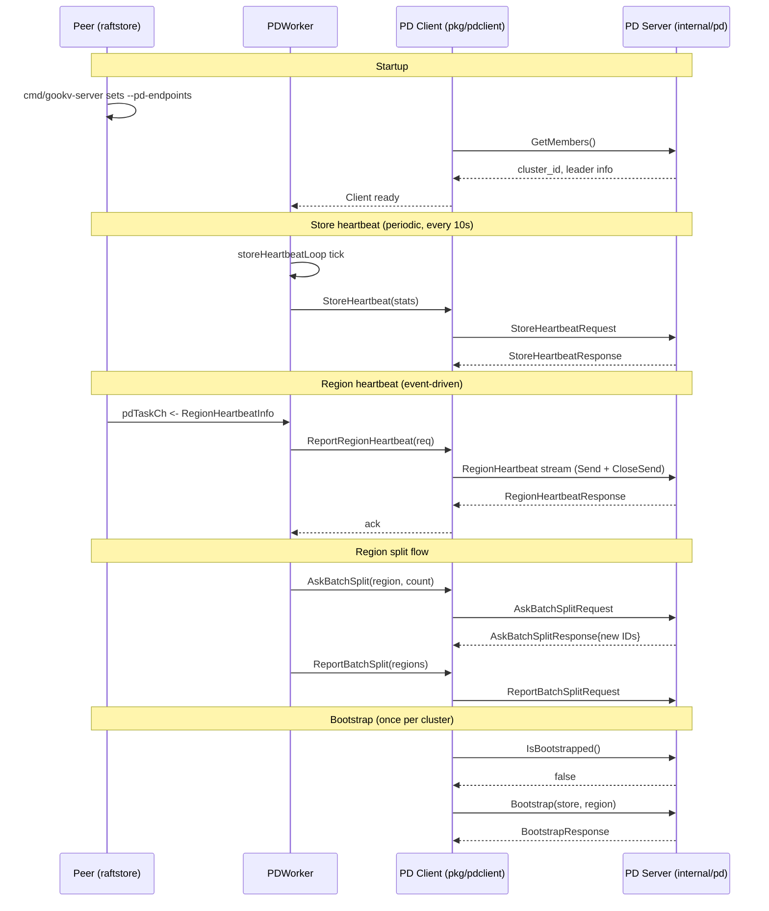
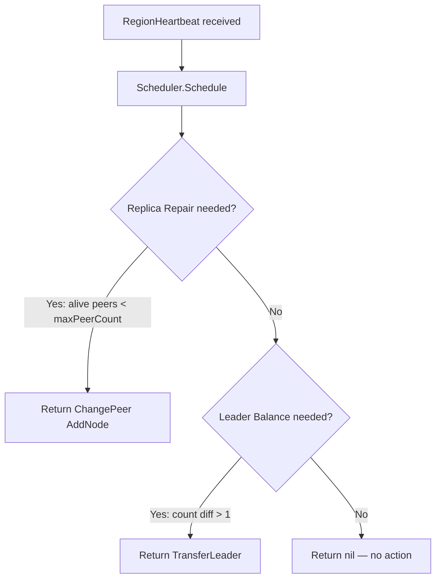
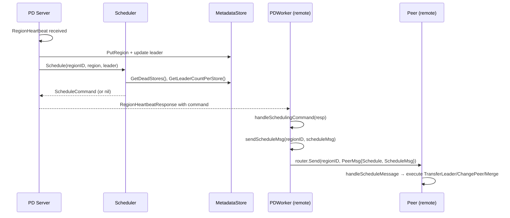
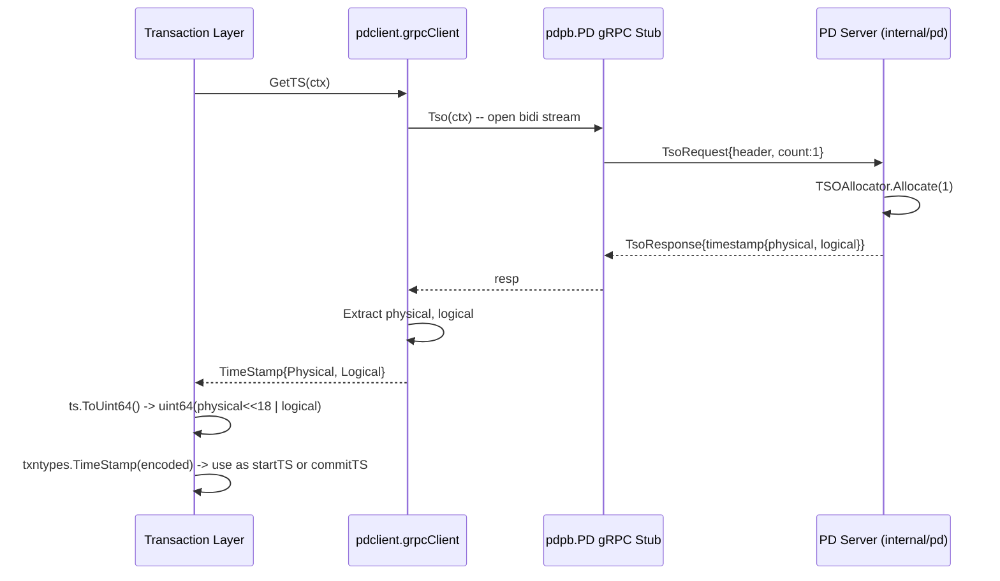
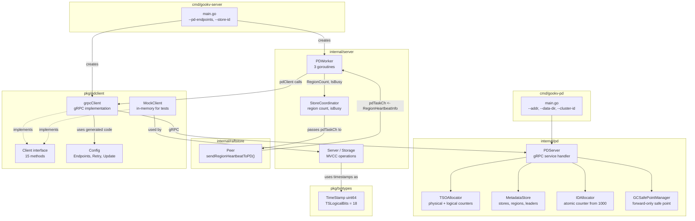
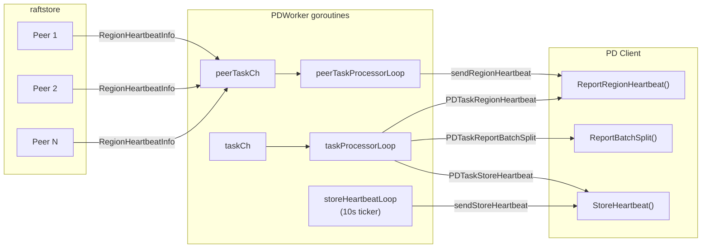

# Placement Driver (PD) Client

## 1. Overview

gookv includes both a Placement Driver (PD) client package (`pkg/pdclient`) and an embedded PD server (`internal/pd`). PD is the cluster-level metadata and coordination service responsible for:

- **TSO (Timestamp Oracle) allocation** -- providing globally unique, monotonically increasing timestamps used by the MVCC transaction layer.
- **Cluster bootstrap and metadata management** -- registering stores and the initial region so PD can begin scheduling.
- **Region/store heartbeat and discovery** -- receiving periodic heartbeats that report region status (leader, size, traffic) and store health, and returning scheduling commands (peer changes, leader transfers, splits, merges).
- **Region split coordination** -- allocating new region/peer IDs when a store needs to split a region, and recording the result after the split completes.
- **Unique ID allocation** -- providing a globally unique monotonic ID generator for stores and regions.
- **GC safe point management** -- tracking the global GC safe point so that MVCC garbage collection knows which versions are safe to reclaim.

The PD client speaks the kvproto `pdpb.PD` gRPC service. gookv ships its own PD server (`cmd/gookv-pd`) built on the same proto, so no external PD deployment is required. Alternatively, the client can connect to a real TiKV PD server without modification.

## 2. Client Interface

### `Client` interface

Defined in `pkg/pdclient/client.go`. Every method takes a `context.Context` as its first argument.

| Method | Signature | Purpose |
|--------|-----------|---------|
| `GetTS` | `(ctx) -> (TimeStamp, error)` | Allocate a globally unique timestamp from PD's TSO. |
| `GetRegion` | `(ctx, key []byte) -> (*metapb.Region, *metapb.Peer, error)` | Look up the region that contains the given key, plus its current leader. |
| `GetRegionByID` | `(ctx, regionID uint64) -> (*metapb.Region, *metapb.Peer, error)` | Look up a region by its numeric ID, plus its current leader. |
| `GetStore` | `(ctx, storeID uint64) -> (*metapb.Store, error)` | Retrieve store metadata by store ID. |
| `Bootstrap` | `(ctx, *metapb.Store, *metapb.Region) -> (*pdpb.BootstrapResponse, error)` | Bootstrap the cluster with the first store and region. |
| `IsBootstrapped` | `(ctx) -> (bool, error)` | Check whether the cluster has already been bootstrapped. |
| `PutStore` | `(ctx, *metapb.Store) -> error` | Register or update a store in PD. |
| `ReportRegionHeartbeat` | `(ctx, *pdpb.RegionHeartbeatRequest) -> (*pdpb.RegionHeartbeatResponse, error)` | Send a region heartbeat; PD returns scheduling commands (transfer leader, change peer, merge). |
| `StoreHeartbeat` | `(ctx, *pdpb.StoreStats) -> error` | Send a store-level heartbeat reporting capacity, region count, etc. |
| `AskBatchSplit` | `(ctx, *metapb.Region, count uint32) -> (*pdpb.AskBatchSplitResponse, error)` | Request `count` new region/peer ID sets for a split operation. |
| `ReportBatchSplit` | `(ctx, []*metapb.Region) -> error` | Notify PD that splits have been completed. |
| `AllocID` | `(ctx) -> (uint64, error)` | Allocate a globally unique ID. |
| `GetGCSafePoint` | `(ctx) -> (uint64, error)` | Retrieve the current global GC safe point from PD. |
| `UpdateGCSafePoint` | `(ctx, safePoint uint64) -> (uint64, error)` | Advance the global GC safe point (forward only); returns the new value. |
| `GetClusterID` | `(ctx) -> uint64` | Return the cluster ID (cached from initial connection). |
| `Close` | `()` | Shut down the client and release the gRPC connection. |

The `Client` interface now has **15 methods** total (13 original + `GetGCSafePoint` + `UpdateGCSafePoint`).

### `grpcClient` implementation struct

```go
type grpcClient struct {
    cfg         Config
    clusterID   uint64

    mu          sync.RWMutex
    conn        *grpc.ClientConn
    client      pdpb.PDClient      // auto-generated gRPC stub
    endpoints   []string           // all PD endpoints for failover
    currentIdx  int                // index of current active endpoint
    reconnectMu sync.Mutex         // serializes reconnection attempts

    tsoBatchSize int               // default: 64 (reserved for future batched TSO)

    closed atomic.Bool
}
```

Key fields:
- `conn` / `client` -- the live gRPC connection to PD and the generated stub.
- `clusterID` -- discovered at connection time via `GetMembers` and attached to every subsequent request header.
- `closed` -- atomic flag to ensure `Close()` is idempotent.

### `Config` and connection management

```go
type Config struct {
    Endpoints      []string      // PD server addresses (e.g., ["127.0.0.1:2379"])
    RetryInterval  time.Duration // retry interval for failed requests (default 300ms)
    RetryMaxCount  int           // max retries, -1 = infinite (default 10)
    UpdateInterval time.Duration // interval for refreshing PD leader info (default 10min)
}
```

`NewClient` iterates through `Endpoints` and connects to the first one that succeeds using `grpc.DialContext` with insecure credentials. After connecting, it calls `GetMembers` to discover the cluster ID.

The `RetryInterval` (default 500ms) and `RetryMaxCount` (default 3) are now actively used: gRPC methods are wrapped with a `withRetry()` helper that retries failed operations with the configured interval. On connection failure, `reconnect()` closes the current connection and rotates to the next endpoint in round-robin fashion, trying all endpoints once before giving up. `UpdateInterval` remains reserved for future periodic leader refresh logic.

### `ReportRegionHeartbeat` delivery model

The client opens a bidirectional `RegionHeartbeat` stream, sends a single request, calls `CloseSend()`, and then waits for one `Recv()` before returning. This ensures the server has acknowledged the heartbeat before the call returns.

## 3. TSO (Timestamp Oracle)

### Encoding

A PD timestamp has two components:

| Component | Width | Meaning |
|-----------|-------|---------|
| Physical | 46 bits | Milliseconds since Unix epoch |
| Logical | 18 bits | Sequence number within the same millisecond |

The combined 64-bit encoding is:

```
uint64 = Physical << 18 | Logical
```

This is implemented in `pkg/pdclient`:

```go
func (ts TimeStamp) ToUint64() uint64 {
    return uint64(ts.Physical)<<18 | uint64(ts.Logical)
}

func TimeStampFromUint64(v uint64) TimeStamp {
    return TimeStamp{
        Physical: int64(v >> 18),
        Logical:  int64(v & ((1 << 18) - 1)),
    }
}
```

### `GetTS` implementation

`grpcClient.GetTS` opens a bidirectional streaming RPC (`Tso`), sends a `TsoRequest{Count: 1}`, receives the response, and extracts `Physical` + `Logical` from the `Timestamp` proto message.

### Relationship with `txntypes.TimeStamp`

The `pkg/txntypes` package defines a separate `TimeStamp` type as a plain `uint64` with the same 18-bit logical encoding:

```go
type TimeStamp uint64

const TSLogicalBits = 18

func ComposeTS(physical int64, logical int64) TimeStamp {
    return TimeStamp(uint64(physical)<<TSLogicalBits | uint64(logical))
}
```

In the server layer (`internal/server/server.go`), values from the wire protocol (e.g., `req.GetStartVersion()`) are cast directly to `txntypes.TimeStamp`. To bridge between the PD client's `pdclient.TimeStamp` struct and the transaction layer's `txntypes.TimeStamp` scalar, callers use `ToUint64()`:

```go
pdTS, _ := pdClient.GetTS(ctx)
txnTS := txntypes.TimeStamp(pdTS.ToUint64())
```

## 4. Proto Service Definition

The `proto/pdpb.proto` file defines the `PD` gRPC service with the following RPCs (subset relevant to gookv):

| RPC | Request/Response Style | Used by gookv |
|-----|----------------------|----------------|
| `GetClusterInfo` | Unary | No |
| `GetMembers` | Unary | Yes (connection init) |
| `Tso` | Bidirectional stream | Yes (`GetTS`) |
| `Bootstrap` | Unary | Yes |
| `IsBootstrapped` | Unary | Yes |
| `AllocID` | Unary | Yes |
| `GetStore` | Unary | Yes |
| `PutStore` | Unary | Yes |
| `GetAllStores` | Unary | Yes (PDServer) |
| `StoreHeartbeat` | Unary | Yes |
| `RegionHeartbeat` | Bidirectional stream | Yes |
| `GetRegion` | Unary | Yes |
| `GetRegionByID` | Unary | Yes |
| `ScanRegions` | Unary | No |
| `AskBatchSplit` | Unary | Yes |
| `ReportBatchSplit` | Unary | Yes |
| `GetGCSafePoint` | Unary | Yes (PDServer) |
| `UpdateGCSafePoint` | Unary | Yes (PDServer) |

Key proto messages:

- **`TsoRequest`** -- `header`, `count` (number of timestamps to allocate), `dc_location`.
- **`TsoResponse`** -- `header`, `count`, `timestamp` (with `physical`, `logical`, `suffix_bits`).
- **`RegionHeartbeatRequest`** -- carries `region`, `leader`, `down_peers`, `pending_peers`, traffic stats (`bytes_written`, `keys_read`, etc.), `approximate_size`, `approximate_keys`, Raft `term`.
- **`RegionHeartbeatResponse`** -- scheduling commands: `change_peer`, `transfer_leader`, `merge`, `split_region`, `change_peer_v2`.
- **`AskBatchSplitRequest`** -- `region` to split, `split_count`.
- **`AskBatchSplitResponse`** -- list of `SplitID` (each with `new_region_id` + `new_peer_ids`).

## 5. PD in gookv Architecture

gookv ships an **embedded PD server** (`internal/pd/server.go`) that implements the full `pdpb.PD` gRPC service. The server is packaged as a standalone binary (`cmd/gookv-pd`) and runs as a separate process alongside `gookv-server` nodes. This eliminates the need for an external TiKV PD deployment while maintaining protocol compatibility -- `gookv-server` can also connect to a real TiKV PD if desired.

The communication path between a gookv-server node and PD involves three layers:

1. **Peers** generate region heartbeat events and push them into a shared `pdTaskCh` channel.
2. **PDWorker** (`internal/server/pd_worker.go`) drains the channel and calls the PD client methods.
3. **PD Client** (`pkg/pdclient`) sends gRPC requests to the PD server.



### Current integration status

- **PD client IS instantiated in `main.go`.** When `--pd-endpoints` is set and the first endpoint is non-empty, `cmd/gookv-server/main.go` calls `pdclient.NewClient` with a 10-second timeout. On success it registers all stores via `PutStore`, bootstraps the cluster if needed, and creates a `PDWorker`.
- **`--pd-endpoints` flag** is accepted by `cmd/gookv-server/main.go` and stored in `config.PDConfig.Endpoints`. The default is `127.0.0.1:2379`.
- **Heartbeats are active.** PDWorker runs a periodic `storeHeartbeatLoop` (every 10 seconds) and processes region heartbeats from peers via the `peerTaskProcessorLoop`. Peers call `sendRegionHeartbeatToPD` which pushes `RegionHeartbeatInfo` into `pdTaskCh`.
- **GC safe point RPCs are fully integrated.** PDServer handles `GetGCSafePoint` and `UpdateGCSafePoint`. The `pdclient.Client` interface exposes both methods (15 methods total). `PDSafePointProvider` wraps the client for the GC worker, and the `KvGC` handler calls `UpdateGCSafePoint` after local GC to centralize the safe point in PD.
- **TSO usage pattern.** The `internal/server` layer accepts timestamps from client requests as `uint64` values (cast to `txntypes.TimeStamp`). In a full deployment, a TiDB-compatible SQL layer would call `GetTS` before issuing prewrite/commit RPCs, providing the timestamp in the request.

## 6. Internal PD Package

The `internal/pd/` package implements a simplified, single-node Placement Driver server. It stores all metadata in memory (no etcd dependency) and provides the full `pdpb.PD` gRPC service.

### PDServer

`PDServer` is the top-level struct that owns all sub-components and registers itself as a gRPC service handler.

```go
type PDServer struct {
    pdpb.UnimplementedPDServer

    cfg       PDServerConfig
    clusterID uint64

    tso       *TSOAllocator
    meta      *MetadataStore
    idAlloc   *IDAllocator
    gcMgr     *GCSafePointManager
    scheduler *Scheduler

    grpcServer *grpc.Server
    listener   net.Listener

    ctx    context.Context
    cancel context.CancelFunc
    wg     sync.WaitGroup
}
```

### PDServerConfig

```go
type PDServerConfig struct {
    ListenAddr                string        // default "0.0.0.0:2379"
    DataDir                   string        // default "/tmp/gookv-pd"
    ClusterID                 uint64        // default 1
    TSOSaveInterval           time.Duration // default 3s
    TSOUpdatePhysicalInterval time.Duration // default 50ms
    MaxPeerCount              int           // default 3 (used by AskBatchSplit to allocate peer IDs)
}
```

### Sub-components

#### TSOAllocator

Generates monotonically increasing timestamps using a physical (milliseconds) + logical (sequence) pair. When the logical counter overflows 2^18, the physical counter advances.

```go
type TSOAllocator struct {
    mu           sync.Mutex
    physical     int64         // milliseconds since epoch
    logical      int64
    saveInterval time.Duration
}
```

`Allocate(count int) -> (*pdpb.Timestamp, error)` advances the counters by `count` and returns the resulting timestamp. If `logical` overflows, `physical` is incremented and `logical` resets.

#### MetadataStore

In-memory registry for cluster metadata: stores, regions, leaders, and store stats.

```go
type MetadataStore struct {
    mu sync.RWMutex

    clusterID          uint64
    bootstrapped       bool
    stores             map[uint64]*metapb.Store
    regions            map[uint64]*metapb.Region
    leaders            map[uint64]*metapb.Peer
    storeStats         map[uint64]*pdpb.StoreStats
    storeLastHeartbeat map[uint64]time.Time    // tracks store liveness
}

const StoreDownDuration = 30 * time.Second
```

Key methods:
- `PutStore` / `GetStore` / `GetAllStores` -- CRUD for store metadata.
- `PutRegion` / `GetRegionByID` / `GetRegionByKey` / `GetAllRegions` -- CRUD for region metadata. `GetRegionByKey` uses linear scan over all regions (sufficient for the current scale). `GetAllRegions` returns all regions (used by the scheduler).
- `UpdateStoreStats` -- records the latest `StoreStats` from a heartbeat and updates `storeLastHeartbeat` timestamp.
- `IsStoreAlive(storeID)` -- returns `true` if the store's last heartbeat was within `StoreDownDuration` (30 seconds).
- `GetDeadStores()` -- returns store IDs that have exceeded `StoreDownDuration` since their last heartbeat.
- `GetLeaderCountPerStore()` -- returns a `map[uint64]int` counting leaders per store (used by the scheduler for leader balance).
- `IsBootstrapped` / `SetBootstrapped` -- tracks whether the cluster has been bootstrapped.

#### IDAllocator

Mutex-protected counter starting at 1000 (to avoid collisions with bootstrap IDs). `Alloc()` returns the next ID and increments the counter.

```go
type IDAllocator struct {
    mu     sync.Mutex
    nextID uint64  // starts at 1000
}
```

#### GCSafePointManager

Tracks the global GC safe point. `UpdateSafePoint` only advances the safe point forward (never backward).

```go
type GCSafePointManager struct {
    mu        sync.Mutex
    safePoint uint64
}
```

### Implemented RPCs

PDServer implements 16 RPCs from the `pdpb.PD` service:

| RPC | Type | Behavior |
|-----|------|----------|
| `GetMembers` | Unary | Returns cluster ID and a single leader member pointing at the server's listen address. |
| `Tso` | Bidi stream | Loops receiving `TsoRequest`, calls `TSOAllocator.Allocate(count)`, sends `TsoResponse`. |
| `Bootstrap` | Unary | Registers the first store and region; fails if already bootstrapped. |
| `IsBootstrapped` | Unary | Returns the bootstrapped flag from MetadataStore. |
| `AllocID` | Unary | Delegates to `IDAllocator.Alloc()`. |
| `GetStore` | Unary | Looks up a store by ID in MetadataStore. |
| `PutStore` | Unary | Registers or updates a store in MetadataStore. |
| `GetAllStores` | Unary | Returns all registered stores. |
| `StoreHeartbeat` | Unary | Records store stats via `MetadataStore.UpdateStoreStats`. |
| `RegionHeartbeat` | Bidi stream | Loops receiving heartbeat requests, updates region metadata and leader in MetadataStore, runs `scheduler.Schedule()` and returns scheduling commands (transfer leader, change peer, merge) in the response. |
| `GetRegion` | Unary | Key-based region lookup via `MetadataStore.GetRegionByKey`. |
| `GetRegionByID` | Unary | ID-based region lookup via `MetadataStore.GetRegionByID`. |
| `AskBatchSplit` | Unary | Allocates `splitCount` sets of (new region ID + `MaxPeerCount` peer IDs) using IDAllocator. |
| `ReportBatchSplit` | Unary | Records all post-split regions into MetadataStore. |
| `GetGCSafePoint` | Unary | Returns the current GC safe point from GCSafePointManager. |
| `UpdateGCSafePoint` | Unary | Advances the GC safe point (forward only) and returns the new value. |

#### Scheduler

**File:** `internal/pd/scheduler.go`

The `Scheduler` makes placement decisions based on region heartbeat data. It is invoked during `RegionHeartbeat` processing.

```go
type Scheduler struct {
    meta         *MetadataStore
    idAlloc      *IDAllocator
    maxPeerCount int    // default: 3
}

type ScheduleCommand struct {
    RegionID       uint64
    TransferLeader *pdpb.TransferLeader
    ChangePeer     *pdpb.ChangePeer
    Merge          *pdpb.Merge
}
```

`NewScheduler(meta, idAlloc, maxPeerCount)` creates a scheduler. If `maxPeerCount` is 0, it defaults to 3.

**`Schedule(regionID, region, leader)`** evaluates two strategies in order:

1. **Replica repair** (`scheduleReplicaRepair`): Checks if the region has peers on dead stores (via `meta.GetDeadStores()`). If the count of alive peers is below `maxPeerCount`, calls `pickStoreForRegion` to find a live store not already hosting the region, allocates a new peer ID via `idAlloc.Alloc()`, and returns a `ChangePeer{AddNode}` command.

2. **Leader balance** (`scheduleLeaderBalance`): Calls `meta.GetLeaderCountPerStore()` to find the store with the fewest leaders. If the difference between the current leader's store count and the minimum count exceeds 1, returns a `TransferLeader` command to the least-loaded store.





### PD Server Binary

`cmd/gookv-pd/main.go` is the standalone PD server binary. It accepts three flags:

| Flag | Default | Purpose |
|------|---------|---------|
| `--addr` | `0.0.0.0:2379` | gRPC listen address |
| `--data-dir` | `/tmp/gookv-pd` | Data directory for metadata |
| `--cluster-id` | `1` | Cluster ID |

The binary creates a `PDServer` with `DefaultPDServerConfig()`, applies flag overrides, starts the server, and waits for `SIGINT`/`SIGTERM` to shut down gracefully.

## 6.1. PDWorker

`internal/server/pd_worker.go` implements `PDWorker`, the server-side component that bridges the raftstore with the PD client. It runs inside each `gookv-server` process and handles all outbound PD communication.

### PDWorkerConfig

```go
type PDWorkerConfig struct {
    StoreID                uint64
    PDClient               pdclient.Client
    Coordinator            *StoreCoordinator
    StoreHeartbeatInterval time.Duration  // default 10s
    TaskChannelCapacity    int            // default 256
}
```

### PDTask types

PDWorker accepts tasks via two channels. The `taskCh` channel carries explicit `PDTask` values:

```go
type PDTask struct {
    Type PDTaskType
    Data interface{}
}
```

| PDTaskType | Data type | Purpose |
|------------|-----------|---------|
| `PDTaskStoreHeartbeat` | (none) | Trigger an immediate store heartbeat. |
| `PDTaskRegionHeartbeat` | `*RegionHeartbeatData` | Send a region heartbeat with full stats. |
| `PDTaskReportBatchSplit` | `[]*metapb.Region` | Report completed splits to PD. |

The `peerTaskCh` channel carries `*raftstore.RegionHeartbeatInfo` values pushed directly by peers.

### RegionHeartbeatData

```go
type RegionHeartbeatData struct {
    Term            uint64
    Region          *metapb.Region
    Peer            *metapb.Peer
    DownPeers       []*pdpb.PeerStats
    PendingPeers    []*metapb.Peer
    WrittenBytes    uint64
    WrittenKeys     uint64
    ApproximateSize uint64
    ApproximateKeys uint64
}
```

This struct carries richer data than `RegionHeartbeatInfo` -- it includes traffic stats, down/pending peers, and Raft term. The peer-originated `RegionHeartbeatInfo` (which only has Region and Peer) is converted when received on the `peerTaskCh`.

### Goroutines

PDWorker spawns three goroutines when `Run()` is called:

1. **`storeHeartbeatLoop`** -- ticks every `StoreHeartbeatInterval` (default 10 seconds). Each tick gathers stats from the coordinator (`RegionCount`, `IsBusy`) and calls `pdClient.StoreHeartbeat`. All calls have a 5-second timeout.

2. **`taskProcessorLoop`** -- drains the `taskCh` channel and dispatches each `PDTask` by type: region heartbeats are forwarded to `sendRegionHeartbeat`, batch split reports to `reportBatchSplit`, and store heartbeats to `sendStoreHeartbeat`.

3. **`peerTaskProcessorLoop`** -- drains the `peerTaskCh` channel. Each `*raftstore.RegionHeartbeatInfo` is wrapped into a `RegionHeartbeatData` and forwarded to `sendRegionHeartbeat`.

All three goroutines respect `ctx.Done()` for graceful shutdown. `ScheduleTask` and the peer channel are non-blocking -- tasks are dropped with a warning if the channel is full.

### Scheduling Command Processing

`sendRegionHeartbeat` now processes the `RegionHeartbeatResponse` returned by PD. If the response contains scheduling commands, `handleSchedulingCommand` is called:

- **`handleSchedulingCommand(resp *pdpb.RegionHeartbeatResponse)`** — Inspects the response for `TransferLeader`, `ChangePeer`, or `Merge` fields and routes each to `sendScheduleMsg`.
- **`sendScheduleMsg(regionID uint64, msg *raftstore.ScheduleMsg)`** — Sends a `PeerMsg{Type: PeerMsgTypeSchedule, Data: msg}` to the target peer via `coordinator.Router().Send(regionID, ...)`. The peer's `handleScheduleMessage` then executes the command (only if the peer is the leader).

### Wiring in main.go

In `cmd/gookv-server/main.go`, the PDWorker lifecycle is:

1. PD client is created if `--pd-endpoints` is configured.
2. Stores are registered via `PutStore`; the cluster is bootstrapped if needed.
3. `NewPDWorker` is called with the store ID and PD client.
4. `pdWorker.PeerTaskCh()` is passed into `StoreCoordinatorConfig.PDTaskCh`, so the coordinator can hand it to peers.
5. After the coordinator is created, `pdWorker.SetCoordinator(coord)` establishes the back-reference (needed for `RegionCount` / `IsBusy` in store heartbeats).
6. `pdWorker.Run()` starts the three goroutines.
7. On shutdown, `pdWorker.Stop()` is called before the coordinator stops.

## 7. Diagrams

### TSO Allocation Flow



### Component Relationships



### PDWorker Data Flow



## 8. Implementation Status

### Fully implemented

- PD `Client` interface with all 15 methods (including `GetGCSafePoint` and `UpdateGCSafePoint`).
- `grpcClient` -- complete gRPC implementation for all 15 methods, including bidirectional streaming for `Tso` and `RegionHeartbeat`. `ReportRegionHeartbeat` uses `CloseSend()` + `Recv()` for reliable delivery and now returns `(*pdpb.RegionHeartbeatResponse, error)` with scheduling commands.
- `MockClient` -- full in-memory implementation with 14 test cases.
- `TimeStamp` encoding/decoding (compatible with TiKV's physical<<18|logical format).
- `Config` with `DefaultConfig()` providing sensible defaults.
- Connection setup: endpoint iteration, `GetMembers`-based cluster ID discovery.
- `txntypes.TimeStamp` type with `ComposeTS`, `Physical()`, `Logical()`, `Prev()`, `Next()`, `IsZero()`.
- **PD server** (`internal/pd/server.go`) with 16 RPCs: `GetMembers`, `Tso`, `Bootstrap`, `IsBootstrapped`, `AllocID`, `GetStore`, `PutStore`, `GetAllStores`, `StoreHeartbeat`, `RegionHeartbeat`, `GetRegion`, `GetRegionByID`, `AskBatchSplit`, `ReportBatchSplit`, `GetGCSafePoint`, `UpdateGCSafePoint`.
- **PD server sub-components**: `TSOAllocator`, `MetadataStore`, `IDAllocator`, `GCSafePointManager`.
- **PD server binary** (`cmd/gookv-pd`) with `--addr`, `--data-dir`, `--cluster-id` flags.
- **PD client instantiation in `main.go`.** When `--pd-endpoints` is configured, the server creates a `pdclient.Client`, registers stores, and bootstraps the cluster.
- **PDWorker** (`internal/server/pd_worker.go`) with three goroutines: periodic store heartbeats, task processing, and peer task processing.
- **Peer-to-PDWorker wiring.** Peers call `sendRegionHeartbeatToPD()` which non-blocking-sends `RegionHeartbeatInfo` into `pdTaskCh`. The coordinator passes the channel to peers at construction time.

- **TSO integration.** The server calls `pdClient.GetTS()` when a PD client is configured, using PD-allocated timestamps for 1PC commitTS and async commit maxCommitTS. For standard 2PC, timestamps still arrive in client requests as pre-allocated `uint64` values from the upstream SQL layer (TiDB).
- **Leader failover / retry logic.** The client supports multi-endpoint failover with round-robin rotation and configurable retry logic (`RetryInterval`, `RetryMaxCount`). `UpdateInterval` for periodic PD leader refresh remains reserved for future use.
- **Split coordination via PD.** Wired end-to-end. Peers run a `SplitCheckTick` at a configurable interval (default 10s) when acting as leader. The `StoreCoordinator.RunSplitResultHandler()` processes split check results: calls `AskBatchSplit` on PD for new region/peer IDs, executes `ExecBatchSplit`, bootstraps child regions via `CreatePeer`, and reports completed splits to PD via `ReportBatchSplit`.
- **GC safe point PD centralization.** `GetGCSafePoint` and `UpdateGCSafePoint` are now exposed in the `pdclient.Client` interface (15 methods total). `PDSafePointProvider` wraps the PD client for the GC worker. The `KvGC` handler calls `pdClient.UpdateGCSafePoint` after local GC.
- **PD scheduling.** `Scheduler` runs during `RegionHeartbeat` processing with two strategies: replica repair (adds peers when alive count < maxPeerCount) and leader balance (transfers leadership when count difference > 1). Commands flow from PD → `PDWorker.handleSchedulingCommand` → `sendScheduleMsg` → `Peer.handleScheduleMessage`.

### Not yet connected

- **TSO batching.** The client allocates timestamps one at a time. Batching `GetTS` calls and dispensing from a local buffer would reduce round-trips but is deferred as a low-priority optimization.
