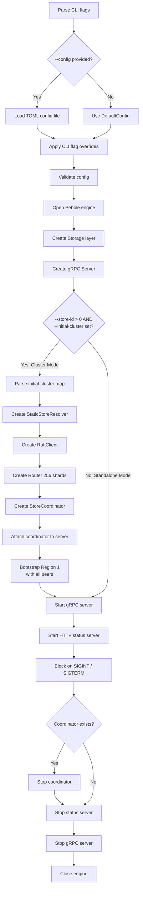
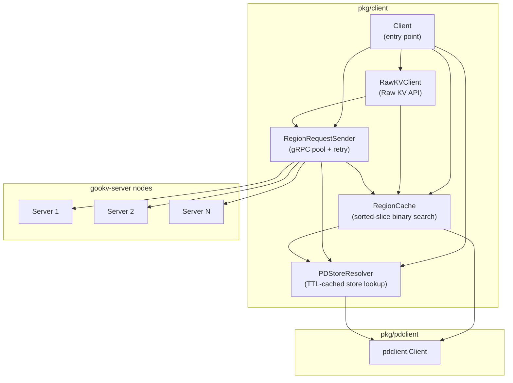
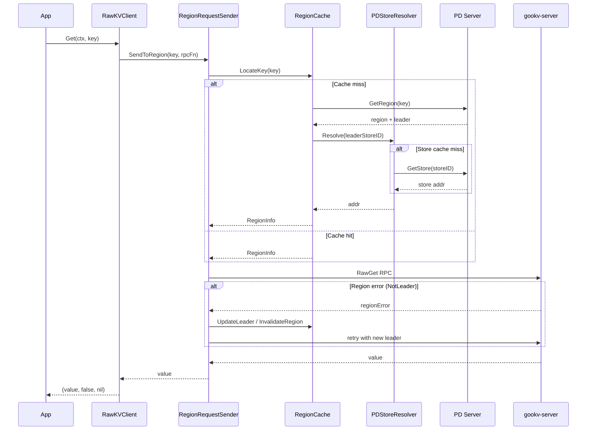

# 06. Client and CLI Tools

## 1. Overview

gookv ships two executables:

| Binary | Package | Purpose |
|---|---|---|
| `gookv-server` | `cmd/gookv-server` | Main server daemon -- gRPC API, Raft coordination, HTTP status endpoint |
| `gookv-ctl` | `cmd/gookv-ctl` | Offline admin CLI for inspecting and diagnosing a gookv data directory |

In addition, the public package `pkg/pdclient` provides a reusable Go client library for communicating with the Placement Driver (PD) service.

---

## 2. Server Entry Point (`cmd/gookv-server/main.go`)

### 2.1 CLI Flags

| Flag | Type | Default | Description |
|---|---|---|---|
| `--config` | string | `""` | Path to a TOML configuration file |
| `--addr` | string | (from config) | gRPC listen address; overrides config value |
| `--status-addr` | string | (from config) | HTTP status listen address; overrides config value |
| `--data-dir` | string | (from config) | Storage data directory; overrides config value |
| `--pd-endpoints` | string | (from config) | Comma-separated PD endpoint addresses; overrides config value |
| `--store-id` | uint64 | `0` | Store ID for this node. A non-zero value enables cluster (multi-node Raft) mode |
| `--initial-cluster` | string | `""` | Initial cluster topology in `storeID=addr,storeID=addr,...` format |

### 2.2 Startup Sequence

The `main()` function proceeds through these steps in order:

1. **Flag parsing** -- `flag.Parse()` reads all CLI flags listed above.

2. **Config loading** -- If `--config` is provided, the TOML file is loaded via `config.LoadFromFile()`. Otherwise `config.DefaultConfig()` supplies sensible defaults.

3. **CLI flag overrides** -- Non-empty CLI flags (`--addr`, `--status-addr`, `--data-dir`, `--pd-endpoints`) override corresponding config fields. This allows operators to use a config file as a base and tweak individual settings per invocation.

4. **Config validation** -- `cfg.Validate()` is called; the process exits on error.

5. **Pebble engine open** -- `rocks.Open(cfg.Storage.DataDir)` opens the underlying Pebble storage engine at the configured data directory. The engine is deferred-closed on exit.

6. **Storage layer creation** -- `server.NewStorage(engine)` wraps the raw engine with the storage abstraction used by the gRPC service handlers.

7. **gRPC Server creation** -- `server.NewServer(srvCfg, storage)` creates the gRPC server and registers the TiKV-compatible service (tikvService).

8. **Cluster mode branch** -- If `--store-id > 0` AND `--initial-cluster` is non-empty, cluster (multi-node Raft) mode activates:
   - `parseInitialCluster()` parses the `"storeID=addr,storeID=addr,..."` string into a `map[uint64]string`.
   - `server.NewStaticStoreResolver(clusterMap)` creates a resolver that maps store IDs to network addresses.
   - `transport.NewRaftClient(resolver, config)` creates a Raft transport client for inter-node communication.
   - `raftrouter.New(256)` creates the Raft message router with 256 shards.
   - `server.NewStoreCoordinator(...)` creates the coordinator that ties together the engine, storage, router, Raft client, and optional PD client for split coordination.
   - The coordinator is attached to the server via `srv.SetCoordinator(coord)`.
   - **Region bootstrap**: A single region (ID=1) is created spanning all stores. Each store ID doubles as a peer ID (`Peer{Id: storeID, StoreId: storeID}`). `coord.BootstrapRegion()` initializes the Raft group.
   - If PD client is configured, `go coord.RunSplitResultHandler(ctx)` is started to handle PD-coordinated splits.
   - `go coord.RunStoreWorker(storeWorkerCtx)` is started to handle dynamic peer creation/destruction via the store-level message channel.

9. **gRPC server start** -- `srv.Start()` begins accepting gRPC connections.

10. **HTTP status server start** -- `statusserver.New(...)` is configured with a `ConfigFn` that returns the current config, then `statusSrv.Start()` begins serving HTTP diagnostics.

11. **Signal handling** -- The process blocks on a channel listening for `SIGINT` or `SIGTERM`.

12. **Graceful shutdown** -- On signal receipt:
    - `coord.Stop()` (if cluster mode) stops Raft coordination.
    - `statusSrv.Stop()` stops the HTTP status server.
    - `srv.Stop()` stops the gRPC server.
    - The deferred `engine.Close()` flushes and closes the storage engine.

### 2.3 Helper Functions

- **`splitEndpoints(s string) []string`** -- Splits a comma-separated string into trimmed non-empty endpoint addresses.
- **`parseInitialCluster(s string) map[uint64]string`** -- Parses `"1=127.0.0.1:20160,2=127.0.0.1:20161"` into `{1: "127.0.0.1:20160", 2: "127.0.0.1:20161"}`. Silently skips malformed entries.

---

## 3. Admin CLI (`cmd/gookv-ctl/main.go`)

### 3.1 Command Dispatch

The CLI uses positional subcommands. `main()` reads `os.Args[1]` as the command name and dispatches via a switch statement. Unrecognized commands print usage and exit with code 1.

Two exported helper functions support testability:

- **`RunCommand(args []string) int`** -- Executes a command from a string slice (e.g. `["scan", "--db", "/data"]`). Returns 0 on success, 1 on failure or unknown command.
- **`ParseCommand(input string) string`** -- Extracts the command name from a whitespace-delimited string. Used in test harnesses.

### 3.2 Database Access

All commands that need storage call:

```go
func openDB(path string) traits.KvEngine
```

This opens a Pebble database at the given path via `rocks.Open()` and exits on error. The returned engine provides column-family-aware iterators, point reads, and snapshots.

### 3.3 Commands

#### 3.3.1 `scan` -- Range scan within a column family

| Flag | Type | Default | Description |
|---|---|---|---|
| `--db` | string | (required) | Path to data directory |
| `--cf` | string | `"default"` | Column family name (`default`, `lock`, `write`, `raft`) |
| `--start` | string | `""` | Start key in hex encoding (inclusive); empty = beginning |
| `--end` | string | `""` | End key in hex encoding (exclusive); empty = unbounded |
| `--limit` | int | `100` | Maximum number of keys to return |

Creates an iterator with `LowerBound`/`UpperBound` options, seeks to first, and prints each key-value pair. Values are displayed as printable ASCII when possible, otherwise as hex.

#### 3.3.2 `get` -- Single key lookup

| Flag | Type | Default | Description |
|---|---|---|---|
| `--db` | string | (required) | Path to data directory |
| `--cf` | string | `"default"` | Column family name |
| `--key` | string | (required) | Key in hex encoding |

Performs a point read via `eng.Get(cf, key)`. Prints the column family, key (hex), and value. Reports "Key not found" when `ErrNotFound` is returned.

#### 3.3.3 `mvcc` -- MVCC information for a user key

| Flag | Type | Default | Description |
|---|---|---|---|
| `--db` | string | (required) | Path to data directory |
| `--key` | string | (required) | User key in hex encoding |

This command inspects the multi-version concurrency control state for a single user key. It:

1. Opens a snapshot and creates an `mvcc.MvccReader`.
2. **Lock check**: Calls `reader.LoadLock(userKey)` to find any active lock. If present, reports lock type, primary key, start timestamp, TTL, for-update timestamp, min-commit timestamp, async-commit flag, and short value.
3. **Write scan**: Creates an iterator over the `write` column family. Seeks to `mvcc.EncodeKey(userKey, TSMax)` and iterates backward through commit timestamps. For each write record it calls `txntypes.UnmarshalWrite()` and reports commit timestamp, start timestamp, write type (Put/Delete/Lock/Rollback), and short value. Stops after 10 write records.
4. Outputs all information as formatted JSON using three struct types:
   - `MvccInfo` -- top-level container with key, optional lock, and write list.
   - `LockInfo` -- lock details (type, primary, timestamps, TTL, async-commit).
   - `WriteInfo` -- write record details (commit/start timestamps, type, short value).

#### 3.3.4 `dump` -- Raw hex dump

| Flag | Type | Default | Description |
|---|---|---|---|
| `--db` | string | (required) | Path to data directory |
| `--cf` | string | `"default"` | Column family name |
| `--limit` | int | `50` | Maximum entries to dump |
| `--decode` | bool | `false` | Decode MVCC keys and values |
| `--sst` | string | `""` | Path to SST file for direct parsing (no `--db` required) |

Iterates from the beginning of the specified column family and prints each key-value pair as tab-separated hex strings. Useful for low-level debugging.

When `--decode` is set, the output includes decoded MVCC information:
- **Write CF** (`dumpWriteCF`): Decodes user key, commit timestamp, write type (Put/Delete/Lock/Rollback), and start timestamp from each entry.
- **Lock CF** (`dumpLockCF`): Decodes user key and lock details (type, primary key, start timestamp, TTL) from each entry.

When `--sst` is provided, the command parses an SST file directly using Pebble's `sstable` package (`cmdDumpSST`), bypassing the need for a running database. This enables offline debugging of individual SST files.

#### 3.3.5 `size` -- Approximate data size per column family

| Flag | Type | Default | Description |
|---|---|---|---|
| `--db` | string | (required) | Path to data directory |

Iterates all four column families (`default`, `lock`, `write`, `raft`) and computes:
- Key count per CF
- Total byte size (sum of key + value lengths)

Sizes are formatted with human-readable units (B, KB, MB, GB) via the `formatSize()` helper.

#### 3.3.6 `compact` -- Trigger compaction

| Flag | Type | Default | Description |
|---|---|---|---|
| `--db` | string | (required) | Path to data directory |
| `--cf` | string | `""` | Column family to compact (empty = all CFs) |
| `--flush-only` | bool | `false` | Only flush WAL without full compaction |

When `--flush-only` is set, calls `eng.SyncWAL()` to ensure WAL durability. Otherwise, calls `CompactAll()` (all CFs) or `CompactCF(cf)` (specific CF) to trigger full LSM-tree compaction.

#### 3.3.7 `region` -- Region metadata inspection

| Flag | Type | Default | Description |
|---|---|---|---|
| `--db` | string | (required) | Path to data directory |
| `--id` | uint64 | `0` | Look up a specific region by ID |
| `--all` | bool | `false` | List all regions |
| `--limit` | int | `100` | Maximum number of regions to display |

Reads region metadata from the `CF_RAFT` column family:
- **`--id <N>`**: Looks up the region state key (`keys.RegionStateKey(N)`) and prints the region's metadata (ID, start key, end key, peers, epoch).
- **`--all`**: Iterates all keys in `CF_RAFT`, filters for region state keys using `isRegionStateKey()`, and prints each region's metadata via `printRegionState()`. Stops after `--limit` regions.
- With no flags, prints usage information.

### 3.4 Utility Functions

- **`tryPrintable(data []byte) string`** -- Returns the data as a plain string if all bytes are printable ASCII (0x20-0x7E), otherwise returns hex encoding. Used for human-friendly value display.
- **`formatSize(bytes int64) string`** -- Converts byte counts to human-readable format (B/KB/MB/GB).
- **`writeTypeStr(wt txntypes.WriteType) string`** -- Maps write type constants to readable strings: `Put`, `Delete`, `Lock`, `Rollback`, or `Unknown(N)`.

---

## 4. PD Client Library (`pkg/pdclient/`)

The `pdclient` package is a public Go library for interacting with the Placement Driver service. It lives under `pkg/` so external consumers can import it.

### 4.1 Client Interface

The `Client` interface defines 15 methods:

| Method | Purpose |
|---|---|
| `GetTS` | Allocate a globally unique timestamp from PD's TSO |
| `GetRegion` | Look up the region containing a given key, plus its leader |
| `GetRegionByID` | Look up a region by ID |
| `GetStore` | Get store metadata by store ID |
| `Bootstrap` | Bootstrap the cluster with an initial store and region |
| `IsBootstrapped` | Check if the cluster has been bootstrapped |
| `PutStore` | Register or update a store in PD |
| `ReportRegionHeartbeat` | Send region heartbeat; returns `(*pdpb.RegionHeartbeatResponse, error)` with scheduling commands |
| `StoreHeartbeat` | Send store-level heartbeat |
| `AskBatchSplit` | Request new region/peer IDs for split operations |
| `ReportBatchSplit` | Notify PD of completed region splits |
| `GetGCSafePoint` | Retrieve the current global GC safe point from PD |
| `UpdateGCSafePoint` | Advance the global GC safe point (forward only) |
| `AllocID` | Allocate a unique ID from PD |
| `GetClusterID` | Return the cluster identifier |
| `Close` | Shut down the client |

### 4.2 Timestamp Encoding

The `TimeStamp` type encodes physical (milliseconds since epoch) and logical components. `ToUint64()` packs them as `physical<<18 | logical`, compatible with TiKV's timestamp format. `TimeStampFromUint64()` decodes back.

### 4.3 gRPC Client Implementation

`grpcClient` connects to PD via gRPC using kvproto's `pdpb.PDClient`. On creation (`NewClient`), it dials the first reachable endpoint, discovers the cluster ID via `GetMembers`, and stores the connection. All RPC methods attach a `RequestHeader` with the cluster ID.

Configuration (`Config`) supports:
- `Endpoints` -- PD server addresses (default: `127.0.0.1:2379`)
- `RetryInterval` -- 300ms default retry interval
- `RetryMaxCount` -- 10 retries by default
- `UpdateInterval` -- 10-minute PD leader refresh interval

### 4.4 Mock Client

`MockClient` is an in-memory implementation of `Client` for testing. It simulates:
- TSO allocation with atomic counters (physical/logical, with logical rollover at 2^18)
- Region and store registries (in-memory maps)
- Batch split ID allocation (starting at ID 1000)
- Region heartbeat processing (stores region/leader updates)

Test helper methods: `SetRegion`, `SetStore`, `SetHeartbeatResponse`, `GetAllRegions`.

---

## 5. Server Startup Flow



---

## 6. Multi-Region Client Library (`pkg/client/`)

The `pkg/client` package provides a full client library for gookv with transparent multi-region routing. It builds on `pkg/pdclient` for cluster metadata and connects directly to gookv-server nodes via gRPC.

### 6.1 Architecture



### 6.2 Config

```go
type Config struct {
    PDAddrs       []string      // PD server addresses (required)
    DialTimeout   time.Duration // gRPC dial timeout (default: 5s)
    MaxRetries    int           // max retry attempts per request (default: 3)
    StoreCacheTTL time.Duration // store address cache TTL (default: 30s)
}
```

### 6.3 Client

`Client` is the main entry point. Created via `NewClient(ctx, cfg)`, which initializes a PD client, `RegionCache`, `PDStoreResolver`, and `RegionRequestSender`.

| Method | Description |
|---|---|
| `RawKV()` | Returns a `RawKVClient` for key-value operations |
| `Close()` | Closes sender connections and PD client |

### 6.4 RawKVClient

Provides the full Raw KV API with transparent cross-region routing.

**Single-key operations:**

| Method | Description |
|---|---|
| `Get(ctx, key)` | Point read. Returns `(value, notFound, error)` |
| `Put(ctx, key, value)` | Write a key-value pair |
| `PutWithTTL(ctx, key, value, ttl)` | Write with per-key TTL |
| `Delete(ctx, key)` | Delete a key |
| `GetKeyTTL(ctx, key)` | Returns remaining TTL |

**Batch operations** (parallel multi-region via `errgroup`):

| Method | Description |
|---|---|
| `BatchGet(ctx, keys)` | Multi-key read across regions |
| `BatchPut(ctx, pairs)` | Multi-key write across regions |
| `BatchDelete(ctx, keys)` | Multi-key delete across regions |

**Range operations** (automatic region boundary handling):

| Method | Description |
|---|---|
| `Scan(ctx, startKey, endKey, limit)` | Cross-region scan with limit |
| `DeleteRange(ctx, startKey, endKey)` | Delete all keys in range |

**Atomic / utility operations:**

| Method | Description |
|---|---|
| `CompareAndSwap(ctx, key, value, prevValue, prevNotExist)` | Atomic CAS. Returns `(succeeded, previousValue, error)` |
| `Checksum(ctx, startKey, endKey)` | Returns `(checksum, totalKvs, totalBytes, error)` |

### 6.5 RegionCache

Maintains a sorted `[]*RegionInfo` slice (binary search on `StartKey`) plus a `map[uint64]int` index by region ID.

| Method | Description |
|---|---|
| `LocateKey(ctx, key)` | Returns `*RegionInfo` from cache or queries PD |
| `InvalidateRegion(regionID)` | Removes stale cache entry |
| `UpdateLeader(regionID, leader, storeAddr)` | Updates leader in-place |
| `GroupKeysByRegion(ctx, keys)` | Groups keys by region for batch operations |

### 6.6 PDStoreResolver

TTL-based cache mapping `storeID → gRPC address`. Default TTL is 30 seconds.

| Method | Description |
|---|---|
| `Resolve(ctx, storeID)` | Returns cached address or queries PD |
| `InvalidateStore(storeID)` | Removes stale address from cache |

### 6.7 RegionRequestSender

gRPC connection pool with automatic retry on region errors. Manages a `map[string]*grpc.ClientConn` pool with double-check locking.

| Method | Description |
|---|---|
| `SendToRegion(ctx, key, rpcFn)` | Core retry loop: locate region, dial, execute, handle errors |
| `HandleRegionError(ctx, info, regionErr)` | Processes `NotLeader`, `EpochNotMatch`, `RegionNotFound`, `StoreNotMatch` errors and invalidates cache |
| `Close()` | Closes all gRPC connections |

**Retry behavior**: On `NotLeader`, updates the cached leader and retries. On `EpochNotMatch`, `RegionNotFound`, or `StoreNotMatch`, invalidates the region cache entry and retries with fresh PD data. Max retries configurable (default 3).

### 6.8 Request Flow



---

## 7. Implementation Status

| Component | Status | Notes |
|---|---|---|
| Server startup (standalone) | Implemented | Config loading, engine, gRPC, status server |
| Server startup (cluster mode) | Implemented | Raft coordination, region bootstrap, graceful shutdown |
| CLI: `scan` | Implemented | Column-family range scan with hex key bounds |
| CLI: `get` | Implemented | Single key point lookup |
| CLI: `mvcc` | Implemented | Lock inspection, write history (up to 10 records), JSON output |
| CLI: `dump` | Implemented | Raw hex key-value dump with `--sst` for direct SST file parsing |
| CLI: `size` | Implemented | Per-CF key count and byte size |
| CLI: `compact` | Implemented | Full LSM compaction via `CompactAll()`/`CompactCF()` with `--flush-only` flag for WAL-only sync |
| CLI: `region` | Implemented | Region metadata inspection with `--id`, `--all`, `--limit` flags |
| CLI: `dump --decode` | Implemented | MVCC key/value decoding for write and lock CFs |
| PD client library | Implemented | Full gRPC client with multi-endpoint failover and retry + mock for testing |
| Client library (`pkg/client`) | Implemented | Multi-region RawKVClient, RegionCache, PDStoreResolver, RegionRequestSender |
